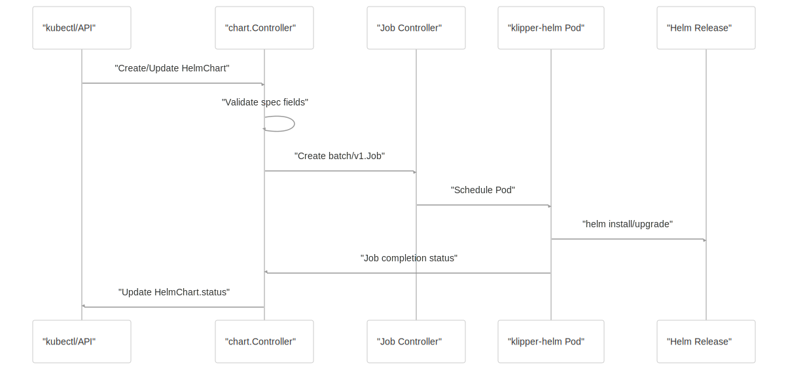

# Overview

[Get free private DeepWikis in Devin](/private-repo)

[DeepWiki](https://deepwiki.com)

[DeepWiki](/)

[k3s-io/helm-controller](https://github.com/k3s-io/helm-controller)

[Get free private DeepWikis with

Devin](/private-repo)Share

Last indexed: 22 July 2025 ([dac1b5](https://github.com/k3s-io/helm-controller/commits/dac1b5e9))

* [Overview](/k3s-io/helm-controller/1-overview)
* [User Guide](/k3s-io/helm-controller/2-user-guide)
* [Installation and Setup](/k3s-io/helm-controller/2.1-installation-and-setup)
* [Using HelmChart Resources](/k3s-io/helm-controller/2.2-using-helmchart-resources)
* [Configuration Options](/k3s-io/helm-controller/2.3-configuration-options)
* [Architecture](/k3s-io/helm-controller/3-architecture)
* [System Overview](/k3s-io/helm-controller/3.1-system-overview)
* [API Design](/k3s-io/helm-controller/3.2-api-design)
* [Controller Implementation](/k3s-io/helm-controller/3.3-controller-implementation)
* [Job Execution Model](/k3s-io/helm-controller/3.4-job-execution-model)
* [Developer Guide](/k3s-io/helm-controller/4-developer-guide)
* [Code Generation](/k3s-io/helm-controller/4.1-code-generation)
* [Build System](/k3s-io/helm-controller/4.2-build-system)
* [Testing Framework](/k3s-io/helm-controller/4.3-testing-framework)
* [CI/CD Pipeline](/k3s-io/helm-controller/4.4-cicd-pipeline)
* [Reference](/k3s-io/helm-controller/5-reference)
* [API Reference](/k3s-io/helm-controller/5.1-api-reference)
* [CLI Reference](/k3s-io/helm-controller/5.2-cli-reference)
* [Generated Components](/k3s-io/helm-controller/5.3-generated-components)

Menu

# Overview

Relevant source files

* [README.md](https://github.com/k3s-io/helm-controller/blob/dac1b5e9/README.md)
* [go.mod](https://github.com/k3s-io/helm-controller/blob/dac1b5e9/go.mod)
* [go.sum](https://github.com/k3s-io/helm-controller/blob/dac1b5e9/go.sum)
* [main.go](https://github.com/k3s-io/helm-controller/blob/dac1b5e9/main.go)
* [pkg/codegen/main.go](https://github.com/k3s-io/helm-controller/blob/dac1b5e9/pkg/codegen/main.go)
* [test/framework/controller.go](https://github.com/k3s-io/helm-controller/blob/dac1b5e9/test/framework/controller.go)

This document provides a comprehensive overview of the helm-controller project, a Kubernetes controller that enables declarative management of Helm charts through Custom Resource Definitions (CRDs). The helm-controller watches for `HelmChart` and `HelmChartConfig` custom resources and orchestrates Helm operations by creating Kubernetes Jobs that execute Helm commands in isolated containers.

For detailed usage instructions, see [Using HelmChart Resources](/k3s-io/helm-controller/2.2-using-helmchart-resources). For in-depth architectural details, see [Architecture](/k3s-io/helm-controller/3-architecture). For development and contribution guidelines, see [Developer Guide](/k3s-io/helm-controller/4-developer-guide).

## Project Purpose

The helm-controller bridges the gap between Helm's imperative chart management and Kubernetes' declarative resource model. Instead of manually running `helm install` or `helm upgrade` commands, users can define `HelmChart` resources that specify desired chart installations, and the controller ensures these charts are installed, upgraded, or removed automatically.

**Sources:** [README.md1-56](https://github.com/k3s-io/helm-controller/blob/dac1b5e9/README.md#L1-L56) [main.go27-28](https://github.com/k3s-io/helm-controller/blob/dac1b5e9/main.go#L27-L28)

## System Architecture

The helm-controller follows the standard Kubernetes controller pattern, consisting of a control loop that watches custom resources and reconciles their desired state with the actual state of the cluster.

### High-Level Component Architecture

**Sources:** [main.go9-31](https://github.com/k3s-io/helm-controller/blob/dac1b5e9/main.go#L9-L31) [pkg/codegen/main.go12-28](https://github.com/k3s-io/helm-controller/blob/dac1b5e9/pkg/codegen/main.go#L12-L28) [test/framework/controller.go20-64](https://github.com/k3s-io/helm-controller/blob/dac1b5e9/test/framework/controller.go#L20-L64)

## Core Components

### Custom Resource Definitions

The system defines two primary CRDs that represent the desired state of Helm chart installations:

| Resource | Purpose | Key Fields |
| --- | --- | --- |
| `HelmChart` | Defines a Helm chart installation | `spec.chart`, `spec.repo`, `spec.targetNamespace`, `spec.valuesContent` |
| `HelmChartConfig` | Provides additional configuration for `HelmChart` resources | `spec.valuesContent`, `spec.failurePolicy` |

**Sources:** [pkg/codegen/main.go19-22](https://github.com/k3s-io/helm-controller/blob/dac1b5e9/pkg/codegen/main.go#L19-L22)

### Chart Controller

The `chart.Controller` in `pkg/controllers/chart/` implements the core reconciliation logic. It watches for changes to `HelmChart` and `HelmChartConfig` resources and creates Kubernetes Jobs to execute the appropriate Helm commands.

**Sources:** [test/framework/controller.go8](https://github.com/k3s-io/helm-controller/blob/dac1b5e9/test/framework/controller.go#L8-L8)

### Code Generation Pipeline

The system uses extensive code generation to create Kubernetes client libraries and controller interfaces:

**Sources:** [main.go1-5](https://github.com/k3s-io/helm-controller/blob/dac1b5e9/main.go#L1-L5) [pkg/codegen/main.go12-28](https://github.com/k3s-io/helm-controller/blob/dac1b5e9/pkg/codegen/main.go#L12-L28)

## Key Workflows

### Chart Installation Process

1. **Resource Creation**: User creates a `HelmChart` resource with chart specifications
2. **Controller Detection**: The chart controller detects the new resource through watch events
3. **Job Creation**: Controller creates a Kubernetes `batch/v1.Job` with appropriate RBAC
4. **Helm Execution**: Job pod runs the klipper-helm image to execute Helm commands
5. **Status Update**: Controller updates the `HelmChart` status based on job completion

### CLI Configuration

The main entry point accepts various configuration options through CLI flags and environment variables:

| Flag | Environment Variable | Purpose |
| --- | --- | --- |
| `--controller-name` | `CONTROLLER_NAME` | Unique controller identifier |
| `--default-job-image` | `DEFAULT_JOB_IMAGE` | Container image for Helm jobs |
| `--job-cluster-role` | `JOB_CLUSTER_ROLE` | RBAC role for job pods |
| `--namespace` | `NAMESPACE` | Namespace scope for watching |
| `--threads` | `THREADS` | Controller thread count |

**Sources:** [main.go32-100](https://github.com/k3s-io/helm-controller/blob/dac1b5e9/main.go#L32-L100)

## Testing Infrastructure

The project includes comprehensive testing through the `test/framework/` package, which provides:

* **Controller Setup**: Automated deployment of controller components for testing
* **CRD Management**: Installation and cleanup of Custom Resource Definitions
* **RBAC Configuration**: Creation of appropriate service accounts and cluster roles
* **Isolated Testing**: Each test runs in its own namespace with proper cleanup

**Sources:** [test/framework/controller.go20-210](https://github.com/k3s-io/helm-controller/blob/dac1b5e9/test/framework/controller.go#L20-L210)

## Dependencies and Build System

The system is built using Go 1.23.4 and relies on several key dependencies:

* **Kubernetes Libraries**: `k8s.io/client-go`, `k8s.io/api`, `k8s.io/apimachinery`
* **Rancher Wrangler**: `github.com/rancher/wrangler/v3` for controller generation
* **CLI Framework**: `github.com/urfave/cli/v2` for command-line interface
* **Testing**: `github.com/onsi/ginkgo/v2` and `github.com/onsi/gomega` for BDD-style tests

**Sources:** [go.mod1-79](https://github.com/k3s-io/helm-controller/blob/dac1b5e9/go.mod#L1-L79)

The controller follows cloud-native patterns and integrates seamlessly with standard Kubernetes tooling, making it suitable for both development and production environments. For deployment instructions, see [Installation and Setup](/k3s-io/helm-controller/2.1-installation-and-setup). For detailed API specifications, see [API Reference](/k3s-io/helm-controller/5.1-api-reference).

Dismiss

Refresh this wiki

Enter email to refresh

### On this page

* [Overview](#overview)
* [Project Purpose](#project-purpose)
* [System Architecture](#system-architecture)
* [High-Level Component Architecture](#high-level-component-architecture)
* [Core Components](#core-components)
* [Custom Resource Definitions](#custom-resource-definitions)
* [Chart Controller](#chart-controller)
* [Code Generation Pipeline](#code-generation-pipeline)
* [Key Workflows](#key-workflows)
* [Chart Installation Process](#chart-installation-process)
* [CLI Configuration](#cli-configuration)
* [Testing Infrastructure](#testing-infrastructure)
* [Dependencies and Build System](#dependencies-and-build-system)

Ask Devin about k3s-io/helm-controller

Deep Research