# Job Execution Model

[Get free private DeepWikis in Devin](/private-repo)

[DeepWiki](https://deepwiki.com)

[DeepWiki](/)

[k3s-io/helm-controller](https://github.com/k3s-io/helm-controller)

[Get free private DeepWikis with

Devin](/private-repo)Share

Last indexed: 22 July 2025 ([dac1b5](https://github.com/k3s-io/helm-controller/commits/dac1b5e9))

* [Overview](/k3s-io/helm-controller/1-overview)
* [User Guide](/k3s-io/helm-controller/2-user-guide)
* [Installation and Setup](/k3s-io/helm-controller/2.1-installation-and-setup)
* [Using HelmChart Resources](/k3s-io/helm-controller/2.2-using-helmchart-resources)
* [Configuration Options](/k3s-io/helm-controller/2.3-configuration-options)
* [Architecture](/k3s-io/helm-controller/3-architecture)
* [System Overview](/k3s-io/helm-controller/3.1-system-overview)
* [API Design](/k3s-io/helm-controller/3.2-api-design)
* [Controller Implementation](/k3s-io/helm-controller/3.3-controller-implementation)
* [Job Execution Model](/k3s-io/helm-controller/3.4-job-execution-model)
* [Developer Guide](/k3s-io/helm-controller/4-developer-guide)
* [Code Generation](/k3s-io/helm-controller/4.1-code-generation)
* [Build System](/k3s-io/helm-controller/4.2-build-system)
* [Testing Framework](/k3s-io/helm-controller/4.3-testing-framework)
* [CI/CD Pipeline](/k3s-io/helm-controller/4.4-cicd-pipeline)
* [Reference](/k3s-io/helm-controller/5-reference)
* [API Reference](/k3s-io/helm-controller/5.1-api-reference)
* [CLI Reference](/k3s-io/helm-controller/5.2-cli-reference)
* [Generated Components](/k3s-io/helm-controller/5.3-generated-components)

Menu

# Job Execution Model

Relevant source files

* [pkg/controllers/chart/chart.go](https://github.com/k3s-io/helm-controller/blob/dac1b5e9/pkg/controllers/chart/chart.go)
* [test/suite/helm\_test.go](https://github.com/k3s-io/helm-controller/blob/dac1b5e9/test/suite/helm_test.go)
* [test/suite/zz\_suite\_test.go](https://github.com/k3s-io/helm-controller/blob/dac1b5e9/test/suite/zz_suite_test.go)

This document describes how helm-controller executes Helm operations using Kubernetes Jobs rather than embedding Helm libraries directly. This design provides better isolation, debugging capabilities, and security compared to in-process execution.

For information about the overall controller architecture, see [Controller Implementation](/k3s-io/helm-controller/3.3-controller-implementation). For details about the API structures that trigger job execution, see [API Design](/k3s-io/helm-controller/3.2-api-design).

## Overview

helm-controller implements a job-based execution model where each Helm operation (install, upgrade, or delete) runs as a separate Kubernetes Job. This approach offers several advantages:

* **Process Isolation**: Each Helm operation runs in its own container, preventing issues in one operation from affecting others
* **Debugging**: Job pods remain available for log inspection and troubleshooting
* **Security**: Each job runs with minimal required permissions via dedicated ServiceAccounts
* **Scalability**: Multiple Helm operations can run concurrently across different nodes

The controller watches for changes to `HelmChart` and `HelmChartConfig` resources, then creates the necessary Kubernetes resources to execute Helm operations.

Sources: [test/suite/helm\_test.go1-854](https://github.com/k3s-io/helm-controller/blob/dac1b5e9/test/suite/helm_test.go#L1-L854) [pkg/controllers/chart/chart\_test.go1-185](https://github.com/k3s-io/helm-controller/blob/dac1b5e9/pkg/controllers/chart/chart_test.go#L1-L185)

## Job Types and Lifecycle

The controller creates different types of jobs based on the operation being performed:

| Job Type | Naming Pattern | Trigger | Purpose |
| --- | --- | --- | --- |
| Install | `helm-install-{chart-name}` | New HelmChart creation | Initial chart installation |
| Upgrade | `helm-install-{chart-name}` | HelmChart spec changes | Chart upgrades and updates |
| Delete | `helm-delete-{chart-name}` | HelmChart deletion | Chart removal and cleanup |



Sources: [pkg/controllers/chart/chart\_test.go128-140](https://github.com/k3s-io/helm-controller/blob/dac1b5e9/pkg/controllers/chart/chart_test.go#L128-L140) [test/suite/helm\_test.go49-62](https://github.com/k3s-io/helm-controller/blob/dac1b5e9/test/suite/helm_test.go#L49-L62)

## Job Creation Process

When the controller detects a change requiring Helm execution, it creates several Kubernetes resources working together:



The job creation process involves these key functions:

* `job()`: Creates the Job, Secret, and ConfigMap resources
* `args()`: Builds the Helm CLI command arguments
* `hashObjects()`: Generates content hash for change detection
* `valuesSecretAddConfig()`: Merges chart and config values

Sources: [pkg/controllers/chart/chart\_test.go76-77](https://github.com/k3s-io/helm-controller/blob/dac1b5e9/pkg/controllers/chart/chart_test.go#L76-L77) [pkg/controllers/chart/chart\_test.go90-96](https://github.com/k3s-io/helm-controller/blob/dac1b5e9/pkg/controllers/chart/chart_test.go#L90-L96) [pkg/controllers/chart/chart\_test.go150-160](https://github.com/k3s-io/helm-controller/blob/dac1b5e9/pkg/controllers/chart/chart_test.go#L150-L160)

## Job Configuration and Resources

Each job is configured with specific resources and environment variables:

### Job Specification


### Default Job Settings

| Setting | Default Value | Configurable Via |
| --- | --- | --- |
| Container Image | `DefaultJobImage` | `HelmChart.spec.jobImage` |
| Backoff Limit | `1000` | `HelmChart.spec.backOffLimit` |
| Security Context | Non-root, drop all capabilities | `HelmChart.spec.securityContext` |
| Pod Security Context | Non-root, seccomp runtime default | `HelmChart.spec.podSecurityContext` |
| Timeout | None | `HelmChart.spec.timeout` |

Sources: [test/suite/helm\_test.go187-207](https://github.com/k3s-io/helm-controller/blob/dac1b5e9/test/suite/helm_test.go#L187-L207) [test/suite/helm\_test.go558-572](https://github.com/k3s-io/helm-controller/blob/dac1b5e9/test/suite/helm_test.go#L558-L572) [test/suite/helm\_test.go661-676](https://github.com/k3s-io/helm-controller/blob/dac1b5e9/test/suite/helm_test.go#L661-L676)

## Environment Variables and Arguments

Jobs receive configuration through environment variables and command-line arguments:

### Environment Variables

* `TIMEOUT`: Operation timeout from `HelmChart.spec.timeout`
* Additional variables for authentication and chart repository access

### Helm CLI Arguments

The `args()` function builds Helm command arguments based on the operation type:

**Install/Upgrade Operations:**

```
helm install --set-string key=value --set flag=bool --timeout 15m

```

**Delete Operations:**

```
helm delete

```

Arguments are constructed from `HelmChart.spec.set` values, with automatic type detection for boolean and numeric values.

Sources: [pkg/controllers/chart/chart\_test.go150-169](https://github.com/k3s-io/helm-controller/blob/dac1b5e9/pkg/controllers/chart/chart_test.go#L150-L169) [test/suite/helm\_test.go201-206](https://github.com/k3s-io/helm-controller/blob/dac1b5e9/test/suite/helm_test.go#L201-L206)

## Security Model

The job execution model implements a comprehensive security approach:



### ServiceAccount and RBAC

Each job runs with a dedicated ServiceAccount that has minimal required permissions:

* Read access to Secrets and ConfigMaps containing chart values
* Cluster-level permissions only as needed for the specific chart being deployed

### Security Context Configuration

The controller applies secure defaults that can be overridden per chart:

**Default Pod Security Context:**

```
securityContext:
  runAsNonRoot: true
  seccompProfile:
    type: RuntimeDefault
```

**Default Container Security Context:**

```
securityContext:
  allowPrivilegeEscalation: false
  capabilities:
    drop: ["ALL"]
  readOnlyRootFilesystem: true
```

Sources: [test/suite/helm\_test.go695-730](https://github.com/k3s-io/helm-controller/blob/dac1b5e9/test/suite/helm_test.go#L695-L730) [test/suite/helm\_test.go803-841](https://github.com/k3s-io/helm-controller/blob/dac1b5e9/test/suite/helm_test.go#L803-L841)

## Content Hashing and Change Detection

The controller uses content hashing to determine when new jobs are needed:



The `hashObjects()` function generates a SHA256 hash of all chart configuration and stores it as a pod template annotation. When configuration changes, the hash changes, triggering a new job creation.

Sources: [pkg/controllers/chart/chart\_test.go90-96](https://github.com/k3s-io/helm-controller/blob/dac1b5e9/pkg/controllers/chart/chart_test.go#L90-L96) [pkg/controllers/chart/chart\_test.go21-98](https://github.com/k3s-io/helm-controller/blob/dac1b5e9/pkg/controllers/chart/chart_test.go#L21-L98)

## Job Monitoring and Status

The controller tracks job execution status and updates the HelmChart resource accordingly:

### Status Conditions

* `HelmChartDeployed`: Chart successfully installed/upgraded
* `HelmChartFailed`: Job failed with error details
* Job completion status is reflected in the HelmChart status

### Release Tracking

The controller monitors Helm releases to verify successful deployment:

* Release count increases with each successful operation
* Failed operations do not create new releases
* Release history provides audit trail of changes

Sources: [test/suite/helm\_test.go89-104](https://github.com/k3s-io/helm-controller/blob/dac1b5e9/test/suite/helm_test.go#L89-L104) [test/suite/helm\_test.go510-521](https://github.com/k3s-io/helm-controller/blob/dac1b5e9/test/suite/helm_test.go#L510-L521)

Dismiss

Refresh this wiki

Enter email to refresh

### On this page

* [Job Execution Model](#job-execution-model)
* [Overview](#overview)
* [Job Types and Lifecycle](#job-types-and-lifecycle)
* [Job Creation Process](#job-creation-process)
* [Job Configuration and Resources](#job-configuration-and-resources)
* [Job Specification](#job-specification)
* [Default Job Settings](#default-job-settings)
* [Environment Variables and Arguments](#environment-variables-and-arguments)
* [Environment Variables](#environment-variables)
* [Helm CLI Arguments](#helm-cli-arguments)
* [Security Model](#security-model)
* [ServiceAccount and RBAC](#serviceaccount-and-rbac)
* [Security Context Configuration](#security-context-configuration)
* [Content Hashing and Change Detection](#content-hashing-and-change-detection)
* [Job Monitoring and Status](#job-monitoring-and-status)
* [Status Conditions](#status-conditions)
* [Release Tracking](#release-tracking)

Ask Devin about k3s-io/helm-controller

Deep Research