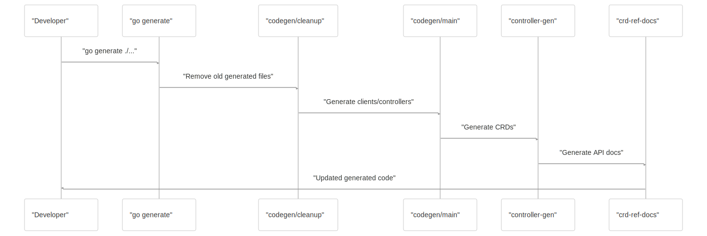

# Developer Guide

[Get free private DeepWikis in Devin](/private-repo)

[DeepWiki](https://deepwiki.com)

[DeepWiki](/)

[k3s-io/helm-controller](https://github.com/k3s-io/helm-controller)

[Get free private DeepWikis with

Devin](/private-repo)Share

Last indexed: 22 July 2025 ([dac1b5](https://github.com/k3s-io/helm-controller/commits/dac1b5e9))

* [Overview](/k3s-io/helm-controller/1-overview)
* [User Guide](/k3s-io/helm-controller/2-user-guide)
* [Installation and Setup](/k3s-io/helm-controller/2.1-installation-and-setup)
* [Using HelmChart Resources](/k3s-io/helm-controller/2.2-using-helmchart-resources)
* [Configuration Options](/k3s-io/helm-controller/2.3-configuration-options)
* [Architecture](/k3s-io/helm-controller/3-architecture)
* [System Overview](/k3s-io/helm-controller/3.1-system-overview)
* [API Design](/k3s-io/helm-controller/3.2-api-design)
* [Controller Implementation](/k3s-io/helm-controller/3.3-controller-implementation)
* [Job Execution Model](/k3s-io/helm-controller/3.4-job-execution-model)
* [Developer Guide](/k3s-io/helm-controller/4-developer-guide)
* [Code Generation](/k3s-io/helm-controller/4.1-code-generation)
* [Build System](/k3s-io/helm-controller/4.2-build-system)
* [Testing Framework](/k3s-io/helm-controller/4.3-testing-framework)
* [CI/CD Pipeline](/k3s-io/helm-controller/4.4-cicd-pipeline)
* [Reference](/k3s-io/helm-controller/5-reference)
* [API Reference](/k3s-io/helm-controller/5.1-api-reference)
* [CLI Reference](/k3s-io/helm-controller/5.2-cli-reference)
* [Generated Components](/k3s-io/helm-controller/5.3-generated-components)

Menu

# Developer Guide

Relevant source files

* [Makefile](https://github.com/k3s-io/helm-controller/blob/dac1b5e9/Makefile)
* [main.go](https://github.com/k3s-io/helm-controller/blob/dac1b5e9/main.go)
* [pkg/codegen/main.go](https://github.com/k3s-io/helm-controller/blob/dac1b5e9/pkg/codegen/main.go)
* [scripts/build](https://github.com/k3s-io/helm-controller/blob/dac1b5e9/scripts/build)

This guide provides comprehensive information for developers who want to contribute to, extend, or understand the internal workings of the helm-controller project. It covers the development environment setup, code organization, build processes, and testing frameworks.

For end-user documentation on deploying and configuring helm-controller, see [User Guide](/k3s-io/helm-controller/2-user-guide). For architectural details about the system design, see [Architecture](/k3s-io/helm-controller/3-architecture).

## Development Environment Setup

The helm-controller is a Go-based Kubernetes controller that requires specific tools for development and code generation.

### Prerequisites

* Go 1.21 or later
* Docker for building and testing
* Kubernetes cluster (K3s recommended for testing)
* Make for build automation

### Code Generation Dependencies

The project relies heavily on generated code for Kubernetes integration. The following tools are automatically invoked during the generation process:

| Tool | Purpose | Configuration |
| --- | --- | --- |
| `controller-gen` | CRD generation | [main.go4](https://github.com/k3s-io/helm-controller/blob/dac1b5e9/main.go#L4-L4) |
| `wrangler` | Client/controller generation | [pkg/codegen/main.go8](https://github.com/k3s-io/helm-controller/blob/dac1b5e9/pkg/codegen/main.go#L8-L8) |
| `crd-ref-docs` | API documentation | [main.go5](https://github.com/k3s-io/helm-controller/blob/dac1b5e9/main.go#L5-L5) |

Sources: [main.go1-5](https://github.com/k3s-io/helm-controller/blob/dac1b5e9/main.go#L1-L5) [pkg/codegen/main.go8-27](https://github.com/k3s-io/helm-controller/blob/dac1b5e9/pkg/codegen/main.go#L8-L27)

## Code Organization and Structure

### Entry Point and CLI Structure



The main entry point defines a comprehensive CLI interface with the `HelmController` struct from `pkg/cmd` handling the core execution logic.

Sources: [main.go22-107](https://github.com/k3s-io/helm-controller/blob/dac1b5e9/main.go#L22-L107)

### Code Generation Pipeline



The code generation process is orchestrated through `go:generate` directives in [main.go1-5](https://github.com/k3s-io/helm-controller/blob/dac1b5e9/main.go#L1-L5) and implemented by [pkg/codegen/main.go12-28](https://github.com/k3s-io/helm-controller/blob/dac1b5e9/pkg/codegen/main.go#L12-L28) The `controllergen.Run()` function generates Kubernetes clients and controllers for the `HelmChart` and `HelmChartConfig` types.

Sources: [main.go1-5](https://github.com/k3s-io/helm-controller/blob/dac1b5e9/main.go#L1-L5) [pkg/codegen/main.go12-28](https://github.com/k3s-io/helm-controller/blob/dac1b5e9/pkg/codegen/main.go#L12-L28)

### Generated Components Structure

The wrangler-based code generation creates a comprehensive set of Kubernetes integration components:



The generation configuration in [pkg/codegen/main.go17-26](https://github.com/k3s-io/helm-controller/blob/dac1b5e9/pkg/codegen/main.go#L17-L26) specifies `GenerateTypes: true` and `GenerateClients: true` for the `helm.cattle.io` group, producing the complete client-go pattern implementation.

Sources: [pkg/codegen/main.go17-26](https://github.com/k3s-io/helm-controller/blob/dac1b5e9/pkg/codegen/main.go#L17-L26)

## Build System Architecture

### Docker Multi-Stage Build Process



The build system uses a multi-stage Dockerfile with specific targets for different use cases. The [Makefile7-26](https://github.com/k3s-io/helm-controller/blob/dac1b5e9/Makefile#L7-L26) defines targets that correspond to Docker build stages.

### Make Targets and Build Flow

| Target | Docker Stage | Purpose |
| --- | --- | --- |
| `build` | `binary` | Compile helm-controller binary |
| `validate` | `dev` | Run validation scripts |
| `test` | `dev` | Execute test suites |
| `package` | `artifacts` + `production` | Create distributable image |

Sources: [Makefile7-31](https://github.com/k3s-io/helm-controller/blob/dac1b5e9/Makefile#L7-L31)

### Build Script and Versioning

The [scripts/build9-10](https://github.com/k3s-io/helm-controller/blob/dac1b5e9/scripts/build#L9-L10) script handles the Go build process with specific linker flags:

```
CGO_ENABLED=0 go build -ldflags "-X github.com/k3s-io/helm-controller/pkg/version.Version=$VERSION $LINKFLAGS" -o bin/helm-controller
```

The build process:

1. Sources version information from [scripts/version](https://github.com/k3s-io/helm-controller/blob/dac1b5e9/scripts/version)
2. Disables CGO for static linking
3. Embeds version information into the binary
4. Applies platform-specific linker flags

Sources: [scripts/build4-10](https://github.com/k3s-io/helm-controller/blob/dac1b5e9/scripts/build#L4-L10)

## Code Generation Workflow

### Triggering Code Generation

Code generation is triggered through Go's `go:generate` mechanism defined in [main.go1-5](https://github.com/k3s-io/helm-controller/blob/dac1b5e9/main.go#L1-L5):



### Wrangler Code Generation Configuration

The [pkg/codegen/main.go14-27](https://github.com/k3s-io/helm-controller/blob/dac1b5e9/pkg/codegen/main.go#L14-L27) configures the wrangler code generation with:

* `OutputPackage`: Target package for generated code
* `Boilerplate`: License header template
* `Groups`: API group configuration with type definitions

The configuration specifies both `HelmChart` and `HelmChartConfig` types from the `v1` package, enabling full client-go pattern generation.

Sources: [main.go1-5](https://github.com/k3s-io/helm-controller/blob/dac1b5e9/main.go#L1-L5) [pkg/codegen/main.go14-27](https://github.com/k3s-io/helm-controller/blob/dac1b5e9/pkg/codegen/main.go#L14-L27)

### Generated Code Artifacts

The generation process produces several categories of artifacts:

1. **Kubernetes Clients**: Standard clientset, informers, and listers following client-go patterns
2. **Deep Copy Methods**: Required for Kubernetes API objects
3. **CRD Manifests**: YAML definitions for Custom Resource Definitions
4. **API Documentation**: Markdown documentation generated from Go types

These artifacts are placed in the `pkg/generated/` directory structure and `pkg/crds/yaml/generated/` for CRD manifests.

Sources: [main.go2-5](https://github.com/k3s-io/helm-controller/blob/dac1b5e9/main.go#L2-L5) [pkg/codegen/main.go15](https://github.com/k3s-io/helm-controller/blob/dac1b5e9/pkg/codegen/main.go#L15-L15)

## Development Workflow

### Local Development Setup

1. **Clone and Generate**: Start by running code generation to ensure all dependencies are available
2. **Build Validation**: Use `make validate` to run linting and validation checks
3. **Testing**: Execute `make test` for unit tests and integration validation
4. **Local Build**: Use `make build` to create a local binary for testing

### Working with Generated Code

When modifying API types in `pkg/apis/helm.cattle.io/v1/`, always regenerate code before testing:

```
go generate ./...
make validate test
```

The generated clients and controllers provide the interface between your controller logic and the Kubernetes API server. Understanding the wrangler-generated patterns is crucial for effective development.

### Build and Package Workflow

The complete CI workflow is captured in the `make ci` target, which sequentially executes:

1. Binary compilation (`build`)
2. Code validation (`validate`)
3. Test execution (`test`)
4. Image packaging (`package`)

This ensures consistent build quality and validates all aspects of the codebase.

Sources: [Makefile31](https://github.com/k3s-io/helm-controller/blob/dac1b5e9/Makefile#L31-L31)

Dismiss

Refresh this wiki

Enter email to refresh

### On this page

* [Developer Guide](#developer-guide)
* [Development Environment Setup](#development-environment-setup)
* [Prerequisites](#prerequisites)
* [Code Generation Dependencies](#code-generation-dependencies)
* [Code Organization and Structure](#code-organization-and-structure)
* [Entry Point and CLI Structure](#entry-point-and-cli-structure)
* [Code Generation Pipeline](#code-generation-pipeline)
* [Generated Components Structure](#generated-components-structure)
* [Build System Architecture](#build-system-architecture)
* [Docker Multi-Stage Build Process](#docker-multi-stage-build-process)
* [Make Targets and Build Flow](#make-targets-and-build-flow)
* [Build Script and Versioning](#build-script-and-versioning)
* [Code Generation Workflow](#code-generation-workflow)
* [Triggering Code Generation](#triggering-code-generation)
* [Wrangler Code Generation Configuration](#wrangler-code-generation-configuration)
* [Generated Code Artifacts](#generated-code-artifacts)
* [Development Workflow](#development-workflow)
* [Local Development Setup](#local-development-setup)
* [Working with Generated Code](#working-with-generated-code)
* [Build and Package Workflow](#build-and-package-workflow)

Ask Devin about k3s-io/helm-controller

Deep Research