# Code Generation

[Get free private DeepWikis in Devin](/private-repo)

[DeepWiki](https://deepwiki.com)

[DeepWiki](/)

[k3s-io/helm-controller](https://github.com/k3s-io/helm-controller)

[Get free private DeepWikis with

Devin](/private-repo)Share

Last indexed: 22 July 2025 ([dac1b5](https://github.com/k3s-io/helm-controller/commits/dac1b5e9))

* [Overview](/k3s-io/helm-controller/1-overview)
* [User Guide](/k3s-io/helm-controller/2-user-guide)
* [Installation and Setup](/k3s-io/helm-controller/2.1-installation-and-setup)
* [Using HelmChart Resources](/k3s-io/helm-controller/2.2-using-helmchart-resources)
* [Configuration Options](/k3s-io/helm-controller/2.3-configuration-options)
* [Architecture](/k3s-io/helm-controller/3-architecture)
* [System Overview](/k3s-io/helm-controller/3.1-system-overview)
* [API Design](/k3s-io/helm-controller/3.2-api-design)
* [Controller Implementation](/k3s-io/helm-controller/3.3-controller-implementation)
* [Job Execution Model](/k3s-io/helm-controller/3.4-job-execution-model)
* [Developer Guide](/k3s-io/helm-controller/4-developer-guide)
* [Code Generation](/k3s-io/helm-controller/4.1-code-generation)
* [Build System](/k3s-io/helm-controller/4.2-build-system)
* [Testing Framework](/k3s-io/helm-controller/4.3-testing-framework)
* [CI/CD Pipeline](/k3s-io/helm-controller/4.4-cicd-pipeline)
* [Reference](/k3s-io/helm-controller/5-reference)
* [API Reference](/k3s-io/helm-controller/5.1-api-reference)
* [CLI Reference](/k3s-io/helm-controller/5.2-cli-reference)
* [Generated Components](/k3s-io/helm-controller/5.3-generated-components)

Menu

# Code Generation

Relevant source files

* [main.go](https://github.com/k3s-io/helm-controller/blob/dac1b5e9/main.go)
* [pkg/apis/helm.cattle.io/v1/zz\_generated\_deepcopy.go](https://github.com/k3s-io/helm-controller/blob/dac1b5e9/pkg/apis/helm.cattle.io/v1/zz_generated_deepcopy.go)
* [pkg/codegen/cleanup/main.go](https://github.com/k3s-io/helm-controller/blob/dac1b5e9/pkg/codegen/cleanup/main.go)
* [pkg/codegen/main.go](https://github.com/k3s-io/helm-controller/blob/dac1b5e9/pkg/codegen/main.go)

The helm-controller project relies extensively on code generation to create Kubernetes client libraries, controller interfaces, and API support code. This page explains the automated code generation pipeline, the tools involved, and the artifacts produced.

For information about the build system that orchestrates these generation steps, see [Build System](/k3s-io/helm-controller/4.2-build-system). For details about the generated API components themselves, see [Generated Components](/k3s-io/helm-controller/5.3-generated-components).

## Overview

The helm-controller uses a multi-stage code generation pipeline to automatically create the boilerplate code required for Kubernetes controller operations. This includes generating typed clients for Custom Resources, deep copy methods for API objects, controller interfaces, and CRD manifests.

The generation process is triggered via `go:generate` directives and produces several categories of generated code that enable the controller to interact with Kubernetes APIs in a type-safe manner.

## Code Generation Pipeline



Sources: [main.go1-5](https://github.com/k3s-io/helm-controller/blob/dac1b5e9/main.go#L1-L5) [pkg/codegen/main.go1-28](https://github.com/k3s-io/helm-controller/blob/dac1b5e9/pkg/codegen/main.go#L1-L28) [pkg/codegen/cleanup/main.go1-17](https://github.com/k3s-io/helm-controller/blob/dac1b5e9/pkg/codegen/cleanup/main.go#L1-L17)

## Generation Process Steps

The code generation follows a precise sequence controlled by `go:generate` directives in the main package:

### Step 1: Cleanup Phase



The cleanup phase removes all previously generated files to ensure a clean regeneration. The cleanup utility removes generated files from API packages and deletes entire generated directories.

Sources: [main.go1-2](https://github.com/k3s-io/helm-controller/blob/dac1b5e9/main.go#L1-L2) [pkg/codegen/cleanup/main.go11-16](https://github.com/k3s-io/helm-controller/blob/dac1b5e9/pkg/codegen/cleanup/main.go#L11-L16)

### Step 2: Wrangler Code Generation



The main code generator uses the Wrangler framework to generate controller and client code. It processes the `HelmChart` and `HelmChartConfig` types defined in the API package.

Sources: [main.go3](https://github.com/k3s-io/helm-controller/blob/dac1b5e9/main.go#L3-L3) [pkg/codegen/main.go12-28](https://github.com/k3s-io/helm-controller/blob/dac1b5e9/pkg/codegen/main.go#L12-L28)

### Step 3: CRD Manifest Generation

The `controller-gen` tool generates Custom Resource Definition manifests from the API types with embedded object metadata support.

### Step 4: Documentation Generation

The `crd-ref-docs` tool generates markdown documentation for the API reference from the CRD definitions.

Sources: [main.go4-5](https://github.com/k3s-io/helm-controller/blob/dac1b5e9/main.go#L4-L5)

## Generated Artifacts

### DeepCopy Methods

The generation process creates `DeepCopyInto`, `DeepCopy`, and `DeepCopyObject` methods for all API types. These methods are essential for Kubernetes controller operations as they enable safe copying of API objects.

Key generated functions include:

* `HelmChart.DeepCopy() *HelmChart`
* `HelmChart.DeepCopyObject() runtime.Object`
* `HelmChartConfig.DeepCopy() *HelmChartConfig`
* `HelmChartConfig.DeepCopyObject() runtime.Object`

Sources: [pkg/apis/helm.cattle.io/v1/zz\_generated\_deepcopy.go42-56](https://github.com/k3s-io/helm-controller/blob/dac1b5e9/pkg/apis/helm.cattle.io/v1/zz_generated_deepcopy.go#L42-L56) [pkg/apis/helm.cattle.io/v1/zz\_generated\_deepcopy.go85-99](https://github.com/k3s-io/helm-controller/blob/dac1b5e9/pkg/apis/helm.cattle.io/v1/zz_generated_deepcopy.go#L85-L99)

### Kubernetes Clients

The Wrangler framework generates typed Kubernetes clients that provide type-safe access to Custom Resources:



Sources: [pkg/codegen/main.go24](https://github.com/k3s-io/helm-controller/blob/dac1b5e9/pkg/codegen/main.go#L24-L24)

### Controller Interfaces

Generated controller interfaces provide event-driven programming models for watching and responding to Custom Resource changes. These interfaces abstract the complexity of Kubernetes watch operations and provide callbacks for resource lifecycle events.

Sources: [pkg/codegen/main.go23](https://github.com/k3s-io/helm-controller/blob/dac1b5e9/pkg/codegen/main.go#L23-L23)

## Tools and Frameworks

### Wrangler Framework

The code generation relies heavily on the Rancher Wrangler framework (`github.com/rancher/wrangler/v3/pkg/controller-gen`), which provides:

* **Controller Generation**: Creates controller interfaces and event handlers
* **Client Generation**: Generates typed Kubernetes clients
* **DeepCopy Generation**: Creates required deep copy methods

Configuration options for Wrangler:

* `OutputPackage`: Target package for generated code
* `Boilerplate`: Header template for generated files
* `Groups`: API group definitions with types to process
* `GenerateTypes`: Enable type generation
* `GenerateClients`: Enable client generation

Sources: [pkg/codegen/main.go14-26](https://github.com/k3s-io/helm-controller/blob/dac1b5e9/pkg/codegen/main.go#L14-L26)

### Controller-gen Tool

The `controller-gen` tool from the Kubernetes controller-tools project generates CRD manifests with the following configuration:

* `crd:generateEmbeddedObjectMeta=true`: Include embedded object metadata
* `paths=./pkg/apis/...`: Process all API packages
* `output:crd:dir=./pkg/crds/yaml/generated`: Output directory for CRD files

Sources: [main.go4](https://github.com/k3s-io/helm-controller/blob/dac1b5e9/main.go#L4-L4)

## Development Workflow

To regenerate all code and manifests, developers run:

```
go generate ./...
```

This command executes all `go:generate` directives in sequence, ensuring that changes to API types are properly reflected in all generated artifacts.

The generation process must be run whenever:

* API types are modified in `pkg/apis/helm.cattle.io/v1/types.go`
* New fields are added to existing Custom Resources
* New Custom Resource types are added
* Generated code is accidentally deleted or corrupted

Sources: [main.go1-5](https://github.com/k3s-io/helm-controller/blob/dac1b5e9/main.go#L1-L5)

Dismiss

Refresh this wiki

Enter email to refresh

### On this page

* [Code Generation](#code-generation)
* [Overview](#overview)
* [Code Generation Pipeline](#code-generation-pipeline)
* [Generation Process Steps](#generation-process-steps)
* [Step 1: Cleanup Phase](#step-1-cleanup-phase)
* [Step 2: Wrangler Code Generation](#step-2-wrangler-code-generation)
* [Step 3: CRD Manifest Generation](#step-3-crd-manifest-generation)
* [Step 4: Documentation Generation](#step-4-documentation-generation)
* [Generated Artifacts](#generated-artifacts)
* [DeepCopy Methods](#deepcopy-methods)
* [Kubernetes Clients](#kubernetes-clients)
* [Controller Interfaces](#controller-interfaces)
* [Tools and Frameworks](#tools-and-frameworks)
* [Wrangler Framework](#wrangler-framework)
* [Controller-gen Tool](#controller-gen-tool)
* [Development Workflow](#development-workflow)

Ask Devin about k3s-io/helm-controller

Deep Research