# Build System

[Get free private DeepWikis in Devin](/private-repo)

[DeepWiki](https://deepwiki.com)

[DeepWiki](/)

[k3s-io/helm-controller](https://github.com/k3s-io/helm-controller)

[Get free private DeepWikis with

Devin](/private-repo)Share

Last indexed: 22 July 2025 ([dac1b5](https://github.com/k3s-io/helm-controller/commits/dac1b5e9))

* [Overview](/k3s-io/helm-controller/1-overview)
* [User Guide](/k3s-io/helm-controller/2-user-guide)
* [Installation and Setup](/k3s-io/helm-controller/2.1-installation-and-setup)
* [Using HelmChart Resources](/k3s-io/helm-controller/2.2-using-helmchart-resources)
* [Configuration Options](/k3s-io/helm-controller/2.3-configuration-options)
* [Architecture](/k3s-io/helm-controller/3-architecture)
* [System Overview](/k3s-io/helm-controller/3.1-system-overview)
* [API Design](/k3s-io/helm-controller/3.2-api-design)
* [Controller Implementation](/k3s-io/helm-controller/3.3-controller-implementation)
* [Job Execution Model](/k3s-io/helm-controller/3.4-job-execution-model)
* [Developer Guide](/k3s-io/helm-controller/4-developer-guide)
* [Code Generation](/k3s-io/helm-controller/4.1-code-generation)
* [Build System](/k3s-io/helm-controller/4.2-build-system)
* [Testing Framework](/k3s-io/helm-controller/4.3-testing-framework)
* [CI/CD Pipeline](/k3s-io/helm-controller/4.4-cicd-pipeline)
* [Reference](/k3s-io/helm-controller/5-reference)
* [API Reference](/k3s-io/helm-controller/5.1-api-reference)
* [CLI Reference](/k3s-io/helm-controller/5.2-cli-reference)
* [Generated Components](/k3s-io/helm-controller/5.3-generated-components)

Menu

# Build System

Relevant source files

* [Dockerfile](https://github.com/k3s-io/helm-controller/blob/dac1b5e9/Dockerfile)
* [Makefile](https://github.com/k3s-io/helm-controller/blob/dac1b5e9/Makefile)
* [scripts/build](https://github.com/k3s-io/helm-controller/blob/dac1b5e9/scripts/build)
* [scripts/package](https://github.com/k3s-io/helm-controller/blob/dac1b5e9/scripts/package)

## Purpose and Scope

This document covers the build system infrastructure for the helm-controller project, including Docker multi-stage builds, Makefile targets, build scripts, and packaging processes. The build system handles compilation of the Go binary, creation of container images, generation of deployment manifests, and preparation of distribution artifacts.

For information about code generation processes, see [Code Generation](/k3s-io/helm-controller/4.1-code-generation). For CI/CD pipeline details, see [CI/CD Pipeline](/k3s-io/helm-controller/4.4-cicd-pipeline).

## Build Pipeline Overview

The helm-controller build system follows a multi-stage approach that separates concerns between development, building, testing, and packaging phases.

**Build Pipeline Architecture**



Sources: [Dockerfile1-42](https://github.com/k3s-io/helm-controller/blob/dac1b5e9/Dockerfile#L1-L42) [Makefile1-31](https://github.com/k3s-io/helm-controller/blob/dac1b5e9/Makefile#L1-L31) [scripts/build1-11](https://github.com/k3s-io/helm-controller/blob/dac1b5e9/scripts/build#L1-L11) [scripts/package1-47](https://github.com/k3s-io/helm-controller/blob/dac1b5e9/scripts/package#L1-L47)

## Docker Multi-Stage Build

The `Dockerfile` implements a sophisticated multi-stage build with six distinct stages, each serving specific purposes in the build and deployment lifecycle.

**Docker Build Stages**



### Builder Stage

The `builder` stage [Dockerfile1-11](https://github.com/k3s-io/helm-controller/blob/dac1b5e9/Dockerfile#L1-L11) establishes the Go compilation environment:

* Base: `golang:1.24-alpine3.22`
* Dependencies: `bash`, `git`, `gcc`, `musl-dev`
* Caching: Go module cache and build cache mounted
* Output: Compiled `helm-controller` binary

### Binary Stage

The `binary` stage [Dockerfile12-13](https://github.com/k3s-io/helm-controller/blob/dac1b5e9/Dockerfile#L12-L13) creates a minimal distribution:

* Base: `scratch` (empty container)
* Content: Only the compiled `helm-controller` binary
* Purpose: Ultra-minimal binary extraction for CI/CD

### Dev Stage

The `dev` stage [Dockerfile16-32](https://github.com/k3s-io/helm-controller/blob/dac1b5e9/Dockerfile#L16-L32) provides a complete development environment:

| Tool | Version | Architecture Constraint | Purpose |
| --- | --- | --- | --- |
| `goimports` | gopls/v0.18.1 | All | Import formatting |
| `controller-gen` | v0.17.3 | All | CRD generation |
| `golangci-lint` | v1.64.7 | Not ARM | Static analysis |
| `kustomize` | v5.6.0 | AMD64 only | Manifest processing |

### Package and Artifacts Stages

The `package` stage [Dockerfile34-35](https://github.com/k3s-io/helm-controller/blob/dac1b5e9/Dockerfile#L34-L35) executes [scripts/package1-47](https://github.com/k3s-io/helm-controller/blob/dac1b5e9/scripts/package#L1-L47) to generate deployment manifests, while `artifacts` [Dockerfile37-38](https://github.com/k3s-io/helm-controller/blob/dac1b5e9/Dockerfile#L37-L38) extracts the distribution files.

Sources: [Dockerfile1-42](https://github.com/k3s-io/helm-controller/blob/dac1b5e9/Dockerfile#L1-L42)

## Makefile Targets

The `Makefile` provides a clean interface to the Docker-based build system with five primary targets.

**Makefile Target Dependencies**



### Build Target

The `build` target [Makefile7-10](https://github.com/k3s-io/helm-controller/blob/dac1b5e9/Makefile#L7-L10) extracts the compiled binary:

```
DOCKER_BUILDKIT=1 docker build --target binary --output type=local,dest=. .
```

This creates `bin/helm-controller` locally without requiring a Go toolchain on the host.

### Validate and Test Targets

Both `validate` [Makefile12-14](https://github.com/k3s-io/helm-controller/blob/dac1b5e9/Makefile#L12-L14) and `test` [Makefile16-18](https://github.com/k3s-io/helm-controller/blob/dac1b5e9/Makefile#L16-L18) targets:

1. Build the `dev` stage with architecture-specific tools
2. Execute respective scripts in the containerized environment
3. Support cross-architecture validation via `ARCH` parameter

### Package Target

The `package` target [Makefile20-26](https://github.com/k3s-io/helm-controller/blob/dac1b5e9/Makefile#L20-L26) performs the complete packaging workflow:

1. Builds the `artifacts` stage to generate deployment manifests
2. Creates the production Docker image with version tagging
3. Outputs image name to `bin/helm-controller-image.txt`
4. Sources version information from `scripts/version`

Sources: [Makefile1-31](https://github.com/k3s-io/helm-controller/blob/dac1b5e9/Makefile#L1-L31)

## Build Scripts

### scripts/build

The `scripts/build` script [scripts/build1-11](https://github.com/k3s-io/helm-controller/blob/dac1b5e9/scripts/build#L1-L11) handles the Go compilation process:

**Build Configuration**



Key features:

* **Version Injection**: Links version from `scripts/version` via `-X github.com/k3s-io/helm-controller/pkg/version.Version=$VERSION`
* **Static Linking**: Applies `-extldflags -static -s` on non-Darwin platforms
* **CGO Disabled**: Ensures static binary compilation with `CGO_ENABLED=0`
* **Symbol Stripping**: Uses `-s` flag to reduce binary size

### scripts/version

The version script [scripts/package4](https://github.com/k3s-io/helm-controller/blob/dac1b5e9/scripts/package#L4-L4) provides centralized version management, sourced by both build and package scripts for consistent versioning across artifacts.

Sources: [scripts/build1-11](https://github.com/k3s-io/helm-controller/blob/dac1b5e9/scripts/build#L1-L11) [scripts/package4](https://github.com/k3s-io/helm-controller/blob/dac1b5e9/scripts/package#L4-L4)

## Packaging Process

The `scripts/package` script implements a comprehensive packaging workflow that generates deployment manifests and organizes distribution artifacts.

**Package Script Workflow**


### Binary Packaging

The script first validates that the binary exists [scripts/package8-11](https://github.com/k3s-io/helm-controller/blob/dac1b5e9/scripts/package#L8-L11) and copies it to `dist/artifacts/` with an architecture-specific suffix.

### Manifest Generation (AMD64 Only)

For AMD64 architecture, the script generates two deployment variants:

#### Cluster-Scoped Deployment

[scripts/package22-24](https://github.com/k3s-io/helm-controller/blob/dac1b5e9/scripts/package#L22-L24) creates `deploy-cluster-scoped.yaml`:

1. Concatenates all CRD files from `pkg/crds/yaml/*/*`
2. Updates the kustomization with the correct image reference
3. Builds the complete cluster-scoped manifest

#### Namespaced Deployment

[scripts/package26-45](https://github.com/k3s-io/helm-controller/blob/dac1b5e9/scripts/package#L26-L45) creates `deploy-namespaced.yaml`:

1. Applies a strategic merge patch to inject the `NAMESPACE` environment variable
2. Uses `fieldRef` to populate `metadata.namespace` dynamically
3. Builds the namespaced variant with appropriate RBAC scoping

### Cleanup and Error Handling

The script uses a trap [scripts/package16-21](https://github.com/k3s-io/helm-controller/blob/dac1b5e9/scripts/package#L16-L21) to ensure `kustomization.yaml` is reset via `git checkout` even if packaging fails, maintaining repository cleanliness.

Sources: [scripts/package1-47](https://github.com/k3s-io/helm-controller/blob/dac1b5e9/scripts/package#L1-L47)

## Architecture and Multi-Platform Support

The build system supports multiple architectures through conditional tool installation and platform-specific handling:

**Multi-Architecture Build Matrix**

| Architecture | Binary Support | Development Tools | Kustomize | Linting |
| --- | --- | --- | --- | --- |
| `amd64` | ✓ | Full toolchain | ✓ | ✓ |
| `arm64` | ✓ | Basic toolchain | ✗ | ✓ |
| `arm/v7` | ✓ | Basic toolchain | ✗ | ✗ |

The architecture-specific constraints are implemented in the `dev` stage [Dockerfile22-27](https://github.com/k3s-io/helm-controller/blob/dac1b5e9/Dockerfile#L22-L27) where certain tools are conditionally installed based on the `ARCH` build argument.

This design enables the build system to support the full range of K3s deployment targets while maintaining development workflow compatibility across different host architectures.

Sources: [Dockerfile17-27](https://github.com/k3s-io/helm-controller/blob/dac1b5e9/Dockerfile#L17-L27) [Makefile2](https://github.com/k3s-io/helm-controller/blob/dac1b5e9/Makefile#L2-L2)

Dismiss

Refresh this wiki

Enter email to refresh

### On this page

* [Build System](#build-system)
* [Purpose and Scope](#purpose-and-scope)
* [Build Pipeline Overview](#build-pipeline-overview)
* [Docker Multi-Stage Build](#docker-multi-stage-build)
* [Builder Stage](#builder-stage)
* [Binary Stage](#binary-stage)
* [Dev Stage](#dev-stage)
* [Package and Artifacts Stages](#package-and-artifacts-stages)
* [Makefile Targets](#makefile-targets)
* [Build Target](#build-target)
* [Validate and Test Targets](#validate-and-test-targets)
* [Package Target](#package-target)
* [Build Scripts](#build-scripts)
* [scripts/build](#scriptsbuild)
* [scripts/version](#scriptsversion)
* [Packaging Process](#packaging-process)
* [Binary Packaging](#binary-packaging)
* [Manifest Generation (AMD64 Only)](#manifest-generation-amd64-only)
* [Cluster-Scoped Deployment](#cluster-scoped-deployment)
* [Namespaced Deployment](#namespaced-deployment)
* [Cleanup and Error Handling](#cleanup-and-error-handling)
* [Architecture and Multi-Platform Support](#architecture-and-multi-platform-support)

Ask Devin about k3s-io/helm-controller

Deep Research