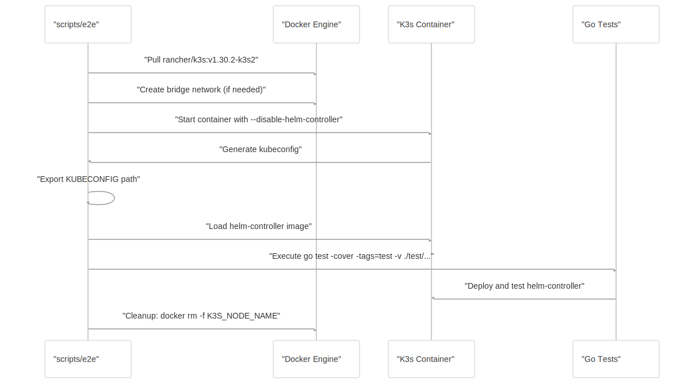
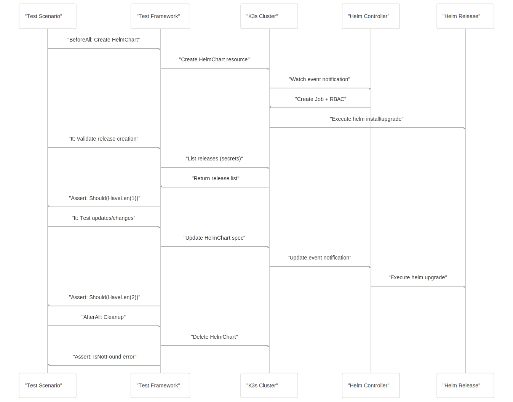

# Testing Framework

[Get free private DeepWikis in Devin](/private-repo)

[DeepWiki](https://deepwiki.com)

[DeepWiki](/)

[k3s-io/helm-controller](https://github.com/k3s-io/helm-controller)

[Get free private DeepWikis with

Devin](/private-repo)Share

Last indexed: 22 July 2025 ([dac1b5](https://github.com/k3s-io/helm-controller/commits/dac1b5e9))

* [Overview](/k3s-io/helm-controller/1-overview)
* [User Guide](/k3s-io/helm-controller/2-user-guide)
* [Installation and Setup](/k3s-io/helm-controller/2.1-installation-and-setup)
* [Using HelmChart Resources](/k3s-io/helm-controller/2.2-using-helmchart-resources)
* [Configuration Options](/k3s-io/helm-controller/2.3-configuration-options)
* [Architecture](/k3s-io/helm-controller/3-architecture)
* [System Overview](/k3s-io/helm-controller/3.1-system-overview)
* [API Design](/k3s-io/helm-controller/3.2-api-design)
* [Controller Implementation](/k3s-io/helm-controller/3.3-controller-implementation)
* [Job Execution Model](/k3s-io/helm-controller/3.4-job-execution-model)
* [Developer Guide](/k3s-io/helm-controller/4-developer-guide)
* [Code Generation](/k3s-io/helm-controller/4.1-code-generation)
* [Build System](/k3s-io/helm-controller/4.2-build-system)
* [Testing Framework](/k3s-io/helm-controller/4.3-testing-framework)
* [CI/CD Pipeline](/k3s-io/helm-controller/4.4-cicd-pipeline)
* [Reference](/k3s-io/helm-controller/5-reference)
* [API Reference](/k3s-io/helm-controller/5.1-api-reference)
* [CLI Reference](/k3s-io/helm-controller/5.2-cli-reference)
* [Generated Components](/k3s-io/helm-controller/5.3-generated-components)

Menu

# Testing Framework

Relevant source files

* [scripts/e2e](https://github.com/k3s-io/helm-controller/blob/dac1b5e9/scripts/e2e)
* [test/framework/framework.go](https://github.com/k3s-io/helm-controller/blob/dac1b5e9/test/framework/framework.go)
* [test/suite/helm\_test.go](https://github.com/k3s-io/helm-controller/blob/dac1b5e9/test/suite/helm_test.go)
* [test/suite/zz\_suite\_test.go](https://github.com/k3s-io/helm-controller/blob/dac1b5e9/test/suite/zz_suite_test.go)

The helm-controller testing framework provides comprehensive end-to-end testing capabilities for validating Helm chart deployments and controller behavior in a Kubernetes environment. This framework uses Ginkgo and Gomega for behavior-driven development (BDD) style testing with a K3s cluster running in Docker containers for isolation.

For information about the build system that supports testing, see [Build System](/k3s-io/helm-controller/4.2-build-system). For details about the CI/CD pipeline that executes these tests, see [CI/CD Pipeline](/k3s-io/helm-controller/4.4-cicd-pipeline).

## Test Architecture

The testing framework consists of three main layers: the test execution environment, the test framework infrastructure, and the actual test suites.



Sources: [test/suite/helm\_test.go1-855](https://github.com/k3s-io/helm-controller/blob/dac1b5e9/test/suite/helm_test.go#L1-L855) [test/framework/framework.go1-288](https://github.com/k3s-io/helm-controller/blob/dac1b5e9/test/framework/framework.go#L1-L288) [scripts/e2e1-47](https://github.com/k3s-io/helm-controller/blob/dac1b5e9/scripts/e2e#L1-L47) [test/suite/zz\_suite\_test.go1-14](https://github.com/k3s-io/helm-controller/blob/dac1b5e9/test/suite/zz_suite_test.go#L1-L14)

## Test Environment Setup

The E2E testing environment is orchestrated by the `scripts/e2e` script, which creates an isolated K3s cluster in Docker for testing.

### E2E Environment Components

| Component | Purpose | Configuration |
| --- | --- | --- |
| K3s Container | Kubernetes test cluster | `rancher/k3s:v1.30.2-k3s2` |
| Network Isolation | Docker bridge network | Auto-detected or default bridge |
| Disabled Services | Reduce test complexity | `--disable=metrics-server,traefik` |
| Helm Controller | Disabled built-in version | `--disable-helm-controller` |

The setup process follows this sequence:



Sources: [scripts/e2e15-46](https://github.com/k3s-io/helm-controller/blob/dac1b5e9/scripts/e2e#L15-L46)

## Framework Infrastructure

The `Framework` struct in [test/framework/framework.go](https://github.com/k3s-io/helm-controller/blob/dac1b5e9/test/framework/framework.go) provides the core testing infrastructure with Kubernetes clients and helper methods.

### Framework Structure

The `Framework` struct contains the following key components:

```
type Framework struct {
    HelmClientSet *helmcln.Clientset     // Helm custom resource client
    ClientSet     *kubernetes.Clientset  // Standard Kubernetes client
    ClientExt     *extclient.Clientset   // Extension API client
    crds          []*apiextv1.CustomResourceDefinition
    Kubeconfig    string
    Name          string
    Namespace     string
    PID           int
}
```

Sources: [test/framework/framework.go38-47](https://github.com/k3s-io/helm-controller/blob/dac1b5e9/test/framework/framework.go#L38-L47)

### Framework Lifecycle

The framework integrates with Ginkgo's lifecycle hooks to manage test setup and teardown:



Sources: [test/framework/framework.go49-89](https://github.com/k3s-io/helm-controller/blob/dac1b5e9/test/framework/framework.go#L49-L89)

### Helper Methods

The framework provides specialized helper methods for Helm resource management:

| Method | Purpose | Return Type |
| --- | --- | --- |
| `NewHelmChart()` | Create HelmChart resource template | `*v1.HelmChart` |
| `NewHelmChartConfig()` | Create HelmChartConfig template | `*v1.HelmChartConfig` |
| `CreateHelmChart()` | Deploy HelmChart to cluster | `*v1.HelmChart, error` |
| `UpdateHelmChart()` | Update existing HelmChart | `*v1.HelmChart, error` |
| `DeleteHelmChart()` | Remove HelmChart resource | `error` |
| `ListReleases()` | List Helm releases (secrets) | `[]corev1.Secret, error` |
| `GetJob()` | Get controller job for chart | `*batchv1.Job, error` |
| `ListChartPods()` | List pods created by chart | `[]corev1.Pod, error` |
| `GetChartContent()` | Download chart tarball | `string, error` |

Sources: [test/framework/framework.go120-287](https://github.com/k3s-io/helm-controller/blob/dac1b5e9/test/framework/framework.go#L120-L287)

## Test Suite Structure

The test suites use Ginkgo's BDD structure with `Describe`, `Context`, `It`, `BeforeAll`, and `AfterAll` blocks to organize test scenarios.

### Test Organization Pattern


Sources: [test/suite/helm\_test.go21-854](https://github.com/k3s-io/helm-controller/blob/dac1b5e9/test/suite/helm_test.go#L21-L854)

### Core Test Scenarios

The test suite covers these primary scenarios:

| Test Context | Validation Points | Key Assertions |
| --- | --- | --- |
| Basic HelmChart Creation | Release creation, pod deployment | `Eventually(framework.ListReleases).Should(HaveLen(1))` |
| Version Updates | New release generation, image updates | `Should(HaveLen(2))`, container image validation |
| Values Updates | Configuration changes trigger updates | Release count increments |
| ChartContent Usage | Base64-encoded chart deployment | Direct chart content deployment |
| HelmChartConfig Integration | Config resource affects chart | Config changes trigger releases |
| ValuesSecrets | Secret-based value injection | Secret updates trigger releases |
| Timeout Configuration | Job timeout propagation | `TIMEOUT` environment variable validation |
| Security Contexts | Pod/container security settings | SecurityContext field validation |
| Namespace Creation | Target namespace handling | Release deployed to correct namespace |
| BackoffLimit Configuration | Job retry behavior | `BackoffLimit` field validation |

Sources: [test/suite/helm\_test.go24-854](https://github.com/k3s-io/helm-controller/blob/dac1b5e9/test/suite/helm_test.go#L24-L854)

## Test Execution Flow

Individual test scenarios follow a consistent pattern for resource lifecycle management:



Sources: [test/suite/helm\_test.go29-62](https://github.com/k3s-io/helm-controller/blob/dac1b5e9/test/suite/helm_test.go#L29-L62) [test/suite/helm\_test.go89-114](https://github.com/k3s-io/helm-controller/blob/dac1b5e9/test/suite/helm_test.go#L89-L114)

## Validation Strategies

The testing framework employs several validation strategies to ensure comprehensive coverage:

### Release Validation

Release validation uses Helm's secret-based storage mechanism:

```
labelSelector := labels.SelectorFromSet(labels.Set{
    "owner": "helm",
    "name":  chart.Name,
})
```

Sources: [test/framework/framework.go156-159](https://github.com/k3s-io/helm-controller/blob/dac1b5e9/test/framework/framework.go#L156-L159)

### Asynchronous Validation

The framework uses Gomega's `Eventually` construct for asynchronous validation with configurable timeouts:

* **Timeout**: 120 seconds
* **Polling Interval**: 5 seconds
* **Pattern**: `Eventually(func, timeout, interval).Should(matcher)`

Sources: [test/suite/helm\_test.go50](https://github.com/k3s-io/helm-controller/blob/dac1b5e9/test/suite/helm_test.go#L50-L50) [test/suite/helm\_test.go100](https://github.com/k3s-io/helm-controller/blob/dac1b5e9/test/suite/helm_test.go#L100-L100)

### Job Validation

Controller job validation ensures proper environment variable propagation and security context application:

```
job.Spec.Template.Spec.Containers[0].Env
job.Spec.Template.Spec.SecurityContext
job.Spec.BackoffLimit
```

Sources: [test/suite/helm\_test.go199-206](https://github.com/k3s-io/helm-controller/blob/dac1b5e9/test/suite/helm_test.go#L199-L206) [test/suite/helm\_test.go565-571](https://github.com/k3s-io/helm-controller/blob/dac1b5e9/test/suite/helm_test.go#L565-L571)

## Error Handling and Debugging

The framework includes comprehensive error handling and debugging capabilities:

### Failure Reporting

On test failures, the framework automatically collects pod logs from all containers:


Sources: [test/framework/framework.go65-85](https://github.com/k3s-io/helm-controller/blob/dac1b5e9/test/framework/framework.go#L65-L85)

### Resource Cleanup

The framework ensures proper resource cleanup with retry logic for eventual consistency:

```
Eventually(func(g Gomega) {
    g.Expect(framework.GetHelmChart(chart.Name, chart.Namespace)).Error().Should(MatchError(apierrors.IsNotFound, "IsNotFound"))
}, 120*time.Second, 5*time.Second).Should(Succeed())
```

Sources: [test/suite/helm\_test.go57-59](https://github.com/k3s-io/helm-controller/blob/dac1b5e9/test/suite/helm_test.go#L57-L59)

This testing framework provides a robust foundation for validating helm-controller functionality across various deployment scenarios and edge cases, ensuring reliable Helm chart management in Kubernetes environments.

Dismiss

Refresh this wiki

Enter email to refresh

### On this page

* [Testing Framework](#testing-framework)
* [Test Architecture](#test-architecture)
* [Test Environment Setup](#test-environment-setup)
* [E2E Environment Components](#e2e-environment-components)
* [Framework Infrastructure](#framework-infrastructure)
* [Framework Structure](#framework-structure)
* [Framework Lifecycle](#framework-lifecycle)
* [Helper Methods](#helper-methods)
* [Test Suite Structure](#test-suite-structure)
* [Test Organization Pattern](#test-organization-pattern)
* [Core Test Scenarios](#core-test-scenarios)
* [Test Execution Flow](#test-execution-flow)
* [Validation Strategies](#validation-strategies)
* [Release Validation](#release-validation)
* [Asynchronous Validation](#asynchronous-validation)
* [Job Validation](#job-validation)
* [Error Handling and Debugging](#error-handling-and-debugging)
* [Failure Reporting](#failure-reporting)
* [Resource Cleanup](#resource-cleanup)

Ask Devin about k3s-io/helm-controller

Deep Research