# CI/CD Pipeline

[Get free private DeepWikis in Devin](/private-repo)

[DeepWiki](https://deepwiki.com)

[DeepWiki](/)

[k3s-io/helm-controller](https://github.com/k3s-io/helm-controller)

[Get free private DeepWikis with

Devin](/private-repo)Share

Last indexed: 22 July 2025 ([dac1b5](https://github.com/k3s-io/helm-controller/commits/dac1b5e9))

* [Overview](/k3s-io/helm-controller/1-overview)
* [User Guide](/k3s-io/helm-controller/2-user-guide)
* [Installation and Setup](/k3s-io/helm-controller/2.1-installation-and-setup)
* [Using HelmChart Resources](/k3s-io/helm-controller/2.2-using-helmchart-resources)
* [Configuration Options](/k3s-io/helm-controller/2.3-configuration-options)
* [Architecture](/k3s-io/helm-controller/3-architecture)
* [System Overview](/k3s-io/helm-controller/3.1-system-overview)
* [API Design](/k3s-io/helm-controller/3.2-api-design)
* [Controller Implementation](/k3s-io/helm-controller/3.3-controller-implementation)
* [Job Execution Model](/k3s-io/helm-controller/3.4-job-execution-model)
* [Developer Guide](/k3s-io/helm-controller/4-developer-guide)
* [Code Generation](/k3s-io/helm-controller/4.1-code-generation)
* [Build System](/k3s-io/helm-controller/4.2-build-system)
* [Testing Framework](/k3s-io/helm-controller/4.3-testing-framework)
* [CI/CD Pipeline](/k3s-io/helm-controller/4.4-cicd-pipeline)
* [Reference](/k3s-io/helm-controller/5-reference)
* [API Reference](/k3s-io/helm-controller/5.1-api-reference)
* [CLI Reference](/k3s-io/helm-controller/5.2-cli-reference)
* [Generated Components](/k3s-io/helm-controller/5.3-generated-components)

Menu

# CI/CD Pipeline

Relevant source files

* [.github/workflows/pr.yml](https://github.com/k3s-io/helm-controller/blob/dac1b5e9/.github/workflows/pr.yml)
* [.github/workflows/release.yml](https://github.com/k3s-io/helm-controller/blob/dac1b5e9/.github/workflows/release.yml)
* [.github/workflows/updatecli.yml](https://github.com/k3s-io/helm-controller/blob/dac1b5e9/.github/workflows/updatecli.yml)
* [.golangci.json](https://github.com/k3s-io/helm-controller/blob/dac1b5e9/.golangci.json)
* [updatecli/updatecli.d/updatecli.yml](https://github.com/k3s-io/helm-controller/blob/dac1b5e9/updatecli/updatecli.d/updatecli.yml)
* [updatecli/validate.yml](https://github.com/k3s-io/helm-controller/blob/dac1b5e9/updatecli/validate.yml)
* [updatecli/values.yaml](https://github.com/k3s-io/helm-controller/blob/dac1b5e9/updatecli/values.yaml)

This document describes the continuous integration and continuous deployment (CI/CD) pipeline for the helm-controller project. The pipeline is implemented using GitHub Actions and consists of three primary workflows that handle pull request validation, release automation, and dependency management.

For information about the testing infrastructure used within these pipelines, see [Testing Framework](/k3s-io/helm-controller/4.3-testing-framework). For details about the build system and packaging processes, see [Build System](/k3s-io/helm-controller/4.2-build-system).

## Overview

The helm-controller CI/CD pipeline is designed around three main GitHub Actions workflows that automate different aspects of the software development lifecycle:

**Sources:** [.github/workflows/pr.yml](https://github.com/k3s-io/helm-controller/blob/dac1b5e9/.github/workflows/pr.yml) [.github/workflows/release.yml](https://github.com/k3s-io/helm-controller/blob/dac1b5e9/.github/workflows/release.yml) [.github/workflows/updatecli.yml](https://github.com/k3s-io/helm-controller/blob/dac1b5e9/.github/workflows/updatecli.yml)

## Pull Request and Build Workflow

The primary CI workflow is defined in `.github/workflows/pr.yml` and triggers on pull requests and pushes to the master branch. This workflow ensures code quality and functionality through a multi-stage process.

### Workflow Jobs

| Job | Purpose | Key Steps |
| --- | --- | --- |
| `unit` | Run unit tests with coverage | Go test execution on `./pkg/...` |
| `ci` | Build, validate, package, and E2E test | Full integration testing pipeline |

**Pull Request Workflow Execution:**

The workflow uses environment variables to control the build architecture, defaulting to `amd64` for the CI environment.

**Sources:** [.github/workflows/pr.yml11-44](https://github.com/k3s-io/helm-controller/blob/dac1b5e9/.github/workflows/pr.yml#L11-L44)

## Release Workflow

The release workflow is triggered when a GitHub release is created and handles multi-architecture builds, Docker image publishing, and binary artifact distribution.

### Multi-Architecture Build Strategy

The release process supports three architectures through a matrix build strategy:

**Sources:** [.github/workflows/release.yml12-111](https://github.com/k3s-io/helm-controller/blob/dac1b5e9/.github/workflows/release.yml#L12-L111) [.github/workflows/release.yml112-218](https://github.com/k3s-io/helm-controller/blob/dac1b5e9/.github/workflows/release.yml#L112-L218)

### Container Registry Publishing

The release workflow publishes to multiple container registries with conditional authentication:

| Registry | Repository | Authentication Method |
| --- | --- | --- |
| Docker Hub | `rancher/helm-controller` (k3s-io org) | Vault secrets |
| Docker Hub | `${{ secrets.DOCKER_USERNAME }}/helm-controller` (forks) | GitHub secrets |
| GitHub Container Registry | `ghcr.io/${{ github.repository_owner }}/helm-controller` | GitHub token |

The workflow uses Docker Buildx with multi-platform support and implements a digest-based approach for creating multi-architecture manifests.

**Sources:** [.github/workflows/release.yml43-49](https://github.com/k3s-io/helm-controller/blob/dac1b5e9/.github/workflows/release.yml#L43-L49) [.github/workflows/release.yml59-87](https://github.com/k3s-io/helm-controller/blob/dac1b5e9/.github/workflows/release.yml#L59-L87) [.github/workflows/release.yml334-340](https://github.com/k3s-io/helm-controller/blob/dac1b5e9/.github/workflows/release.yml#L334-L340)

## Dependency Management

The `updatecli.yml` workflow provides automated dependency management through the UpdateCLI tool, running daily at 18:00 UTC.

### UpdateCLI Configuration

The workflow includes branch cleanup logic that removes merged UpdateCLI branches to maintain repository hygiene.

**Sources:** [.github/workflows/updatecli.yml1-56](https://github.com/k3s-io/helm-controller/blob/dac1b5e9/.github/workflows/updatecli.yml#L1-L56) [updatecli/updatecli.d/updatecli.yml](https://github.com/k3s-io/helm-controller/blob/dac1b5e9/updatecli/updatecli.d/updatecli.yml)

## Code Quality and Validation

### Linting Configuration

The CI pipeline uses golangci-lint for code quality enforcement, configured through `.golangci.json`:

**Enabled Linters:**

* `govet` - Go vet analysis
* `revive` - Fast, configurable, extensible, flexible linter
* `goimports` - Import formatting
* `misspell` - Spell checking
* `ineffassign` - Ineffectual assignment detection
* `gofmt` - Code formatting

**Exclusions:**

* Generated files matching pattern `/zz_generated_`
* Build and package directories
* Specific revive rules for test files and comments

**Sources:** [.golangci.json1-46](https://github.com/k3s-io/helm-controller/blob/dac1b5e9/.golangci.json#L1-L46)

### Validation Pipeline

The `make validate` step in the CI workflow performs comprehensive validation:

This ensures that all code follows project standards and that generated components are up-to-date.

**Sources:** [.github/workflows/pr.yml37-38](https://github.com/k3s-io/helm-controller/blob/dac1b5e9/.github/workflows/pr.yml#L37-L38)

## Job Dependencies and Artifact Flow

The release workflow demonstrates complex job orchestration with artifact sharing:

The workflow uses GitHub Actions artifacts to share build outputs between jobs, ensuring efficient resource utilization and proper dependency management.

**Sources:** [.github/workflows/release.yml234-266](https://github.com/k3s-io/helm-controller/blob/dac1b5e9/.github/workflows/release.yml#L234-L266) [.github/workflows/release.yml268-345](https://github.com/k3s-io/helm-controller/blob/dac1b5e9/.github/workflows/release.yml#L268-L345)

Dismiss

Refresh this wiki

Enter email to refresh

### On this page

* [CI/CD Pipeline](#cicd-pipeline)
* [Overview](#overview)
* [Pull Request and Build Workflow](#pull-request-and-build-workflow)
* [Workflow Jobs](#workflow-jobs)
* [Release Workflow](#release-workflow)
* [Multi-Architecture Build Strategy](#multi-architecture-build-strategy)
* [Container Registry Publishing](#container-registry-publishing)
* [Dependency Management](#dependency-management)
* [UpdateCLI Configuration](#updatecli-configuration)
* [Code Quality and Validation](#code-quality-and-validation)
* [Linting Configuration](#linting-configuration)
* [Validation Pipeline](#validation-pipeline)
* [Job Dependencies and Artifact Flow](#job-dependencies-and-artifact-flow)

Ask Devin about k3s-io/helm-controller

Deep Research