# Reference

[Get free private DeepWikis in Devin](/private-repo)

[DeepWiki](https://deepwiki.com)

[DeepWiki](/)

[k3s-io/helm-controller](https://github.com/k3s-io/helm-controller)

[Get free private DeepWikis with

Devin](/private-repo)Share

Last indexed: 22 July 2025 ([dac1b5](https://github.com/k3s-io/helm-controller/commits/dac1b5e9))

* [Overview](/k3s-io/helm-controller/1-overview)
* [User Guide](/k3s-io/helm-controller/2-user-guide)
* [Installation and Setup](/k3s-io/helm-controller/2.1-installation-and-setup)
* [Using HelmChart Resources](/k3s-io/helm-controller/2.2-using-helmchart-resources)
* [Configuration Options](/k3s-io/helm-controller/2.3-configuration-options)
* [Architecture](/k3s-io/helm-controller/3-architecture)
* [System Overview](/k3s-io/helm-controller/3.1-system-overview)
* [API Design](/k3s-io/helm-controller/3.2-api-design)
* [Controller Implementation](/k3s-io/helm-controller/3.3-controller-implementation)
* [Job Execution Model](/k3s-io/helm-controller/3.4-job-execution-model)
* [Developer Guide](/k3s-io/helm-controller/4-developer-guide)
* [Code Generation](/k3s-io/helm-controller/4.1-code-generation)
* [Build System](/k3s-io/helm-controller/4.2-build-system)
* [Testing Framework](/k3s-io/helm-controller/4.3-testing-framework)
* [CI/CD Pipeline](/k3s-io/helm-controller/4.4-cicd-pipeline)
* [Reference](/k3s-io/helm-controller/5-reference)
* [API Reference](/k3s-io/helm-controller/5.1-api-reference)
* [CLI Reference](/k3s-io/helm-controller/5.2-cli-reference)
* [Generated Components](/k3s-io/helm-controller/5.3-generated-components)

Menu

# Reference

Relevant source files

* [crd-ref-docs.yaml](https://github.com/k3s-io/helm-controller/blob/dac1b5e9/crd-ref-docs.yaml)
* [doc/helmchart.md](https://github.com/k3s-io/helm-controller/blob/dac1b5e9/doc/helmchart.md)
* [pkg/apis/helm.cattle.io/v1/types.go](https://github.com/k3s-io/helm-controller/blob/dac1b5e9/pkg/apis/helm.cattle.io/v1/types.go)
* [pkg/cmd/cmd.go](https://github.com/k3s-io/helm-controller/blob/dac1b5e9/pkg/cmd/cmd.go)

This section provides comprehensive technical reference documentation for the helm-controller's APIs, command-line interface, and auto-generated code components. This material is intended for developers who need detailed information about the specific interfaces, data structures, and generated client libraries provided by helm-controller.

For information about how to use these APIs and CLI options in practice, see [User Guide](/k3s-io/helm-controller/2-user-guide). For architectural details about how these components work internally, see [Architecture](/k3s-io/helm-controller/3-architecture).

## Overview

The helm-controller reference documentation is organized into three main areas that correspond to the different ways developers interact with the system:

**Sources:** [pkg/cmd/cmd.go28-40](https://github.com/k3s-io/helm-controller/blob/dac1b5e9/pkg/cmd/cmd.go#L28-L40) [pkg/apis/helm.cattle.io/v1/types.go24-176](https://github.com/k3s-io/helm-controller/blob/dac1b5e9/pkg/apis/helm.cattle.io/v1/types.go#L24-L176)

## API Type Hierarchy

The helm-controller defines two primary Custom Resource types in the `helm.cattle.io/v1` API group, along with their associated specifications, status, and supporting types:

**Sources:** [pkg/apis/helm.cattle.io/v1/types.go24-176](https://github.com/k3s-io/helm-controller/blob/dac1b5e9/pkg/apis/helm.cattle.io/v1/types.go#L24-L176)

## CLI Configuration Structure

The main CLI application provides extensive configuration options organized into functional groups through the `HelmController` struct:

| Configuration Area | Fields | Default Values | Purpose |
| --- | --- | --- | --- |
| **Debug & Profiling** | `Debug`, `DebugLevel`, `PprofPort` | `false`, `0`, `6060` | Development and troubleshooting |
| **Kubernetes Config** | `Kubeconfig`, `MasterURL`, `Namespace` | Environment-based | Cluster connection |
| **Controller Identity** | `ControllerName`, `NodeName` | `helm-controller`, node-specific | Controller identification |
| **Job Execution** | `JobClusterRole`, `DefaultJobImage` | `cluster-admin`, configurable | Helm job execution |
| **Performance** | `Threads` | `2` | Concurrent processing |

**Sources:** [pkg/cmd/cmd.go28-125](https://github.com/k3s-io/helm-controller/blob/dac1b5e9/pkg/cmd/cmd.go#L28-L125)

## CLI Configuration Structure

The main CLI application provides extensive configuration options organized into functional groups:

| Flag Category | Flag Name | Type | Default | Environment Variable |
| --- | --- | --- | --- | --- |
| **Controller Identity** | `controller-name` | string | `helm-controller` | `CONTROLLER_NAME` |
| **Debugging** | `debug` | bool | `false` | - |
| **Debugging** | `debug-level` | int | - | - |
| **Debugging** | `pprof-port` | int | `6060` | - |
| **Job Management** | `default-job-image` | string | - | `DEFAULT_JOB_IMAGE` |
| **Job Management** | `job-cluster-role` | string | `cluster-admin` | `JOB_CLUSTER_ROLE` |
| **Kubernetes Config** | `kubeconfig` | string | - | `KUBECONFIG` |
| **Kubernetes Config** | `master-url` | string | - | `MASTERURL` |
| **Scope Control** | `namespace` | string | - | `NAMESPACE` |
| **Node Information** | `node-name` | string | - | `NODE_NAME` |
| **Performance** | `threads` | int | `2` | `THREADS` |

**Sources:** [main.go26-94](https://github.com/k3s-io/helm-controller/blob/dac1b5e9/main.go#L26-L94)

## Reference Sections

### API Reference

The [API Reference](/k3s-io/helm-controller/5.1-api-reference) section provides complete documentation for all fields, types, and validation rules for the `HelmChart` and `HelmChartConfig` custom resources. This includes detailed field descriptions, supported values, and usage examples for the 48 configuration fields in `HelmChartSpec` and the supporting types like `SecretSpec` and `HelmChartCondition`.

### CLI Reference

The [CLI Reference](/k3s-io/helm-controller/5.2-cli-reference) section documents all command-line flags, environment variables, and configuration options available when running the helm-controller binary. This covers operational parameters like debugging options, Kubernetes connection settings, job execution configuration, and controller behavior tuning.

### Generated Components

The [Generated Components](/k3s-io/helm-controller/5.3-generated-components) section explains the auto-generated client libraries, controller interfaces, and factory patterns created by the code generation system. This includes the `HelmChartController`, `HelmChartClient`, and `HelmChartCache` interfaces, along with the handler registration functions and their implementation details.

**Sources:** [main.go16-25](https://github.com/k3s-io/helm-controller/blob/dac1b5e9/main.go#L16-L25) [pkg/apis/helm.cattle.io/v1/types.go10-56](https://github.com/k3s-io/helm-controller/blob/dac1b5e9/pkg/apis/helm.cattle.io/v1/types.go#L10-L56) [pkg/generated/controllers/helm.cattle.io/v1/helmchart.go17](https://github.com/k3s-io/helm-controller/blob/dac1b5e9/pkg/generated/controllers/helm.cattle.io/v1/helmchart.go#L17-L17) [pkg/generated/controllers/helm.cattle.io/factory.go17](https://github.com/k3s-io/helm-controller/blob/dac1b5e9/pkg/generated/controllers/helm.cattle.io/factory.go#L17-L17)

Dismiss

Refresh this wiki

Enter email to refresh

### On this page

* [Reference](#reference)
* [Overview](#overview)
* [API Type Hierarchy](#api-type-hierarchy)
* [CLI Configuration Structure](#cli-configuration-structure)
* [CLI Configuration Structure](#cli-configuration-structure-1)
* [Reference Sections](#reference-sections)
* [API Reference](#api-reference)
* [CLI Reference](#cli-reference)
* [Generated Components](#generated-components)

Ask Devin about k3s-io/helm-controller

Deep Research