# API Reference

[Get free private DeepWikis in Devin](/private-repo)

[DeepWiki](https://deepwiki.com)

[DeepWiki](/)

[k3s-io/helm-controller](https://github.com/k3s-io/helm-controller)

[Get free private DeepWikis with

Devin](/private-repo)Share

Last indexed: 22 July 2025 ([dac1b5](https://github.com/k3s-io/helm-controller/commits/dac1b5e9))

* [Overview](/k3s-io/helm-controller/1-overview)
* [User Guide](/k3s-io/helm-controller/2-user-guide)
* [Installation and Setup](/k3s-io/helm-controller/2.1-installation-and-setup)
* [Using HelmChart Resources](/k3s-io/helm-controller/2.2-using-helmchart-resources)
* [Configuration Options](/k3s-io/helm-controller/2.3-configuration-options)
* [Architecture](/k3s-io/helm-controller/3-architecture)
* [System Overview](/k3s-io/helm-controller/3.1-system-overview)
* [API Design](/k3s-io/helm-controller/3.2-api-design)
* [Controller Implementation](/k3s-io/helm-controller/3.3-controller-implementation)
* [Job Execution Model](/k3s-io/helm-controller/3.4-job-execution-model)
* [Developer Guide](/k3s-io/helm-controller/4-developer-guide)
* [Code Generation](/k3s-io/helm-controller/4.1-code-generation)
* [Build System](/k3s-io/helm-controller/4.2-build-system)
* [Testing Framework](/k3s-io/helm-controller/4.3-testing-framework)
* [CI/CD Pipeline](/k3s-io/helm-controller/4.4-cicd-pipeline)
* [Reference](/k3s-io/helm-controller/5-reference)
* [API Reference](/k3s-io/helm-controller/5.1-api-reference)
* [CLI Reference](/k3s-io/helm-controller/5.2-cli-reference)
* [Generated Components](/k3s-io/helm-controller/5.3-generated-components)

Menu

# API Reference

Relevant source files

* [crd-ref-docs.yaml](https://github.com/k3s-io/helm-controller/blob/dac1b5e9/crd-ref-docs.yaml)
* [doc/helmchart.md](https://github.com/k3s-io/helm-controller/blob/dac1b5e9/doc/helmchart.md)
* [manifests/example-helmchart.yaml](https://github.com/k3s-io/helm-controller/blob/dac1b5e9/manifests/example-helmchart.yaml)
* [pkg/apis/helm.cattle.io/v1/types.go](https://github.com/k3s-io/helm-controller/blob/dac1b5e9/pkg/apis/helm.cattle.io/v1/types.go)
* [pkg/apis/helm.cattle.io/v1/zz\_generated\_list\_types.go](https://github.com/k3s-io/helm-controller/blob/dac1b5e9/pkg/apis/helm.cattle.io/v1/zz_generated_list_types.go)
* [pkg/apis/helm.cattle.io/v1/zz\_generated\_register.go](https://github.com/k3s-io/helm-controller/blob/dac1b5e9/pkg/apis/helm.cattle.io/v1/zz_generated_register.go)
* [pkg/cmd/cmd.go](https://github.com/k3s-io/helm-controller/blob/dac1b5e9/pkg/cmd/cmd.go)

This document provides a comprehensive reference for the Custom Resource Definitions (CRDs) and API types used by the helm-controller. It covers the schema definitions, field descriptions, and validation rules for the `HelmChart` and `HelmChartConfig` resources in the `helm.cattle.io/v1` API group.

For information about using these resources in practice, see [Using HelmChart Resources](/k3s-io/helm-controller/2.2-using-helmchart-resources). For details about the controller implementation that processes these resources, see [Controller Implementation](/k3s-io/helm-controller/3.3-controller-implementation).

## API Group Overview

The helm-controller defines two primary Custom Resources under the `helm.cattle.io/v1` API group:

* **HelmChart**: Primary resource for declarative Helm chart management
* **HelmChartConfig**: Additional configuration overlay for existing HelmChart resources



Sources: [pkg/apis/helm.cattle.io/v1/types.go1-177](https://github.com/k3s-io/helm-controller/blob/dac1b5e9/pkg/apis/helm.cattle.io/v1/types.go#L1-L177) [pkg/apis/helm.cattle.io/v1/zz\_generated\_register.go30-63](https://github.com/k3s-io/helm-controller/blob/dac1b5e9/pkg/apis/helm.cattle.io/v1/zz_generated_register.go#L30-L63)

## Resource Type Hierarchy



Sources: [pkg/apis/helm.cattle.io/v1/types.go24-176](https://github.com/k3s-io/helm-controller/blob/dac1b5e9/pkg/apis/helm.cattle.io/v1/types.go#L24-L176)

## HelmChart Resource

The `HelmChart` resource represents configuration and state for the deployment of a Helm chart. It is the primary Custom Resource managed by the helm-controller.

### Metadata Annotations

The controller uses several kubebuilder annotations to define API behavior:

| Annotation | Purpose |
| --- | --- |
| `+genclient` | Generate client code |
| `+kubebuilder:subresource:status` | Enable status subresource |
| `+kubebuilder:printcolumn` | Define kubectl output columns |
| `+k8s:deepcopy-gen:interfaces` | Generate deep copy methods |

Sources: [pkg/apis/helm.cattle.io/v1/types.go13-23](https://github.com/k3s-io/helm-controller/blob/dac1b5e9/pkg/apis/helm.cattle.io/v1/types.go#L13-L23)

### HelmChartSpec Fields

| Field | Type | Description | Helm CLI Equivalent |
| --- | --- | --- | --- |
| `targetNamespace` | `string` | Target namespace for chart deployment | `--namespace` |
| `createNamespace` | `bool` | Create namespace if it doesn't exist | `--create-namespace` |
| `chart` | `string` | Chart name or HTTPS URL to chart archive | `CHART` argument |
| `version` | `string` | Chart version (repository installs only) | `--version` |
| `repo` | `string` | Chart repository URL | `--repo` |
| `repoCA` | `string` | PEM-encoded CA certificates | `--ca-file` |
| `repoCAConfigMap` | `LocalObjectReference` | ConfigMap containing CA certificates | `--ca-file` |
| `set` | `map[string]intstr.IntOrString` | Simple value overrides | `--set`, `--set-string` |
| `valuesContent` | `string` | Inline YAML values | `--values` |
| `valuesSecrets` | `[]SecretSpec` | Secret references for values | `--values` |
| `chartContent` | `string` | Base64-encoded chart archive | `CHART` argument |
| `jobImage` | `string` | Custom image for Helm job pod | N/A |
| `backOffLimit` | `*int32` | Job retry limit | N/A |
| `timeout` | `*metav1.Duration` | Operation timeout | `--timeout` |
| `failurePolicy` | `FailurePolicy` | Failure handling policy | N/A |
| `bootstrap` | `bool` | Bootstrap cluster component flag | N/A |
| `authSecret` | `LocalObjectReference` | Basic auth credentials | Uses with `--repo` |
| `authPassCredentials` | `bool` | Pass credentials to all domains | `--pass-credentials` |
| `insecureSkipTLSVerify` | `bool` | Skip TLS verification | `--insecure-skip-tls-verify` |
| `plainHTTP` | `bool` | Use HTTP instead of HTTPS | `--plain-http` |
| `dockerRegistrySecret` | `LocalObjectReference` | OCI registry credentials | N/A |
| `podSecurityContext` | `PodSecurityContext` | Pod security context | N/A |
| `securityContext` | `SecurityContext` | Container security context | N/A |

Sources: [pkg/apis/helm.cattle.io/v1/types.go34-101](https://github.com/k3s-io/helm-controller/blob/dac1b5e9/pkg/apis/helm.cattle.io/v1/types.go#L34-L101)

### HelmChartStatus Fields

| Field | Type | Description |
| --- | --- | --- |
| `jobName` | `string` | Name of the Kubernetes Job executing Helm operations |
| `conditions` | `[]HelmChartCondition` | Array of condition objects indicating resource state |

Sources: [pkg/apis/helm.cattle.io/v1/types.go104-115](https://github.com/k3s-io/helm-controller/blob/dac1b5e9/pkg/apis/helm.cattle.io/v1/types.go#L104-L115)

## HelmChartConfig Resource

The `HelmChartConfig` resource provides additional configuration for HelmChart resources managed by external systems. It allows operators to overlay configuration without modifying the original HelmChart resource.

### HelmChartConfigSpec Fields

| Field | Type | Description |
| --- | --- | --- |
| `valuesContent` | `string` | Inline YAML values (overrides HelmChart values) |
| `valuesSecrets` | `[]SecretSpec` | Secret references for values |
| `failurePolicy` | `FailurePolicy` | Failure handling policy override |

Sources: [pkg/apis/helm.cattle.io/v1/types.go130-144](https://github.com/k3s-io/helm-controller/blob/dac1b5e9/pkg/apis/helm.cattle.io/v1/types.go#L130-L144)

## Supporting Types

### FailurePolicy

```
type FailurePolicy string
```

Enumerated values with kubebuilder validation:

| Value | Description |
| --- | --- |
| `abort` | Leave chart in failed state for manual intervention |
| `reinstall` | Perform clean uninstall and reinstall |

Default: `reinstall`

Sources: [pkg/apis/helm.cattle.io/v1/types.go10-11](https://github.com/k3s-io/helm-controller/blob/dac1b5e9/pkg/apis/helm.cattle.io/v1/types.go#L10-L11)

### SecretSpec

Defines how to load chart values from Kubernetes Secrets:

| Field | Type | Description |
| --- | --- | --- |
| `name` | `string` | Secret name (must be in same namespace) |
| `keys` | `[]string` | Keys to read from secret |
| `ignoreUpdates` | `bool` | Skip watching for secret changes |

Sources: [pkg/apis/helm.cattle.io/v1/types.go167-176](https://github.com/k3s-io/helm-controller/blob/dac1b5e9/pkg/apis/helm.cattle.io/v1/types.go#L167-L176)

### HelmChartCondition

Represents status conditions on HelmChart resources:

| Field | Type | Description |
| --- | --- | --- |
| `type` | `HelmChartConditionType` | Condition type |
| `status` | `corev1.ConditionStatus` | True, False, or Unknown |
| `reason` | `string` | Brief reason for transition |
| `message` | `string` | Human-readable details |

#### HelmChartConditionType Constants

| Constant | Value | Description |
| --- | --- | --- |
| `HelmChartJobCreated` | `"JobCreated"` | Job has been created |
| `HelmChartFailed` | `"Failed"` | Job failed with abort policy |

Sources: [pkg/apis/helm.cattle.io/v1/types.go146-164](https://github.com/k3s-io/helm-controller/blob/dac1b5e9/pkg/apis/helm.cattle.io/v1/types.go#L146-L164)

## Resource Relationships



Sources: [pkg/apis/helm.cattle.io/v1/types.go54-96](https://github.com/k3s-io/helm-controller/blob/dac1b5e9/pkg/apis/helm.cattle.io/v1/types.go#L54-L96)

## Example Resource Definitions

### Basic HelmChart

```
apiVersion: helm.cattle.io/v1
kind: HelmChart
metadata:
  name: traefik
  namespace: kube-system
spec:
  chart: stable/traefik
  set:
    rbac.enabled: "true"
    ssl.enabled: "true"
```

### Advanced HelmChart with Secret References

```
apiVersion: helm.cattle.io/v1
kind: HelmChart
metadata:
  name: my-app
  namespace: default
spec:
  repo: https://charts.example.com
  chart: my-app
  version: "1.2.3"
  targetNamespace: my-app
  createNamespace: true
  valuesSecrets:
    - name: my-app-values
      keys: ["values.yaml"]
  failurePolicy: abort
  timeout: "10m"
```

### HelmChartConfig Overlay

```
apiVersion: helm.cattle.io/v1
kind: HelmChartConfig
metadata:
  name: my-app
  namespace: default
spec:
  valuesContent: |
    replicaCount: 3
    resources:
      limits:
        memory: "512Mi"
  failurePolicy: reinstall
```

Sources: [manifests/example-helmchart.yaml1-12](https://github.com/k3s-io/helm-controller/blob/dac1b5e9/manifests/example-helmchart.yaml#L1-L12)

## Generated API Components

The controller generates several supporting types for Kubernetes integration:

* `HelmChartList` and `HelmChartConfigList`: List wrapper types
* `NewHelmChart()` and `NewHelmChartConfig()`: Constructor functions
* Deep copy methods via code generation
* Client interfaces and implementations

Sources: [pkg/apis/helm.cattle.io/v1/zz\_generated\_list\_types.go29-59](https://github.com/k3s-io/helm-controller/blob/dac1b5e9/pkg/apis/helm.cattle.io/v1/zz_generated_list_types.go#L29-L59)

Dismiss

Refresh this wiki

Enter email to refresh

### On this page

* [API Reference](#api-reference)
* [API Group Overview](#api-group-overview)
* [Resource Type Hierarchy](#resource-type-hierarchy)
* [HelmChart Resource](#helmchart-resource)
* [Metadata Annotations](#metadata-annotations)
* [HelmChartSpec Fields](#helmchartspec-fields)
* [HelmChartStatus Fields](#helmchartstatus-fields)
* [HelmChartConfig Resource](#helmchartconfig-resource)
* [HelmChartConfigSpec Fields](#helmchartconfigspec-fields)
* [Supporting Types](#supporting-types)
* [FailurePolicy](#failurepolicy)
* [SecretSpec](#secretspec)
* [HelmChartCondition](#helmchartcondition)
* [HelmChartConditionType Constants](#helmchartconditiontype-constants)
* [Resource Relationships](#resource-relationships)
* [Example Resource Definitions](#example-resource-definitions)
* [Basic HelmChart](#basic-helmchart)
* [Advanced HelmChart with Secret References](#advanced-helmchart-with-secret-references)
* [HelmChartConfig Overlay](#helmchartconfig-overlay)
* [Generated API Components](#generated-api-components)

Ask Devin about k3s-io/helm-controller

Deep Research