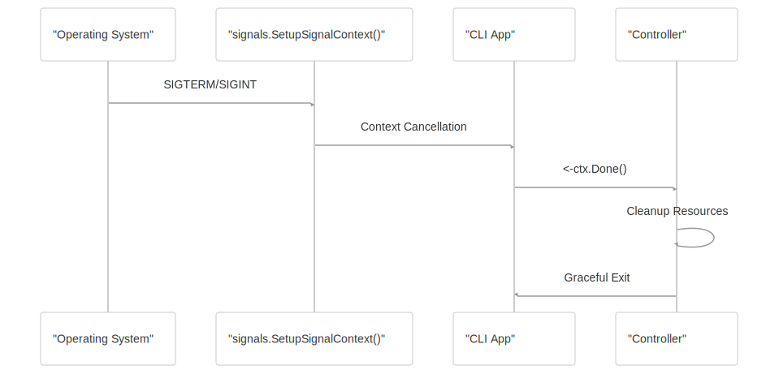

# CLI Reference

[Get free private DeepWikis in Devin](/private-repo)

[DeepWiki](https://deepwiki.com)

[DeepWiki](/)

[k3s-io/helm-controller](https://github.com/k3s-io/helm-controller)

[Get free private DeepWikis with

Devin](/private-repo)Share

Last indexed: 22 July 2025 ([dac1b5](https://github.com/k3s-io/helm-controller/commits/dac1b5e9))

* [Overview](/k3s-io/helm-controller/1-overview)
* [User Guide](/k3s-io/helm-controller/2-user-guide)
* [Installation and Setup](/k3s-io/helm-controller/2.1-installation-and-setup)
* [Using HelmChart Resources](/k3s-io/helm-controller/2.2-using-helmchart-resources)
* [Configuration Options](/k3s-io/helm-controller/2.3-configuration-options)
* [Architecture](/k3s-io/helm-controller/3-architecture)
* [System Overview](/k3s-io/helm-controller/3.1-system-overview)
* [API Design](/k3s-io/helm-controller/3.2-api-design)
* [Controller Implementation](/k3s-io/helm-controller/3.3-controller-implementation)
* [Job Execution Model](/k3s-io/helm-controller/3.4-job-execution-model)
* [Developer Guide](/k3s-io/helm-controller/4-developer-guide)
* [Code Generation](/k3s-io/helm-controller/4.1-code-generation)
* [Build System](/k3s-io/helm-controller/4.2-build-system)
* [Testing Framework](/k3s-io/helm-controller/4.3-testing-framework)
* [CI/CD Pipeline](/k3s-io/helm-controller/4.4-cicd-pipeline)
* [Reference](/k3s-io/helm-controller/5-reference)
* [API Reference](/k3s-io/helm-controller/5.1-api-reference)
* [CLI Reference](/k3s-io/helm-controller/5.2-cli-reference)
* [Generated Components](/k3s-io/helm-controller/5.3-generated-components)

Menu

# CLI Reference

Relevant source files

* [crd-ref-docs.yaml](https://github.com/k3s-io/helm-controller/blob/dac1b5e9/crd-ref-docs.yaml)
* [doc/helmchart.md](https://github.com/k3s-io/helm-controller/blob/dac1b5e9/doc/helmchart.md)
* [main.go](https://github.com/k3s-io/helm-controller/blob/dac1b5e9/main.go)
* [pkg/cmd/cmd.go](https://github.com/k3s-io/helm-controller/blob/dac1b5e9/pkg/cmd/cmd.go)
* [pkg/codegen/main.go](https://github.com/k3s-io/helm-controller/blob/dac1b5e9/pkg/codegen/main.go)

This document provides a comprehensive reference for the helm-controller command-line interface. The helm-controller CLI is the primary way to start and configure the Kubernetes controller that manages Helm chart installations through Custom Resources.

For information about the HelmChart and HelmChartConfig Custom Resource APIs, see [API Reference](/k3s-io/helm-controller/5.1-api-reference). For details about configuring the controller behavior through Custom Resources, see [Using HelmChart Resources](/k3s-io/helm-controller/2.2-using-helmchart-resources).

## Command Overview

The helm-controller binary provides a single command interface for running the Kubernetes controller. It uses the urfave/cli/v2 framework and supports configuration through both command-line flags and environment variables.

```
helm-controller [global options]
```

**Application Details:**

* **Name**: `helm-controller`
* **Description**: "A simple way to manage helm charts with CRDs in K8s."
* **Version**: Dynamically generated from build metadata

Sources: [main.go25-31](https://github.com/k3s-io/helm-controller/blob/dac1b5e9/main.go#L25-L31)

## CLI Architecture Flow



Sources: [main.go24-107](https://github.com/k3s-io/helm-controller/blob/dac1b5e9/main.go#L24-L107) [pkg/cmd/cmd.go63-115](https://github.com/k3s-io/helm-controller/blob/dac1b5e9/pkg/cmd/cmd.go#L63-L115)

## Configuration Structure Mapping


Sources: [main.go32-100](https://github.com/k3s-io/helm-controller/blob/dac1b5e9/main.go#L32-L100) [pkg/cmd/cmd.go28-40](https://github.com/k3s-io/helm-controller/blob/dac1b5e9/pkg/cmd/cmd.go#L28-L40)

## Command-Line Flags Reference

### Core Controller Configuration

| Flag | Type | Default | Description |
| --- | --- | --- | --- |
| `--controller-name` | string | `helm-controller` | Unique name to identify this controller that is added to all HelmCharts tracked by this controller |
| `--namespace` | string | *(empty)* | Namespace to watch, empty means it will watch CRDs in all namespaces |
| `--threads` | int | `2` | Threadiness level to set |

### Kubernetes Connection

| Flag | Type | Default | Description |
| --- | --- | --- | --- |
| `--kubeconfig` | string | *(empty)* | Kubernetes config files, e.g. $HOME/.kube/config |
| `--master-url` | string | *(empty)* | Kubernetes cluster master URL |

### Job Management

| Flag | Type | Default | Description |
| --- | --- | --- | --- |
| `--default-job-image` | string | *(empty)* | Default image to use by jobs managing helm charts |
| `--job-cluster-role` | string | `cluster-admin` | Name of the cluster role to use for jobs created to manage helm charts |
| `--node-name` | string | *(empty)* | Name of the node this controller is running on |

### Debugging and Profiling

| Flag | Type | Default | Description |
| --- | --- | --- | --- |
| `--debug` | bool | `false` | Turn on debug logging |
| `--debug-level` | int | `0` | If debugging is enabled, set klog -v=X |
| `--pprof-port` | int | `6060` | Port to publish HTTP server runtime profiling data in the format expected by the pprof visualization tool. Only enabled if in debug mode |

Sources: [main.go32-100](https://github.com/k3s-io/helm-controller/blob/dac1b5e9/main.go#L32-L100)

## Environment Variables

All command-line flags have corresponding environment variable equivalents for container-friendly configuration:

| Environment Variable | Corresponding Flag | Purpose |
| --- | --- | --- |
| `CONTROLLER_NAME` | `--controller-name` | Controller identification |
| `NAMESPACE` | `--namespace` | Watch scope configuration |
| `THREADS` | `--threads` | Concurrency control |
| `KUBECONFIG` | `--kubeconfig` | Kubernetes authentication |
| `MASTERURL` | `--master-url` | Kubernetes API endpoint |
| `DEFAULT_JOB_IMAGE` | `--default-job-image` | Helm job container image |
| `JOB_CLUSTER_ROLE` | `--job-cluster-role` | RBAC configuration |
| `NODE_NAME` | `--node-name` | Node scheduling hint |

Sources: [main.go37-98](https://github.com/k3s-io/helm-controller/blob/dac1b5e9/main.go#L37-L98)

## Usage Examples

### Basic Usage

Start the controller with default settings:

```
helm-controller
```

### Namespace-Scoped Operation

Run the controller watching only a specific namespace:

```
helm-controller --namespace=my-apps
```

### Custom Job Configuration

Configure custom job image and RBAC:

```
helm-controller \
  --default-job-image=my-registry/klipper-helm:latest \
  --job-cluster-role=helm-operator
```

### Debug Mode

Enable debug logging with verbose output:

```
helm-controller --debug --debug-level=5
```

### Container Deployment

Example using environment variables for containerized deployment:

```
export CONTROLLER_NAME=production-helm-controller
export NAMESPACE=helm-system
export DEFAULT_JOB_IMAGE=rancher/klipper-helm:v0.8.3
export THREADS=4
helm-controller
```

## Debug and Profiling Features

### Debug Logging Setup

When debug mode is enabled, the controller configures both logrus and klog logging systems:



### Profiling Server

When debug mode is enabled and `pprof-port` is set, an HTTP server is started for runtime profiling:

* **Default Port**: 6060
* **Endpoint**: `http://localhost:<pprof-port>/debug/pprof/`
* **Purpose**: Go runtime profiling data compatible with the pprof visualization tool

Sources: [pkg/cmd/cmd.go42-61](https://github.com/k3s-io/helm-controller/blob/dac1b5e9/pkg/cmd/cmd.go#L42-L61) [pkg/cmd/cmd.go64-71](https://github.com/k3s-io/helm-controller/blob/dac1b5e9/pkg/cmd/cmd.go#L64-L71)

## Signal Handling and Shutdown

The controller implements graceful shutdown using the wrangler signals package:



Sources: [main.go103-106](https://github.com/k3s-io/helm-controller/blob/dac1b5e9/main.go#L103-L106) [pkg/cmd/cmd.go113-114](https://github.com/k3s-io/helm-controller/blob/dac1b5e9/pkg/cmd/cmd.go#L113-L114)

## Configuration Validation

The controller validates configuration through the `common.Options.Validate()` method before starting:

| Configuration | Validation Rule |
| --- | --- |
| `DefaultJobImage` | Must be a valid container image reference if specified |
| `JobClusterRole` | Must be a valid Kubernetes ClusterRole name |
| `Threads` | Must be a positive integer |

Sources: [pkg/cmd/cmd.go94-103](https://github.com/k3s-io/helm-controller/blob/dac1b5e9/pkg/cmd/cmd.go#L94-L103)

## Exit Codes and Error Handling

The controller uses standard Unix exit codes:

* **0**: Successful execution
* **1**: Fatal error (logged via logrus.Fatal)

Common error scenarios include:

* Kubernetes configuration errors
* CRD installation failures
* Controller registration failures

Sources: [main.go104-106](https://github.com/k3s-io/helm-controller/blob/dac1b5e9/main.go#L104-L106)

Dismiss

Refresh this wiki

Enter email to refresh

### On this page

* [CLI Reference](#cli-reference)
* [Command Overview](#command-overview)
* [CLI Architecture Flow](#cli-architecture-flow)
* [Configuration Structure Mapping](#configuration-structure-mapping)
* [Command-Line Flags Reference](#command-line-flags-reference)
* [Core Controller Configuration](#core-controller-configuration)
* [Kubernetes Connection](#kubernetes-connection)
* [Job Management](#job-management)
* [Debugging and Profiling](#debugging-and-profiling)
* [Environment Variables](#environment-variables)
* [Usage Examples](#usage-examples)
* [Basic Usage](#basic-usage)
* [Namespace-Scoped Operation](#namespace-scoped-operation)
* [Custom Job Configuration](#custom-job-configuration)
* [Debug Mode](#debug-mode)
* [Container Deployment](#container-deployment)
* [Debug and Profiling Features](#debug-and-profiling-features)
* [Debug Logging Setup](#debug-logging-setup)
* [Profiling Server](#profiling-server)
* [Signal Handling and Shutdown](#signal-handling-and-shutdown)
* [Configuration Validation](#configuration-validation)
* [Exit Codes and Error Handling](#exit-codes-and-error-handling)

Ask Devin about k3s-io/helm-controller

Deep Research