# Generated Components

[Get free private DeepWikis in Devin](/private-repo)

[DeepWiki](https://deepwiki.com)

[DeepWiki](/)

[k3s-io/helm-controller](https://github.com/k3s-io/helm-controller)

[Get free private DeepWikis with

Devin](/private-repo)Share

Last indexed: 22 July 2025 ([dac1b5](https://github.com/k3s-io/helm-controller/commits/dac1b5e9))

* [Overview](/k3s-io/helm-controller/1-overview)
* [User Guide](/k3s-io/helm-controller/2-user-guide)
* [Installation and Setup](/k3s-io/helm-controller/2.1-installation-and-setup)
* [Using HelmChart Resources](/k3s-io/helm-controller/2.2-using-helmchart-resources)
* [Configuration Options](/k3s-io/helm-controller/2.3-configuration-options)
* [Architecture](/k3s-io/helm-controller/3-architecture)
* [System Overview](/k3s-io/helm-controller/3.1-system-overview)
* [API Design](/k3s-io/helm-controller/3.2-api-design)
* [Controller Implementation](/k3s-io/helm-controller/3.3-controller-implementation)
* [Job Execution Model](/k3s-io/helm-controller/3.4-job-execution-model)
* [Developer Guide](/k3s-io/helm-controller/4-developer-guide)
* [Code Generation](/k3s-io/helm-controller/4.1-code-generation)
* [Build System](/k3s-io/helm-controller/4.2-build-system)
* [Testing Framework](/k3s-io/helm-controller/4.3-testing-framework)
* [CI/CD Pipeline](/k3s-io/helm-controller/4.4-cicd-pipeline)
* [Reference](/k3s-io/helm-controller/5-reference)
* [API Reference](/k3s-io/helm-controller/5.1-api-reference)
* [CLI Reference](/k3s-io/helm-controller/5.2-cli-reference)
* [Generated Components](/k3s-io/helm-controller/5.3-generated-components)

Menu

# Generated Components

Relevant source files

* [pkg/generated/clientset/versioned/clientset.go](https://github.com/k3s-io/helm-controller/blob/dac1b5e9/pkg/generated/clientset/versioned/clientset.go)
* [pkg/generated/clientset/versioned/typed/helm.cattle.io/v1/fake/fake\_helm.cattle.io\_client.go](https://github.com/k3s-io/helm-controller/blob/dac1b5e9/pkg/generated/clientset/versioned/typed/helm.cattle.io/v1/fake/fake_helm.cattle.io_client.go)
* [pkg/generated/clientset/versioned/typed/helm.cattle.io/v1/helm.cattle.io\_client.go](https://github.com/k3s-io/helm-controller/blob/dac1b5e9/pkg/generated/clientset/versioned/typed/helm.cattle.io/v1/helm.cattle.io_client.go)
* [pkg/generated/clientset/versioned/typed/helm.cattle.io/v1/helmchart.go](https://github.com/k3s-io/helm-controller/blob/dac1b5e9/pkg/generated/clientset/versioned/typed/helm.cattle.io/v1/helmchart.go)
* [pkg/generated/clientset/versioned/typed/helm.cattle.io/v1/helmchartconfig.go](https://github.com/k3s-io/helm-controller/blob/dac1b5e9/pkg/generated/clientset/versioned/typed/helm.cattle.io/v1/helmchartconfig.go)
* [pkg/generated/controllers/helm.cattle.io/v1/helmchartconfig.go](https://github.com/k3s-io/helm-controller/blob/dac1b5e9/pkg/generated/controllers/helm.cattle.io/v1/helmchartconfig.go)
* [pkg/generated/controllers/helm.cattle.io/v1/interface.go](https://github.com/k3s-io/helm-controller/blob/dac1b5e9/pkg/generated/controllers/helm.cattle.io/v1/interface.go)

This document provides technical reference documentation for the auto-generated code components in helm-controller. These components include Kubernetes clientsets, controller interfaces, and fake clients for testing that are automatically generated from the API type definitions.

For information about the underlying API types that drive this code generation, see [API Reference](/k3s-io/helm-controller/5.1-api-reference). For details about the code generation process itself, see [Code Generation](/k3s-io/helm-controller/4.1-code-generation).

## Overview

The helm-controller project uses Kubernetes code generation tools to automatically create several categories of components from the source API definitions. This generated code provides type-safe clients, controller interfaces, and testing utilities that integrate seamlessly with the Kubernetes ecosystem.



Sources: [pkg/generated/clientset/versioned/clientset.go1-121](https://github.com/k3s-io/helm-controller/blob/dac1b5e9/pkg/generated/clientset/versioned/clientset.go#L1-L121) [pkg/generated/controllers/helm.cattle.io/v1/interface.go1-55](https://github.com/k3s-io/helm-controller/blob/dac1b5e9/pkg/generated/controllers/helm.cattle.io/v1/interface.go#L1-L55)

## Kubernetes Clientsets

The generated clientsets provide strongly-typed interfaces for interacting with helm-controller custom resources. The client hierarchy follows Kubernetes conventions with version-specific groupings and implements the standard Kubernetes client-go patterns.

### Clientset Architecture



### Primary Clientset Interface

The main `Clientset` struct provides access to API groups through the `Interface`:

| Method | Return Type | Purpose |
| --- | --- | --- |
| `HelmV1()` | `helmv1.HelmV1Interface` | Access to helm.cattle.io/v1 resources |
| `Discovery()` | `discovery.DiscoveryInterface` | Kubernetes API discovery |

The `HelmV1Interface` embeds both getter interfaces for the custom resources ([helm.cattle.io\_client.go29-33](https://github.com/k3s-io/helm-controller/blob/dac1b5e9/helm.cattle.io_client.go#L29-L33)).

### Resource-Specific Interfaces

Both `HelmChartInterface` and `HelmChartConfigInterface` provide full CRUD operations:

| Operation | Method Signature | Notes |
| --- | --- | --- |
| Create | `Create(ctx, obj, opts) (*T, error)` | Standard creation |
| Get | `Get(ctx, name, opts) (*T, error)` | Name-based retrieval |
| List | `List(ctx, opts) (*TList, error)` | Supports label/field selectors |
| Update | `Update(ctx, obj, opts) (*T, error)` | Full resource update |
| UpdateStatus | `UpdateStatus(ctx, obj, opts) (*T, error)` | HelmChart only |
| Delete | `Delete(ctx, name, opts) error` | Single resource deletion |
| DeleteCollection | `DeleteCollection(ctx, deleteOpts, listOpts) error` | Bulk deletion |
| Watch | `Watch(ctx, opts) (watch.Interface, error)` | Event stream |
| Patch | `Patch(ctx, name, pt, data, opts, ...) (*T, error)` | Partial updates |

Note that `HelmChartConfigInterface` does not include `UpdateStatus()` as HelmChartConfig resources do not have a status subresource ([helmchartconfig.go38-49](https://github.com/k3s-io/helm-controller/blob/dac1b5e9/helmchartconfig.go#L38-L49)).

### Client Construction Patterns

The clientset supports multiple construction patterns for different use cases:

| Constructor | Error Handling | Use Case |
| --- | --- | --- |
| `NewForConfig(*rest.Config)` | Returns error | Standard configuration |
| `NewForConfigOrDie(*rest.Config)` | Panics on error | Simple initialization |
| `NewForConfigAndClient(config, httpClient)` | Returns error | Custom HTTP client |
| `New(rest.Interface)` | No error | Existing REST client |

All constructors handle rate limiting configuration and user agent setup automatically ([clientset.go55-101](https://github.com/k3s-io/helm-controller/blob/dac1b5e9/clientset.go#L55-L101)).

Sources: [pkg/generated/clientset/versioned/clientset.go31-121](https://github.com/k3s-io/helm-controller/blob/dac1b5e9/pkg/generated/clientset/versioned/clientset.go#L31-L121) [pkg/generated/clientset/versioned/typed/helm.cattle.io/v1/helm.cattle.io\_client.go29-102](https://github.com/k3s-io/helm-controller/blob/dac1b5e9/pkg/generated/clientset/versioned/typed/helm.cattle.io/v1/helm.cattle.io_client.go#L29-L102) [pkg/generated/clientset/versioned/typed/helm.cattle.io/v1/helmchart.go32-71](https://github.com/k3s-io/helm-controller/blob/dac1b5e9/pkg/generated/clientset/versioned/typed/helm.cattle.io/v1/helmchart.go#L32-L71) [pkg/generated/clientset/versioned/typed/helm.cattle.io/v1/helmchartconfig.go32-68](https://github.com/k3s-io/helm-controller/blob/dac1b5e9/pkg/generated/clientset/versioned/typed/helm.cattle.io/v1/helmchartconfig.go#L32-L68)

## Controller Interfaces

The generated controller interfaces provide high-level abstractions for managing helm-controller resources using the Rancher Wrangler framework. These interfaces combine controller, client, and cache functionality into unified components.

### Wrangler Framework Integration



### Controller Interface Structure

The main `Interface` provides access to both resource controllers:

| Method | Return Type | GVK | Resource Name |
| --- | --- | --- | --- |
| `HelmChart()` | `HelmChartController` | `helm.cattle.io/v1/HelmChart` | `helmcharts` |
| `HelmChartConfig()` | `HelmChartConfigController` | `helm.cattle.io/v1/HelmChartConfig` | `helmchartconfigs` |

Each controller is created using `generic.NewController` with the appropriate `schema.GroupVersionKind` ([interface.go48-54](https://github.com/k3s-io/helm-controller/blob/dac1b5e9/interface.go#L48-L54)).

### Resource-Specific Controller Types

Both resource types define three complementary interfaces:

#### HelmChart Controllers

* `HelmChartController`: Embeds `generic.ControllerInterface[*v1.HelmChart, *v1.HelmChartList]`
* `HelmChartClient`: Embeds `generic.ClientInterface[*v1.HelmChart, *v1.HelmChartList]`
* `HelmChartCache`: Embeds `generic.CacheInterface[*v1.HelmChart]`

#### HelmChartConfig Controllers

* `HelmChartConfigController`: Embeds `generic.ControllerInterface[*v1.HelmChartConfig, *v1.HelmChartConfigList]`
* `HelmChartConfigClient`: Embeds `generic.ClientInterface[*v1.HelmChartConfig, *v1.HelmChartConfigList]`
* `HelmChartConfigCache`: Embeds `generic.CacheInterface[*v1.HelmChartConfig]`

### Wrangler Generic Framework

The controller interfaces leverage Wrangler's generic framework which provides:

* **Controller Interface**: Event handling, reconciliation, and lifecycle management
* **Client Interface**: Kubernetes API operations with built-in retry and caching
* **Cache Interface**: In-memory resource caching with watch-based updates

All interfaces are created with the `namespaced=true` flag, indicating these are namespace-scoped resources ([interface.go49-53](https://github.com/k3s-io/helm-controller/blob/dac1b5e9/interface.go#L49-L53)).

Sources: [pkg/generated/controllers/helm.cattle.io/v1/interface.go29-55](https://github.com/k3s-io/helm-controller/blob/dac1b5e9/pkg/generated/controllers/helm.cattle.io/v1/interface.go#L29-L55) [pkg/generated/controllers/helm.cattle.io/v1/helmchartconfig.go26-40](https://github.com/k3s-io/helm-controller/blob/dac1b5e9/pkg/generated/controllers/helm.cattle.io/v1/helmchartconfig.go#L26-L40)

## Fake Clients for Testing

Fake clients implement the same interfaces as production clients but operate against in-memory test fixtures instead of live Kubernetes clusters. These enable comprehensive unit testing without infrastructure dependencies.

### Fake Client Architecture



### FakeHelmV1 Implementation

The `FakeHelmV1` struct embeds `*testing.Fake` to provide the core testing functionality:

| Method | Purpose | Implementation |
| --- | --- | --- |
| `HelmCharts(namespace)` | Returns fake HelmChart client | `newFakeHelmCharts(c, namespace)` |
| `HelmChartConfigs(namespace)` | Returns fake HelmChartConfig client | `newFakeHelmChartConfigs(c, namespace)` |
| `RESTClient()` | Returns nil REST client | Always returns `nil` |

The fake client maintains the same interface structure as the production client but routes all operations through the testing framework ([fake\_helm.cattle.io\_client.go27-44](https://github.com/k3s-io/helm-controller/blob/dac1b5e9/fake_helm.cattle.io_client.go#L27-L44)).

### Testing Framework Integration

Fake clients integrate with `k8s.io/client-go/testing` through several key patterns:

#### Action Recording

All client operations are converted to `testing.Action` objects that record:

* **Resource metadata**: Group, version, kind, namespace
* **Operation type**: Get, List, Create, Update, Delete, Watch, Patch
* **Request parameters**: Object data, options, selectors

#### Response Simulation

The testing framework can be configured with:

* **PrependReactor**: Custom response logic for specific operations
* **Object state**: Pre-populated resources for Get/List operations
* **Error injection**: Simulated API server errors

### Usage in Unit Tests

Fake clients enable isolated testing by:

1. **Replacing real API calls**: No actual Kubernetes cluster required
2. **Deterministic responses**: Predictable test outcomes
3. **Action verification**: Assert expected API operations occurred
4. **State manipulation**: Control resource state for test scenarios

Example test patterns leverage the fake's action recording to verify controller behavior without external dependencies.

Sources: [pkg/generated/clientset/versioned/typed/helm.cattle.io/v1/fake/fake\_helm.cattle.io\_client.go21-44](https://github.com/k3s-io/helm-controller/blob/dac1b5e9/pkg/generated/clientset/versioned/typed/helm.cattle.io/v1/fake/fake_helm.cattle.io_client.go#L21-L44)

## Integration Patterns

Generated components integrate with helm-controller through well-established patterns that align with Kubernetes controller development practices and the Rancher Wrangler framework.

### Controller Integration Pattern

The helm-controller's main controller logic integrates generated components through dependency injection:



### Standard Usage Patterns

#### Client Construction and Configuration

```
// Create clientset from cluster config
clientset, err := versioned.NewForConfig(restConfig)
helmV1Client := clientset.HelmV1()

// Access namespace-scoped resource clients  
helmCharts := helmV1Client.HelmCharts(namespace)
helmChartConfigs := helmV1Client.HelmChartConfigs(namespace)

```

#### Controller Setup with Wrangler

```
// Create controller factory
factory := controller.NewSharedControllerFactory(...)

// Initialize generated controllers
controllers := v1.New(factory)
helmChartController := controllers.HelmChart()
helmChartConfigController := controllers.HelmChartConfig()

```

### Testing Integration Pattern

Unit tests leverage fake clients to simulate Kubernetes API interactions without external dependencies:



#### Typical Test Pattern

```
// Create fake clientset with test data
fakeClientset := fake.NewSimpleClientset(existingObjects...)
fakeHelmV1 := fakeClientset.HelmV1()

// Execute controller logic with fake client
controller.reconcileHelmChart(ctx, helmChart, fakeHelmV1)

// Verify expected API operations occurred
actions := fakeClientset.Actions()
assert.Equal(t, expectedActionCount, len(actions))

```

### Resource Lifecycle Management

Generated components facilitate the complete resource lifecycle:

1. **Resource Creation**: Using typed `Create()` methods with validation
2. **Status Updates**: Via `UpdateStatus()` for HelmChart resources only
3. **Reconciliation**: Through controller interfaces and event handling
4. **Cleanup**: Using `Delete()` and `DeleteCollection()` methods

The generated interfaces ensure type safety while maintaining compatibility with standard Kubernetes patterns and the Wrangler framework's enhanced controller capabilities.

Sources: [pkg/generated/clientset/versioned/clientset.go55-101](https://github.com/k3s-io/helm-controller/blob/dac1b5e9/pkg/generated/clientset/versioned/clientset.go#L55-L101) [pkg/generated/controllers/helm.cattle.io/v1/interface.go38-54](https://github.com/k3s-io/helm-controller/blob/dac1b5e9/pkg/generated/controllers/helm.cattle.io/v1/interface.go#L38-L54)

## Integration Patterns

Generated components integrate with helm-controller through well-established patterns that align with Kubernetes controller development practices.

### Controller Usage Pattern

Controllers typically consume generated components through dependency injection:

1. **Client construction**: Clientset creation from cluster configuration
2. **Informer setup**: Watch-based caching using generated clients
3. **Resource manipulation**: CRUD operations via typed interfaces
4. **Deep copying**: Safe object handling during reconciliation

### Testing Integration Pattern

Unit tests leverage fake clients to simulate Kubernetes API interactions:

1. **Fake clientset creation**: In-memory client instantiation
2. **Resource pre-population**: Test fixture setup
3. **Action verification**: Operation validation via testing framework
4. **Response simulation**: Custom reactor configuration for complex scenarios

Sources: [pkg/generated/clientset/versioned/clientset.go55-101](https://github.com/k3s-io/helm-controller/blob/dac1b5e9/pkg/generated/clientset/versioned/clientset.go#L55-L101) [pkg/generated/clientset/versioned/fake/register.go33-55](https://github.com/k3s-io/helm-controller/blob/dac1b5e9/pkg/generated/clientset/versioned/fake/register.go#L33-L55)

Dismiss

Refresh this wiki

Enter email to refresh

### On this page

* [Generated Components](#generated-components)
* [Overview](#overview)
* [Kubernetes Clientsets](#kubernetes-clientsets)
* [Clientset Architecture](#clientset-architecture)
* [Primary Clientset Interface](#primary-clientset-interface)
* [Resource-Specific Interfaces](#resource-specific-interfaces)
* [Client Construction Patterns](#client-construction-patterns)
* [Controller Interfaces](#controller-interfaces)
* [Wrangler Framework Integration](#wrangler-framework-integration)
* [Controller Interface Structure](#controller-interface-structure)
* [Resource-Specific Controller Types](#resource-specific-controller-types)
* [HelmChart Controllers](#helmchart-controllers)
* [HelmChartConfig Controllers](#helmchartconfig-controllers)
* [Wrangler Generic Framework](#wrangler-generic-framework)
* [Fake Clients for Testing](#fake-clients-for-testing)
* [Fake Client Architecture](#fake-client-architecture)
* [FakeHelmV1 Implementation](#fakehelmv1-implementation)
* [Testing Framework Integration](#testing-framework-integration)
* [Action Recording](#action-recording)
* [Response Simulation](#response-simulation)
* [Usage in Unit Tests](#usage-in-unit-tests)
* [Integration Patterns](#integration-patterns)
* [Controller Integration Pattern](#controller-integration-pattern)
* [Standard Usage Patterns](#standard-usage-patterns)
* [Client Construction and Configuration](#client-construction-and-configuration)
* [Controller Setup with Wrangler](#controller-setup-with-wrangler)
* [Testing Integration Pattern](#testing-integration-pattern)
* [Typical Test Pattern](#typical-test-pattern)
* [Resource Lifecycle Management](#resource-lifecycle-management)
* [Integration Patterns](#integration-patterns-1)
* [Controller Usage Pattern](#controller-usage-pattern)
* [Testing Integration Pattern](#testing-integration-pattern-1)

Ask Devin about k3s-io/helm-controller

Deep Research