# User Guide

[Get free private DeepWikis in Devin](/private-repo)

[DeepWiki](https://deepwiki.com)

[DeepWiki](/)

[k3s-io/helm-controller](https://github.com/k3s-io/helm-controller)

[Get free private DeepWikis with

Devin](/private-repo)Share

Last indexed: 22 July 2025 ([dac1b5](https://github.com/k3s-io/helm-controller/commits/dac1b5e9))

* [Overview](/k3s-io/helm-controller/1-overview)
* [User Guide](/k3s-io/helm-controller/2-user-guide)
* [Installation and Setup](/k3s-io/helm-controller/2.1-installation-and-setup)
* [Using HelmChart Resources](/k3s-io/helm-controller/2.2-using-helmchart-resources)
* [Configuration Options](/k3s-io/helm-controller/2.3-configuration-options)
* [Architecture](/k3s-io/helm-controller/3-architecture)
* [System Overview](/k3s-io/helm-controller/3.1-system-overview)
* [API Design](/k3s-io/helm-controller/3.2-api-design)
* [Controller Implementation](/k3s-io/helm-controller/3.3-controller-implementation)
* [Job Execution Model](/k3s-io/helm-controller/3.4-job-execution-model)
* [Developer Guide](/k3s-io/helm-controller/4-developer-guide)
* [Code Generation](/k3s-io/helm-controller/4.1-code-generation)
* [Build System](/k3s-io/helm-controller/4.2-build-system)
* [Testing Framework](/k3s-io/helm-controller/4.3-testing-framework)
* [CI/CD Pipeline](/k3s-io/helm-controller/4.4-cicd-pipeline)
* [Reference](/k3s-io/helm-controller/5-reference)
* [API Reference](/k3s-io/helm-controller/5.1-api-reference)
* [CLI Reference](/k3s-io/helm-controller/5.2-cli-reference)
* [Generated Components](/k3s-io/helm-controller/5.3-generated-components)

Menu

# User Guide

Relevant source files

* [README.md](https://github.com/k3s-io/helm-controller/blob/dac1b5e9/README.md)
* [manifests/example-helmchart.yaml](https://github.com/k3s-io/helm-controller/blob/dac1b5e9/manifests/example-helmchart.yaml)
* [pkg/apis/helm.cattle.io/v1/zz\_generated\_list\_types.go](https://github.com/k3s-io/helm-controller/blob/dac1b5e9/pkg/apis/helm.cattle.io/v1/zz_generated_list_types.go)
* [pkg/apis/helm.cattle.io/v1/zz\_generated\_register.go](https://github.com/k3s-io/helm-controller/blob/dac1b5e9/pkg/apis/helm.cattle.io/v1/zz_generated_register.go)
* [test/framework/controller.go](https://github.com/k3s-io/helm-controller/blob/dac1b5e9/test/framework/controller.go)

## Purpose and Scope

This guide provides comprehensive instructions for end users on installing, configuring, and using the helm-controller to manage Helm charts through Kubernetes Custom Resources. The helm-controller allows you to declaratively manage Helm releases using `HelmChart` and `HelmChartConfig` Custom Resource Definitions (CRDs) instead of running `helm` commands directly.

For detailed installation procedures, see [Installation and Setup](/k3s-io/helm-controller/2.1-installation-and-setup). For complete API reference documentation, see [API Reference](/k3s-io/helm-controller/5.1-api-reference). For architecture details and internal implementation, see [Architecture](/k3s-io/helm-controller/3-architecture).

## Core Concepts

The helm-controller operates on two primary Custom Resource types defined in [pkg/apis/helm.cattle.io/v1/zz\_generated\_register.go31-32](https://github.com/k3s-io/helm-controller/blob/dac1b5e9/pkg/apis/helm.cattle.io/v1/zz_generated_register.go#L31-L32):

* **HelmChart**: Defines a Helm chart to be installed, including repository, version, and values
* **HelmChartConfig**: Provides additional configuration options for chart deployment

The controller watches these resources and creates Kubernetes Jobs that execute the actual Helm operations using the `klipper-helm` image, providing isolation and proper RBAC controls.

### User Interaction Model



Sources: [pkg/apis/helm.cattle.io/v1/zz\_generated\_register.go31-32](https://github.com/k3s-io/helm-controller/blob/dac1b5e9/pkg/apis/helm.cattle.io/v1/zz_generated_register.go#L31-L32) [README.md4](https://github.com/k3s-io/helm-controller/blob/dac1b5e9/README.md#L4-L4)

## Deployment Modes

The helm-controller supports two deployment configurations:

### Namespaced Deployment

Uses `deploy-namespaced.yaml` from [README.md10](https://github.com/k3s-io/helm-controller/blob/dac1b5e9/README.md#L10-L10) to create a namespace-scoped controller that only watches `HelmChart` resources within a specific namespace (default: `helm-controller`). This provides isolation and limits the controller's scope.

### Cluster-Scoped Deployment

Uses `deploy-cluster-scoped.yaml` from [README.md13](https://github.com/k3s-io/helm-controller/blob/dac1b5e9/README.md#L13-L13) to deploy a controller that watches `HelmChart` resources across the entire cluster. Typically deployed in the `kube-system` namespace.

The test framework demonstrates cluster-scoped deployment patterns in [test/framework/controller.go104-106](https://github.com/k3s-io/helm-controller/blob/dac1b5e9/test/framework/controller.go#L104-L106) where the controller is configured with `--namespace helm-controller` and `--job-cluster-role` parameters.

## Resource Processing Workflow

Sources: [test/framework/controller.go102-107](https://github.com/k3s-io/helm-controller/blob/dac1b5e9/test/framework/controller.go#L102-L107) [README.md4](https://github.com/k3s-io/helm-controller/blob/dac1b5e9/README.md#L4-L4)

## Basic Usage Example

Here's a simple example of deploying a chart using a `HelmChart` resource:

```
apiVersion: helm.cattle.io/v1
kind: HelmChart
metadata:
  name: traefik
  namespace: kube-system
spec:
  chart: stable/traefik
  set:
    rbac.enabled: "true"
    ssl.enabled: "true"
```

This example from [manifests/example-helmchart.yaml1-11](https://github.com/k3s-io/helm-controller/blob/dac1b5e9/manifests/example-helmchart.yaml#L1-L11) demonstrates:

* Using the `helm.cattle.io/v1` API version registered in [pkg/apis/helm.cattle.io/v1/zz\_generated\_register.go36](https://github.com/k3s-io/helm-controller/blob/dac1b5e9/pkg/apis/helm.cattle.io/v1/zz_generated_register.go#L36-L36)
* Specifying a chart from a repository (`stable/traefik`)
* Setting chart values using the `set` field

## Controller Configuration

The controller accepts several configuration options that can be specified as command-line arguments or environment variables. Key parameters include:

* `--kubeconfig`: Path to kubeconfig file for cluster access
* `--masterurl`: Kubernetes API server URL
* `--namespace`: Namespace to watch for resources (namespaced mode)
* `--job-cluster-role`: ClusterRole name for job execution

As noted in [README.md37](https://github.com/k3s-io/helm-controller/blob/dac1b5e9/README.md#L37-L37) all options have corresponding environment variables and `--kubeconfig` or `--masterurl` are required when running outside a Kubernetes pod.

The test framework shows typical configuration in [test/framework/controller.go104-106](https://github.com/k3s-io/helm-controller/blob/dac1b5e9/test/framework/controller.go#L104-L106) with namespace specification and cluster role assignment.

## RBAC Requirements

The controller requires appropriate RBAC permissions to:

* Watch and modify `HelmChart` and `HelmChartConfig` resources
* Create and manage Kubernetes Jobs
* Create ServiceAccounts and RBAC resources for job execution

The test framework demonstrates comprehensive RBAC setup in [test/framework/controller.go122-138](https://github.com/k3s-io/helm-controller/blob/dac1b5e9/test/framework/controller.go#L122-L138) with cluster-wide permissions for all API groups and resources.

## Getting Started

To get started with helm-controller:

1. **Installation**: Deploy the controller using manifests from the `./manifests` folder - see [Installation and Setup](/k3s-io/helm-controller/2.1-installation-and-setup) for detailed instructions
2. **Create Resources**: Define your Helm charts using `HelmChart` Custom Resources - see [Using HelmChart Resources](/k3s-io/helm-controller/2.2-using-helmchart-resources) for examples and best practices
3. **Configuration**: Customize controller behavior using CLI flags and environment variables - see [Configuration Options](/k3s-io/helm-controller/2.3-configuration-options) for complete reference

For local development and testing, you can build and run the controller locally using the commands shown in [README.md29-31](https://github.com/k3s-io/helm-controller/blob/dac1b5e9/README.md#L29-L31)

Sources: [README.md6-38](https://github.com/k3s-io/helm-controller/blob/dac1b5e9/README.md#L6-L38) [manifests/example-helmchart.yaml1-11](https://github.com/k3s-io/helm-controller/blob/dac1b5e9/manifests/example-helmchart.yaml#L1-L11) [test/framework/controller.go20-64](https://github.com/k3s-io/helm-controller/blob/dac1b5e9/test/framework/controller.go#L20-L64)

Dismiss

Refresh this wiki

Enter email to refresh

### On this page

* [User Guide](#user-guide)
* [Purpose and Scope](#purpose-and-scope)
* [Core Concepts](#core-concepts)
* [User Interaction Model](#user-interaction-model)
* [Deployment Modes](#deployment-modes)
* [Namespaced Deployment](#namespaced-deployment)
* [Cluster-Scoped Deployment](#cluster-scoped-deployment)
* [Resource Processing Workflow](#resource-processing-workflow)
* [Basic Usage Example](#basic-usage-example)
* [Controller Configuration](#controller-configuration)
* [RBAC Requirements](#rbac-requirements)
* [Getting Started](#getting-started)

Ask Devin about k3s-io/helm-controller

Deep Research

Syntax error in textmermaid version 11.6.0