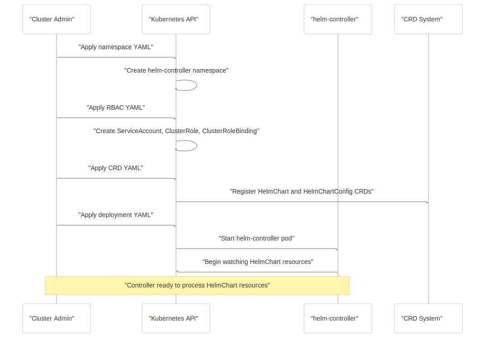

# Installation and Setup

[Get free private DeepWikis in Devin](/private-repo)

[DeepWiki](https://deepwiki.com)

[DeepWiki](/)

[k3s-io/helm-controller](https://github.com/k3s-io/helm-controller)

[Get free private DeepWikis with

Devin](/private-repo)Share

Last indexed: 22 July 2025 ([dac1b5](https://github.com/k3s-io/helm-controller/commits/dac1b5e9))

* [Overview](/k3s-io/helm-controller/1-overview)
* [User Guide](/k3s-io/helm-controller/2-user-guide)
* [Installation and Setup](/k3s-io/helm-controller/2.1-installation-and-setup)
* [Using HelmChart Resources](/k3s-io/helm-controller/2.2-using-helmchart-resources)
* [Configuration Options](/k3s-io/helm-controller/2.3-configuration-options)
* [Architecture](/k3s-io/helm-controller/3-architecture)
* [System Overview](/k3s-io/helm-controller/3.1-system-overview)
* [API Design](/k3s-io/helm-controller/3.2-api-design)
* [Controller Implementation](/k3s-io/helm-controller/3.3-controller-implementation)
* [Job Execution Model](/k3s-io/helm-controller/3.4-job-execution-model)
* [Developer Guide](/k3s-io/helm-controller/4-developer-guide)
* [Code Generation](/k3s-io/helm-controller/4.1-code-generation)
* [Build System](/k3s-io/helm-controller/4.2-build-system)
* [Testing Framework](/k3s-io/helm-controller/4.3-testing-framework)
* [CI/CD Pipeline](/k3s-io/helm-controller/4.4-cicd-pipeline)
* [Reference](/k3s-io/helm-controller/5-reference)
* [API Reference](/k3s-io/helm-controller/5.1-api-reference)
* [CLI Reference](/k3s-io/helm-controller/5.2-cli-reference)
* [Generated Components](/k3s-io/helm-controller/5.3-generated-components)

Menu

# Installation and Setup

Relevant source files

* [README.md](https://github.com/k3s-io/helm-controller/blob/dac1b5e9/README.md)
* [manifests/deployment.yaml](https://github.com/k3s-io/helm-controller/blob/dac1b5e9/manifests/deployment.yaml)
* [manifests/example-helmchart.yaml](https://github.com/k3s-io/helm-controller/blob/dac1b5e9/manifests/example-helmchart.yaml)
* [manifests/ns.yaml](https://github.com/k3s-io/helm-controller/blob/dac1b5e9/manifests/ns.yaml)
* [manifests/rbac.yaml](https://github.com/k3s-io/helm-controller/blob/dac1b5e9/manifests/rbac.yaml)
* [pkg/apis/helm.cattle.io/v1/zz\_generated\_list\_types.go](https://github.com/k3s-io/helm-controller/blob/dac1b5e9/pkg/apis/helm.cattle.io/v1/zz_generated_list_types.go)
* [pkg/apis/helm.cattle.io/v1/zz\_generated\_register.go](https://github.com/k3s-io/helm-controller/blob/dac1b5e9/pkg/apis/helm.cattle.io/v1/zz_generated_register.go)
* [test/framework/controller.go](https://github.com/k3s-io/helm-controller/blob/dac1b5e9/test/framework/controller.go)

This document provides step-by-step instructions for deploying helm-controller in Kubernetes clusters. It covers both cluster-scoped and namespaced deployment configurations, along with verification and basic configuration options.

For detailed configuration options and environment variables, see [Configuration Options](/k3s-io/helm-controller/2.3-configuration-options). For information about using HelmChart resources after installation, see [Using HelmChart Resources](/k3s-io/helm-controller/2.2-using-helmchart-resources).

## Prerequisites

Before installing helm-controller, ensure you have:

* A running Kubernetes cluster (version 1.16+)
* `kubectl` configured to access your cluster
* Cluster administrator privileges (for cluster-scoped installation)
* Namespace administrator privileges (for namespaced installation)

## Installation Methods

The helm-controller can be deployed in two configurations depending on your security and operational requirements.

### Cluster-Scoped Installation

Cluster-scoped installation allows helm-controller to watch and manage HelmChart resources across all namespaces in the cluster. This is the recommended approach for most deployments.

#### Deployment Architecture



#### Installation Steps

1. **Create the namespace** (typically `kube-system`):

```
kubectl apply -f manifests/ns.yaml
```

2. **Apply RBAC configuration**:

```
kubectl apply -f manifests/rbac.yaml
```

3. **Deploy the controller**:

```
kubectl apply -f manifests/deployment.yaml
```

4. **Apply Custom Resource Definitions**:

```
kubectl apply -f manifests/crd.yaml
```

The deployment uses the `rancher/helm-controller:v0.12.1` image by default and runs with cluster-wide permissions defined in the `helm-controller` ClusterRole.

**Sources:** [README.md12-13](https://github.com/k3s-io/helm-controller/blob/dac1b5e9/README.md#L12-L13) [manifests/deployment.yaml1-32](https://github.com/k3s-io/helm-controller/blob/dac1b5e9/manifests/deployment.yaml#L1-L32) [manifests/rbac.yaml1-31](https://github.com/k3s-io/helm-controller/blob/dac1b5e9/manifests/rbac.yaml#L1-L31) [manifests/ns.yaml1-7](https://github.com/k3s-io/helm-controller/blob/dac1b5e9/manifests/ns.yaml#L1-L7)

### Namespaced Installation

Namespaced installation restricts helm-controller to watch and manage HelmChart resources only within a specific namespace. This provides better security isolation but limits functionality.

#### Deployment Architecture



For namespaced installation, modify the RBAC configuration to use `Role` and `RoleBinding` instead of `ClusterRole` and `ClusterRoleBinding`, and update the deployment to include the `--namespace` flag.

**Sources:** [README.md9-10](https://github.com/k3s-io/helm-controller/blob/dac1b5e9/README.md#L9-L10) [test/framework/controller.go20-64](https://github.com/k3s-io/helm-controller/blob/dac1b5e9/test/framework/controller.go#L20-L64)

## Installation Flow



**Sources:** [test/framework/controller.go20-64](https://github.com/k3s-io/helm-controller/blob/dac1b5e9/test/framework/controller.go#L20-L64) [manifests/deployment.yaml1-32](https://github.com/k3s-io/helm-controller/blob/dac1b5e9/manifests/deployment.yaml#L1-L32)

## Verification

After installation, verify that helm-controller is running properly:

1. **Check pod status**:

```
kubectl get pods -n helm-controller
```

Expected output:

```
NAME                               READY   STATUS    RESTARTS   AGE
helm-controller-xxxxxxxxxx-xxxxx   1/1     Running   0          30s

```

2. **Verify CRDs are installed**:

```
kubectl get crd helmcharts.helm.cattle.io helmchartconfigs.helm.cattle.io
```

3. **Check controller logs**:

```
kubectl logs -n helm-controller deployment/helm-controller
```

4. **Test with example HelmChart**:

```
kubectl apply -f manifests/example-helmchart.yaml
```

This creates a HelmChart resource for Traefik with the specification defined in the example manifest.

**Sources:** [manifests/example-helmchart.yaml1-12](https://github.com/k3s-io/helm-controller/blob/dac1b5e9/manifests/example-helmchart.yaml#L1-L12) [pkg/apis/helm.cattle.io/v1/zz\_generated\_register.go31-33](https://github.com/k3s-io/helm-controller/blob/dac1b5e9/pkg/apis/helm.cattle.io/v1/zz_generated_register.go#L31-L33)

## Container Configuration

The helm-controller deployment uses several key configuration elements:

| Configuration | Value | Description |
| --- | --- | --- |
| **Image** | `rancher/helm-controller:v0.12.1` | Controller container image |
| **Command** | `helm-controller` | Main binary executable |
| **ServiceAccount** | `helm-controller` | Service account with appropriate RBAC |
| **Environment Variables** | `NODE_NAME`, `JOB_CLUSTER_ROLE` | Runtime configuration |

The controller automatically inherits the service account name for the `JOB_CLUSTER_ROLE` environment variable, which is used when creating Kubernetes Jobs for Helm operations.

**Sources:** [manifests/deployment.yaml18-32](https://github.com/k3s-io/helm-controller/blob/dac1b5e9/manifests/deployment.yaml#L18-L32) [test/framework/controller.go100-107](https://github.com/k3s-io/helm-controller/blob/dac1b5e9/test/framework/controller.go#L100-L107)

## Command-Line Options

When running helm-controller locally or customizing deployment arguments, key options include:

* `--kubeconfig`: Path to kubeconfig file
* `--namespace`: Namespace to watch (for namespaced deployments)
* `--job-cluster-role`: ClusterRole name for Helm execution jobs

These correspond to the deployment configuration and can be set via command-line arguments or environment variables.

**Sources:** [README.md36-37](https://github.com/k3s-io/helm-controller/blob/dac1b5e9/README.md#L36-L37) [test/framework/controller.go103-106](https://github.com/k3s-io/helm-controller/blob/dac1b5e9/test/framework/controller.go#L103-L106)

## Uninstallation

To remove helm-controller from your cluster:

1. **Delete HelmChart resources** (optional, to clean up managed Helm releases):

```
kubectl delete helmcharts --all --all-namespaces
```

2. **Remove the deployment**:

```
kubectl delete -f manifests/deployment.yaml
```

3. **Clean up RBAC**:

```
kubectl delete -f manifests/rbac.yaml
```

4. **Remove CRDs** (this will delete all HelmChart resources):

```
kubectl delete -f manifests/crd.yaml
```

5. **Delete namespace**:

```
kubectl delete -f manifests/ns.yaml
```

**Sources:** [README.md19-20](https://github.com/k3s-io/helm-controller/blob/dac1b5e9/README.md#L19-L20) [test/framework/controller.go170-210](https://github.com/k3s-io/helm-controller/blob/dac1b5e9/test/framework/controller.go#L170-L210)

Dismiss

Refresh this wiki

Enter email to refresh

### On this page

* [Installation and Setup](#installation-and-setup)
* [Prerequisites](#prerequisites)
* [Installation Methods](#installation-methods)
* [Cluster-Scoped Installation](#cluster-scoped-installation)
* [Deployment Architecture](#deployment-architecture)
* [Installation Steps](#installation-steps)
* [Namespaced Installation](#namespaced-installation)
* [Deployment Architecture](#deployment-architecture-1)
* [Installation Flow](#installation-flow)
* [Verification](#verification)
* [Container Configuration](#container-configuration)
* [Command-Line Options](#command-line-options)
* [Uninstallation](#uninstallation)

Ask Devin about k3s-io/helm-controller

Deep Research