# Using HelmChart Resources

[Get free private DeepWikis in Devin](/private-repo)

[DeepWiki](https://deepwiki.com)

[DeepWiki](/)

[k3s-io/helm-controller](https://github.com/k3s-io/helm-controller)

[Get free private DeepWikis with

Devin](/private-repo)Share

Last indexed: 22 July 2025 ([dac1b5](https://github.com/k3s-io/helm-controller/commits/dac1b5e9))

* [Overview](/k3s-io/helm-controller/1-overview)
* [User Guide](/k3s-io/helm-controller/2-user-guide)
* [Installation and Setup](/k3s-io/helm-controller/2.1-installation-and-setup)
* [Using HelmChart Resources](/k3s-io/helm-controller/2.2-using-helmchart-resources)
* [Configuration Options](/k3s-io/helm-controller/2.3-configuration-options)
* [Architecture](/k3s-io/helm-controller/3-architecture)
* [System Overview](/k3s-io/helm-controller/3.1-system-overview)
* [API Design](/k3s-io/helm-controller/3.2-api-design)
* [Controller Implementation](/k3s-io/helm-controller/3.3-controller-implementation)
* [Job Execution Model](/k3s-io/helm-controller/3.4-job-execution-model)
* [Developer Guide](/k3s-io/helm-controller/4-developer-guide)
* [Code Generation](/k3s-io/helm-controller/4.1-code-generation)
* [Build System](/k3s-io/helm-controller/4.2-build-system)
* [Testing Framework](/k3s-io/helm-controller/4.3-testing-framework)
* [CI/CD Pipeline](/k3s-io/helm-controller/4.4-cicd-pipeline)
* [Reference](/k3s-io/helm-controller/5-reference)
* [API Reference](/k3s-io/helm-controller/5.1-api-reference)
* [CLI Reference](/k3s-io/helm-controller/5.2-cli-reference)
* [Generated Components](/k3s-io/helm-controller/5.3-generated-components)

Menu

# Using HelmChart Resources

Relevant source files

* [manifests/example-helmchart.yaml](https://github.com/k3s-io/helm-controller/blob/dac1b5e9/manifests/example-helmchart.yaml)
* [pkg/apis/helm.cattle.io/v1/types.go](https://github.com/k3s-io/helm-controller/blob/dac1b5e9/pkg/apis/helm.cattle.io/v1/types.go)
* [pkg/apis/helm.cattle.io/v1/zz\_generated\_list\_types.go](https://github.com/k3s-io/helm-controller/blob/dac1b5e9/pkg/apis/helm.cattle.io/v1/zz_generated_list_types.go)
* [pkg/apis/helm.cattle.io/v1/zz\_generated\_register.go](https://github.com/k3s-io/helm-controller/blob/dac1b5e9/pkg/apis/helm.cattle.io/v1/zz_generated_register.go)
* [test/suite/helm\_test.go](https://github.com/k3s-io/helm-controller/blob/dac1b5e9/test/suite/helm_test.go)
* [test/suite/zz\_suite\_test.go](https://github.com/k3s-io/helm-controller/blob/dac1b5e9/test/suite/zz_suite_test.go)

This document provides a comprehensive guide to creating and managing `HelmChart` and `HelmChartConfig` Custom Resources for deploying Helm charts in Kubernetes clusters. It covers the resource specifications, configuration options, and practical usage patterns for declaratively managing Helm chart installations through the helm-controller.

For information about the underlying controller implementation and job execution model, see [Controller Implementation](/k3s-io/helm-controller/3.3-controller-implementation) and [Job Execution Model](/k3s-io/helm-controller/3.4-job-execution-model). For complete API reference documentation, see [API Reference](/k3s-io/helm-controller/5.1-api-reference).

## Resource Overview

The helm-controller provides two primary Custom Resource types for managing Helm chart deployments:



**HelmChart Resource Structure**
Sources: [pkg/apis/helm.cattle.io/v1/types.go24-31](https://github.com/k3s-io/helm-controller/blob/dac1b5e9/pkg/apis/helm.cattle.io/v1/types.go#L24-L31)

| Field | Type | Description |
| --- | --- | --- |
| `metadata` | `ObjectMeta` | Standard Kubernetes resource metadata |
| `spec` | `HelmChartSpec` | Chart installation specification |
| `status` | `HelmChartStatus` | Current state and job information |

## Chart Source Configuration

The helm-controller supports three methods for specifying chart sources, processed in order of precedence:

### 1. Chart Content (Highest Precedence)

Use `spec.chartContent` to provide a base64-encoded chart archive:

```
apiVersion: helm.cattle.io/v1
kind: HelmChart
metadata:
  name: my-chart
  namespace: default
spec:
  chartContent: "H4sIAAAAAAAC/+y8W..."  # base64-encoded .tgz
  targetNamespace: production
```

Sources: [pkg/apis/helm.cattle.io/v1/types.go69-71](https://github.com/k3s-io/helm-controller/blob/dac1b5e9/pkg/apis/helm.cattle.io/v1/types.go#L69-L71) [test/suite/helm\_test.go220-260](https://github.com/k3s-io/helm-controller/blob/dac1b5e9/test/suite/helm_test.go#L220-L260)

### 2. Chart Repository

Use `spec.repo` and `spec.chart` for repository-hosted charts:

```
apiVersion: helm.cattle.io/v1
kind: HelmChart
metadata:
  name: traefik-example
  namespace: kube-system
spec:
  repo: https://helm.traefik.io/traefik
  chart: traefik
  version: "10.24.0"
  targetNamespace: traefik-system
```

Sources: [pkg/apis/helm.cattle.io/v1/types.go41-49](https://github.com/k3s-io/helm-controller/blob/dac1b5e9/pkg/apis/helm.cattle.io/v1/types.go#L41-L49) [manifests/example-helmchart.yaml1-12](https://github.com/k3s-io/helm-controller/blob/dac1b5e9/manifests/example-helmchart.yaml#L1-L12)

### 3. Direct Chart URL

Use `spec.chart` with a complete HTTPS URL:

```
apiVersion: helm.cattle.io/v1
kind: HelmChart
metadata:
  name: direct-chart
  namespace: default
spec:
  chart: "https://charts.example.com/mychart-1.0.0.tgz"
  targetNamespace: app-namespace
```

Sources: [pkg/apis/helm.cattle.io/v1/types.go41-43](https://github.com/k3s-io/helm-controller/blob/dac1b5e9/pkg/apis/helm.cattle.io/v1/types.go#L41-L43)

## Values Configuration

The helm-controller provides multiple methods for configuring chart values, with precedence from highest to lowest:



### Simple Key-Value Pairs

Use `spec.set` for simple value overrides:

```
spec:
  set:
    replicas: "3"
    service.type: "LoadBalancer"
    ingress.enabled: "true"
```

Sources: [pkg/apis/helm.cattle.io/v1/types.go56-58](https://github.com/k3s-io/helm-controller/blob/dac1b5e9/pkg/apis/helm.cattle.io/v1/types.go#L56-L58) [test/suite/helm\_test.go35-44](https://github.com/k3s-io/helm-controller/blob/dac1b5e9/test/suite/helm_test.go#L35-L44)

### Inline YAML Values

Use `spec.valuesContent` for complex value structures:

```
spec:
  valuesContent: |
    replicaCount: 2
    service:
      type: ClusterIP
      port: 80
    ingress:
      enabled: true
      hosts:
        - host: example.local
          paths: ["/"]
```

Sources: [pkg/apis/helm.cattle.io/v1/types.go59-61](https://github.com/k3s-io/helm-controller/blob/dac1b5e9/pkg/apis/helm.cattle.io/v1/types.go#L59-L61) [test/suite/helm\_test.go34](https://github.com/k3s-io/helm-controller/blob/dac1b5e9/test/suite/helm_test.go#L34-L34)

### Values from Secrets

Use `spec.valuesSecrets` to reference external secrets:

```
spec:
  valuesSecrets:
    - name: my-chart-values
      keys: ["values.yaml", "production.yaml"]
    - name: sensitive-config
      keys: ["database.yaml"]
      ignoreUpdates: true  # Optional: ignore secret changes
```

The referenced secret structure:

```
apiVersion: v1
kind: Secret
metadata:
  name: my-chart-values
type: Opaque
stringData:
  values.yaml: |
    database:
      host: db.example.com
      port: 5432
  production.yaml: |
    replicas: 5
```

Sources: [pkg/apis/helm.cattle.io/v1/types.go62-64](https://github.com/k3s-io/helm-controller/blob/dac1b5e9/pkg/apis/helm.cattle.io/v1/types.go#L62-L64) [pkg/apis/helm.cattle.io/v1/types.go166-176](https://github.com/k3s-io/helm-controller/blob/dac1b5e9/pkg/apis/helm.cattle.io/v1/types.go#L166-L176) [test/suite/helm\_test.go303-365](https://github.com/k3s-io/helm-controller/blob/dac1b5e9/test/suite/helm_test.go#L303-L365)

## HelmChartConfig Resources

`HelmChartConfig` resources provide external configuration overrides for existing `HelmChart` resources, useful when the primary chart is managed by another system:

```
apiVersion: helm.cattle.io/v1
kind: HelmChartConfig
metadata:
  name: traefik-example  # Must match HelmChart name
  namespace: kube-system  # Must match HelmChart namespace
spec:
  valuesContent: |
    service:
      type: LoadBalancer
  failurePolicy: abort
```

### HelmChartConfig Lifecycle


Sources: [pkg/apis/helm.cattle.io/v1/types.go120-128](https://github.com/k3s-io/helm-controller/blob/dac1b5e9/pkg/apis/helm.cattle.io/v1/types.go#L120-L128) [test/suite/helm\_test.go262-301](https://github.com/k3s-io/helm-controller/blob/dac1b5e9/test/suite/helm_test.go#L262-L301)

## Advanced Configuration Options

### Namespace Management

Configure target namespace and creation:

```
spec:
  targetNamespace: my-app-namespace
  createNamespace: true  # Create namespace if it doesn't exist
```

Sources: [pkg/apis/helm.cattle.io/v1/types.go35-40](https://github.com/k3s-io/helm-controller/blob/dac1b5e9/pkg/apis/helm.cattle.io/v1/types.go#L35-L40) [test/suite/helm\_test.go441-484](https://github.com/k3s-io/helm-controller/blob/dac1b5e9/test/suite/helm_test.go#L441-L484)

### Timeout Configuration

Set custom timeouts for Helm operations:

```
spec:
  timeout: "15m"  # Duration string
```

Sources: [pkg/apis/helm.cattle.io/v1/types.go76-78](https://github.com/k3s-io/helm-controller/blob/dac1b5e9/pkg/apis/helm.cattle.io/v1/types.go#L76-L78) [test/suite/helm\_test.go165-218](https://github.com/k3s-io/helm-controller/blob/dac1b5e9/test/suite/helm_test.go#L165-L218)

### Failure Handling

Configure how failed installations are handled:

```
spec:
  failurePolicy: "reinstall"  # or "abort"
```

* `reinstall`: Perform clean uninstall and reinstall on failure
* `abort`: Leave chart in failed state for manual intervention

Sources: [pkg/apis/helm.cattle.io/v1/types.go10-11](https://github.com/k3s-io/helm-controller/blob/dac1b5e9/pkg/apis/helm.cattle.io/v1/types.go#L10-L11) [pkg/apis/helm.cattle.io/v1/types.go79-83](https://github.com/k3s-io/helm-controller/blob/dac1b5e9/pkg/apis/helm.cattle.io/v1/types.go#L79-L83)

### Security Configuration

#### Repository Authentication

```
spec:
  authSecret:
    name: repo-credentials  # Secret with username/password
  authPassCredentials: true  # Pass credentials to all domains
```

Sources: [pkg/apis/helm.cattle.io/v1/types.go84-88](https://github.com/k3s-io/helm-controller/blob/dac1b5e9/pkg/apis/helm.cattle.io/v1/types.go#L84-L88)

#### TLS Configuration

```
spec:
  repoCA: |
    -----BEGIN CERTIFICATE-----
    MIIDXTCCAkWgAwIBAgIJAKoK/hb...
    -----END CERTIFICATE-----
  repoCAConfigMap:
    name: ca-certificates
  insecureSkipTLSVerify: false
  plainHTTP: false
```

Sources: [pkg/apis/helm.cattle.io/v1/types.go50-55](https://github.com/k3s-io/helm-controller/blob/dac1b5e9/pkg/apis/helm.cattle.io/v1/types.go#L50-L55) [pkg/apis/helm.cattle.io/v1/types.go89-94](https://github.com/k3s-io/helm-controller/blob/dac1b5e9/pkg/apis/helm.cattle.io/v1/types.go#L89-L94)

#### Job Security Contexts

Configure security contexts for the Helm execution jobs:

```
spec:
  podSecurityContext:
    runAsNonRoot: true
    seccompProfile:
      type: RuntimeDefault
  securityContext:
    allowPrivilegeEscalation: false
    capabilities:
      drop: ["ALL"]
    readOnlyRootFilesystem: true
```

Sources: [pkg/apis/helm.cattle.io/v1/types.go97-101](https://github.com/k3s-io/helm-controller/blob/dac1b5e9/pkg/apis/helm.cattle.io/v1/types.go#L97-L101) [test/suite/helm\_test.go636-853](https://github.com/k3s-io/helm-controller/blob/dac1b5e9/test/suite/helm_test.go#L636-L853)

### Job Configuration

#### Retry Behavior

```
spec:
  backOffLimit: 10  # Number of retries before marking as failed
```

Sources: [pkg/apis/helm.cattle.io/v1/types.go74-75](https://github.com/k3s-io/helm-controller/blob/dac1b5e9/pkg/apis/helm.cattle.io/v1/types.go#L74-L75) [test/suite/helm\_test.go534-583](https://github.com/k3s-io/helm-controller/blob/dac1b5e9/test/suite/helm_test.go#L534-L583)

#### Custom Job Image

```
spec:
  jobImage: "rancher/klipper-helm:v0.8.0-build20230815"
```

Sources: [pkg/apis/helm.cattle.io/v1/types.go72-73](https://github.com/k3s-io/helm-controller/blob/dac1b5e9/pkg/apis/helm.cattle.io/v1/types.go#L72-L73)

## Resource Status and Monitoring

### Status Fields

The `HelmChart` resource provides status information through the `status` field:

```
status:
  jobName: "helm-install-traefik-example-abc123"
  conditions:
    - type: "JobCreated"
      status: "True"
      reason: "JobCreated"
      message: "Job helm-install-traefik-example-abc123 created"
```

### Condition Types

| Condition Type | Description |
| --- | --- |
| `JobCreated` | Indicates a Kubernetes job has been created |
| `Failed` | Indicates the Helm operation failed and failure policy is `abort` |

Sources: [pkg/apis/helm.cattle.io/v1/types.go103-115](https://github.com/k3s-io/helm-controller/blob/dac1b5e9/pkg/apis/helm.cattle.io/v1/types.go#L103-L115) [pkg/apis/helm.cattle.io/v1/types.go146-164](https://github.com/k3s-io/helm-controller/blob/dac1b5e9/pkg/apis/helm.cattle.io/v1/types.go#L146-L164)

### Bootstrap Charts

Mark charts as required for cluster bootstrapping:

```
spec:
  bootstrap: true  # Ensures chart is installed before other resources
```

Sources: [pkg/apis/helm.cattle.io/v1/types.go67-68](https://github.com/k3s-io/helm-controller/blob/dac1b5e9/pkg/apis/helm.cattle.io/v1/types.go#L67-L68)

## Complete Example

Here's a comprehensive example demonstrating multiple configuration options:

```
apiVersion: helm.cattle.io/v1
kind: HelmChart
metadata:
  name: traefik-ingress
  namespace: kube-system
spec:
  repo: https://helm.traefik.io/traefik
  chart: traefik
  version: "10.24.0"
  targetNamespace: traefik-system
  createNamespace: true
  timeout: "10m"
  backOffLimit: 5
  failurePolicy: "reinstall"
  
  set:
    deployment.replicas: "2"
    service.type: "LoadBalancer"
  
  valuesContent: |
    ingressRoute:
      dashboard:
        enabled: true
    ports:
      web:
        redirectTo: websecure
      websecure:
        tls:
          enabled: true
  
  valuesSecrets:
    - name: traefik-tls-config
      keys: ["tls.yaml"]
  
  podSecurityContext:
    runAsNonRoot: true
    seccompProfile:
      type: RuntimeDefault
  
  securityContext:
    allowPrivilegeEscalation: false
    capabilities:
      drop: ["ALL"]
    readOnlyRootFilesystem: true

---
apiVersion: helm.cattle.io/v1
kind: HelmChartConfig
metadata:
  name: traefik-ingress
  namespace: kube-system
spec:
  failurePolicy: "abort"
  valuesContent: |
    logs:
      general:
        level: INFO
      access:
        enabled: true
```

Sources: [test/suite/helm\_test.go24-47](https://github.com/k3s-io/helm-controller/blob/dac1b5e9/test/suite/helm_test.go#L24-L47) [pkg/apis/helm.cattle.io/v1/types.go34-101](https://github.com/k3s-io/helm-controller/blob/dac1b5e9/pkg/apis/helm.cattle.io/v1/types.go#L34-L101)

Dismiss

Refresh this wiki

Enter email to refresh

### On this page

* [Using HelmChart Resources](#using-helmchart-resources)
* [Resource Overview](#resource-overview)
* [Chart Source Configuration](#chart-source-configuration)
* [1. Chart Content (Highest Precedence)](#1-chart-content-highest-precedence)
* [2. Chart Repository](#2-chart-repository)
* [3. Direct Chart URL](#3-direct-chart-url)
* [Values Configuration](#values-configuration)
* [Simple Key-Value Pairs](#simple-key-value-pairs)
* [Inline YAML Values](#inline-yaml-values)
* [Values from Secrets](#values-from-secrets)
* [HelmChartConfig Resources](#helmchartconfig-resources)
* [HelmChartConfig Lifecycle](#helmchartconfig-lifecycle)
* [Advanced Configuration Options](#advanced-configuration-options)
* [Namespace Management](#namespace-management)
* [Timeout Configuration](#timeout-configuration)
* [Failure Handling](#failure-handling)
* [Security Configuration](#security-configuration)
* [Repository Authentication](#repository-authentication)
* [TLS Configuration](#tls-configuration)
* [Job Security Contexts](#job-security-contexts)
* [Job Configuration](#job-configuration)
* [Retry Behavior](#retry-behavior)
* [Custom Job Image](#custom-job-image)
* [Resource Status and Monitoring](#resource-status-and-monitoring)
* [Status Fields](#status-fields)
* [Condition Types](#condition-types)
* [Bootstrap Charts](#bootstrap-charts)
* [Complete Example](#complete-example)

Ask Devin about k3s-io/helm-controller

Deep Research