# Configuration Options

[Get free private DeepWikis in Devin](/private-repo)

[DeepWiki](https://deepwiki.com)

[DeepWiki](/)

[k3s-io/helm-controller](https://github.com/k3s-io/helm-controller)

[Get free private DeepWikis with

Devin](/private-repo)Share

Last indexed: 22 July 2025 ([dac1b5](https://github.com/k3s-io/helm-controller/commits/dac1b5e9))

* [Overview](/k3s-io/helm-controller/1-overview)
* [User Guide](/k3s-io/helm-controller/2-user-guide)
* [Installation and Setup](/k3s-io/helm-controller/2.1-installation-and-setup)
* [Using HelmChart Resources](/k3s-io/helm-controller/2.2-using-helmchart-resources)
* [Configuration Options](/k3s-io/helm-controller/2.3-configuration-options)
* [Architecture](/k3s-io/helm-controller/3-architecture)
* [System Overview](/k3s-io/helm-controller/3.1-system-overview)
* [API Design](/k3s-io/helm-controller/3.2-api-design)
* [Controller Implementation](/k3s-io/helm-controller/3.3-controller-implementation)
* [Job Execution Model](/k3s-io/helm-controller/3.4-job-execution-model)
* [Developer Guide](/k3s-io/helm-controller/4-developer-guide)
* [Code Generation](/k3s-io/helm-controller/4.1-code-generation)
* [Build System](/k3s-io/helm-controller/4.2-build-system)
* [Testing Framework](/k3s-io/helm-controller/4.3-testing-framework)
* [CI/CD Pipeline](/k3s-io/helm-controller/4.4-cicd-pipeline)
* [Reference](/k3s-io/helm-controller/5-reference)
* [API Reference](/k3s-io/helm-controller/5.1-api-reference)
* [CLI Reference](/k3s-io/helm-controller/5.2-cli-reference)
* [Generated Components](/k3s-io/helm-controller/5.3-generated-components)

Menu

# Configuration Options

Relevant source files

* [crd-ref-docs.yaml](https://github.com/k3s-io/helm-controller/blob/dac1b5e9/crd-ref-docs.yaml)
* [doc/helmchart.md](https://github.com/k3s-io/helm-controller/blob/dac1b5e9/doc/helmchart.md)
* [main.go](https://github.com/k3s-io/helm-controller/blob/dac1b5e9/main.go)
* [pkg/cmd/cmd.go](https://github.com/k3s-io/helm-controller/blob/dac1b5e9/pkg/cmd/cmd.go)
* [pkg/codegen/main.go](https://github.com/k3s-io/helm-controller/blob/dac1b5e9/pkg/codegen/main.go)

This document provides a comprehensive reference for all configuration options available in the helm-controller. It covers controller-level configuration (CLI flags and environment variables) as well as chart-level configuration options defined in HelmChart and HelmChartConfig Custom Resources.

For API field definitions and detailed resource schemas, see [API Reference](/k3s-io/helm-controller/5.1-api-reference). For installation and deployment configuration examples, see [Installation and Setup](/k3s-io/helm-controller/2.1-installation-and-setup).

## Controller Configuration

The helm-controller accepts configuration through CLI flags and corresponding environment variables. All configuration is defined in the `HelmController` struct and processed through the `cli.App` framework.

### Configuration Structure Overview

Sources: [main.go22-100](https://github.com/k3s-io/helm-controller/blob/dac1b5e9/main.go#L22-L100) [pkg/cmd/cmd.go28-40](https://github.com/k3s-io/helm-controller/blob/dac1b5e9/pkg/cmd/cmd.go#L28-L40)

### Core Controller Configuration

| Flag | Environment Variable | Default | Description |
| --- | --- | --- | --- |
| `--controller-name` | `CONTROLLER_NAME` | `helm-controller` | Unique name to identify this controller instance |
| `--namespace` | `NAMESPACE` | `""` (all namespaces) | Namespace to watch for HelmChart resources |
| `--threads` | `THREADS` | `2` | Number of worker threads for processing |

The controller name is particularly important for multi-instance deployments, as it's added to all HelmChart resources tracked by this controller instance.

Sources: [main.go33-39](https://github.com/k3s-io/helm-controller/blob/dac1b5e9/main.go#L33-L39) [main.go76-80](https://github.com/k3s-io/helm-controller/blob/dac1b5e9/main.go#L76-L80) [main.go94-99](https://github.com/k3s-io/helm-controller/blob/dac1b5e9/main.go#L94-L99)

### Kubernetes Connection Configuration

| Flag | Environment Variable | Default | Description |
| --- | --- | --- | --- |
| `--kubeconfig` | `KUBECONFIG` | `""` | Path to Kubernetes config file |
| `--master-url` | `MASTERURL` | `""` | Kubernetes cluster master URL |
| `--node-name` | `NODE_NAME` | `""` | Name of the node this controller runs on |

The connection configuration follows standard Kubernetes client patterns. The `GetNonInteractiveClientConfig()` method creates a `clientcmd.ClientConfig` using these parameters.

Sources: [main.go63-85](https://github.com/k3s-io/helm-controller/blob/dac1b5e9/main.go#L63-L85) [pkg/cmd/cmd.go117-125](https://github.com/k3s-io/helm-controller/blob/dac1b5e9/pkg/cmd/cmd.go#L117-L125)

### Job Management Configuration

| Flag | Environment Variable | Default | Description |
| --- | --- | --- | --- |
| `--default-job-image` | `DEFAULT_JOB_IMAGE` | `""` | Default container image for Helm job pods |
| `--job-cluster-role` | `JOB_CLUSTER_ROLE` | `cluster-admin` | ClusterRole assigned to job ServiceAccounts |

These settings control how the controller creates Kubernetes Jobs to execute Helm operations. Jobs run with the specified image (typically `klipper-helm`) and are granted the specified ClusterRole permissions.

Sources: [main.go50-62](https://github.com/k3s-io/helm-controller/blob/dac1b5e9/main.go#L50-L62) [pkg/cmd/cmd.go94-103](https://github.com/k3s-io/helm-controller/blob/dac1b5e9/pkg/cmd/cmd.go#L94-L103)

### Debug and Profiling Configuration

| Flag | Environment Variable | Default | Description |
| --- | --- | --- | --- |
| `--debug` | N/A | `false` | Enable debug logging |
| `--debug-level` | N/A | `0` | Klog verbosity level when debugging |
| `--pprof-port` | N/A | `6060` | HTTP profiling server port |

Debug configuration affects both `logrus` and `klog` logging systems. When debug mode is enabled, an HTTP profiling server is started on the specified port.

Sources: [main.go41-91](https://github.com/k3s-io/helm-controller/blob/dac1b5e9/main.go#L41-L91) [pkg/cmd/cmd.go42-71](https://github.com/k3s-io/helm-controller/blob/dac1b5e9/pkg/cmd/cmd.go#L42-L71)

## Chart-Level Configuration

Chart-level configuration is specified through `HelmChart` and `HelmChartConfig` Custom Resources. These resources define how individual Helm charts are installed, configured, and managed.

### HelmChart Configuration Categories

Sources: [doc/helmchart.md125-162](https://github.com/k3s-io/helm-controller/blob/dac1b5e9/doc/helmchart.md#L125-L162)

### Essential Chart Configuration Fields

| Field Category | Key Fields | Purpose |
| --- | --- | --- |
| **Chart Source** | `chart`, `repo`, `version`, `chartContent` | Specify which chart to install |
| **Target Config** | `targetNamespace`, `createNamespace` | Control installation destination |
| **Values** | `valuesContent`, `valuesSecrets`, `set` | Customize chart configuration |
| **Authentication** | `authSecret`, `dockerRegistrySecret`, `repoCA` | Repository access credentials |
| **Behavior** | `failurePolicy`, `timeout`, `bootstrap` | Control installation behavior |

### HelmChartConfig Override Pattern

`HelmChartConfig` resources provide a way to override specific fields of a `HelmChart` without modifying the original resource. This is useful for system-managed charts that need user customization.

The `HelmChartConfig` resource supports a limited subset of `HelmChart` fields, focusing on values customization and failure handling.

Sources: [doc/helmchart.md83-121](https://github.com/k3s-io/helm-controller/blob/dac1b5e9/doc/helmchart.md#L83-L121)

### Value Precedence and Security

Chart values are applied in the following precedence order (highest to lowest):

1. `set` field (simple key-value pairs)
2. `valuesContent` field (inline YAML)
3. `valuesSecrets` field (external Secret references)

The `ignoreUpdates` flag on `SecretSpec` allows making secrets optional and prevents automatic chart upgrades when secret values change.

Sources: [doc/helmchart.md181-198](https://github.com/k3s-io/helm-controller/blob/dac1b5e9/doc/helmchart.md#L181-L198) [doc/helmchart.md145-147](https://github.com/k3s-io/helm-controller/blob/dac1b5e9/doc/helmchart.md#L145-L147)

### Failure Policy Configuration

The `failurePolicy` field controls how the controller handles failed Helm operations:

| Policy | Behavior | Use Case |
| --- | --- | --- |
| `reinstall` | Performs clean uninstall then reinstall | Automatic recovery from failed states |
| `abort` | Leaves chart in failed state | Manual intervention required |

This configuration is available on both `HelmChart` and `HelmChartConfig` resources, with `HelmChartConfig` values taking precedence.

Sources: [doc/helmchart.md14-26](https://github.com/k3s-io/helm-controller/blob/dac1b5e9/doc/helmchart.md#L14-L26) [doc/helmchart.md154-155](https://github.com/k3s-io/helm-controller/blob/dac1b5e9/doc/helmchart.md#L154-L155)

Dismiss

Refresh this wiki

Enter email to refresh

### On this page

* [Configuration Options](#configuration-options)
* [Controller Configuration](#controller-configuration)
* [Configuration Structure Overview](#configuration-structure-overview)
* [Core Controller Configuration](#core-controller-configuration)
* [Kubernetes Connection Configuration](#kubernetes-connection-configuration)
* [Job Management Configuration](#job-management-configuration)
* [Debug and Profiling Configuration](#debug-and-profiling-configuration)
* [Chart-Level Configuration](#chart-level-configuration)
* [HelmChart Configuration Categories](#helmchart-configuration-categories)
* [Essential Chart Configuration Fields](#essential-chart-configuration-fields)
* [HelmChartConfig Override Pattern](#helmchartconfig-override-pattern)
* [Value Precedence and Security](#value-precedence-and-security)
* [Failure Policy Configuration](#failure-policy-configuration)

Ask Devin about k3s-io/helm-controller

Deep Research