# Architecture

[Get free private DeepWikis in Devin](/private-repo)

[DeepWiki](https://deepwiki.com)

[DeepWiki](/)

[k3s-io/helm-controller](https://github.com/k3s-io/helm-controller)

[Get free private DeepWikis with

Devin](/private-repo)Share

Last indexed: 22 July 2025 ([dac1b5](https://github.com/k3s-io/helm-controller/commits/dac1b5e9))

* [Overview](/k3s-io/helm-controller/1-overview)
* [User Guide](/k3s-io/helm-controller/2-user-guide)
* [Installation and Setup](/k3s-io/helm-controller/2.1-installation-and-setup)
* [Using HelmChart Resources](/k3s-io/helm-controller/2.2-using-helmchart-resources)
* [Configuration Options](/k3s-io/helm-controller/2.3-configuration-options)
* [Architecture](/k3s-io/helm-controller/3-architecture)
* [System Overview](/k3s-io/helm-controller/3.1-system-overview)
* [API Design](/k3s-io/helm-controller/3.2-api-design)
* [Controller Implementation](/k3s-io/helm-controller/3.3-controller-implementation)
* [Job Execution Model](/k3s-io/helm-controller/3.4-job-execution-model)
* [Developer Guide](/k3s-io/helm-controller/4-developer-guide)
* [Code Generation](/k3s-io/helm-controller/4.1-code-generation)
* [Build System](/k3s-io/helm-controller/4.2-build-system)
* [Testing Framework](/k3s-io/helm-controller/4.3-testing-framework)
* [CI/CD Pipeline](/k3s-io/helm-controller/4.4-cicd-pipeline)
* [Reference](/k3s-io/helm-controller/5-reference)
* [API Reference](/k3s-io/helm-controller/5.1-api-reference)
* [CLI Reference](/k3s-io/helm-controller/5.2-cli-reference)
* [Generated Components](/k3s-io/helm-controller/5.3-generated-components)

Menu

# Architecture

Relevant source files

* [pkg/controllers/chart/chart.go](https://github.com/k3s-io/helm-controller/blob/dac1b5e9/pkg/controllers/chart/chart.go)
* [pkg/controllers/chart/chart\_test.go](https://github.com/k3s-io/helm-controller/blob/dac1b5e9/pkg/controllers/chart/chart_test.go)
* [pkg/controllers/controllers.go](https://github.com/k3s-io/helm-controller/blob/dac1b5e9/pkg/controllers/controllers.go)
* [pkg/remove/handler.go](https://github.com/k3s-io/helm-controller/blob/dac1b5e9/pkg/remove/handler.go)

This document provides a deep dive into the internal architecture and design decisions of helm-controller. It covers the core controller implementation, job execution model, API design, and system interactions that enable declarative Helm chart management through Kubernetes Custom Resource Definitions.

For information about using helm-controller in practice, see [User Guide](/k3s-io/helm-controller/2-user-guide). For API reference details, see [API Reference](/k3s-io/helm-controller/5.1-api-reference).

## System Design Philosophy

helm-controller implements the standard Kubernetes controller pattern to manage Helm charts declaratively. Rather than embedding Helm libraries directly, it uses a **job-based execution model** where Kubernetes Jobs run the Helm CLI in isolated containers. This design provides better security isolation, easier debugging, and cleaner separation of concerns.

The system operates on two primary Custom Resource Definitions:

* **HelmChart**: Defines a Helm chart to be installed
* **HelmChartConfig**: Provides additional configuration that can override HelmChart settings

## Core Controller Architecture

The controller architecture centers around the `Controller` struct in [pkg/controllers/chart/chart.go82-96](https://github.com/k3s-io/helm-controller/blob/dac1b5e9/pkg/controllers/chart/chart.go#L82-L96) which orchestrates all Helm chart operations.

### Controller Registration and Initialization

The registration process in [pkg/controllers/controllers.go57-122](https://github.com/k3s-io/helm-controller/blob/dac1b5e9/pkg/controllers/controllers.go#L57-L122) creates a complete application context with all necessary Kubernetes client interfaces and starts the controller with leader election.

**Sources:** [pkg/controllers/controllers.go57-122](https://github.com/k3s-io/helm-controller/blob/dac1b5e9/pkg/controllers/controllers.go#L57-L122) [pkg/controllers/chart/chart.go98-178](https://github.com/k3s-io/helm-controller/blob/dac1b5e9/pkg/controllers/chart/chart.go#L98-L178)

### Event Handling and Reconciliation

The controller implements two primary event handlers that respond to changes in HelmChart resources:

The `OnChange` handler in [pkg/controllers/chart/chart.go256-322](https://github.com/k3s-io/helm-controller/blob/dac1b5e9/pkg/controllers/chart/chart.go#L256-L322) manages chart installation and updates, while `OnRemove` in [pkg/controllers/chart/chart.go324-401](https://github.com/k3s-io/helm-controller/blob/dac1b5e9/pkg/controllers/chart/chart.go#L324-L401) handles chart deletion and cleanup.

**Sources:** [pkg/controllers/chart/chart.go256-322](https://github.com/k3s-io/helm-controller/blob/dac1b5e9/pkg/controllers/chart/chart.go#L256-L322) [pkg/controllers/chart/chart.go324-401](https://github.com/k3s-io/helm-controller/blob/dac1b5e9/pkg/controllers/chart/chart.go#L324-L401) [pkg/remove/handler.go24-39](https://github.com/k3s-io/helm-controller/blob/dac1b5e9/pkg/remove/handler.go#L24-L39)

## Job Execution Model

Rather than embedding Helm libraries, helm-controller creates Kubernetes Jobs that run the `klipper-helm` container image to execute Helm operations. This approach provides security isolation and operational benefits.

### Job Creation Process

The job creation logic in [pkg/controllers/chart/chart.go525-750](https://github.com/k3s-io/helm-controller/blob/dac1b5e9/pkg/controllers/chart/chart.go#L525-L750) generates all necessary Kubernetes resources for executing Helm operations securely.

**Sources:** [pkg/controllers/chart/chart.go525-750](https://github.com/k3s-io/helm-controller/blob/dac1b5e9/pkg/controllers/chart/chart.go#L525-L750) [pkg/controllers/chart/chart.go438-503](https://github.com/k3s-io/helm-controller/blob/dac1b5e9/pkg/controllers/chart/chart.go#L438-L503)

### Security Context and RBAC

Each Helm operation runs with a dedicated ServiceAccount and ClusterRoleBinding, using security contexts that follow best practices:

| Security Feature | Implementation | Location |
| --- | --- | --- |
| Non-root execution | `RunAsNonRoot: true` | [pkg/controllers/chart/chart.go65-70](https://github.com/k3s-io/helm-controller/blob/dac1b5e9/pkg/controllers/chart/chart.go#L65-L70) |
| Read-only filesystem | `ReadOnlyRootFilesystem: true` | [pkg/controllers/chart/chart.go71-79](https://github.com/k3s-io/helm-controller/blob/dac1b5e9/pkg/controllers/chart/chart.go#L71-L79) |
| Dropped capabilities | `Drop: ["ALL"]` | [pkg/controllers/chart/chart.go71-79](https://github.com/k3s-io/helm-controller/blob/dac1b5e9/pkg/controllers/chart/chart.go#L71-L79) |
| Seccomp profile | `RuntimeDefault` | [pkg/controllers/chart/chart.go65-70](https://github.com/k3s-io/helm-controller/blob/dac1b5e9/pkg/controllers/chart/chart.go#L65-L70) |

**Sources:** [pkg/controllers/chart/chart.go65-80](https://github.com/k3s-io/helm-controller/blob/dac1b5e9/pkg/controllers/chart/chart.go#L65-L80) [pkg/controllers/chart/chart.go839-851](https://github.com/k3s-io/helm-controller/blob/dac1b5e9/pkg/controllers/chart/chart.go#L839-L851) [pkg/controllers/chart/chart.go815-837](https://github.com/k3s-io/helm-controller/blob/dac1b5e9/pkg/controllers/chart/chart.go#L815-L837)

## Resource Management and Relationships

The controller manages complex relationships between HelmChart resources and the Kubernetes objects they create or reference.

### Resource Ownership and Lifecycle

The controller uses owner references to manage the lifecycle of generated resources. When a HelmChart is deleted, all owned resources are automatically cleaned up by Kubernetes garbage collection, while application resources are removed by the Helm uninstall operation.

**Sources:** [pkg/controllers/chart/chart.go498-502](https://github.com/k3s-io/helm-controller/blob/dac1b5e9/pkg/controllers/chart/chart.go#L498-L502) [pkg/controllers/chart/chart.go389-400](https://github.com/k3s-io/helm-controller/blob/dac1b5e9/pkg/controllers/chart/chart.go#L389-L400)

### Related Resource Watching

The controller watches for changes in related resources to trigger reconciliation:

These watch relationships ensure that changes to secrets containing Helm values or authentication credentials trigger appropriate chart reconciliation.

**Sources:** [pkg/controllers/chart/chart.go139-177](https://github.com/k3s-io/helm-controller/blob/dac1b5e9/pkg/controllers/chart/chart.go#L139-L177) [pkg/controllers/chart/chart.go505-523](https://github.com/k3s-io/helm-controller/blob/dac1b5e9/pkg/controllers/chart/chart.go#L505-L523) [pkg/controllers/chart/chart.go214-253](https://github.com/k3s-io/helm-controller/blob/dac1b5e9/pkg/controllers/chart/chart.go#L214-L253)

## Configuration and Values Management

The system provides sophisticated handling of Helm values through multiple sources with a defined precedence order.

### Values Projection System

Values are projected into a single volume with numbered filenames that ensure proper precedence. HelmChartConfig values (1-xxx) override HelmChart values (0-xxx) due to alphabetical ordering.

**Sources:** [pkg/controllers/chart/chart.go973-1033](https://github.com/k3s-io/helm-controller/blob/dac1b5e9/pkg/controllers/chart/chart.go#L973-L1033) [pkg/controllers/chart/chart.go776-813](https://github.com/k3s-io/helm-controller/blob/dac1b5e9/pkg/controllers/chart/chart.go#L776-L813)

## Failure Handling and Recovery

The controller implements configurable failure policies and retry mechanisms to handle various failure scenarios.

### Failure Policy Implementation

| Policy | Behavior | Implementation |
| --- | --- | --- |
| `reinstall` (default) | Delete existing resources and reinstall | Job recreated with new hash |
| `abort` | Stop processing on failure | Job backoff limit reached |

The failure policy is set via environment variable in the job container and processed by the `klipper-helm` image during Helm execution.

### Job Recreation and Hashing

The controller uses content hashing to determine when jobs need to be recreated:

When the hash changes, the existing job is deleted and recreated, ensuring that configuration changes are properly applied.

**Sources:** [pkg/controllers/chart/chart.go1125-1145](https://github.com/k3s-io/helm-controller/blob/dac1b5e9/pkg/controllers/chart/chart.go#L1125-L1145) [pkg/controllers/chart/chart.go180-186](https://github.com/k3s-io/helm-controller/blob/dac1b5e9/pkg/controllers/chart/chart.go#L180-L186) [pkg/controllers/chart/chart.go1118-1123](https://github.com/k3s-io/helm-controller/blob/dac1b5e9/pkg/controllers/chart/chart.go#L1118-L1123)

## Controller Scoping and Multi-tenancy

The controller supports both cluster-wide and namespace-scoped operation modes through the `systemNamespace` configuration.

### Scope Management

The scoping logic in [pkg/controllers/chart/chart.go403-436](https://github.com/k3s-io/helm-controller/blob/dac1b5e9/pkg/controllers/chart/chart.go#L403-L436) ensures that multiple helm-controller instances can coexist without interfering with each other's managed resources.

**Sources:** [pkg/controllers/chart/chart.go403-436](https://github.com/k3s-io/helm-controller/blob/dac1b5e9/pkg/controllers/chart/chart.go#L403-L436) [pkg/controllers/chart/chart.go188-212](https://github.com/k3s-io/helm-controller/blob/dac1b5e9/pkg/controllers/chart/chart.go#L188-L212)

Dismiss

Refresh this wiki

Enter email to refresh

### On this page

* [Architecture](#architecture)
* [System Design Philosophy](#system-design-philosophy)
* [Core Controller Architecture](#core-controller-architecture)
* [Controller Registration and Initialization](#controller-registration-and-initialization)
* [Event Handling and Reconciliation](#event-handling-and-reconciliation)
* [Job Execution Model](#job-execution-model)
* [Job Creation Process](#job-creation-process)
* [Security Context and RBAC](#security-context-and-rbac)
* [Resource Management and Relationships](#resource-management-and-relationships)
* [Resource Ownership and Lifecycle](#resource-ownership-and-lifecycle)
* [Related Resource Watching](#related-resource-watching)
* [Configuration and Values Management](#configuration-and-values-management)
* [Values Projection System](#values-projection-system)
* [Failure Handling and Recovery](#failure-handling-and-recovery)
* [Failure Policy Implementation](#failure-policy-implementation)
* [Job Recreation and Hashing](#job-recreation-and-hashing)
* [Controller Scoping and Multi-tenancy](#controller-scoping-and-multi-tenancy)
* [Scope Management](#scope-management)

Ask Devin about k3s-io/helm-controller

Deep Research