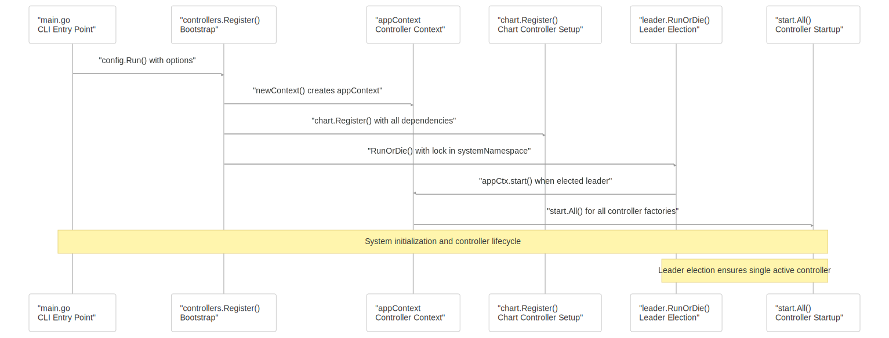

# System Overview

[Get free private DeepWikis in Devin](/private-repo)

[DeepWiki](https://deepwiki.com)

[DeepWiki](/)

[k3s-io/helm-controller](https://github.com/k3s-io/helm-controller)

[Get free private DeepWikis with

Devin](/private-repo)Share

Last indexed: 22 July 2025 ([dac1b5](https://github.com/k3s-io/helm-controller/commits/dac1b5e9))

* [Overview](/k3s-io/helm-controller/1-overview)
* [User Guide](/k3s-io/helm-controller/2-user-guide)
* [Installation and Setup](/k3s-io/helm-controller/2.1-installation-and-setup)
* [Using HelmChart Resources](/k3s-io/helm-controller/2.2-using-helmchart-resources)
* [Configuration Options](/k3s-io/helm-controller/2.3-configuration-options)
* [Architecture](/k3s-io/helm-controller/3-architecture)
* [System Overview](/k3s-io/helm-controller/3.1-system-overview)
* [API Design](/k3s-io/helm-controller/3.2-api-design)
* [Controller Implementation](/k3s-io/helm-controller/3.3-controller-implementation)
* [Job Execution Model](/k3s-io/helm-controller/3.4-job-execution-model)
* [Developer Guide](/k3s-io/helm-controller/4-developer-guide)
* [Code Generation](/k3s-io/helm-controller/4.1-code-generation)
* [Build System](/k3s-io/helm-controller/4.2-build-system)
* [Testing Framework](/k3s-io/helm-controller/4.3-testing-framework)
* [CI/CD Pipeline](/k3s-io/helm-controller/4.4-cicd-pipeline)
* [Reference](/k3s-io/helm-controller/5-reference)
* [API Reference](/k3s-io/helm-controller/5.1-api-reference)
* [CLI Reference](/k3s-io/helm-controller/5.2-cli-reference)
* [Generated Components](/k3s-io/helm-controller/5.3-generated-components)

Menu

# System Overview

Relevant source files

* [main.go](https://github.com/k3s-io/helm-controller/blob/dac1b5e9/main.go)
* [pkg/apis/helm.cattle.io/v1/doc.go](https://github.com/k3s-io/helm-controller/blob/dac1b5e9/pkg/apis/helm.cattle.io/v1/doc.go)
* [pkg/codegen/main.go](https://github.com/k3s-io/helm-controller/blob/dac1b5e9/pkg/codegen/main.go)
* [pkg/controllers/chart/chart\_test.go](https://github.com/k3s-io/helm-controller/blob/dac1b5e9/pkg/controllers/chart/chart_test.go)
* [pkg/controllers/controllers.go](https://github.com/k3s-io/helm-controller/blob/dac1b5e9/pkg/controllers/controllers.go)
* [pkg/remove/handler.go](https://github.com/k3s-io/helm-controller/blob/dac1b5e9/pkg/remove/handler.go)

## Purpose and Scope

This document provides a high-level architectural overview of the helm-controller system, explaining how its core components interact to manage Helm charts through Kubernetes Custom Resources. It covers the system's overall design patterns, component relationships, and execution flow.

For detailed information about the API design and Custom Resource schemas, see [API Design](/k3s-io/helm-controller/3.2-api-design). For implementation details of the chart controller logic, see [Controller Implementation](/k3s-io/helm-controller/3.3-controller-implementation). For specifics on how Helm operations are executed, see [Job Execution Model](/k3s-io/helm-controller/3.4-job-execution-model).

## System Architecture

The helm-controller follows a standard Kubernetes controller pattern, orchestrating multiple components to provide declarative Helm chart management:

Sources: [main.go22-107](https://github.com/k3s-io/helm-controller/blob/dac1b5e9/main.go#L22-L107) [pkg/controllers/controllers.go38-51](https://github.com/k3s-io/helm-controller/blob/dac1b5e9/pkg/controllers/controllers.go#L38-L51) [pkg/controllers/controllers.go57-122](https://github.com/k3s-io/helm-controller/blob/dac1b5e9/pkg/controllers/controllers.go#L57-L122)

## Component Interaction Flow

The system processes HelmChart Custom Resources through a series of coordinated interactions:

Sources: [main.go29-30](https://github.com/k3s-io/helm-controller/blob/dac1b5e9/main.go#L29-L30) [pkg/controllers/controllers.go57-122](https://github.com/k3s-io/helm-controller/blob/dac1b5e9/pkg/controllers/controllers.go#L57-L122) [pkg/controllers/controllers.go53-55](https://github.com/k3s-io/helm-controller/blob/dac1b5e9/pkg/controllers/controllers.go#L53-L55)

## Core System Components

### Application Context (`appContext`)

The `appContext` struct serves as the central coordinator, managing all controller interfaces and shared services:

| Component | Type | Purpose |
| --- | --- | --- |
| `Interface` | `helmcontroller.Interface` | Generated Helm chart controllers |
| `K8s` | `kubernetes.Interface` | Standard Kubernetes client |
| `Core` | `corecontroller.Interface` | Core resource controllers |
| `RBAC` | `rbaccontroller.Interface` | RBAC resource controllers |
| `Batch` | `batchcontroller.Interface` | Job and batch controllers |
| `Apply` | `apply.Apply` | Declarative resource management |
| `EventBroadcaster` | `record.EventBroadcaster` | Event recording system |

Sources: [pkg/controllers/controllers.go38-51](https://github.com/k3s-io/helm-controller/blob/dac1b5e9/pkg/controllers/controllers.go#L38-L51)

### Controller Factory System

The system uses a shared controller factory pattern to manage resource watchers and caches efficiently:

Sources: [pkg/controllers/controllers.go124-136](https://github.com/k3s-io/helm-controller/blob/dac1b5e9/pkg/controllers/controllers.go#L124-L136) [pkg/controllers/controllers.go161-195](https://github.com/k3s-io/helm-controller/blob/dac1b5e9/pkg/controllers/controllers.go#L161-L195)

## Controller Lifecycle Management

### Leader Election and Startup

The system implements leader election to ensure only one controller instance is active in a cluster:

Sources: [pkg/controllers/controllers.go113-121](https://github.com/k3s-io/helm-controller/blob/dac1b5e9/pkg/controllers/controllers.go#L113-L121) [pkg/controllers/controllers.go67-74](https://github.com/k3s-io/helm-controller/blob/dac1b5e9/pkg/controllers/controllers.go#L67-L74) [pkg/controllers/controllers.go209-215](https://github.com/k3s-io/helm-controller/blob/dac1b5e9/pkg/controllers/controllers.go#L209-L215)

### Chart Controller Registration

The chart controller is registered with all necessary dependencies for managing HelmChart resources:

Sources: [pkg/controllers/controllers.go81-100](https://github.com/k3s-io/helm-controller/blob/dac1b5e9/pkg/controllers/controllers.go#L81-L100)

## Code Generation Pipeline

The system relies heavily on generated code for Kubernetes integration:

Sources: [main.go1-5](https://github.com/k3s-io/helm-controller/blob/dac1b5e9/main.go#L1-L5) [pkg/codegen/main.go12-28](https://github.com/k3s-io/helm-controller/blob/dac1b5e9/pkg/codegen/main.go#L12-L28)

## Configuration and Extensibility

### CLI Configuration Options

The system exposes comprehensive configuration through CLI flags and environment variables:

| Flag | Environment Variable | Purpose | Default |
| --- | --- | --- | --- |
| `--controller-name` | `CONTROLLER_NAME` | Controller identity | `helm-controller` |
| `--default-job-image` | `DEFAULT_JOB_IMAGE` | Helm execution image | Built-in default |
| `--job-cluster-role` | `JOB_CLUSTER_ROLE` | RBAC for jobs | `cluster-admin` |
| `--namespace` | `NAMESPACE` | Watch namespace | All namespaces |
| `--threads` | `THREADS` | Controller workers | `2` |

Sources: [main.go32-100](https://github.com/k3s-io/helm-controller/blob/dac1b5e9/main.go#L32-L100)

### Scoped Remove Handler Pattern

The system includes a generic pattern for scoped resource cleanup through the `ScopedOnRemoveHandler`:

Sources: [pkg/remove/handler.go24-39](https://github.com/k3s-io/helm-controller/blob/dac1b5e9/pkg/remove/handler.go#L24-L39)

The helm-controller system demonstrates a well-structured Kubernetes controller implementation, leveraging code generation, shared controller factories, and leader election to provide robust and scalable Helm chart management through Custom Resources.

Dismiss

Refresh this wiki

Enter email to refresh

### On this page

* [System Overview](#system-overview)
* [Purpose and Scope](#purpose-and-scope)
* [System Architecture](#system-architecture)
* [Component Interaction Flow](#component-interaction-flow)
* [Core System Components](#core-system-components)
* [Application Context (`appContext`)](#application-context-appcontext)
* [Controller Factory System](#controller-factory-system)
* [Controller Lifecycle Management](#controller-lifecycle-management)
* [Leader Election and Startup](#leader-election-and-startup)
* [Chart Controller Registration](#chart-controller-registration)
* [Code Generation Pipeline](#code-generation-pipeline)
* [Configuration and Extensibility](#configuration-and-extensibility)
* [CLI Configuration Options](#cli-configuration-options)
* [Scoped Remove Handler Pattern](#scoped-remove-handler-pattern)

Ask Devin about k3s-io/helm-controller

Deep Research