# API Design

[Get free private DeepWikis in Devin](/private-repo)

[DeepWiki](https://deepwiki.com)

[DeepWiki](/)

[k3s-io/helm-controller](https://github.com/k3s-io/helm-controller)

[Get free private DeepWikis with

Devin](/private-repo)Share

Last indexed: 22 July 2025 ([dac1b5](https://github.com/k3s-io/helm-controller/commits/dac1b5e9))

* [Overview](/k3s-io/helm-controller/1-overview)
* [User Guide](/k3s-io/helm-controller/2-user-guide)
* [Installation and Setup](/k3s-io/helm-controller/2.1-installation-and-setup)
* [Using HelmChart Resources](/k3s-io/helm-controller/2.2-using-helmchart-resources)
* [Configuration Options](/k3s-io/helm-controller/2.3-configuration-options)
* [Architecture](/k3s-io/helm-controller/3-architecture)
* [System Overview](/k3s-io/helm-controller/3.1-system-overview)
* [API Design](/k3s-io/helm-controller/3.2-api-design)
* [Controller Implementation](/k3s-io/helm-controller/3.3-controller-implementation)
* [Job Execution Model](/k3s-io/helm-controller/3.4-job-execution-model)
* [Developer Guide](/k3s-io/helm-controller/4-developer-guide)
* [Code Generation](/k3s-io/helm-controller/4.1-code-generation)
* [Build System](/k3s-io/helm-controller/4.2-build-system)
* [Testing Framework](/k3s-io/helm-controller/4.3-testing-framework)
* [CI/CD Pipeline](/k3s-io/helm-controller/4.4-cicd-pipeline)
* [Reference](/k3s-io/helm-controller/5-reference)
* [API Reference](/k3s-io/helm-controller/5.1-api-reference)
* [CLI Reference](/k3s-io/helm-controller/5.2-cli-reference)
* [Generated Components](/k3s-io/helm-controller/5.3-generated-components)

Menu

# API Design

Relevant source files

* [pkg/apis/helm.cattle.io/v1/doc.go](https://github.com/k3s-io/helm-controller/blob/dac1b5e9/pkg/apis/helm.cattle.io/v1/doc.go)
* [pkg/apis/helm.cattle.io/v1/types.go](https://github.com/k3s-io/helm-controller/blob/dac1b5e9/pkg/apis/helm.cattle.io/v1/types.go)
* [pkg/apis/helm.cattle.io/v1/zz\_generated\_deepcopy.go](https://github.com/k3s-io/helm-controller/blob/dac1b5e9/pkg/apis/helm.cattle.io/v1/zz_generated_deepcopy.go)

This document explains the Custom Resource API design for the helm-controller project, covering the schema architecture, resource types, and integration patterns used to provide declarative Helm chart management through Kubernetes Custom Resources.

For implementation details of how these APIs are processed by the controller, see [Controller Implementation](/k3s-io/helm-controller/3.3-controller-implementation). For complete field reference documentation, see [API Reference](/k3s-io/helm-controller/5.1-api-reference).

## API Group and Versioning

The helm-controller defines its Custom Resources under the API group `helm.cattle.io/v1`. This follows Kubernetes conventions for third-party APIs and provides a stable v1 interface for production use.

Sources: [pkg/apis/helm.cattle.io/v1/doc.go19-21](https://github.com/k3s-io/helm-controller/blob/dac1b5e9/pkg/apis/helm.cattle.io/v1/doc.go#L19-L21) [pkg/apis/helm.cattle.io/v1/types.go1-8](https://github.com/k3s-io/helm-controller/blob/dac1b5e9/pkg/apis/helm.cattle.io/v1/types.go#L1-L8)

## Resource Types Overview

The API provides two primary Custom Resource types designed for different use cases:

| Resource | Purpose | Use Case |
| --- | --- | --- |
| `HelmChart` | Complete chart installation specification | Direct chart management, bootstrap charts |
| `HelmChartConfig` | Additional configuration overlay | External system integration, value overrides |

Sources: [pkg/apis/helm.cattle.io/v1/types.go24-31](https://github.com/k3s-io/helm-controller/blob/dac1b5e9/pkg/apis/helm.cattle.io/v1/types.go#L24-L31) [pkg/apis/helm.cattle.io/v1/types.go120-128](https://github.com/k3s-io/helm-controller/blob/dac1b5e9/pkg/apis/helm.cattle.io/v1/types.go#L120-L128)

## HelmChart Resource Design

The `HelmChart` resource serves as the primary interface for declarative Helm chart management. Its design mirrors Helm CLI functionality while adding Kubernetes-native features.

### Core Structure

Sources: [pkg/apis/helm.cattle.io/v1/types.go25-31](https://github.com/k3s-io/helm-controller/blob/dac1b5e9/pkg/apis/helm.cattle.io/v1/types.go#L25-L31) [pkg/apis/helm.cattle.io/v1/types.go34-101](https://github.com/k3s-io/helm-controller/blob/dac1b5e9/pkg/apis/helm.cattle.io/v1/types.go#L34-L101)

### Chart Source Configuration

The API supports multiple chart source patterns through mutually exclusive fields:

| Field | Purpose | Helm CLI Equivalent |
| --- | --- | --- |
| `chart` + `repo` + `version` | Repository-based chart | `helm install RELEASE CHART --repo REPO --version VERSION` |
| `chart` (URL) | Direct archive URL | `helm install RELEASE https://example.com/chart.tgz` |
| `chartContent` | Base64-encoded archive | Direct chart content installation |

Sources: [pkg/apis/helm.cattle.io/v1/types.go41-71](https://github.com/k3s-io/helm-controller/blob/dac1b5e9/pkg/apis/helm.cattle.io/v1/types.go#L41-L71)

### Values Hierarchy

The API implements a three-tier values override system:

Sources: [pkg/apis/helm.cattle.io/v1/types.go56-64](https://github.com/k3s-io/helm-controller/blob/dac1b5e9/pkg/apis/helm.cattle.io/v1/types.go#L56-L64) [pkg/apis/helm.cattle.io/v1/types.go166-176](https://github.com/k3s-io/helm-controller/blob/dac1b5e9/pkg/apis/helm.cattle.io/v1/types.go#L166-L176)

## HelmChartConfig Resource Design

The `HelmChartConfig` provides a lightweight overlay mechanism for external systems to inject additional configuration without modifying the primary `HelmChart` resource.

### Design Rationale

Sources: [pkg/apis/helm.cattle.io/v1/types.go120-123](https://github.com/k3s-io/helm-controller/blob/dac1b5e9/pkg/apis/helm.cattle.io/v1/types.go#L120-L123)

### Configuration Merge Semantics

The `HelmChartConfigSpec` contains a subset of `HelmChartSpec` fields that can override or extend the base chart configuration:

| Field | Merge Behavior |
| --- | --- |
| `valuesContent` | Replaces base chart values |
| `valuesSecrets` | Appends to base chart secrets list |
| `failurePolicy` | Overrides base chart policy |

Sources: [pkg/apis/helm.cattle.io/v1/types.go130-144](https://github.com/k3s-io/helm-controller/blob/dac1b5e9/pkg/apis/helm.cattle.io/v1/types.go#L130-L144)

## Status and Condition Design

The `HelmChartStatus` follows Kubernetes conventions for status reporting with a condition-based state machine.

Sources: [pkg/apis/helm.cattle.io/v1/types.go103-115](https://github.com/k3s-io/helm-controller/blob/dac1b5e9/pkg/apis/helm.cattle.io/v1/types.go#L103-L115) [pkg/apis/helm.cattle.io/v1/types.go146-164](https://github.com/k3s-io/helm-controller/blob/dac1b5e9/pkg/apis/helm.cattle.io/v1/types.go#L146-L164)

## Field Design Patterns

### Kubernetes Integration

The API leverages standard Kubernetes types for consistent integration:

Sources: [pkg/apis/helm.cattle.io/v1/types.go3-8](https://github.com/k3s-io/helm-controller/blob/dac1b5e9/pkg/apis/helm.cattle.io/v1/types.go#L3-L8) [pkg/apis/helm.cattle.io/v1/types.go55-100](https://github.com/k3s-io/helm-controller/blob/dac1b5e9/pkg/apis/helm.cattle.io/v1/types.go#L55-L100)

### Kubebuilder Annotations

The API uses kubebuilder annotations for validation, code generation, and kubectl integration:

| Annotation | Purpose | Example |
| --- | --- | --- |
| `+kubebuilder:validation:Enum` | Field validation | `FailurePolicy` enum values |
| `+kubebuilder:subresource:status` | Status subresource | Enable `/status` endpoint |
| `+kubebuilder:printcolumn` | kubectl display | Show key fields in table output |
| `+kubebuilder:default` | Default values | `failurePolicy=reinstall` |

Sources: [pkg/apis/helm.cattle.io/v1/types.go10-22](https://github.com/k3s-io/helm-controller/blob/dac1b5e9/pkg/apis/helm.cattle.io/v1/types.go#L10-L22) [pkg/apis/helm.cattle.io/v1/types.go82-83](https://github.com/k3s-io/helm-controller/blob/dac1b5e9/pkg/apis/helm.cattle.io/v1/types.go#L82-L83)

### Authentication and Security

The API provides multiple authentication mechanisms for chart repositories:

Sources: [pkg/apis/helm.cattle.io/v1/types.go84-100](https://github.com/k3s-io/helm-controller/blob/dac1b5e9/pkg/apis/helm.cattle.io/v1/types.go#L84-L100)

## Code Generation Integration

The API types are designed to work seamlessly with Kubernetes code generation tools:

Sources: [pkg/apis/helm.cattle.io/v1/types.go13](https://github.com/k3s-io/helm-controller/blob/dac1b5e9/pkg/apis/helm.cattle.io/v1/types.go#L13-L13) [pkg/apis/helm.cattle.io/v1/types.go22](https://github.com/k3s-io/helm-controller/blob/dac1b5e9/pkg/apis/helm.cattle.io/v1/types.go#L22-L22) [pkg/apis/helm.cattle.io/v1/zz\_generated\_deepcopy.go1-30](https://github.com/k3s-io/helm-controller/blob/dac1b5e9/pkg/apis/helm.cattle.io/v1/zz_generated_deepcopy.go#L1-L30)

Dismiss

Refresh this wiki

Enter email to refresh

### On this page

* [API Design](#api-design)
* [API Group and Versioning](#api-group-and-versioning)
* [Resource Types Overview](#resource-types-overview)
* [HelmChart Resource Design](#helmchart-resource-design)
* [Core Structure](#core-structure)
* [Chart Source Configuration](#chart-source-configuration)
* [Values Hierarchy](#values-hierarchy)
* [HelmChartConfig Resource Design](#helmchartconfig-resource-design)
* [Design Rationale](#design-rationale)
* [Configuration Merge Semantics](#configuration-merge-semantics)
* [Status and Condition Design](#status-and-condition-design)
* [Field Design Patterns](#field-design-patterns)
* [Kubernetes Integration](#kubernetes-integration)
* [Kubebuilder Annotations](#kubebuilder-annotations)
* [Authentication and Security](#authentication-and-security)
* [Code Generation Integration](#code-generation-integration)

Ask Devin about k3s-io/helm-controller

Deep Research