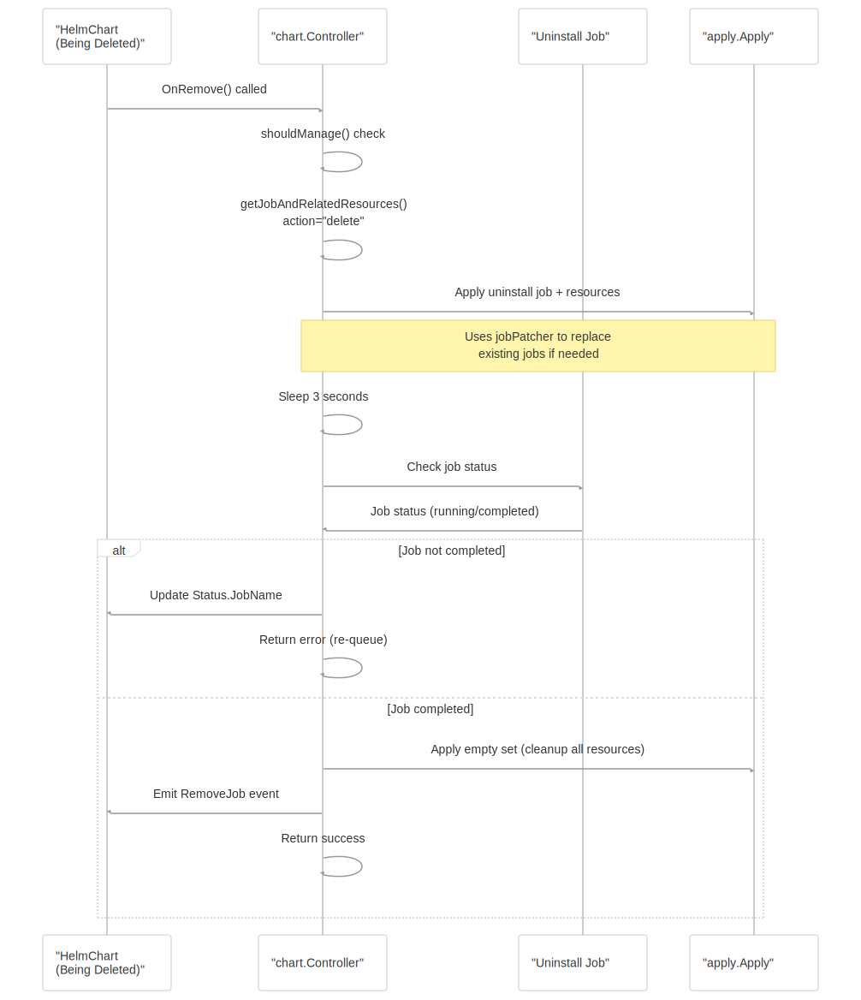

# Controller Implementation

[Get free private DeepWikis in Devin](/private-repo)

[DeepWiki](https://deepwiki.com)

[DeepWiki](/)

[k3s-io/helm-controller](https://github.com/k3s-io/helm-controller)

[Get free private DeepWikis with

Devin](/private-repo)Share

Last indexed: 22 July 2025 ([dac1b5](https://github.com/k3s-io/helm-controller/commits/dac1b5e9))

* [Overview](/k3s-io/helm-controller/1-overview)
* [User Guide](/k3s-io/helm-controller/2-user-guide)
* [Installation and Setup](/k3s-io/helm-controller/2.1-installation-and-setup)
* [Using HelmChart Resources](/k3s-io/helm-controller/2.2-using-helmchart-resources)
* [Configuration Options](/k3s-io/helm-controller/2.3-configuration-options)
* [Architecture](/k3s-io/helm-controller/3-architecture)
* [System Overview](/k3s-io/helm-controller/3.1-system-overview)
* [API Design](/k3s-io/helm-controller/3.2-api-design)
* [Controller Implementation](/k3s-io/helm-controller/3.3-controller-implementation)
* [Job Execution Model](/k3s-io/helm-controller/3.4-job-execution-model)
* [Developer Guide](/k3s-io/helm-controller/4-developer-guide)
* [Code Generation](/k3s-io/helm-controller/4.1-code-generation)
* [Build System](/k3s-io/helm-controller/4.2-build-system)
* [Testing Framework](/k3s-io/helm-controller/4.3-testing-framework)
* [CI/CD Pipeline](/k3s-io/helm-controller/4.4-cicd-pipeline)
* [Reference](/k3s-io/helm-controller/5-reference)
* [API Reference](/k3s-io/helm-controller/5.1-api-reference)
* [CLI Reference](/k3s-io/helm-controller/5.2-cli-reference)
* [Generated Components](/k3s-io/helm-controller/5.3-generated-components)

Menu

# Controller Implementation

Relevant source files

* [pkg/controllers/chart/chart.go](https://github.com/k3s-io/helm-controller/blob/dac1b5e9/pkg/controllers/chart/chart.go)
* [pkg/generated/controllers/helm.cattle.io/factory.go](https://github.com/k3s-io/helm-controller/blob/dac1b5e9/pkg/generated/controllers/helm.cattle.io/factory.go)
* [pkg/generated/controllers/helm.cattle.io/v1/helmchart.go](https://github.com/k3s-io/helm-controller/blob/dac1b5e9/pkg/generated/controllers/helm.cattle.io/v1/helmchart.go)

This document provides an in-depth analysis of the core chart controller implementation in helm-controller. It covers the controller's architecture, reconciliation patterns, event handling mechanisms, and job management strategies. The controller follows standard Kubernetes controller patterns using the wrangler framework to manage HelmChart and HelmChartConfig custom resources.

For information about the API design and resource schemas, see [API Design](/k3s-io/helm-controller/3.2-api-design). For details about how Helm operations are executed via Kubernetes Jobs, see [Job Execution Model](/k3s-io/helm-controller/3.4-job-execution-model).

## Controller Architecture

The chart controller is implemented as a standard Kubernetes controller that watches HelmChart and HelmChartConfig resources and reconciles their desired state by creating and managing Kubernetes Jobs.

**Sources:** [pkg/controllers/chart/chart.go82-96](https://github.com/k3s-io/helm-controller/blob/dac1b5e9/pkg/controllers/chart/chart.go#L82-L96) [pkg/generated/controllers/helm.cattle.io/v1/helmchart.go37-50](https://github.com/k3s-io/helm-controller/blob/dac1b5e9/pkg/generated/controllers/helm.cattle.io/v1/helmchart.go#L37-L50)

## Controller Struct and Dependencies

The `Controller` struct encapsulates all dependencies needed for chart management:

**Sources:** [pkg/controllers/chart/chart.go82-96](https://github.com/k3s-io/helm-controller/blob/dac1b5e9/pkg/controllers/chart/chart.go#L82-L96) [pkg/controllers/chart/chart.go119-132](https://github.com/k3s-io/helm-controller/blob/dac1b5e9/pkg/controllers/chart/chart.go#L119-L132)

## Registration and Setup

The `Register` function initializes the controller and establishes all necessary watches and handlers:

| Component | Purpose | Implementation |
| --- | --- | --- |
| `chartBySecretIndex` | Index HelmCharts by referenced Secrets | [pkg/controllers/chart/chart.go139](https://github.com/k3s-io/helm-controller/blob/dac1b5e9/pkg/controllers/chart/chart.go#L139-L139) |
| `chartConfigBySecretIndex` | Index HelmChartConfigs by referenced Secrets | [pkg/controllers/chart/chart.go140](https://github.com/k3s-io/helm-controller/blob/dac1b5e9/pkg/controllers/chart/chart.go#L140-L140) |
| Related Resource Watches | Trigger reconciliation when related resources change | [pkg/controllers/chart/chart.go142-144](https://github.com/k3s-io/helm-controller/blob/dac1b5e9/pkg/controllers/chart/chart.go#L142-L144) |
| Generating Handler | Main reconciliation handler with apply operations | [pkg/controllers/chart/chart.go155-157](https://github.com/k3s-io/helm-controller/blob/dac1b5e9/pkg/controllers/chart/chart.go#L155-L157) |
| Remove Handler | Handles resource deletion with uninstall jobs | [pkg/controllers/chart/chart.go159-171](https://github.com/k3s-io/helm-controller/blob/dac1b5e9/pkg/controllers/chart/chart.go#L159-L171) |

**Sources:** [pkg/controllers/chart/chart.go98-178](https://github.com/k3s-io/helm-controller/blob/dac1b5e9/pkg/controllers/chart/chart.go#L98-L178) [pkg/controllers/chart/chart.go134-137](https://github.com/k3s-io/helm-controller/blob/dac1b5e9/pkg/controllers/chart/chart.go#L134-L137)

## Reconciliation Loop Implementation

The primary reconciliation logic is implemented in the `OnChange` method, which follows a standard controller pattern:

**Sources:** [pkg/controllers/chart/chart.go256-322](https://github.com/k3s-io/helm-controller/blob/dac1b5e9/pkg/controllers/chart/chart.go#L256-L322)

### Management Decision Logic

The `shouldManage` method implements ownership logic to determine if this controller instance should process a given HelmChart:

| Condition | Action | Reason |
| --- | --- | --- |
| `chart.Namespace != c.systemNamespace` | Skip | Namespace-scoped controller |
| `chart.Spec.Chart == "" && chart.Spec.ChartContent == ""` | Skip | Invalid chart specification |
| `chart.Annotations[Unmanaged]` exists | Skip | Explicitly marked as unmanaged |
| `chart.Annotations[ManagedBy] == c.managedBy` | Manage | Already claimed by this controller |
| No `ManagedBy` annotation | Claim & Skip | Add annotation, trigger re-reconciliation |

**Sources:** [pkg/controllers/chart/chart.go403-436](https://github.com/k3s-io/helm-controller/blob/dac1b5e9/pkg/controllers/chart/chart.go#L403-L436)

## Event Handling and Related Resource Watches

The controller uses the wrangler framework's `relatedresource.Watch` mechanism to respond to changes in related resources:

**Sources:** [pkg/controllers/chart/chart.go188-253](https://github.com/k3s-io/helm-controller/blob/dac1b5e9/pkg/controllers/chart/chart.go#L188-L253) [pkg/controllers/chart/chart.go505-523](https://github.com/k3s-io/helm-controller/blob/dac1b5e9/pkg/controllers/chart/chart.go#L505-L523)

## Resource Deletion and Cleanup

The `OnRemove` method handles HelmChart deletion by creating uninstall jobs and managing cleanup:

**Sources:** [pkg/controllers/chart/chart.go324-401](https://github.com/k3s-io/helm-controller/blob/dac1b5e9/pkg/controllers/chart/chart.go#L324-L401)

## Job and Resource Generation

The controller creates multiple Kubernetes resources for each HelmChart operation:

**Sources:** [pkg/controllers/chart/chart.go438-503](https://github.com/k3s-io/helm-controller/blob/dac1b5e9/pkg/controllers/chart/chart.go#L438-L503) [pkg/controllers/chart/chart.go525-749](https://github.com/k3s-io/helm-controller/blob/dac1b5e9/pkg/controllers/chart/chart.go#L525-L749)

### Job Security Context Configuration

The controller applies secure defaults and allows customization of security contexts:

| Security Setting | Default Value | Customizable Via |
| --- | --- | --- |
| `runAsNonRoot` | `true` | `chart.Spec.PodSecurityContext` |
| `allowPrivilegeEscalation` | `false` | `chart.Spec.SecurityContext` |
| `readOnlyRootFilesystem` | `true` | `chart.Spec.SecurityContext` |
| `seccompProfile.type` | `RuntimeDefault` | `chart.Spec.PodSecurityContext` |
| `capabilities.drop` | `["ALL"]` | `chart.Spec.SecurityContext` |

**Sources:** [pkg/controllers/chart/chart.go65-79](https://github.com/k3s-io/helm-controller/blob/dac1b5e9/pkg/controllers/chart/chart.go#L65-L79) [pkg/controllers/chart/chart.go1151-1159](https://github.com/k3s-io/helm-controller/blob/dac1b5e9/pkg/controllers/chart/chart.go#L1151-L1159)

## Status Management and Conditions

The controller maintains comprehensive status information using Kubernetes conditions:

The status also includes the `JobName` field to track which Job is handling the current operation, enabling users to monitor progress and debug issues.

**Sources:** [pkg/controllers/chart/chart.go304-316](https://github.com/k3s-io/helm-controller/blob/dac1b5e9/pkg/controllers/chart/chart.go#L304-L316) [pkg/controllers/chart/chart.go271-283](https://github.com/k3s-io/helm-controller/blob/dac1b5e9/pkg/controllers/chart/chart.go#L271-L283) [pkg/controllers/chart/chart.go288-300](https://github.com/k3s-io/helm-controller/blob/dac1b5e9/pkg/controllers/chart/chart.go#L288-L300)

Dismiss

Refresh this wiki

Enter email to refresh

### On this page

* [Controller Implementation](#controller-implementation)
* [Controller Architecture](#controller-architecture)
* [Controller Struct and Dependencies](#controller-struct-and-dependencies)
* [Registration and Setup](#registration-and-setup)
* [Reconciliation Loop Implementation](#reconciliation-loop-implementation)
* [Management Decision Logic](#management-decision-logic)
* [Event Handling and Related Resource Watches](#event-handling-and-related-resource-watches)
* [Resource Deletion and Cleanup](#resource-deletion-and-cleanup)
* [Job and Resource Generation](#job-and-resource-generation)
* [Job Security Context Configuration](#job-security-context-configuration)
* [Status Management and Conditions](#status-management-and-conditions)

Ask Devin about k3s-io/helm-controller

Deep Research