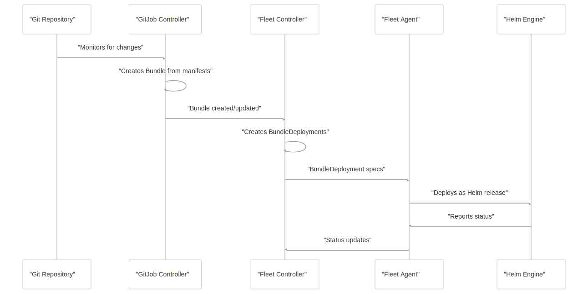

# Overview

[Index your code with Devin](/private-repo)

[DeepWiki](/)

[DeepWiki](/)

[rancher/fleet](https://github.com/rancher/fleet "Open repository")

[Index your code with

Devin](/private-repo)Edit WikiShare

Last indexed: 3 June 2025 ([01abaa](https://github.com/rancher/fleet/commits/01abaa07))

* [Overview](/rancher/fleet/1-overview)
* [Architecture](/rancher/fleet/2-architecture)
* [Core APIs and Custom Resources](/rancher/fleet/2.1-core-apis-and-custom-resources)
* [Controllers and Reconcilers](/rancher/fleet/2.2-controllers-and-reconcilers)
* [Agent System](/rancher/fleet/2.3-agent-system)
* [Core Components](/rancher/fleet/3-core-components)
* [GitOps System](/rancher/fleet/3.1-gitops-system)
* [Bundle Management](/rancher/fleet/3.2-bundle-management)
* [Cluster Management](/rancher/fleet/3.3-cluster-management)
* [CLI Tools](/rancher/fleet/3.4-cli-tools)
* [Deployment and Installation](/rancher/fleet/4-deployment-and-installation)
* [Helm Charts](/rancher/fleet/4.1-helm-charts)
* [Container Images](/rancher/fleet/4.2-container-images)
* [Configuration and Tuning](/rancher/fleet/4.3-configuration-and-tuning)
* [Development](/rancher/fleet/5-development)
* [Development Environment](/rancher/fleet/5.1-development-environment)
* [Testing](/rancher/fleet/5.2-testing)
* [CI/CD and Release Process](/rancher/fleet/5.3-cicd-and-release-process)
* [Operations and Troubleshooting](/rancher/fleet/6-operations-and-troubleshooting)
* [Troubleshooting and Support](/rancher/fleet/6.1-troubleshooting-and-support)
* [Git Webhooks and Integrations](/rancher/fleet/6.2-git-webhooks-and-integrations)

Menu

# Overview

Relevant source files

* [DEVELOPING.md](https://github.com/rancher/fleet/blob/01abaa07/DEVELOPING.md)
* [README.md](https://github.com/rancher/fleet/blob/01abaa07/README.md)
* [charts/fleet-agent/Chart.yaml](https://github.com/rancher/fleet/blob/01abaa07/charts/fleet-agent/Chart.yaml)
* [charts/fleet-agent/templates/\_helpers.tpl](https://github.com/rancher/fleet/blob/01abaa07/charts/fleet-agent/templates/_helpers.tpl)
* [charts/fleet-crd/Chart.yaml](https://github.com/rancher/fleet/blob/01abaa07/charts/fleet-crd/Chart.yaml)
* [charts/fleet/Chart.yaml](https://github.com/rancher/fleet/blob/01abaa07/charts/fleet/Chart.yaml)
* [charts/fleet/templates/\_helpers.tpl](https://github.com/rancher/fleet/blob/01abaa07/charts/fleet/templates/_helpers.tpl)
* [docs/arch.png](https://github.com/rancher/fleet/blob/01abaa07/docs/arch.png)
* [go.mod](https://github.com/rancher/fleet/blob/01abaa07/go.mod)
* [go.sum](https://github.com/rancher/fleet/blob/01abaa07/go.sum)
* [pkg/apis/fleet.cattle.io/v1alpha1/groupversion\_info.go](https://github.com/rancher/fleet/blob/01abaa07/pkg/apis/fleet.cattle.io/v1alpha1/groupversion_info.go)
* [pkg/apis/go.mod](https://github.com/rancher/fleet/blob/01abaa07/pkg/apis/go.mod)
* [pkg/apis/go.sum](https://github.com/rancher/fleet/blob/01abaa07/pkg/apis/go.sum)
* [pkg/apis/internal/scheme.go](https://github.com/rancher/fleet/blob/01abaa07/pkg/apis/internal/scheme.go)

## Purpose and Scope

This document provides a comprehensive overview of Fleet, a GitOps platform designed to manage Kubernetes deployments across multiple clusters at scale. Fleet enables organizations to deploy and manage applications from Git repositories containing Kubernetes YAML manifests, Helm charts, or Kustomize configurations.

This overview covers Fleet's core architecture, key components, and fundamental concepts. For detailed information about specific subsystems, see [Architecture](/rancher/fleet/2-architecture) for technical design details, [Core Components](/rancher/fleet/3-core-components) for functional breakdowns, and [Deployment and Installation](/rancher/fleet/4-deployment-and-installation) for setup procedures.

## What is Fleet

Fleet is a GitOps controller that monitors Git repositories and deploys Kubernetes resources to one or more target clusters. It transforms all deployments into Helm releases for consistency and auditability, regardless of the original source format (raw YAML, Helm charts, or Kustomize).

The platform consists of two main components:

* **Fleet Controller**: Runs on a management cluster and orchestrates deployments
* **Fleet Agent**: Runs on managed clusters and executes deployments locally

Fleet's design emphasizes scalability, supporting scenarios with many clusters, many deployments, or many teams within a single organization.

Sources: [README.md12-21](https://github.com/rancher/fleet/blob/01abaa07/README.md#L12-L21) [go.mod1](https://github.com/rancher/fleet/blob/01abaa07/go.mod#L1-L1)

## High-Level Architecture



Fleet operates on a hub-and-spoke model where a central management cluster coordinates deployments to multiple managed clusters. The GitJob controller monitors Git repositories for changes, the Fleet Controller processes these changes into deployment instructions, and Fleet Agents on managed clusters execute the actual deployments using Helm.

Sources: [README.md10-21](https://github.com/rancher/fleet/blob/01abaa07/README.md#L10-L21) [pkg/apis/fleet.cattle.io/v1alpha1/groupversion\_info.go1-32](https://github.com/rancher/fleet/blob/01abaa07/pkg/apis/fleet.cattle.io/v1alpha1/groupversion_info.go#L1-L32)

## Core Custom Resources

Fleet defines several Custom Resource Definitions (CRDs) that form the foundation of its GitOps workflow:



### Primary Resources

| Resource | Purpose | Scope |
| --- | --- | --- |
| `GitRepo` | Defines a Git repository to monitor for Kubernetes manifests | Management Cluster |
| `Bundle` | Collection of Kubernetes resources from a Git repository | Management Cluster |
| `BundleDeployment` | Cluster-specific deployment of a Bundle | Management Cluster |
| `Cluster` | Represents a managed Kubernetes cluster | Management Cluster |
| `ClusterGroup` | Logical grouping of clusters for targeted deployments | Management Cluster |

### Registration Resources

| Resource | Purpose |
| --- | --- |
| `ClusterRegistration` | Handles the process of registering a new managed cluster |
| `ClusterRegistrationToken` | Provides authentication tokens for agent registration |

Sources: [pkg/apis/fleet.cattle.io/v1alpha1/groupversion\_info.go14-31](https://github.com/rancher/fleet/blob/01abaa07/pkg/apis/fleet.cattle.io/v1alpha1/groupversion_info.go#L14-L31)

## Component Architecture



Fleet is distributed as three separate Helm charts to provide installation flexibility:

1. **fleet-crd**: Contains Custom Resource Definitions
2. **fleet**: Contains the Fleet Controller and GitJob Controller
3. **fleet-agent**: Contains the Fleet Agent for managed clusters

Sources: [charts/fleet/Chart.yaml1-19](https://github.com/rancher/fleet/blob/01abaa07/charts/fleet/Chart.yaml#L1-L19) [charts/fleet-agent/Chart.yaml1-16](https://github.com/rancher/fleet/blob/01abaa07/charts/fleet-agent/Chart.yaml#L1-L16) [charts/fleet-crd/Chart.yaml1-14](https://github.com/rancher/fleet/blob/01abaa07/charts/fleet-crd/Chart.yaml#L1-L14)

## GitOps Workflow

Fleet implements a complete GitOps workflow that transforms Git repository contents into Kubernetes deployments:



### Workflow Steps

1. **Git Monitoring**: GitJob controller watches configured Git repositories for changes
2. **Bundle Creation**: Git content is processed and packaged into Bundle resources
3. **Targeting**: Fleet Controller creates BundleDeployments based on cluster targeting rules
4. **Agent Deployment**: Fleet Agents receive BundleDeployment specifications
5. **Helm Execution**: All resources are deployed via Helm for consistency and rollback capabilities
6. **Status Reporting**: Deployment status flows back through the system

Sources: [README.md17-21](https://github.com/rancher/fleet/blob/01abaa07/README.md#L17-L21) [README.md45-66](https://github.com/rancher/fleet/blob/01abaa07/README.md#L45-L66)

## Installation and Basic Usage

Fleet installation involves deploying the CRDs and controller to a management cluster:

```
# Install Fleet CRDs
helm install --create-namespace --wait \
    fleet-crd https://github.com/rancher/fleet/releases/download/v0.12.3/fleet-crd-0.12.3.tgz

# Install Fleet Controller
helm install --create-namespace --wait \
    fleet https://github.com/rancher/fleet/releases/download/v0.12.3/fleet-0.12.3.tgz
```

Basic usage involves creating a GitRepo resource to monitor a repository:

```
apiVersion: fleet.cattle.io/v1alpha1
kind: GitRepo
metadata:
  name: sample
  namespace: fleet-local
spec:
  repo: "https://github.com/rancher/fleet-examples"
  paths:
  - simple
```

Sources: [README.md37-43](https://github.com/rancher/fleet/blob/01abaa07/README.md#L37-L43) [README.md50-66](https://github.com/rancher/fleet/blob/01abaa07/README.md#L50-L66)

## Key Design Principles

Fleet's architecture embodies several key design principles:

* **Helm-Centric Deployment**: All resources are converted to Helm charts for consistent deployment and lifecycle management
* **Scalable Architecture**: Designed to handle large numbers of clusters, deployments, and teams
* **Cluster Independence**: Managed clusters operate independently with local agents
* **Git as Source of Truth**: All configuration and application definitions live in Git repositories
* **Namespace Isolation**: Uses `cattle-fleet-system` namespace for system components and `fleet-local` for local cluster deployments

Sources: [README.md12-21](https://github.com/rancher/fleet/blob/01abaa07/README.md#L12-L21) [charts/fleet/Chart.yaml7](https://github.com/rancher/fleet/blob/01abaa07/charts/fleet/Chart.yaml#L7-L7) [README.md56-57](https://github.com/rancher/fleet/blob/01abaa07/README.md#L56-L57)

---

This overview provides the foundation for understanding Fleet's architecture and capabilities. For implementation details, proceed to the [Architecture](/rancher/fleet/2-architecture) section for technical design, [Core Components](/rancher/fleet/3-core-components) for functional details, or [Deployment and Installation](/rancher/fleet/4-deployment-and-installation) for setup procedures.

Dismiss

Refresh this wiki

Enter email to refresh

### On this page

* [Overview](#overview)
* [Purpose and Scope](#purpose-and-scope)
* [What is Fleet](#what-is-fleet)
* [High-Level Architecture](#high-level-architecture)
* [Core Custom Resources](#core-custom-resources)
* [Primary Resources](#primary-resources)
* [Registration Resources](#registration-resources)
* [Component Architecture](#component-architecture)
* [GitOps Workflow](#gitops-workflow)
* [Workflow Steps](#workflow-steps)
* [Installation and Basic Usage](#installation-and-basic-usage)
* [Key Design Principles](#key-design-principles)

Ask Devin about rancher/fleet

Fast