# CLI Tools

[Index your code with Devin](/private-repo)

[DeepWiki](/)

[DeepWiki](/)

[rancher/fleet](https://github.com/rancher/fleet "Open repository")

[Index your code with

Devin](/private-repo)Edit WikiShare

Last indexed: 3 June 2025 ([01abaa](https://github.com/rancher/fleet/commits/01abaa07))

* [Overview](/rancher/fleet/1-overview)
* [Architecture](/rancher/fleet/2-architecture)
* [Core APIs and Custom Resources](/rancher/fleet/2.1-core-apis-and-custom-resources)
* [Controllers and Reconcilers](/rancher/fleet/2.2-controllers-and-reconcilers)
* [Agent System](/rancher/fleet/2.3-agent-system)
* [Core Components](/rancher/fleet/3-core-components)
* [GitOps System](/rancher/fleet/3.1-gitops-system)
* [Bundle Management](/rancher/fleet/3.2-bundle-management)
* [Cluster Management](/rancher/fleet/3.3-cluster-management)
* [CLI Tools](/rancher/fleet/3.4-cli-tools)
* [Deployment and Installation](/rancher/fleet/4-deployment-and-installation)
* [Helm Charts](/rancher/fleet/4.1-helm-charts)
* [Container Images](/rancher/fleet/4.2-container-images)
* [Configuration and Tuning](/rancher/fleet/4.3-configuration-and-tuning)
* [Development](/rancher/fleet/5-development)
* [Development Environment](/rancher/fleet/5.1-development-environment)
* [Testing](/rancher/fleet/5.2-testing)
* [CI/CD and Release Process](/rancher/fleet/5.3-cicd-and-release-process)
* [Operations and Troubleshooting](/rancher/fleet/6-operations-and-troubleshooting)
* [Troubleshooting and Support](/rancher/fleet/6.1-troubleshooting-and-support)
* [Git Webhooks and Integrations](/rancher/fleet/6.2-git-webhooks-and-integrations)

Menu

# CLI Tools

Relevant source files

* [.github/scripts/register-downstream-clusters.sh](https://github.com/rancher/fleet/blob/01abaa07/.github/scripts/register-downstream-clusters.sh)
* [.github/scripts/setup-rancher.sh](https://github.com/rancher/fleet/blob/01abaa07/.github/scripts/setup-rancher.sh)
* [DEVELOPING.md](https://github.com/rancher/fleet/blob/01abaa07/DEVELOPING.md)
* [README.md](https://github.com/rancher/fleet/blob/01abaa07/README.md)
* [dev/README.md](https://github.com/rancher/fleet/blob/01abaa07/dev/README.md)
* [dev/import-images-k3d](https://github.com/rancher/fleet/blob/01abaa07/dev/import-images-k3d)
* [dev/setup-rancher-clusters](https://github.com/rancher/fleet/blob/01abaa07/dev/setup-rancher-clusters)
* [docs/arch.png](https://github.com/rancher/fleet/blob/01abaa07/docs/arch.png)
* [integrationtests/cli/apply/apply\_test.go](https://github.com/rancher/fleet/blob/01abaa07/integrationtests/cli/apply/apply_test.go)
* [integrationtests/cli/apply/helm\_test.go](https://github.com/rancher/fleet/blob/01abaa07/integrationtests/cli/apply/helm_test.go)
* [internal/bundlereader/loaddirectory.go](https://github.com/rancher/fleet/blob/01abaa07/internal/bundlereader/loaddirectory.go)
* [internal/bundlereader/loaddirectory\_test.go](https://github.com/rancher/fleet/blob/01abaa07/internal/bundlereader/loaddirectory_test.go)
* [internal/bundlereader/read.go](https://github.com/rancher/fleet/blob/01abaa07/internal/bundlereader/read.go)
* [internal/bundlereader/resources.go](https://github.com/rancher/fleet/blob/01abaa07/internal/bundlereader/resources.go)
* [internal/cmd/cli/apply/apply.go](https://github.com/rancher/fleet/blob/01abaa07/internal/cmd/cli/apply/apply.go)
* [internal/cmd/cli/match/match.go](https://github.com/rancher/fleet/blob/01abaa07/internal/cmd/cli/match/match.go)
* [internal/cmd/controller/imagescan/update/filereader.go](https://github.com/rancher/fleet/blob/01abaa07/internal/cmd/controller/imagescan/update/filereader.go)
* [internal/cmd/controller/imagescan/update/setters.go](https://github.com/rancher/fleet/blob/01abaa07/internal/cmd/controller/imagescan/update/setters.go)

This page documents Fleet's command-line interface tools for applying and managing Fleet resources. These tools provide the primary interface for creating and deploying bundles from Git repositories and local directories. For information about GitOps automation and continuous deployment, see [GitOps System](/rancher/fleet/3.1-gitops-system). For details about bundle management within the Fleet controller, see [Bundle Management](/rancher/fleet/3.2-bundle-management).

## Fleet Apply Command

The `fleet apply` command is Fleet's primary tool for creating bundle resources from directories containing Kubernetes manifests, Helm charts, or Kustomize configurations. The command processes source directories and generates Fleet bundle resources that can be deployed to target clusters.

### Command Interface and Options

The apply functionality is implemented through the `apply.Options` struct and related functions in the apply package. The main entry points are `CreateBundles` and `CreateBundlesDriven` functions.

**Sources:** [internal/cmd/cli/apply/apply.go56-80](https://github.com/rancher/fleet/blob/01abaa07/internal/cmd/cli/apply/apply.go#L56-L80)

The `apply.Options` struct provides comprehensive configuration for bundle creation:

| Option | Purpose | Type |
| --- | --- | --- |
| `BundleFile` | Specifies fleet.yaml file location | `string` |
| `TargetsFile` | File containing target cluster definitions | `string` |
| `Compress` | Enable compression for large bundles | `bool` |
| `ServiceAccount` | Service account for bundle deployment | `string` |
| `Auth` | Authentication credentials for private repositories | `bundlereader.Auth` |
| `KeepResources` | Prevent resource deletion on bundle removal | `bool` |
| `CorrectDrift*` | Drift correction configuration | `bool` (multiple flags) |

### Bundle Creation Process

The bundle creation process follows two main paths depending on the scanning mode used:

**Sources:** [internal/cmd/cli/apply/apply.go101-169](https://github.com/rancher/fleet/blob/01abaa07/internal/cmd/cli/apply/apply.go#L101-L169) [internal/cmd/cli/apply/apply.go180-219](https://github.com/rancher/fleet/blob/01abaa07/internal/cmd/cli/apply/apply.go#L180-L219)

### Directory Processing Logic

The standard bundle creation mode uses sophisticated logic to determine when to create bundles based on directory structure and the presence of `fleet.yaml` files:

**Sources:** [internal/cmd/cli/apply/apply.go557-582](https://github.com/rancher/fleet/blob/01abaa07/internal/cmd/cli/apply/apply.go#L557-L582) [internal/cmd/cli/apply/apply.go584-614](https://github.com/rancher/fleet/blob/01abaa07/internal/cmd/cli/apply/apply.go#L584-L614)

The algorithm ensures that:

1. Root directories with `fleet.yaml` always create bundles
2. Subdirectories only create bundles if they contain `fleet.yaml`
3. Root directories without `fleet.yaml` create bundles only if they contain resources in subdirectories without their own `fleet.yaml`

### Driven Scan Mode

Driven scan mode provides explicit control over bundle creation by specifying exact paths and configuration files:

**Sources:** [internal/cmd/cli/apply/apply.go221-234](https://github.com/rancher/fleet/blob/01abaa07/internal/cmd/cli/apply/apply.go#L221-L234)

This mode allows specifying multiple bundles from the same directory with different configuration files, enabling scenarios like environment-specific deployments from a single source.

## Fleet Test Command

The `fleet test` command provides functionality to test bundle targeting and matching logic without deploying resources. This tool is implemented in the `match` package.

**Sources:** [internal/cmd/cli/match/match.go37-77](https://github.com/rancher/fleet/blob/01abaa07/internal/cmd/cli/match/match.go#L37-L77) [internal/cmd/cli/match/match.go79-109](https://github.com/rancher/fleet/blob/01abaa07/internal/cmd/cli/match/match.go#L79-L109)

The test command supports multiple input modes:

* Reading from bundle directories using `bundlereader.NewBundle`
* Loading pre-built bundle YAML files
* Testing against specific target configurations
* Generating templated output for matched targets

## Bundle Reading System

The bundle reading system forms the foundation of Fleet's CLI tools, implemented primarily in the `bundlereader` package. This system handles reading resources from various sources and formats.

### Directory and File Processing

**Sources:** [internal/bundlereader/read.go44-85](https://github.com/rancher/fleet/blob/01abaa07/internal/bundlereader/read.go#L44-L85) [internal/bundlereader/read.go110-134](https://github.com/rancher/fleet/blob/01abaa07/internal/bundlereader/read.go#L110-L134) [internal/bundlereader/read.go145-279](https://github.com/rancher/fleet/blob/01abaa07/internal/bundlereader/read.go#L145-L279)

### Helm Chart Support

The bundle reader provides comprehensive support for Helm charts from various sources:

**Sources:** [internal/bundlereader/resources.go194-220](https://github.com/rancher/fleet/blob/01abaa07/internal/bundlereader/resources.go#L194-L220) [internal/bundlereader/loaddirectory.go344-413](https://github.com/rancher/fleet/blob/01abaa07/internal/bundlereader/loaddirectory.go#L344-L413) [internal/bundlereader/resources.go231-240](https://github.com/rancher/fleet/blob/01abaa07/internal/bundlereader/resources.go#L231-L240)

### File Ignore System

Fleet implements a sophisticated file ignore system based on `.fleetignore` files:

**Sources:** [internal/bundlereader/loaddirectory.go46-145](https://github.com/rancher/fleet/blob/01abaa07/internal/bundlereader/loaddirectory.go#L46-L145) [internal/bundlereader/loaddirectory.go147-184](https://github.com/rancher/fleet/blob/01abaa07/internal/bundlereader/loaddirectory.go#L147-L184)

The ignore system supports:

* Hierarchical ignore rules with parent/child inheritance
* Glob pattern matching for files and directories
* Special syntax for ignoring all files in directories (`folder/*`)
* Proper handling of escaped characters and comments

### Authentication and Security

Fleet's CLI tools support multiple authentication mechanisms for accessing private repositories and registries:

| Authentication Type | Usage | Configuration |
| --- | --- | --- |
| Basic HTTP Auth | Private Git repos, Helm repos | `Auth.Username`, `Auth.Password` |
| SSH Keys | Private Git repositories | `Auth.SSHPrivateKey` |
| CA Bundles | Custom certificate authorities | `Auth.CABundle` |
| OCI Registry Auth | Private OCI registries | OCI-specific auth flow |
| Path-specific Auth | Different credentials per path | `AuthByPath` map |

**Sources:** [internal/bundlereader/loaddirectory.go415-452](https://github.com/rancher/fleet/blob/01abaa07/internal/bundlereader/loaddirectory.go#L415-L452) [internal/cmd/cli/apply/apply.go68-79](https://github.com/rancher/fleet/blob/01abaa07/internal/cmd/cli/apply/apply.go#L68-L79)

The authentication system integrates with Fleet's security model to ensure secure access to private resources while maintaining the principle of least privilege through path-specific authentication configurations.

Dismiss

Refresh this wiki

Enter email to refresh

### On this page

* [CLI Tools](#cli-tools)
* [Fleet Apply Command](#fleet-apply-command)
* [Command Interface and Options](#command-interface-and-options)
* [Bundle Creation Process](#bundle-creation-process)
* [Directory Processing Logic](#directory-processing-logic)
* [Driven Scan Mode](#driven-scan-mode)
* [Fleet Test Command](#fleet-test-command)
* [Bundle Reading System](#bundle-reading-system)
* [Directory and File Processing](#directory-and-file-processing)
* [Helm Chart Support](#helm-chart-support)
* [File Ignore System](#file-ignore-system)
* [Authentication and Security](#authentication-and-security)

Ask Devin about rancher/fleet

Fast