# Deployment and Installation

[Get free private DeepWikis in Devin](/private-repo)

[DeepWiki](https://deepwiki.com)

[DeepWiki](/)

[rancher/fleet](https://github.com/rancher/fleet)

[Get free private DeepWikis with

Devin](/private-repo)Share

Last indexed: 3 June 2025 ([01abaa](https://github.com/rancher/fleet/commits/01abaa07))

* [Overview](/rancher/fleet/1-overview)
* [Architecture](/rancher/fleet/2-architecture)
* [Core APIs and Custom Resources](/rancher/fleet/2.1-core-apis-and-custom-resources)
* [Controllers and Reconcilers](/rancher/fleet/2.2-controllers-and-reconcilers)
* [Agent System](/rancher/fleet/2.3-agent-system)
* [Core Components](/rancher/fleet/3-core-components)
* [GitOps System](/rancher/fleet/3.1-gitops-system)
* [Bundle Management](/rancher/fleet/3.2-bundle-management)
* [Cluster Management](/rancher/fleet/3.3-cluster-management)
* [CLI Tools](/rancher/fleet/3.4-cli-tools)
* [Deployment and Installation](/rancher/fleet/4-deployment-and-installation)
* [Helm Charts](/rancher/fleet/4.1-helm-charts)
* [Container Images](/rancher/fleet/4.2-container-images)
* [Configuration and Tuning](/rancher/fleet/4.3-configuration-and-tuning)
* [Development](/rancher/fleet/5-development)
* [Development Environment](/rancher/fleet/5.1-development-environment)
* [Testing](/rancher/fleet/5.2-testing)
* [CI/CD and Release Process](/rancher/fleet/5.3-cicd-and-release-process)
* [Operations and Troubleshooting](/rancher/fleet/6-operations-and-troubleshooting)
* [Troubleshooting and Support](/rancher/fleet/6.1-troubleshooting-and-support)
* [Git Webhooks and Integrations](/rancher/fleet/6.2-git-webhooks-and-integrations)

Menu

# Deployment and Installation

Relevant source files

* [.github/scripts/build-fleet-binaries.sh](https://github.com/rancher/fleet/blob/01abaa07/.github/scripts/build-fleet-binaries.sh)
* [.github/scripts/build-fleet-images.sh](https://github.com/rancher/fleet/blob/01abaa07/.github/scripts/build-fleet-images.sh)
* [.github/scripts/release-against-test-charts.sh](https://github.com/rancher/fleet/blob/01abaa07/.github/scripts/release-against-test-charts.sh)
* [charts/fleet-agent/Chart.yaml](https://github.com/rancher/fleet/blob/01abaa07/charts/fleet-agent/Chart.yaml)
* [charts/fleet-agent/templates/\_helpers.tpl](https://github.com/rancher/fleet/blob/01abaa07/charts/fleet-agent/templates/_helpers.tpl)
* [charts/fleet-agent/templates/deployment.yaml](https://github.com/rancher/fleet/blob/01abaa07/charts/fleet-agent/templates/deployment.yaml)
* [charts/fleet-agent/templates/network\_policy\_allow\_all.yaml](https://github.com/rancher/fleet/blob/01abaa07/charts/fleet-agent/templates/network_policy_allow_all.yaml)
* [charts/fleet-agent/values.yaml](https://github.com/rancher/fleet/blob/01abaa07/charts/fleet-agent/values.yaml)
* [charts/fleet-crd/Chart.yaml](https://github.com/rancher/fleet/blob/01abaa07/charts/fleet-crd/Chart.yaml)
* [charts/fleet/Chart.yaml](https://github.com/rancher/fleet/blob/01abaa07/charts/fleet/Chart.yaml)
* [charts/fleet/templates/\_helpers.tpl](https://github.com/rancher/fleet/blob/01abaa07/charts/fleet/templates/_helpers.tpl)
* [charts/fleet/templates/deployment.yaml](https://github.com/rancher/fleet/blob/01abaa07/charts/fleet/templates/deployment.yaml)
* [charts/fleet/templates/deployment\_gitjob.yaml](https://github.com/rancher/fleet/blob/01abaa07/charts/fleet/templates/deployment_gitjob.yaml)
* [charts/fleet/templates/deployment\_helmops.yaml](https://github.com/rancher/fleet/blob/01abaa07/charts/fleet/templates/deployment_helmops.yaml)
* [charts/fleet/tests/extraAnnotations\_test.yaml](https://github.com/rancher/fleet/blob/01abaa07/charts/fleet/tests/extraAnnotations_test.yaml)
* [charts/fleet/tests/extraLabels\_test.yaml](https://github.com/rancher/fleet/blob/01abaa07/charts/fleet/tests/extraLabels_test.yaml)
* [charts/fleet/values.yaml](https://github.com/rancher/fleet/blob/01abaa07/charts/fleet/values.yaml)
* [dev/build-fleet](https://github.com/rancher/fleet/blob/01abaa07/dev/build-fleet)
* [package/Dockerfile](https://github.com/rancher/fleet/blob/01abaa07/package/Dockerfile)
* [package/Dockerfile.agent](https://github.com/rancher/fleet/blob/01abaa07/package/Dockerfile.agent)
* [package/log.sh](https://github.com/rancher/fleet/blob/01abaa07/package/log.sh)

This document covers the deployment and installation of Fleet, a GitOps platform for managing Kubernetes clusters at scale. It provides guidance on deploying Fleet components, understanding the deployment architecture, and performing initial configuration.

This document focuses on the overall deployment process and component relationships. For detailed information about specific deployment artifacts, see [Helm Charts](/rancher/fleet/4.1-helm-charts), [Container Images](/rancher/fleet/4.2-container-images), and [Configuration and Tuning](/rancher/fleet/4.3-configuration-and-tuning).

## Deployment Architecture

Fleet uses a hub-and-spoke architecture where a management cluster runs the Fleet controller components and manages multiple downstream clusters through Fleet agents.

### Component Deployment Model

Sources: [charts/fleet/Chart.yaml1-19](https://github.com/rancher/fleet/blob/01abaa07/charts/fleet/Chart.yaml#L1-L19) [charts/fleet-agent/Chart.yaml1-16](https://github.com/rancher/fleet/blob/01abaa07/charts/fleet-agent/Chart.yaml#L1-L16) [charts/fleet-crd/Chart.yaml1-14](https://github.com/rancher/fleet/blob/01abaa07/charts/fleet-crd/Chart.yaml#L1-L14) [charts/fleet/templates/deployment.yaml13-16](https://github.com/rancher/fleet/blob/01abaa07/charts/fleet/templates/deployment.yaml#L13-L16) [charts/fleet/templates/deployment\_gitjob.yaml14-17](https://github.com/rancher/fleet/blob/01abaa07/charts/fleet/templates/deployment_gitjob.yaml#L14-L17)

### Binary and Image Build Process

Sources: [dev/build-fleet32-39](https://github.com/rancher/fleet/blob/01abaa07/dev/build-fleet#L32-L39) [package/Dockerfile14-32](https://github.com/rancher/fleet/blob/01abaa07/package/Dockerfile#L14-L32) [package/Dockerfile.agent6-20](https://github.com/rancher/fleet/blob/01abaa07/package/Dockerfile.agent#L6-L20) [.github/scripts/build-fleet-binaries.sh10-16](https://github.com/rancher/fleet/blob/01abaa07/.github/scripts/build-fleet-binaries.sh#L10-L16)

## Installation Methods

### Helm-based Installation

Fleet provides three Helm charts for installation:

| Chart | Purpose | Namespace |
| --- | --- | --- |
| `fleet-crd` | Custom Resource Definitions | `cattle-fleet-system` |
| `fleet` | Fleet controller components | `cattle-fleet-system` |
| `fleet-agent` | Fleet agent for downstream clusters | `cattle-fleet-system` |

The installation typically follows this sequence:

1. **Install CRDs**: Deploy `fleet-crd` chart first
2. **Install Fleet Controller**: Deploy `fleet` chart to management cluster
3. **Install Fleet Agents**: Deploy `fleet-agent` chart to each managed cluster

Sources: [charts/fleet/Chart.yaml1-2](https://github.com/rancher/fleet/blob/01abaa07/charts/fleet/Chart.yaml#L1-L2) [charts/fleet-agent/Chart.yaml1-2](https://github.com/rancher/fleet/blob/01abaa07/charts/fleet-agent/Chart.yaml#L1-L2) [charts/fleet-crd/Chart.yaml1-2](https://github.com/rancher/fleet/blob/01abaa07/charts/fleet-crd/Chart.yaml#L1-L2)

### Container Images

Fleet uses two primary container images:

* **Fleet Controller Image** (`rancher/fleet`): Contains `fleetcontroller` and `fleet` binaries
* **Fleet Agent Image** (`rancher/fleet-agent`): Contains `fleetagent` binary

Both images are built from SUSE BCI base images and run as non-root user 1000.

Sources: [package/Dockerfile4](https://github.com/rancher/fleet/blob/01abaa07/package/Dockerfile#L4-L4) [package/Dockerfile.agent4](https://github.com/rancher/fleet/blob/01abaa07/package/Dockerfile.agent#L4-L4) [package/Dockerfile30-32](https://github.com/rancher/fleet/blob/01abaa07/package/Dockerfile#L30-L32) [package/Dockerfile.agent19-20](https://github.com/rancher/fleet/blob/01abaa07/package/Dockerfile.agent#L19-L20)

## Core Component Deployment

### Fleet Controller Components

The Fleet controller consists of multiple containers running in the same pod:

Sources: [charts/fleet/templates/deployment.yaml38-104](https://github.com/rancher/fleet/blob/01abaa07/charts/fleet/templates/deployment.yaml#L38-L104) [charts/fleet/templates/deployment.yaml129-234](https://github.com/rancher/fleet/blob/01abaa07/charts/fleet/templates/deployment.yaml#L129-L234) [charts/fleet/templates/deployment\_gitjob.yaml40-42](https://github.com/rancher/fleet/blob/01abaa07/charts/fleet/templates/deployment_gitjob.yaml#L40-L42) [charts/fleet/templates/deployment\_helmops.yaml40-42](https://github.com/rancher/fleet/blob/01abaa07/charts/fleet/templates/deployment_helmops.yaml#L40-L42)

### Fleet Agent Deployment

The Fleet agent runs in downstream clusters with the following structure:

Sources: [charts/fleet-agent/templates/deployment.yaml15-68](https://github.com/rancher/fleet/blob/01abaa07/charts/fleet-agent/templates/deployment.yaml#L15-L68)

## Configuration Overview

### Management Cluster Configuration

Key configuration options for the Fleet controller include:

| Parameter | Purpose | Default |
| --- | --- | --- |
| `apiServerURL` | Public URL of Kubernetes API | `""` |
| `apiServerCA` | CA certificate for API server | `""` |
| `agentCheckinInterval` | Agent heartbeat frequency | `"15m"` |
| `gitClientTimeout` | Git operation timeout | `"30s"` |
| `controller.replicas` | Controller replica count | `1` |

Sources: [charts/fleet/values.yaml11-17](https://github.com/rancher/fleet/blob/01abaa07/charts/fleet/values.yaml#L11-L17) [charts/fleet/values.yaml23-47](https://github.com/rancher/fleet/blob/01abaa07/charts/fleet/values.yaml#L23-L47) [charts/fleet/values.yaml107-108](https://github.com/rancher/fleet/blob/01abaa07/charts/fleet/values.yaml#L107-L108)

### Agent Configuration

Fleet agents require connection details to the management cluster:

| Parameter | Purpose | Required |
| --- | --- | --- |
| `apiServerURL` | Management cluster API URL | Yes |
| `apiServerCA` | Management cluster CA | Optional |
| `token` | Registration token | Yes |
| `clientID` | Cluster identifier | Yes |

Sources: [charts/fleet-agent/values.yaml6-12](https://github.com/rancher/fleet/blob/01abaa07/charts/fleet-agent/values.yaml#L6-L12) [charts/fleet-agent/values.yaml22-33](https://github.com/rancher/fleet/blob/01abaa07/charts/fleet-agent/values.yaml#L22-L33)

### Sharding Support

Fleet supports horizontal scaling through sharding:

Sources: [charts/fleet/templates/deployment.yaml1-12](https://github.com/rancher/fleet/blob/01abaa07/charts/fleet/templates/deployment.yaml#L1-L12) [charts/fleet/values.yaml147-156](https://github.com/rancher/fleet/blob/01abaa07/charts/fleet/values.yaml#L147-L156)

## Environment Variables and Security

### Fleet Controller Environment

The controller deployment supports extensive environment variable configuration:

* **Worker Configuration**: `BUNDLE_RECONCILER_WORKERS`, `GITREPO_RECONCILER_WORKERS`
* **Leader Election**: `CATTLE_ELECTION_LEASE_DURATION`, `CATTLE_ELECTION_RETRY_PERIOD`
* **Proxy Settings**: `HTTP_PROXY`, `HTTPS_PROXY`, `NO_PROXY`
* **Debug Settings**: `CATTLE_DEV_MODE`, debug levels

Sources: [charts/fleet/templates/deployment.yaml72-94](https://github.com/rancher/fleet/blob/01abaa07/charts/fleet/templates/deployment.yaml#L72-L94) [charts/fleet/values.yaml100-104](https://github.com/rancher/fleet/blob/01abaa07/charts/fleet/values.yaml#L100-L104)

### Security Context

Both controller and agent deployments run with restricted security contexts:

* **User**: Non-root user ID 1000
* **Capabilities**: All capabilities dropped
* **File System**: Read-only root filesystem
* **Privilege Escalation**: Disabled

Sources: [charts/fleet/templates/deployment.yaml117-125](https://github.com/rancher/fleet/blob/01abaa07/charts/fleet/templates/deployment.yaml#L117-L125) [charts/fleet-agent/templates/deployment.yaml50-58](https://github.com/rancher/fleet/blob/01abaa07/charts/fleet-agent/templates/deployment.yaml#L50-L58)

This deployment model provides a secure, scalable foundation for GitOps operations across multiple Kubernetes clusters while maintaining clear separation of concerns between management and execution responsibilities.

Dismiss

Refresh this wiki

Enter email to refresh

### On this page

* [Deployment and Installation](#deployment-and-installation)
* [Deployment Architecture](#deployment-architecture)
* [Component Deployment Model](#component-deployment-model)
* [Binary and Image Build Process](#binary-and-image-build-process)
* [Installation Methods](#installation-methods)
* [Helm-based Installation](#helm-based-installation)
* [Container Images](#container-images)
* [Core Component Deployment](#core-component-deployment)
* [Fleet Controller Components](#fleet-controller-components)
* [Fleet Agent Deployment](#fleet-agent-deployment)
* [Configuration Overview](#configuration-overview)
* [Management Cluster Configuration](#management-cluster-configuration)
* [Agent Configuration](#agent-configuration)
* [Sharding Support](#sharding-support)
* [Environment Variables and Security](#environment-variables-and-security)
* [Fleet Controller Environment](#fleet-controller-environment)
* [Security Context](#security-context)

Ask Devin about rancher/fleet

Deep Research