# Helm Charts

[Index your code with Devin](/private-repo)

[DeepWiki](/)

[DeepWiki](/)

[rancher/fleet](https://github.com/rancher/fleet "Open repository")

[Index your code with

Devin](/private-repo)Edit WikiShare

Last indexed: 3 June 2025 ([01abaa](https://github.com/rancher/fleet/commits/01abaa07))

* [Overview](/rancher/fleet/1-overview)
* [Architecture](/rancher/fleet/2-architecture)
* [Core APIs and Custom Resources](/rancher/fleet/2.1-core-apis-and-custom-resources)
* [Controllers and Reconcilers](/rancher/fleet/2.2-controllers-and-reconcilers)
* [Agent System](/rancher/fleet/2.3-agent-system)
* [Core Components](/rancher/fleet/3-core-components)
* [GitOps System](/rancher/fleet/3.1-gitops-system)
* [Bundle Management](/rancher/fleet/3.2-bundle-management)
* [Cluster Management](/rancher/fleet/3.3-cluster-management)
* [CLI Tools](/rancher/fleet/3.4-cli-tools)
* [Deployment and Installation](/rancher/fleet/4-deployment-and-installation)
* [Helm Charts](/rancher/fleet/4.1-helm-charts)
* [Container Images](/rancher/fleet/4.2-container-images)
* [Configuration and Tuning](/rancher/fleet/4.3-configuration-and-tuning)
* [Development](/rancher/fleet/5-development)
* [Development Environment](/rancher/fleet/5.1-development-environment)
* [Testing](/rancher/fleet/5.2-testing)
* [CI/CD and Release Process](/rancher/fleet/5.3-cicd-and-release-process)
* [Operations and Troubleshooting](/rancher/fleet/6-operations-and-troubleshooting)
* [Troubleshooting and Support](/rancher/fleet/6.1-troubleshooting-and-support)
* [Git Webhooks and Integrations](/rancher/fleet/6.2-git-webhooks-and-integrations)

Menu

# Helm Charts

Relevant source files

* [.github/scripts/release-against-test-charts.sh](https://github.com/rancher/fleet/blob/01abaa07/.github/scripts/release-against-test-charts.sh)
* [charts/fleet-agent/Chart.yaml](https://github.com/rancher/fleet/blob/01abaa07/charts/fleet-agent/Chart.yaml)
* [charts/fleet-agent/templates/\_helpers.tpl](https://github.com/rancher/fleet/blob/01abaa07/charts/fleet-agent/templates/_helpers.tpl)
* [charts/fleet-agent/templates/deployment.yaml](https://github.com/rancher/fleet/blob/01abaa07/charts/fleet-agent/templates/deployment.yaml)
* [charts/fleet-agent/templates/network\_policy\_allow\_all.yaml](https://github.com/rancher/fleet/blob/01abaa07/charts/fleet-agent/templates/network_policy_allow_all.yaml)
* [charts/fleet-agent/values.yaml](https://github.com/rancher/fleet/blob/01abaa07/charts/fleet-agent/values.yaml)
* [charts/fleet-crd/Chart.yaml](https://github.com/rancher/fleet/blob/01abaa07/charts/fleet-crd/Chart.yaml)
* [charts/fleet-crd/templates/crds.yaml](https://github.com/rancher/fleet/blob/01abaa07/charts/fleet-crd/templates/crds.yaml)
* [charts/fleet/Chart.yaml](https://github.com/rancher/fleet/blob/01abaa07/charts/fleet/Chart.yaml)
* [charts/fleet/templates/\_helpers.tpl](https://github.com/rancher/fleet/blob/01abaa07/charts/fleet/templates/_helpers.tpl)
* [charts/fleet/templates/deployment.yaml](https://github.com/rancher/fleet/blob/01abaa07/charts/fleet/templates/deployment.yaml)
* [charts/fleet/templates/deployment\_gitjob.yaml](https://github.com/rancher/fleet/blob/01abaa07/charts/fleet/templates/deployment_gitjob.yaml)
* [charts/fleet/templates/deployment\_helmops.yaml](https://github.com/rancher/fleet/blob/01abaa07/charts/fleet/templates/deployment_helmops.yaml)
* [charts/fleet/tests/extraAnnotations\_test.yaml](https://github.com/rancher/fleet/blob/01abaa07/charts/fleet/tests/extraAnnotations_test.yaml)
* [charts/fleet/tests/extraLabels\_test.yaml](https://github.com/rancher/fleet/blob/01abaa07/charts/fleet/tests/extraLabels_test.yaml)
* [charts/fleet/values.yaml](https://github.com/rancher/fleet/blob/01abaa07/charts/fleet/values.yaml)

Fleet provides three Helm charts for deploying and managing its GitOps platform components. This document covers the structure, configuration, and deployment of these charts. For information about the underlying Fleet architecture and components, see [Architecture](/rancher/fleet/2-architecture). For container image details, see [Container Images](/rancher/fleet/4.2-container-images).

## Chart Overview

Fleet consists of three separate Helm charts that work together to provide a complete GitOps solution:



**Sources:** [charts/fleet/Chart.yaml1-19](https://github.com/rancher/fleet/blob/01abaa07/charts/fleet/Chart.yaml#L1-L19) [charts/fleet-agent/Chart.yaml1-16](https://github.com/rancher/fleet/blob/01abaa07/charts/fleet-agent/Chart.yaml#L1-L16) [charts/fleet-crd/Chart.yaml1-14](https://github.com/rancher/fleet/blob/01abaa07/charts/fleet-crd/Chart.yaml#L1-L14)

## Fleet Chart

The `fleet` chart deploys the core Fleet controller components to the management cluster. It includes multiple controller deployments and supports advanced features like sharding and leader election.

### Core Deployments

The chart creates several deployments based on configuration:

| Component | Purpose | Always Deployed |
| --- | --- | --- |
| `fleet-controller` | Main Bundle and Cluster reconciliation | Yes |
| `fleet-cleanup` | Resource cleanup operations | Yes (single shard only) |
| `fleet-agentmanagement` | Agent lifecycle management | Yes (single shard only) |
| `gitjob` | Git repository synchronization | If `gitops.enabled=true` |
| `helmops` | Experimental Helm operations | If `EXPERIMENTAL_HELM_OPS=true` |



**Sources:** [charts/fleet/templates/deployment.yaml12-265](https://github.com/rancher/fleet/blob/01abaa07/charts/fleet/templates/deployment.yaml#L12-L265) [charts/fleet/templates/deployment\_gitjob.yaml12-153](https://github.com/rancher/fleet/blob/01abaa07/charts/fleet/templates/deployment_gitjob.yaml#L12-L153) [charts/fleet/templates/deployment\_helmops.yaml1-140](https://github.com/rancher/fleet/blob/01abaa07/charts/fleet/templates/deployment_helmops.yaml#L1-L140)

### Key Configuration Values

The chart supports extensive configuration through `values.yaml`:

#### Image Configuration

```
image:
  repository: rancher/fleet  # Controller image
  tag: dev
  imagePullPolicy: IfNotPresent

agentImage:
  repository: rancher/fleet-agent  # Agent image for downstream clusters
  tag: dev
```

#### Controller Scaling

```
controller:
  replicas: 1
  reconciler:
    workers:
      gitrepo: "50"
      bundle: "50" 
      bundledeployment: "50"
      cluster: "50"
      clustergroup: "50"
```

#### Leader Election

```
leaderElection:
  leaseDuration: 30s
  retryPeriod: 10s
  renewDeadline: 25s
```

**Sources:** [charts/fleet/values.yaml1-181](https://github.com/rancher/fleet/blob/01abaa07/charts/fleet/values.yaml#L1-L181)

### Sharding Support

Fleet supports horizontal scaling through sharding. Each shard processes a subset of resources based on consistent hashing:



Sharding configuration in `values.yaml`:

```
shards:
  - id: shard0
    nodeSelector:
      kubernetes.io/hostname: k3d-upstream-server-0
  - id: shard1  
    nodeSelector:
      kubernetes.io/hostname: k3d-upstream-server-1
```

**Sources:** [charts/fleet/templates/deployment.yaml1-11](https://github.com/rancher/fleet/blob/01abaa07/charts/fleet/templates/deployment.yaml#L1-L11) [charts/fleet/values.yaml147-157](https://github.com/rancher/fleet/blob/01abaa07/charts/fleet/values.yaml#L147-L157)

### Environment Variables and Configuration

The chart maps configuration values to environment variables in deployments:

| Helm Value | Environment Variable | Component |
| --- | --- | --- |
| `controller.reconciler.workers.bundle` | `BUNDLE_RECONCILER_WORKERS` | fleet-controller |
| `leaderElection.leaseDuration` | `CATTLE_ELECTION_LEASE_DURATION` | All components |
| `proxy` | `HTTP_PROXY`, `HTTPS_PROXY` | All components |
| `gitops.syncPeriod` | `GITREPO_SYNC_PERIOD` | gitjob |
| `debug` | `CATTLE_DEV_MODE` | All components |

**Sources:** [charts/fleet/templates/deployment.yaml72-94](https://github.com/rancher/fleet/blob/01abaa07/charts/fleet/templates/deployment.yaml#L72-L94) [charts/fleet/templates/deployment\_gitjob.yaml97-111](https://github.com/rancher/fleet/blob/01abaa07/charts/fleet/templates/deployment_gitjob.yaml#L97-L111)

## Fleet Agent Chart

The `fleet-agent` chart deploys the Fleet agent to downstream clusters. The agent executes the actual deployment of resources using Helm.

### Agent Deployment Structure



**Sources:** [charts/fleet-agent/templates/deployment.yaml1-87](https://github.com/rancher/fleet/blob/01abaa07/charts/fleet-agent/templates/deployment.yaml#L1-L87)

### Agent Configuration Values

Key configuration options for the agent:

```
# Connection to management cluster
apiServerURL: ""  # Required: Management cluster API endpoint
apiServerCA: ""   # Management cluster CA certificate
token: ""         # Required: Cluster registration token

# Agent behavior
agentTLSMode: "system-store"  # or "strict"
garbageCollectionInterval: "15m"

# Resource allocation  
agent:
  replicas: 1
  reconciler:
    workers:
      bundledeployment: "50"
      drift: "50"
```

**Sources:** [charts/fleet-agent/values.yaml1-88](https://github.com/rancher/fleet/blob/01abaa07/charts/fleet-agent/values.yaml#L1-L88)

### Agent Reconciler Workers

The agent runs two main reconciler types:

| Reconciler | Environment Variable | Purpose |
| --- | --- | --- |
| `bundledeployment` | `BUNDLEDEPLOYMENT_RECONCILER_WORKERS` | Deploy and manage resources |
| `drift` | `DRIFT_RECONCILER_WORKERS` | Detect and correct configuration drift |

**Sources:** [charts/fleet-agent/templates/deployment.yaml21-28](https://github.com/rancher/fleet/blob/01abaa07/charts/fleet-agent/templates/deployment.yaml#L21-L28)

## Fleet CRD Chart

The `fleet-crd` chart contains all Custom Resource Definitions required by Fleet. It must be installed before the Fleet controller.

### Custom Resource Definitions

The chart includes comprehensive CRD definitions:



The CRD template includes extensive OpenAPI v3 schemas for validation, such as Helm deployment options:

```
helm:
  chart: string           # Chart URL or OCI reference
  repo: string           # Helm repository URL  
  version: string        # Chart version
  releaseName: string    # Custom release name
  values: object         # Helm values (templatable)
  valuesFiles: []string  # Values file paths
  atomic: boolean        # Atomic upgrades
  force: boolean         # Force upgrades
```

**Sources:** [charts/fleet-crd/templates/crds.yaml1-4000](https://github.com/rancher/fleet/blob/01abaa07/charts/fleet-crd/templates/crds.yaml#L1-L4000)

## Chart Dependencies and Installation

Fleet charts have a specific installation order and dependency relationship:



The Fleet chart includes a dependency annotation ensuring CRDs are installed:

```
annotations:
  catalog.cattle.io/auto-install: fleet-crd=match
```

**Sources:** [charts/fleet/Chart.yaml2](https://github.com/rancher/fleet/blob/01abaa07/charts/fleet/Chart.yaml#L2-L2) [charts/fleet-crd/Chart.yaml1-14](https://github.com/rancher/fleet/blob/01abaa07/charts/fleet-crd/Chart.yaml#L1-L14)

## Configuration Templates and Helpers

Both charts share common helper templates for consistent configuration:

### System Registry Helper

```
{{- define "system_default_registry" -}}
{{- if .Values.global.cattle.systemDefaultRegistry -}}
{{- printf "%s/" .Values.global.cattle.systemDefaultRegistry -}}
{{- else -}}
{{- "" -}}
{{- end -}}
{{- end -}}
```

### Linux Node Targeting

```
{{- define "linux-node-selector" -}}
kubernetes.io/os: linux
{{- end -}}

{{- define "linux-node-tolerations" -}}
- key: "cattle.io/os"
  value: "linux" 
  effect: "NoSchedule"
  operator: "Equal"
{{- end -}}
```

**Sources:** [charts/fleet/templates/\_helpers.tpl1-22](https://github.com/rancher/fleet/blob/01abaa07/charts/fleet/templates/_helpers.tpl#L1-L22) [charts/fleet-agent/templates/\_helpers.tpl1-22](https://github.com/rancher/fleet/blob/01abaa07/charts/fleet-agent/templates/_helpers.tpl#L1-L22)

## Chart Testing and Validation

The Fleet chart includes comprehensive test suites for validating template rendering:

### Test Categories

| Test Suite | Purpose | Source |
| --- | --- | --- |
| `extraLabels_test.yaml` | Validates custom label injection | [charts/fleet/tests/extraLabels\_test.yaml1-121](https://github.com/rancher/fleet/blob/01abaa07/charts/fleet/tests/extraLabels_test.yaml#L1-L121) |
| `extraAnnotations_test.yaml` | Validates custom annotation injection | [charts/fleet/tests/extraAnnotations\_test.yaml1-118](https://github.com/rancher/fleet/blob/01abaa07/charts/fleet/tests/extraAnnotations_test.yaml#L1-L118) |

### Test Structure Example

```
suite: extraLabels tests
tests:
  - it: should set extraLabels variables in fleet-controller deployment
    set:
      extraLabels.fleetController:
        test-label-1: testvalue1
    template: deployment.yaml
    asserts:
      - equal:
          path: spec.template.metadata.labels.test-label-1
          value: testvalue1
```

**Sources:** [charts/fleet/tests/extraLabels\_test.yaml3-21](https://github.com/rancher/fleet/blob/01abaa07/charts/fleet/tests/extraLabels_test.yaml#L3-L21)

Dismiss

Refresh this wiki

Enter email to refresh

### On this page

* [Helm Charts](#helm-charts)
* [Chart Overview](#chart-overview)
* [Fleet Chart](#fleet-chart)
* [Core Deployments](#core-deployments)
* [Key Configuration Values](#key-configuration-values)
* [Image Configuration](#image-configuration)
* [Controller Scaling](#controller-scaling)
* [Leader Election](#leader-election)
* [Sharding Support](#sharding-support)
* [Environment Variables and Configuration](#environment-variables-and-configuration)
* [Fleet Agent Chart](#fleet-agent-chart)
* [Agent Deployment Structure](#agent-deployment-structure)
* [Agent Configuration Values](#agent-configuration-values)
* [Agent Reconciler Workers](#agent-reconciler-workers)
* [Fleet CRD Chart](#fleet-crd-chart)
* [Custom Resource Definitions](#custom-resource-definitions)
* [Chart Dependencies and Installation](#chart-dependencies-and-installation)
* [Configuration Templates and Helpers](#configuration-templates-and-helpers)
* [System Registry Helper](#system-registry-helper)
* [Linux Node Targeting](#linux-node-targeting)
* [Chart Testing and Validation](#chart-testing-and-validation)
* [Test Categories](#test-categories)
* [Test Structure Example](#test-structure-example)

Ask Devin about rancher/fleet

Fast