# Container Images

[Get free private DeepWikis in Devin](/private-repo)

[DeepWiki](https://deepwiki.com)

[DeepWiki](/)

[rancher/fleet](https://github.com/rancher/fleet)

[Get free private DeepWikis with

Devin](/private-repo)Share

Last indexed: 3 June 2025 ([01abaa](https://github.com/rancher/fleet/commits/01abaa07))

* [Overview](/rancher/fleet/1-overview)
* [Architecture](/rancher/fleet/2-architecture)
* [Core APIs and Custom Resources](/rancher/fleet/2.1-core-apis-and-custom-resources)
* [Controllers and Reconcilers](/rancher/fleet/2.2-controllers-and-reconcilers)
* [Agent System](/rancher/fleet/2.3-agent-system)
* [Core Components](/rancher/fleet/3-core-components)
* [GitOps System](/rancher/fleet/3.1-gitops-system)
* [Bundle Management](/rancher/fleet/3.2-bundle-management)
* [Cluster Management](/rancher/fleet/3.3-cluster-management)
* [CLI Tools](/rancher/fleet/3.4-cli-tools)
* [Deployment and Installation](/rancher/fleet/4-deployment-and-installation)
* [Helm Charts](/rancher/fleet/4.1-helm-charts)
* [Container Images](/rancher/fleet/4.2-container-images)
* [Configuration and Tuning](/rancher/fleet/4.3-configuration-and-tuning)
* [Development](/rancher/fleet/5-development)
* [Development Environment](/rancher/fleet/5.1-development-environment)
* [Testing](/rancher/fleet/5.2-testing)
* [CI/CD and Release Process](/rancher/fleet/5.3-cicd-and-release-process)
* [Operations and Troubleshooting](/rancher/fleet/6-operations-and-troubleshooting)
* [Troubleshooting and Support](/rancher/fleet/6.1-troubleshooting-and-support)
* [Git Webhooks and Integrations](/rancher/fleet/6.2-git-webhooks-and-integrations)

Menu

# Container Images

Relevant source files

* [.github/scripts/build-fleet-binaries.sh](https://github.com/rancher/fleet/blob/01abaa07/.github/scripts/build-fleet-binaries.sh)
* [.github/scripts/build-fleet-images.sh](https://github.com/rancher/fleet/blob/01abaa07/.github/scripts/build-fleet-images.sh)
* [.github/workflows/check-changes.yml](https://github.com/rancher/fleet/blob/01abaa07/.github/workflows/check-changes.yml)
* [.github/workflows/ci.yml](https://github.com/rancher/fleet/blob/01abaa07/.github/workflows/ci.yml)
* [.github/workflows/e2e-ci.yml](https://github.com/rancher/fleet/blob/01abaa07/.github/workflows/e2e-ci.yml)
* [.github/workflows/e2e-fleet-upgrade-ci.yml](https://github.com/rancher/fleet/blob/01abaa07/.github/workflows/e2e-fleet-upgrade-ci.yml)
* [.github/workflows/e2e-multicluster-ci.yml](https://github.com/rancher/fleet/blob/01abaa07/.github/workflows/e2e-multicluster-ci.yml)
* [.github/workflows/e2e-nightly-ci.yml](https://github.com/rancher/fleet/blob/01abaa07/.github/workflows/e2e-nightly-ci.yml)
* [.github/workflows/e2e-rancher-upgrade-fleet-to-head-ci.yml](https://github.com/rancher/fleet/blob/01abaa07/.github/workflows/e2e-rancher-upgrade-fleet-to-head-ci.yml)
* [.github/workflows/e2e-rancher-upgrade-fleet.yml](https://github.com/rancher/fleet/blob/01abaa07/.github/workflows/e2e-rancher-upgrade-fleet.yml)
* [.github/workflows/e2e-test-fleet-in-rancher.yml](https://github.com/rancher/fleet/blob/01abaa07/.github/workflows/e2e-test-fleet-in-rancher.yml)
* [.github/workflows/golangci-lint.yml](https://github.com/rancher/fleet/blob/01abaa07/.github/workflows/golangci-lint.yml)
* [.github/workflows/release-against-charts.yml](https://github.com/rancher/fleet/blob/01abaa07/.github/workflows/release-against-charts.yml)
* [.github/workflows/release-against-rancher.yml](https://github.com/rancher/fleet/blob/01abaa07/.github/workflows/release-against-rancher.yml)
* [.github/workflows/release-against-test-charts.yml](https://github.com/rancher/fleet/blob/01abaa07/.github/workflows/release-against-test-charts.yml)
* [.github/workflows/release.yml](https://github.com/rancher/fleet/blob/01abaa07/.github/workflows/release.yml)
* [.goreleaser.yaml](https://github.com/rancher/fleet/blob/01abaa07/.goreleaser.yaml)
* [benchmarks/assets/create-bundle/bundles.tmpl.yaml](https://github.com/rancher/fleet/blob/01abaa07/benchmarks/assets/create-bundle/bundles.tmpl.yaml)
* [benchmarks/assets/create-bundledeployment-500-resources/bundles.tmpl.yaml](https://github.com/rancher/fleet/blob/01abaa07/benchmarks/assets/create-bundledeployment-500-resources/bundles.tmpl.yaml)
* [benchmarks/cmd/csv.go](https://github.com/rancher/fleet/blob/01abaa07/benchmarks/cmd/csv.go)
* [benchmarks/cmd/json.go](https://github.com/rancher/fleet/blob/01abaa07/benchmarks/cmd/json.go)
* [dev/build-fleet](https://github.com/rancher/fleet/blob/01abaa07/dev/build-fleet)
* [package/Dockerfile](https://github.com/rancher/fleet/blob/01abaa07/package/Dockerfile)
* [package/Dockerfile.agent](https://github.com/rancher/fleet/blob/01abaa07/package/Dockerfile.agent)
* [package/log.sh](https://github.com/rancher/fleet/blob/01abaa07/package/log.sh)

This page documents Fleet's container images, including their structure, build process, and distribution. It covers the two primary container images that make up Fleet's runtime components and explains how they are built and deployed across different environments and architectures.

For information about deploying these images via Helm charts, see [Helm Charts](/rancher/fleet/4.1-helm-charts). For configuration and tuning of the deployed containers, see [Configuration and Tuning](/rancher/fleet/4.3-configuration-and-tuning).

## Overview

Fleet operates using two primary container images that implement its GitOps architecture:

* **Fleet Controller Image** (`rancher/fleet`) - Contains the management plane components
* **Fleet Agent Image** (`rancher/fleet-agent`) - Contains the agent components deployed to managed clusters



**Container Image Architecture**

*Sources: [package/Dockerfile1-33](https://github.com/rancher/fleet/blob/01abaa07/package/Dockerfile#L1-L33) [package/Dockerfile.agent1-21](https://github.com/rancher/fleet/blob/01abaa07/package/Dockerfile.agent#L1-L21)*

## Docker Image Structure

### Fleet Controller Image

The Fleet controller image is built from a SUSE BCI base image and includes multiple binaries and runtime dependencies:



**Fleet Controller Image Build Stages**

The controller Dockerfile uses multi-stage builds to support different build environments:

* **Base stage**: Installs system dependencies including SSH clients, Git, and tini process manager
* **Build-specific stages**: Three different stages (`copy_dapper`, `copy_buildx`, `copy_goreleaser`) handle binary copying based on the `BUILD_ENV` argument
* **Final stage**: Runs as non-root user (UID 1000) with tini as the entrypoint

*Sources: [package/Dockerfile4-32](https://github.com/rancher/fleet/blob/01abaa07/package/Dockerfile#L4-L32) [package/log.sh1-5](https://github.com/rancher/fleet/blob/01abaa07/package/log.sh#L1-L5)*

### Fleet Agent Image

The Fleet agent image uses a minimal busybox-based image for reduced attack surface and smaller size:



**Fleet Agent Image Build Stages**

The agent image is optimized for minimal size and security:

* **Base stage**: Uses busybox for minimal footprint
* **Build-specific stages**: Same multi-stage pattern as controller for different build contexts
* **Final stage**: Runs as non-root user with direct binary execution

*Sources: [package/Dockerfile.agent4-20](https://github.com/rancher/fleet/blob/01abaa07/package/Dockerfile.agent#L4-L20)*

## Build Process and Multi-Architecture Support

### Build Environments

Fleet supports three different build environments through Docker build arguments:

| Build Environment | Usage | Binary Source |
| --- | --- | --- |
| `dapper` | Development builds | `bin/` directory with `ARCH` suffix |
| `buildx` | Docker buildx multi-arch | `bin/` directory with `TARGETARCH` |
| `goreleaser` | Release builds | Root directory with `ARCH` suffix |

*Sources: [package/Dockerfile14-28](https://github.com/rancher/fleet/blob/01abaa07/package/Dockerfile#L14-L28) [package/Dockerfile.agent14-18](https://github.com/rancher/fleet/blob/01abaa07/package/Dockerfile.agent#L14-L18)*

### Architecture Support

Fleet builds images for multiple architectures:



**Multi-Architecture Build Process**

*Sources: [.goreleaser.yaml107-337](https://github.com/rancher/fleet/blob/01abaa07/.goreleaser.yaml#L107-L337)*

## Release and Distribution

### Registry Distribution

Fleet images are distributed through multiple container registries:



**Image Distribution and Security**

The release process includes:

* **Public releases**: Images pushed to Docker Hub for general availability
* **Staging**: Internal staging registry for testing and validation
* **Security features**: Cosign signatures, SBOM generation, and provenance attestation for staging images
* **Hotfix handling**: Conditional publishing based on release type

*Sources: [.goreleaser.yaml323-396](https://github.com/rancher/fleet/blob/01abaa07/.goreleaser.yaml#L323-L396) [.github/workflows/release.yml132-173](https://github.com/rancher/fleet/blob/01abaa07/.github/workflows/release.yml#L132-L173)*

### GoReleaser Configuration

The release process is managed through GoReleaser with specific configurations for each image type:

```
# Fleet Controller Images
- use: buildx
  goos: linux
  goarch: amd64
  ids: [fleet-controller, fleet-cli]
  dockerfile: package/Dockerfile
  build_flag_templates:
    - "--platform=linux/amd64"
    - "--build-arg=BUILD_ENV=goreleaser"

# Fleet Agent Images  
- use: buildx
  goos: linux
  goarch: amd64
  ids: [fleet-agent]
  dockerfile: package/Dockerfile.agent
  build_flag_templates:
    - "--platform=linux/amd64"
    - "--build-arg=BUILD_ENV=goreleaser"
```

*Sources: [.goreleaser.yaml107-210](https://github.com/rancher/fleet/blob/01abaa07/.goreleaser.yaml#L107-L210)*

## Development and CI Integration

### Development Builds

For development, Fleet provides simplified build scripts:

```
# Build development images
./.github/scripts/build-fleet-binaries.sh
./.github/scripts/build-fleet-images.sh
```

These scripts build images tagged as `:dev` for local testing and development.

*Sources: [.github/scripts/build-fleet-images.sh1-5](https://github.com/rancher/fleet/blob/01abaa07/.github/scripts/build-fleet-images.sh#L1-L5) [dev/build-fleet32-39](https://github.com/rancher/fleet/blob/01abaa07/dev/build-fleet#L32-L39)*

### CI/CD Integration

Fleet's CI/CD workflows integrate image building at multiple stages:



**CI/CD Image Integration**

The workflows use temporary registries (like `ttl.sh`) for testing and permanent registries for releases, ensuring thorough testing before distribution.

*Sources: [.github/workflows/e2e-ci.yml87-115](https://github.com/rancher/fleet/blob/01abaa07/.github/workflows/e2e-ci.yml#L87-L115) [.github/workflows/release.yml116-128](https://github.com/rancher/fleet/blob/01abaa07/.github/workflows/release.yml#L116-L128)*

### Image Metadata and Labels

All Fleet images include comprehensive metadata through OCI labels:

* `org.opencontainers.image.created`: Build timestamp
* `org.opencontainers.image.title`: Project name
* `org.opencontainers.image.revision`: Git commit hash
* `org.opencontainers.image.version`: Release version
* `org.opencontainers.image.source`: Source repository URL

*Sources: [.goreleaser.yaml135-142](https://github.com/rancher/fleet/blob/01abaa07/.goreleaser.yaml#L135-L142) [.goreleaser.yaml180-187](https://github.com/rancher/fleet/blob/01abaa07/.goreleaser.yaml#L180-L187)*

Dismiss

Refresh this wiki

Enter email to refresh

### On this page

* [Container Images](#container-images)
* [Overview](#overview)
* [Docker Image Structure](#docker-image-structure)
* [Fleet Controller Image](#fleet-controller-image)
* [Fleet Agent Image](#fleet-agent-image)
* [Build Process and Multi-Architecture Support](#build-process-and-multi-architecture-support)
* [Build Environments](#build-environments)
* [Architecture Support](#architecture-support)
* [Release and Distribution](#release-and-distribution)
* [Registry Distribution](#registry-distribution)
* [GoReleaser Configuration](#goreleaser-configuration)
* [Development and CI Integration](#development-and-ci-integration)
* [Development Builds](#development-builds)
* [CI/CD Integration](#cicd-integration)
* [Image Metadata and Labels](#image-metadata-and-labels)

Ask Devin about rancher/fleet

Deep Research