# Development

[Index your code with Devin](/private-repo)

[DeepWiki](/)

[DeepWiki](/)

[rancher/fleet](https://github.com/rancher/fleet "Open repository")

[Index your code with

Devin](/private-repo)Edit WikiShare

Last indexed: 3 June 2025 ([01abaa](https://github.com/rancher/fleet/commits/01abaa07))

* [Overview](/rancher/fleet/1-overview)
* [Architecture](/rancher/fleet/2-architecture)
* [Core APIs and Custom Resources](/rancher/fleet/2.1-core-apis-and-custom-resources)
* [Controllers and Reconcilers](/rancher/fleet/2.2-controllers-and-reconcilers)
* [Agent System](/rancher/fleet/2.3-agent-system)
* [Core Components](/rancher/fleet/3-core-components)
* [GitOps System](/rancher/fleet/3.1-gitops-system)
* [Bundle Management](/rancher/fleet/3.2-bundle-management)
* [Cluster Management](/rancher/fleet/3.3-cluster-management)
* [CLI Tools](/rancher/fleet/3.4-cli-tools)
* [Deployment and Installation](/rancher/fleet/4-deployment-and-installation)
* [Helm Charts](/rancher/fleet/4.1-helm-charts)
* [Container Images](/rancher/fleet/4.2-container-images)
* [Configuration and Tuning](/rancher/fleet/4.3-configuration-and-tuning)
* [Development](/rancher/fleet/5-development)
* [Development Environment](/rancher/fleet/5.1-development-environment)
* [Testing](/rancher/fleet/5.2-testing)
* [CI/CD and Release Process](/rancher/fleet/5.3-cicd-and-release-process)
* [Operations and Troubleshooting](/rancher/fleet/6-operations-and-troubleshooting)
* [Troubleshooting and Support](/rancher/fleet/6.1-troubleshooting-and-support)
* [Git Webhooks and Integrations](/rancher/fleet/6.2-git-webhooks-and-integrations)

Menu

# Development

Relevant source files

* [.github/scripts/register-downstream-clusters.sh](https://github.com/rancher/fleet/blob/01abaa07/.github/scripts/register-downstream-clusters.sh)
* [.github/scripts/setup-rancher.sh](https://github.com/rancher/fleet/blob/01abaa07/.github/scripts/setup-rancher.sh)
* [.github/workflows/check-changes.yml](https://github.com/rancher/fleet/blob/01abaa07/.github/workflows/check-changes.yml)
* [.github/workflows/ci.yml](https://github.com/rancher/fleet/blob/01abaa07/.github/workflows/ci.yml)
* [.github/workflows/e2e-ci.yml](https://github.com/rancher/fleet/blob/01abaa07/.github/workflows/e2e-ci.yml)
* [.github/workflows/e2e-fleet-upgrade-ci.yml](https://github.com/rancher/fleet/blob/01abaa07/.github/workflows/e2e-fleet-upgrade-ci.yml)
* [.github/workflows/e2e-multicluster-ci.yml](https://github.com/rancher/fleet/blob/01abaa07/.github/workflows/e2e-multicluster-ci.yml)
* [.github/workflows/e2e-nightly-ci.yml](https://github.com/rancher/fleet/blob/01abaa07/.github/workflows/e2e-nightly-ci.yml)
* [.github/workflows/e2e-rancher-upgrade-fleet-to-head-ci.yml](https://github.com/rancher/fleet/blob/01abaa07/.github/workflows/e2e-rancher-upgrade-fleet-to-head-ci.yml)
* [.github/workflows/e2e-rancher-upgrade-fleet.yml](https://github.com/rancher/fleet/blob/01abaa07/.github/workflows/e2e-rancher-upgrade-fleet.yml)
* [.github/workflows/e2e-test-fleet-in-rancher.yml](https://github.com/rancher/fleet/blob/01abaa07/.github/workflows/e2e-test-fleet-in-rancher.yml)
* [.github/workflows/golangci-lint.yml](https://github.com/rancher/fleet/blob/01abaa07/.github/workflows/golangci-lint.yml)
* [.github/workflows/release-against-charts.yml](https://github.com/rancher/fleet/blob/01abaa07/.github/workflows/release-against-charts.yml)
* [.github/workflows/release-against-rancher.yml](https://github.com/rancher/fleet/blob/01abaa07/.github/workflows/release-against-rancher.yml)
* [.github/workflows/release-against-test-charts.yml](https://github.com/rancher/fleet/blob/01abaa07/.github/workflows/release-against-test-charts.yml)
* [.github/workflows/release.yml](https://github.com/rancher/fleet/blob/01abaa07/.github/workflows/release.yml)
* [dev/README.md](https://github.com/rancher/fleet/blob/01abaa07/dev/README.md)
* [dev/import-images-k3d](https://github.com/rancher/fleet/blob/01abaa07/dev/import-images-k3d)
* [dev/setup-rancher-clusters](https://github.com/rancher/fleet/blob/01abaa07/dev/setup-rancher-clusters)
* [integrationtests/agent/adoption\_test.go](https://github.com/rancher/fleet/blob/01abaa07/integrationtests/agent/adoption_test.go)
* [integrationtests/agent/assets/deployment-v1.yaml](https://github.com/rancher/fleet/blob/01abaa07/integrationtests/agent/assets/deployment-v1.yaml)
* [integrationtests/agent/bundle\_deployment\_diffs\_test.go](https://github.com/rancher/fleet/blob/01abaa07/integrationtests/agent/bundle_deployment_diffs_test.go)
* [integrationtests/agent/bundle\_deployment\_drift\_test.go](https://github.com/rancher/fleet/blob/01abaa07/integrationtests/agent/bundle_deployment_drift_test.go)
* [integrationtests/agent/bundle\_deployment\_status\_test.go](https://github.com/rancher/fleet/blob/01abaa07/integrationtests/agent/bundle_deployment_status_test.go)
* [integrationtests/agent/helm\_capabilities\_test.go](https://github.com/rancher/fleet/blob/01abaa07/integrationtests/agent/helm_capabilities_test.go)
* [integrationtests/agent/suite\_test.go](https://github.com/rancher/fleet/blob/01abaa07/integrationtests/agent/suite_test.go)
* [integrationtests/cli/assets/bundledeployment/bd-with-kube-version.yaml](https://github.com/rancher/fleet/blob/01abaa07/integrationtests/cli/assets/bundledeployment/bd-with-kube-version.yaml)
* [internal/cmd/agent/controller/drift\_controller.go](https://github.com/rancher/fleet/blob/01abaa07/internal/cmd/agent/controller/drift_controller.go)
* [internal/cmd/agent/deployer/desiredset/diff.go](https://github.com/rancher/fleet/blob/01abaa07/internal/cmd/agent/deployer/desiredset/diff.go)
* [internal/cmd/agent/deployer/desiredset/diff\_test.go](https://github.com/rancher/fleet/blob/01abaa07/internal/cmd/agent/deployer/desiredset/diff_test.go)
* [internal/cmd/agent/deployer/driftdetect/driftdetect.go](https://github.com/rancher/fleet/blob/01abaa07/internal/cmd/agent/deployer/driftdetect/driftdetect.go)
* [internal/helmdeployer/capabilities.go](https://github.com/rancher/fleet/blob/01abaa07/internal/helmdeployer/capabilities.go)

This section covers resources for developers working on Fleet itself, including local development setup, testing strategies, build processes, and contribution workflows. This documentation is intended for contributors who want to modify Fleet's source code, add features, or fix bugs.

For information about deploying and configuring Fleet in production environments, see [Deployment and Installation](/rancher/fleet/4-deployment-and-installation). For guidance on using Fleet's CLI tools and APIs, see [CLI Tools](/rancher/fleet/3.4-cli-tools).

## Development Ecosystem Overview

Fleet's development environment is built around a comprehensive testing and build system that supports both standalone Fleet deployments and integration with Rancher. The development workflow emphasizes automated testing at multiple levels and uses containerized environments for consistency.

Sources: [dev/README.md1-540](https://github.com/rancher/fleet/blob/01abaa07/dev/README.md#L1-L540) [.github/workflows/ci.yml1-88](https://github.com/rancher/fleet/blob/01abaa07/.github/workflows/ci.yml#L1-L88) [.github/workflows/e2e-ci.yml1-204](https://github.com/rancher/fleet/blob/01abaa07/.github/workflows/e2e-ci.yml#L1-L204)

## Build and Release Pipeline

Fleet uses a sophisticated CI/CD pipeline built on GitHub Actions that handles multiple testing scenarios, cross-platform builds, and automated releases. The system is designed to catch issues early while providing flexibility for different development and testing scenarios.

Sources: [.github/workflows/ci.yml1-88](https://github.com/rancher/fleet/blob/01abaa07/.github/workflows/ci.yml#L1-L88) [.github/workflows/e2e-ci.yml1-204](https://github.com/rancher/fleet/blob/01abaa07/.github/workflows/e2e-ci.yml#L1-L204) [.github/workflows/release.yml1-239](https://github.com/rancher/fleet/blob/01abaa07/.github/workflows/release.yml#L1-L239) [.github/workflows/golangci-lint.yml1-43](https://github.com/rancher/fleet/blob/01abaa07/.github/workflows/golangci-lint.yml#L1-L43)

## Testing Strategy Architecture

Fleet employs a multi-layered testing strategy that validates functionality from unit level through full end-to-end scenarios. The testing infrastructure is designed to run both in CI environments and locally for development.

Sources: [integrationtests/agent/suite\_test.go1-415](https://github.com/rancher/fleet/blob/01abaa07/integrationtests/agent/suite_test.go#L1-L415) [dev/README.md29-49](https://github.com/rancher/fleet/blob/01abaa07/dev/README.md#L29-L49) [.github/workflows/e2e-ci.yml87-171](https://github.com/rancher/fleet/blob/01abaa07/.github/workflows/e2e-ci.yml#L87-L171) [.github/workflows/e2e-multicluster-ci.yml1-265](https://github.com/rancher/fleet/blob/01abaa07/.github/workflows/e2e-multicluster-ci.yml#L1-L265)

## Development Workflow Components

The development environment provides several key workflows for different development scenarios, from quick unit testing to full multi-cluster deployments. The system is designed to support both local development and CI/CD automation.

### Local Development Setup

Fleet development typically involves setting up local Kubernetes clusters using k3d and deploying Fleet components for testing. The development scripts automate cluster setup, image building, and Fleet deployment.

Key development commands:

* `source dev/setup-single-cluster` - Sets up single cluster environment
* `source dev/setup-multi-cluster` - Sets up multi-cluster environment
* `dev/update-agent-k3d` - Updates agent during development
* `dev/update-controller-k3d` - Updates controller during development

### Integration Testing Environment

The integration tests use `controller-runtime/envtest` to provide a real Kubernetes API server for testing Fleet controllers in isolation. This allows testing complex controller logic without requiring full cluster deployments.

Key integration test packages:

* `integrationtests/agent` - Tests for Fleet agent components
* `integrationtests/controller` - Tests for Fleet controller components
* `integrationtests/gitjob` - Tests for GitJob functionality

### Build System Integration

The build system is centered around shell scripts in `.github/scripts/` that handle building binaries, container images, and Helm charts. These scripts are designed to work both locally and in CI environments.

Core build scripts:

* `.github/scripts/build-fleet-binaries.sh` - Builds Go binaries
* `.github/scripts/build-fleet-images.sh` - Builds container images
* `.github/scripts/deploy-fleet.sh` - Deploys Fleet to clusters

Sources: [dev/README.md51-141](https://github.com/rancher/fleet/blob/01abaa07/dev/README.md#L51-L141) [integrationtests/agent/suite\_test.go70-126](https://github.com/rancher/fleet/blob/01abaa07/integrationtests/agent/suite_test.go#L70-L126) [.github/scripts/build-fleet-binaries.sh](https://github.com/rancher/fleet/blob/01abaa07/.github/scripts/build-fleet-binaries.sh) [.github/scripts/build-fleet-images.sh](https://github.com/rancher/fleet/blob/01abaa07/.github/scripts/build-fleet-images.sh)

## Testing Framework Details

Fleet uses Ginkgo as its primary testing framework, which provides BDD-style test organization and powerful test execution features. The tests are organized into focused suites that target specific components and scenarios.

### Agent Integration Tests

The agent integration tests focus on `BundleDeployment` reconciliation, drift detection, and resource management. These tests use a mock lookup system to provide test resources and verify that the agent correctly deploys and monitors resources.

Key test scenarios in `integrationtests/agent/`:

* `bundle_deployment_status_test.go` - Status reporting and resource tracking
* `bundle_deployment_drift_test.go` - Drift detection and correction
* `bundle_deployment_diffs_test.go` - Diff patch functionality
* `helm_capabilities_test.go` - Helm chart capabilities testing

### E2E Test Infrastructure

The end-to-end tests use real Kubernetes clusters (via k3d) and deploy the full Fleet stack. These tests validate complete workflows from Git repository changes through resource deployment and monitoring.

Test infrastructure components:

* `e2e/testenv/infra/` - Infrastructure setup for registries and servers
* `e2e/assets/` - Test resources and configurations
* `FleetCI-RootCA` - Test certificates for OCI registry testing

Sources: [integrationtests/agent/bundle\_deployment\_status\_test.go1-421](https://github.com/rancher/fleet/blob/01abaa07/integrationtests/agent/bundle_deployment_status_test.go#L1-L421) [integrationtests/agent/bundle\_deployment\_drift\_test.go1-407](https://github.com/rancher/fleet/blob/01abaa07/integrationtests/agent/bundle_deployment_drift_test.go#L1-L407) [.github/workflows/e2e-ci.yml138-171](https://github.com/rancher/fleet/blob/01abaa07/.github/workflows/e2e-ci.yml#L138-L171)

For detailed information on setting up your development environment, see [Development Environment](/rancher/fleet/5.1-development-environment). For comprehensive testing procedures and strategies, see [Testing](/rancher/fleet/5.2-testing). For information about the CI/CD pipeline and release processes, see [CI/CD and Release Process](/rancher/fleet/5.3-cicd-and-release-process).

Dismiss

Refresh this wiki

Enter email to refresh

### On this page

* [Development](#development)
* [Development Ecosystem Overview](#development-ecosystem-overview)
* [Build and Release Pipeline](#build-and-release-pipeline)
* [Testing Strategy Architecture](#testing-strategy-architecture)
* [Development Workflow Components](#development-workflow-components)
* [Local Development Setup](#local-development-setup)
* [Integration Testing Environment](#integration-testing-environment)
* [Build System Integration](#build-system-integration)
* [Testing Framework Details](#testing-framework-details)
* [Agent Integration Tests](#agent-integration-tests)
* [E2E Test Infrastructure](#e2e-test-infrastructure)

Ask Devin about rancher/fleet

Fast