# Development Environment

[Index your code with Devin](/private-repo)

[DeepWiki](/)

[DeepWiki](/)

[rancher/fleet](https://github.com/rancher/fleet "Open repository")

[Index your code with

Devin](/private-repo)Edit WikiShare

Last indexed: 3 June 2025 ([01abaa](https://github.com/rancher/fleet/commits/01abaa07))

* [Overview](/rancher/fleet/1-overview)
* [Architecture](/rancher/fleet/2-architecture)
* [Core APIs and Custom Resources](/rancher/fleet/2.1-core-apis-and-custom-resources)
* [Controllers and Reconcilers](/rancher/fleet/2.2-controllers-and-reconcilers)
* [Agent System](/rancher/fleet/2.3-agent-system)
* [Core Components](/rancher/fleet/3-core-components)
* [GitOps System](/rancher/fleet/3.1-gitops-system)
* [Bundle Management](/rancher/fleet/3.2-bundle-management)
* [Cluster Management](/rancher/fleet/3.3-cluster-management)
* [CLI Tools](/rancher/fleet/3.4-cli-tools)
* [Deployment and Installation](/rancher/fleet/4-deployment-and-installation)
* [Helm Charts](/rancher/fleet/4.1-helm-charts)
* [Container Images](/rancher/fleet/4.2-container-images)
* [Configuration and Tuning](/rancher/fleet/4.3-configuration-and-tuning)
* [Development](/rancher/fleet/5-development)
* [Development Environment](/rancher/fleet/5.1-development-environment)
* [Testing](/rancher/fleet/5.2-testing)
* [CI/CD and Release Process](/rancher/fleet/5.3-cicd-and-release-process)
* [Operations and Troubleshooting](/rancher/fleet/6-operations-and-troubleshooting)
* [Troubleshooting and Support](/rancher/fleet/6.1-troubleshooting-and-support)
* [Git Webhooks and Integrations](/rancher/fleet/6.2-git-webhooks-and-integrations)

Menu

# Development Environment

Relevant source files

* [.github/scripts/build-fleet-binaries.sh](https://github.com/rancher/fleet/blob/01abaa07/.github/scripts/build-fleet-binaries.sh)
* [.github/scripts/build-fleet-images.sh](https://github.com/rancher/fleet/blob/01abaa07/.github/scripts/build-fleet-images.sh)
* [.github/scripts/register-downstream-clusters.sh](https://github.com/rancher/fleet/blob/01abaa07/.github/scripts/register-downstream-clusters.sh)
* [.github/scripts/release-against-test-charts.sh](https://github.com/rancher/fleet/blob/01abaa07/.github/scripts/release-against-test-charts.sh)
* [.github/scripts/setup-rancher.sh](https://github.com/rancher/fleet/blob/01abaa07/.github/scripts/setup-rancher.sh)
* [charts/fleet-agent/templates/deployment.yaml](https://github.com/rancher/fleet/blob/01abaa07/charts/fleet-agent/templates/deployment.yaml)
* [charts/fleet-agent/templates/network\_policy\_allow\_all.yaml](https://github.com/rancher/fleet/blob/01abaa07/charts/fleet-agent/templates/network_policy_allow_all.yaml)
* [charts/fleet-agent/values.yaml](https://github.com/rancher/fleet/blob/01abaa07/charts/fleet-agent/values.yaml)
* [charts/fleet/templates/deployment.yaml](https://github.com/rancher/fleet/blob/01abaa07/charts/fleet/templates/deployment.yaml)
* [charts/fleet/templates/deployment\_gitjob.yaml](https://github.com/rancher/fleet/blob/01abaa07/charts/fleet/templates/deployment_gitjob.yaml)
* [charts/fleet/templates/deployment\_helmops.yaml](https://github.com/rancher/fleet/blob/01abaa07/charts/fleet/templates/deployment_helmops.yaml)
* [charts/fleet/tests/extraAnnotations\_test.yaml](https://github.com/rancher/fleet/blob/01abaa07/charts/fleet/tests/extraAnnotations_test.yaml)
* [charts/fleet/tests/extraLabels\_test.yaml](https://github.com/rancher/fleet/blob/01abaa07/charts/fleet/tests/extraLabels_test.yaml)
* [charts/fleet/values.yaml](https://github.com/rancher/fleet/blob/01abaa07/charts/fleet/values.yaml)
* [dev/README.md](https://github.com/rancher/fleet/blob/01abaa07/dev/README.md)
* [dev/build-fleet](https://github.com/rancher/fleet/blob/01abaa07/dev/build-fleet)
* [dev/import-images-k3d](https://github.com/rancher/fleet/blob/01abaa07/dev/import-images-k3d)
* [dev/setup-rancher-clusters](https://github.com/rancher/fleet/blob/01abaa07/dev/setup-rancher-clusters)
* [package/Dockerfile](https://github.com/rancher/fleet/blob/01abaa07/package/Dockerfile)
* [package/Dockerfile.agent](https://github.com/rancher/fleet/blob/01abaa07/package/Dockerfile.agent)
* [package/log.sh](https://github.com/rancher/fleet/blob/01abaa07/package/log.sh)

This page provides guidance for setting up a local development environment for Fleet development, including building binaries, creating container images, and deploying to local k3d clusters for testing. It covers both standalone Fleet deployments and integration with Rancher for comprehensive testing scenarios.

For information about testing strategies and test execution, see [Testing](/rancher/fleet/5.2-testing). For details about the CI/CD pipeline and release process, see [CI/CD and Release Process](/rancher/fleet/5.3-cicd-and-release-process).

## Prerequisites and Requirements

Fleet development requires several tools and dependencies to build, deploy, and test the system locally.

### Required Tools

| Tool | Purpose | Notes |
| --- | --- | --- |
| `docker` | Container image building and k3d cluster management | Required for all development workflows |
| `git` | Source code management | Used by GitJob controllers and development scripts |
| `go` | Building Fleet binaries | Required for `fleetcontroller`, `fleetagent`, and `fleetcli` |
| `helm` | Chart management and deployments | Used for installing Fleet and dependencies |
| `jq` | JSON processing in scripts | Required by development and CI scripts |
| `k3d` | Local Kubernetes cluster management | Primary development cluster environment |
| `kubectl` | Kubernetes cluster interaction | Required for deployment and testing |

### Architecture Considerations

For Mac users, Docker runs in a virtual machine which complicates networking. The development scripts support configuration through the `public_hostname` variable to handle different network setups. The default configuration uses `172.18.0.1.sslip.io` which points to the Docker network gateway.

Sources: [dev/README.md10-28](https://github.com/rancher/fleet/blob/01abaa07/dev/README.md#L10-L28)

## Local Development Setup

The Fleet development environment centers around k3d clusters that provide lightweight Kubernetes environments for testing Fleet's GitOps functionality.

### Development Cluster Architecture



### Single-Cluster Setup

For basic development and testing, Fleet can be deployed to a single k3d cluster where the Fleet controller manages the local cluster directly.

```
# Set up single-cluster environment
source dev/setup-single-cluster
ginkgo e2e/single-cluster
```

The `setup-single-cluster` script performs the following operations:

* Creates a k3d cluster named `k3d-upstream`
* Builds Fleet binaries and container images
* Imports images into the k3d cluster
* Deploys Fleet using Helm charts
* Configures the local cluster for Fleet management

### Multi-Cluster Setup

For testing Fleet's multi-cluster capabilities, a separate downstream cluster is required:

```
# Set up multi-cluster environment
source dev/setup-multi-cluster
ginkgo e2e/multi-cluster
```

This configuration creates two k3d clusters:

* `k3d-upstream`: Management cluster running Fleet controller
* `k3d-downstream1`: Managed cluster running Fleet agent

The upstream cluster's API must be accessible to downstream clusters, which the setup scripts handle through port forwarding and DNS configuration.

Sources: [dev/README.md29-49](https://github.com/rancher/fleet/blob/01abaa07/dev/README.md#L29-L49) [dev/README.md154-159](https://github.com/rancher/fleet/blob/01abaa07/dev/README.md#L154-L159)

## Building Fleet Components

Fleet consists of multiple binaries and container images that must be built and deployed for development testing.

### Build Process Architecture



### Building Fleet Binaries

The primary build script creates all Fleet binaries with debug symbols enabled:

```
# Build all Fleet components
dev/build-fleet
```

This script performs the following build steps:

1. Sets `GOARCH=${GOARCH:-amd64}` and `CGO_ENABLED=0` for static binaries
2. Builds binaries with debug flags `-gcflags='all=-N -l'`
3. Creates Docker images using multi-stage Dockerfiles
4. Tags images as `rancher/fleet:dev` and `rancher/fleet-agent:dev`

The build process generates these artifacts:

* `bin/fleetcontroller-linux-$GOARCH`: Fleet controller binary
* `bin/fleetagent-linux-$GOARCH`: Fleet agent binary
* `bin/fleet-linux-$GOARCH`: Fleet CLI binary

### Container Image Construction

Fleet uses multi-stage Dockerfiles that support different build environments:

**Fleet Controller Image** ([package/Dockerfile1-33](https://github.com/rancher/fleet/blob/01abaa07/package/Dockerfile#L1-L33)):

* Based on `registry.suse.com/bci/bci-base:15.6`
* Includes `openssh-clients`, `tini`, and `git-core`
* Supports `dapper`, `buildx`, and `goreleaser` build environments
* Entry point uses `tini` process manager

**Fleet Agent Image** ([package/Dockerfile.agent1-21](https://github.com/rancher/fleet/blob/01abaa07/package/Dockerfile.agent#L1-L21)):

* Based on `registry.suse.com/bci/bci-busybox:15.6`
* Minimal image containing only the `fleetagent` binary
* Runs as non-root user (UID 1000)

### Incremental Development

For iterative development, individual components can be rebuilt and updated without full cluster recreation:

```
# Update just the agent
dev/update-agent-k3d

# Update just the controller  
dev/update-controller-k3d
```

These scripts rebuild the specific binary, update the container image, and restart the appropriate pods in the k3d cluster.

Sources: [dev/build-fleet1-40](https://github.com/rancher/fleet/blob/01abaa07/dev/build-fleet#L1-L40) [package/Dockerfile1-33](https://github.com/rancher/fleet/blob/01abaa07/package/Dockerfile#L1-L33) [package/Dockerfile.agent1-21](https://github.com/rancher/fleet/blob/01abaa07/package/Dockerfile.agent#L1-L21) [.github/scripts/build-fleet-binaries.sh1-16](https://github.com/rancher/fleet/blob/01abaa07/.github/scripts/build-fleet-binaries.sh#L1-L16) [dev/README.md51-60](https://github.com/rancher/fleet/blob/01abaa07/dev/README.md#L51-L60)

## Development Workflows

Fleet development supports several workflows depending on the testing requirements and integration needs.

### Configuration Management

Development scripts support flexible configuration through environment variables and configuration files:

**Environment Variable Configuration**:

```
# Fleet namespace configuration
export FLEET_E2E_NS=fleet-local                    # Standalone Fleet
export FLEET_E2E_NS_DOWNSTREAM=fleet-default       # Rancher integration

# Cluster context configuration  
export FLEET_E2E_CLUSTER=k3d-upstream             # Management cluster
export FLEET_E2E_CLUSTER_DOWNSTREAM=k3d-downstream1  # Managed cluster

# Architecture configuration
export GOARCH=arm64                                # For Apple Silicon Macs
```

**Configuration File Support**:

* `env.single-cluster`: Custom single-cluster configuration
* `env.multi-cluster`: Custom multi-cluster configuration
* `.envrc`: Manual environment variable configuration

The setup scripts automatically source appropriate configuration files, with the following precedence:

1. `FLEET_TEST_CONFIG` environment variable
2. Custom configuration files (`env.single-cluster`, `env.multi-cluster`)
3. Default configuration files (`dev/env.single-cluster-defaults`, `dev/env.multi-cluster-defaults`)

### Network Configuration

Development clusters support various network configurations through the `public_hostname` variable:

* **Default**: `172.18.0.1.sslip.io` (Docker network gateway)
* **Custom DNS**: Any wildcard DNS resolver or custom A record
* **Port Forwarding**: k3d clusters configured with `-p '80:80@server:0' -p '443:443@server:0'`

### Local Infrastructure Setup

For comprehensive testing, Fleet provides local infrastructure components:

```
# Set up local test infrastructure
dev/import-images-tests-k3d
dev/create-secrets  
go run ./e2e/testenv/infra/main.go setup
```

This creates pods for:

* **Git Server**: nginx with git-http-backend on port 8080
* **OCI Repository**: Zot registry on port 8081
* **Helm Registry**: chartmuseum on port 8082

Sources: [dev/README.md112-142](https://github.com/rancher/fleet/blob/01abaa07/dev/README.md#L112-L142) [dev/README.md181-196](https://github.com/rancher/fleet/blob/01abaa07/dev/README.md#L181-L196) [dev/README.md214-236](https://github.com/rancher/fleet/blob/01abaa07/dev/README.md#L214-L236)

## Rancher Integration Testing

Fleet can be tested within a full Rancher environment to validate integration scenarios and UI functionality.

### Rancher Development Setup



### Fleet Chart Generation

To test Fleet changes against Rancher, the release workflow generates test charts:

1. **Chart Generation**: Run `.github/workflows/release-against-test-charts.yml`
2. **Chart Storage**: Charts stored in specified repository with version `999.9.9+up9.9.9`
3. **Environment Setup**: Set `CHARTS_BRANCH` to the generated branch

### Rancher Installation Process

The `dev/setup-rancher-with-dev-fleet` script installs Rancher with custom Fleet configuration:

**Rancher Helm Configuration**:

```
# Custom Fleet version configuration
--set extraEnv[0].name=CATTLE_FLEET_VERSION
--set extraEnv[0].value=999.9.9+up9.9.9

# Custom chart repository  
--set extraEnv[1].name=CATTLE_CHART_DEFAULT_URL
--set extraEnv[1].value=https://github.com/fleetrepoci/charts

# Custom chart branch
--set extraEnv[2].name=CATTLE_CHART_DEFAULT_BRANCH  
--set extraEnv[2].value=$branch
```

### Infrastructure Creation

```
# Create k3d clusters for Rancher testing
dev/setup-k3d                    # Upstream cluster
dev/setup-k3ds-downstream        # Downstream cluster(s)

# Install Rancher with custom Fleet charts
dev/setup-rancher-with-dev-fleet
```

The Rancher setup provides:

* **Management Interface**: Rancher UI accessible via configured hostname
* **Fleet Integration**: Full Fleet functionality within Rancher
* **Multi-Cluster Management**: Downstream cluster registration and management

Sources: [dev/README.md62-111](https://github.com/rancher/fleet/blob/01abaa07/dev/README.md#L62-L111) [dev/setup-rancher-clusters1-59](https://github.com/rancher/fleet/blob/01abaa07/dev/setup-rancher-clusters#L1-L59) [.github/scripts/setup-rancher.sh1-48](https://github.com/rancher/fleet/blob/01abaa07/.github/scripts/setup-rancher.sh#L1-L48)

## Development Tools and Debugging

Fleet provides several tools and configurations to support development and debugging workflows.

### Helm Chart Configuration

Fleet's development deployment is controlled through Helm chart values that support debugging and development scenarios:

**Debug Configuration** ([charts/fleet/values.yaml91-94](https://github.com/rancher/fleet/blob/01abaa07/charts/fleet/values.yaml#L91-L94)):

```
debug: false
debugLevel: 0
propagateDebugSettingsToAgents: true
disableSecurityContext: false
```

**Worker Configuration** ([charts/fleet/values.yaml109-117](https://github.com/rancher/fleet/blob/01abaa07/charts/fleet/values.yaml#L109-L117)):

```
controller:
  reconciler:
    workers:
      gitrepo: "50"
      bundle: "50" 
      bundledeployment: "50"
      cluster: "50"
      clustergroup: "50"
```

### Environment Variable Injection

The Helm charts support custom environment variables for experimental features and debugging:

```
extraEnv:
- name: EXPERIMENTAL_OCI_STORAGE
  value: "true"
- name: EXPERIMENTAL_HELM_OPS  
  value: "true"
- name: CATTLE_DEV_MODE
  value: "true"
```

### Monitoring and Metrics

Fleet components expose metrics endpoints for monitoring during development:

**Metrics Configuration**:

* **Fleet Controller**: Port 8080 (`/metrics`)
* **GitJob Controller**: Port 8081 (`/metrics`)
* **Agent**: Metrics collection enabled by default

The development environment can be enhanced with a full monitoring stack:

```
# Install monitoring stack
helm repo add prometheus-community https://prometheus-community.github.io/helm-charts
helm upgrade --install --create-namespace -n cattle-system-monitoring \
  monitoring prometheus-community/kube-prometheus-stack
```

### Local Testing with Act

Fleet supports running GitHub Actions locally using `nektos/act` for development validation:

```
# Run specific workflow locally
act -W .github/workflows/e2e-multicluster-ci.yml

# Run with schedule event trigger
act schedule -W .github/workflows/e2e-multicluster-ci.yml
```

This enables developers to test CI/CD workflows before pushing changes to the repository.

Sources: [charts/fleet/values.yaml91-94](https://github.com/rancher/fleet/blob/01abaa07/charts/fleet/values.yaml#L91-L94) [charts/fleet/values.yaml109-117](https://github.com/rancher/fleet/blob/01abaa07/charts/fleet/values.yaml#L109-L117) [charts/fleet/values.yaml140-146](https://github.com/rancher/fleet/blob/01abaa07/charts/fleet/values.yaml#L140-L146) [dev/README.md422-500](https://github.com/rancher/fleet/blob/01abaa07/dev/README.md#L422-L500) [dev/README.md237-366](https://github.com/rancher/fleet/blob/01abaa07/dev/README.md#L237-L366)

Dismiss

Refresh this wiki

Enter email to refresh

### On this page

* [Development Environment](#development-environment)
* [Prerequisites and Requirements](#prerequisites-and-requirements)
* [Required Tools](#required-tools)
* [Architecture Considerations](#architecture-considerations)
* [Local Development Setup](#local-development-setup)
* [Development Cluster Architecture](#development-cluster-architecture)
* [Single-Cluster Setup](#single-cluster-setup)
* [Multi-Cluster Setup](#multi-cluster-setup)
* [Building Fleet Components](#building-fleet-components)
* [Build Process Architecture](#build-process-architecture)
* [Building Fleet Binaries](#building-fleet-binaries)
* [Container Image Construction](#container-image-construction)
* [Incremental Development](#incremental-development)
* [Development Workflows](#development-workflows)
* [Configuration Management](#configuration-management)
* [Network Configuration](#network-configuration)
* [Local Infrastructure Setup](#local-infrastructure-setup)
* [Rancher Integration Testing](#rancher-integration-testing)
* [Rancher Development Setup](#rancher-development-setup)
* [Fleet Chart Generation](#fleet-chart-generation)
* [Rancher Installation Process](#rancher-installation-process)
* [Infrastructure Creation](#infrastructure-creation)
* [Development Tools and Debugging](#development-tools-and-debugging)
* [Helm Chart Configuration](#helm-chart-configuration)
* [Environment Variable Injection](#environment-variable-injection)
* [Monitoring and Metrics](#monitoring-and-metrics)
* [Local Testing with Act](#local-testing-with-act)

Ask Devin about rancher/fleet

Fast