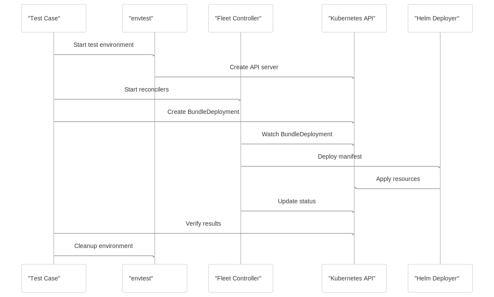
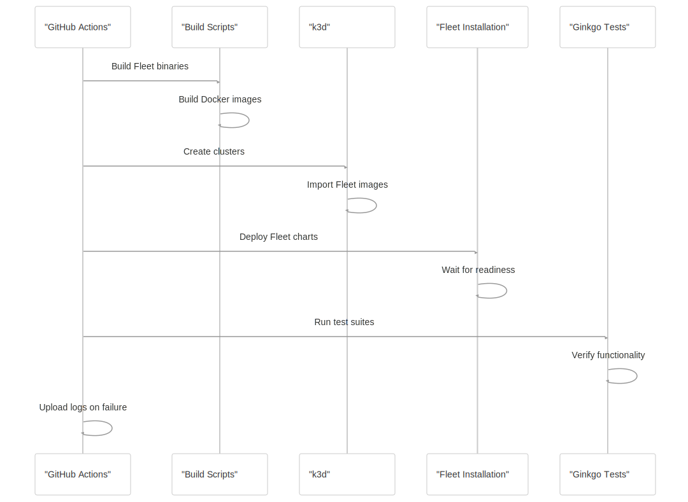
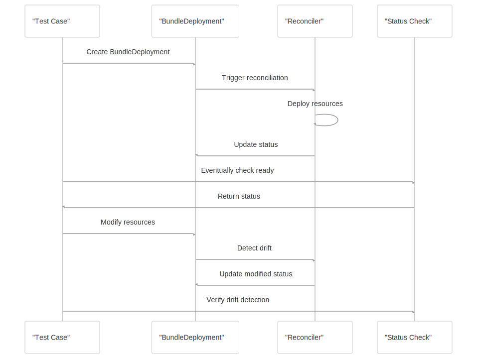
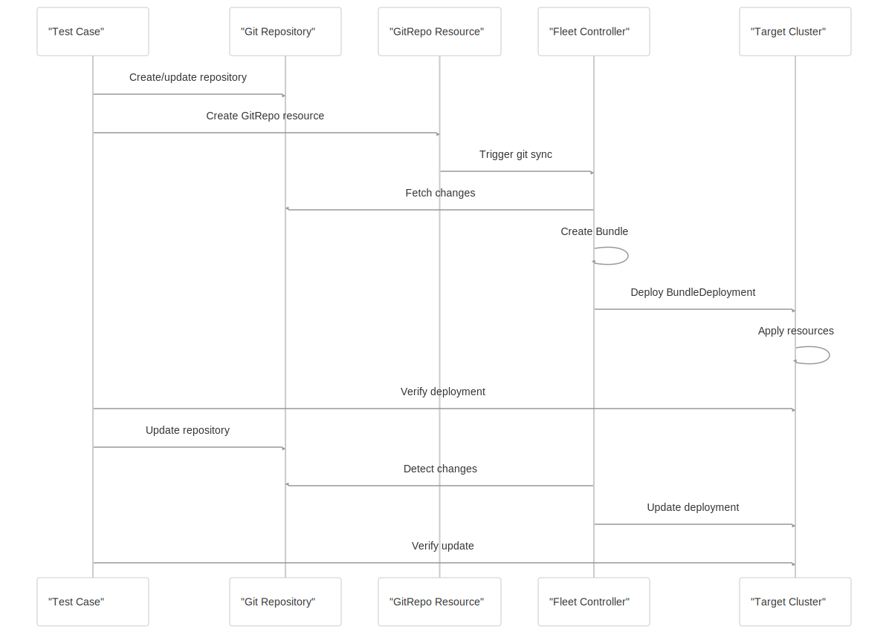

# Testing

[Index your code with Devin](/private-repo)

[DeepWiki](/)

[DeepWiki](/)

[rancher/fleet](https://github.com/rancher/fleet "Open repository")

[Index your code with

Devin](/private-repo)Edit WikiShare

Last indexed: 3 June 2025 ([01abaa](https://github.com/rancher/fleet/commits/01abaa07))

* [Overview](/rancher/fleet/1-overview)
* [Architecture](/rancher/fleet/2-architecture)
* [Core APIs and Custom Resources](/rancher/fleet/2.1-core-apis-and-custom-resources)
* [Controllers and Reconcilers](/rancher/fleet/2.2-controllers-and-reconcilers)
* [Agent System](/rancher/fleet/2.3-agent-system)
* [Core Components](/rancher/fleet/3-core-components)
* [GitOps System](/rancher/fleet/3.1-gitops-system)
* [Bundle Management](/rancher/fleet/3.2-bundle-management)
* [Cluster Management](/rancher/fleet/3.3-cluster-management)
* [CLI Tools](/rancher/fleet/3.4-cli-tools)
* [Deployment and Installation](/rancher/fleet/4-deployment-and-installation)
* [Helm Charts](/rancher/fleet/4.1-helm-charts)
* [Container Images](/rancher/fleet/4.2-container-images)
* [Configuration and Tuning](/rancher/fleet/4.3-configuration-and-tuning)
* [Development](/rancher/fleet/5-development)
* [Development Environment](/rancher/fleet/5.1-development-environment)
* [Testing](/rancher/fleet/5.2-testing)
* [CI/CD and Release Process](/rancher/fleet/5.3-cicd-and-release-process)
* [Operations and Troubleshooting](/rancher/fleet/6-operations-and-troubleshooting)
* [Troubleshooting and Support](/rancher/fleet/6.1-troubleshooting-and-support)
* [Git Webhooks and Integrations](/rancher/fleet/6.2-git-webhooks-and-integrations)

Menu

# Testing

Relevant source files

* [.github/workflows/check-changes.yml](https://github.com/rancher/fleet/blob/01abaa07/.github/workflows/check-changes.yml)
* [.github/workflows/ci.yml](https://github.com/rancher/fleet/blob/01abaa07/.github/workflows/ci.yml)
* [.github/workflows/e2e-ci.yml](https://github.com/rancher/fleet/blob/01abaa07/.github/workflows/e2e-ci.yml)
* [.github/workflows/e2e-fleet-upgrade-ci.yml](https://github.com/rancher/fleet/blob/01abaa07/.github/workflows/e2e-fleet-upgrade-ci.yml)
* [.github/workflows/e2e-multicluster-ci.yml](https://github.com/rancher/fleet/blob/01abaa07/.github/workflows/e2e-multicluster-ci.yml)
* [.github/workflows/e2e-nightly-ci.yml](https://github.com/rancher/fleet/blob/01abaa07/.github/workflows/e2e-nightly-ci.yml)
* [.github/workflows/e2e-rancher-upgrade-fleet-to-head-ci.yml](https://github.com/rancher/fleet/blob/01abaa07/.github/workflows/e2e-rancher-upgrade-fleet-to-head-ci.yml)
* [.github/workflows/e2e-rancher-upgrade-fleet.yml](https://github.com/rancher/fleet/blob/01abaa07/.github/workflows/e2e-rancher-upgrade-fleet.yml)
* [.github/workflows/e2e-test-fleet-in-rancher.yml](https://github.com/rancher/fleet/blob/01abaa07/.github/workflows/e2e-test-fleet-in-rancher.yml)
* [.github/workflows/golangci-lint.yml](https://github.com/rancher/fleet/blob/01abaa07/.github/workflows/golangci-lint.yml)
* [.github/workflows/release-against-charts.yml](https://github.com/rancher/fleet/blob/01abaa07/.github/workflows/release-against-charts.yml)
* [.github/workflows/release-against-rancher.yml](https://github.com/rancher/fleet/blob/01abaa07/.github/workflows/release-against-rancher.yml)
* [.github/workflows/release-against-test-charts.yml](https://github.com/rancher/fleet/blob/01abaa07/.github/workflows/release-against-test-charts.yml)
* [.github/workflows/release.yml](https://github.com/rancher/fleet/blob/01abaa07/.github/workflows/release.yml)
* [e2e/assets/gitrepo/gitrepo.yaml](https://github.com/rancher/fleet/blob/01abaa07/e2e/assets/gitrepo/gitrepo.yaml)
* [e2e/assets/single-cluster/test-oci.yaml](https://github.com/rancher/fleet/blob/01abaa07/e2e/assets/single-cluster/test-oci.yaml)
* [e2e/single-cluster/delete\_namespaces\_test.go](https://github.com/rancher/fleet/blob/01abaa07/e2e/single-cluster/delete_namespaces_test.go)
* [e2e/single-cluster/finalizers\_test.go](https://github.com/rancher/fleet/blob/01abaa07/e2e/single-cluster/finalizers_test.go)
* [e2e/single-cluster/gitrepo\_test.go](https://github.com/rancher/fleet/blob/01abaa07/e2e/single-cluster/gitrepo_test.go)
* [e2e/single-cluster/oci\_registry\_test.go](https://github.com/rancher/fleet/blob/01abaa07/e2e/single-cluster/oci_registry_test.go)
* [e2e/single-cluster/suite\_test.go](https://github.com/rancher/fleet/blob/01abaa07/e2e/single-cluster/suite_test.go)
* [e2e/testenv/k8sclient/k8sclient.go](https://github.com/rancher/fleet/blob/01abaa07/e2e/testenv/k8sclient/k8sclient.go)
* [integrationtests/agent/adoption\_test.go](https://github.com/rancher/fleet/blob/01abaa07/integrationtests/agent/adoption_test.go)
* [integrationtests/agent/assets/deployment-v1.yaml](https://github.com/rancher/fleet/blob/01abaa07/integrationtests/agent/assets/deployment-v1.yaml)
* [integrationtests/agent/bundle\_deployment\_diffs\_test.go](https://github.com/rancher/fleet/blob/01abaa07/integrationtests/agent/bundle_deployment_diffs_test.go)
* [integrationtests/agent/bundle\_deployment\_drift\_test.go](https://github.com/rancher/fleet/blob/01abaa07/integrationtests/agent/bundle_deployment_drift_test.go)
* [integrationtests/agent/bundle\_deployment\_status\_test.go](https://github.com/rancher/fleet/blob/01abaa07/integrationtests/agent/bundle_deployment_status_test.go)
* [integrationtests/agent/helm\_capabilities\_test.go](https://github.com/rancher/fleet/blob/01abaa07/integrationtests/agent/helm_capabilities_test.go)
* [integrationtests/agent/suite\_test.go](https://github.com/rancher/fleet/blob/01abaa07/integrationtests/agent/suite_test.go)
* [integrationtests/cli/assets/bundledeployment/bd-with-kube-version.yaml](https://github.com/rancher/fleet/blob/01abaa07/integrationtests/cli/assets/bundledeployment/bd-with-kube-version.yaml)
* [internal/cmd/agent/controller/drift\_controller.go](https://github.com/rancher/fleet/blob/01abaa07/internal/cmd/agent/controller/drift_controller.go)
* [internal/cmd/agent/deployer/deployer.go](https://github.com/rancher/fleet/blob/01abaa07/internal/cmd/agent/deployer/deployer.go)
* [internal/cmd/agent/deployer/deployer\_test.go](https://github.com/rancher/fleet/blob/01abaa07/internal/cmd/agent/deployer/deployer_test.go)
* [internal/cmd/agent/deployer/desiredset/diff.go](https://github.com/rancher/fleet/blob/01abaa07/internal/cmd/agent/deployer/desiredset/diff.go)
* [internal/cmd/agent/deployer/desiredset/diff\_test.go](https://github.com/rancher/fleet/blob/01abaa07/internal/cmd/agent/deployer/desiredset/diff_test.go)
* [internal/cmd/agent/deployer/driftdetect/driftdetect.go](https://github.com/rancher/fleet/blob/01abaa07/internal/cmd/agent/deployer/driftdetect/driftdetect.go)
* [internal/helmdeployer/capabilities.go](https://github.com/rancher/fleet/blob/01abaa07/internal/helmdeployer/capabilities.go)
* [internal/ocistorage/ociwrapper.go](https://github.com/rancher/fleet/blob/01abaa07/internal/ocistorage/ociwrapper.go)

This document outlines Fleet's comprehensive testing strategy, covering unit tests, integration tests, and end-to-end (E2E) testing. Fleet employs a multi-layered testing approach to ensure reliability across different deployment scenarios, from single-cluster to multi-cluster environments.

For information about the development environment setup, see [Development Environment](/rancher/fleet/5.1-development-environment). For details about the CI/CD and release processes, see [CI/CD and Release Process](/rancher/fleet/5.3-cicd-and-release-process).

## Testing Architecture Overview

Fleet's testing strategy is structured in three main layers, each serving different validation purposes and using different testing infrastructure.

Sources: [.github/workflows/ci.yml](https://github.com/rancher/fleet/blob/01abaa07/.github/workflows/ci.yml) [.github/workflows/e2e-ci.yml](https://github.com/rancher/fleet/blob/01abaa07/.github/workflows/e2e-ci.yml) [.github/workflows/e2e-multicluster-ci.yml](https://github.com/rancher/fleet/blob/01abaa07/.github/workflows/e2e-multicluster-ci.yml) [integrationtests/agent/suite\_test.go](https://github.com/rancher/fleet/blob/01abaa07/integrationtests/agent/suite_test.go) [e2e/single-cluster/suite\_test.go](https://github.com/rancher/fleet/blob/01abaa07/e2e/single-cluster/suite_test.go)

## Unit Testing

Unit tests in Fleet follow standard Go testing practices and focus on testing individual functions and components in isolation. These tests run quickly and provide fast feedback during development.

### Unit Test Execution

Unit tests are executed through the main CI workflow and exclude integration and E2E test packages:

The unit tests run with the `-shuffle=on` flag to catch order-dependent test failures and exclude specific directories containing integration and E2E tests.

Sources: [.github/workflows/ci.yml42-43](https://github.com/rancher/fleet/blob/01abaa07/.github/workflows/ci.yml#L42-L43)

## Integration Testing

Integration tests validate Fleet components working together using a controlled Kubernetes environment. These tests use `envtest` to provide a real Kubernetes API server without requiring a full cluster.

### Integration Test Architecture

The integration tests create a realistic Fleet agent environment with actual Kubernetes controllers and real Helm deployments.

Sources: [integrationtests/agent/suite\_test.go70-126](https://github.com/rancher/fleet/blob/01abaa07/integrationtests/agent/suite_test.go#L70-L126) [integrationtests/agent/suite\_test.go136-218](https://github.com/rancher/fleet/blob/01abaa07/integrationtests/agent/suite_test.go#L136-L218)

### Integration Test Suites

Fleet's integration tests are organized into focused test suites:

| Test Suite | Purpose | Key Components |
| --- | --- | --- |
| **Bundle Deployment Status** | Validates status reporting and resource tracking | `BundleDeploymentReconciler`, `Monitor` |
| **Drift Detection** | Tests automatic drift correction functionality | `DriftReconciler`, `DriftDetect` |
| **Bundle Deployment Diffs** | Validates diff-based resource comparison | `ComparePatch`, `DiffOptions` |
| **Helm Capabilities** | Tests Helm chart capabilities integration | `HelmDeployer`, `Capabilities` |
| **Resource Adoption** | Tests resource ownership and adoption scenarios | `Monitor`, `ObjectSet` |

Sources: [integrationtests/agent/bundle\_deployment\_status\_test.go](https://github.com/rancher/fleet/blob/01abaa07/integrationtests/agent/bundle_deployment_status_test.go) [integrationtests/agent/bundle\_deployment\_drift\_test.go](https://github.com/rancher/fleet/blob/01abaa07/integrationtests/agent/bundle_deployment_drift_test.go) [integrationtests/agent/bundle\_deployment\_diffs\_test.go](https://github.com/rancher/fleet/blob/01abaa07/integrationtests/agent/bundle_deployment_diffs_test.go) [integrationtests/agent/helm\_capabilities\_test.go](https://github.com/rancher/fleet/blob/01abaa07/integrationtests/agent/helm_capabilities_test.go) [integrationtests/agent/adoption\_test.go](https://github.com/rancher/fleet/blob/01abaa07/integrationtests/agent/adoption_test.go)

### Integration Test Execution Flow

Sources: [integrationtests/agent/suite\_test.go121-125](https://github.com/rancher/fleet/blob/01abaa07/integrationtests/agent/suite_test.go#L121-L125) [integrationtests/agent/bundle\_deployment\_status\_test.go66-95](https://github.com/rancher/fleet/blob/01abaa07/integrationtests/agent/bundle_deployment_status_test.go#L66-L95)

## End-to-End Testing

E2E tests validate Fleet's complete functionality in realistic environments using actual Kubernetes clusters, Git repositories, and external services.

### E2E Test Infrastructure

Sources: [.github/workflows/e2e-ci.yml87-114](https://github.com/rancher/fleet/blob/01abaa07/.github/workflows/e2e-ci.yml#L87-L114) [.github/workflows/e2e-multicluster-ci.yml87-112](https://github.com/rancher/fleet/blob/01abaa07/.github/workflows/e2e-multicluster-ci.yml#L87-L112) [e2e/single-cluster/gitrepo\_test.go](https://github.com/rancher/fleet/blob/01abaa07/e2e/single-cluster/gitrepo_test.go) [e2e/single-cluster/oci\_registry\_test.go](https://github.com/rancher/fleet/blob/01abaa07/e2e/single-cluster/oci_registry_test.go)

### E2E Test Categories

Fleet runs different categories of E2E tests based on the testing scenario:

| Test Category | Environment | Key Features Tested |
| --- | --- | --- |
| **Default Tests** | Single k3s cluster | Core GitOps functionality, basic deployments |
| **Sharding Tests** | Sharded Fleet setup | Controller sharding, metrics collection |
| **Infra Tests** | Git/OCI/Helm servers | External integrations, authentication |
| **Multi-Cluster Tests** | Multiple k3s clusters | Cluster registration, cross-cluster deployments |
| **Secrets Tests** | Real Git providers | SSH keys, private repositories, OCI authentication |

Sources: [.github/workflows/e2e-ci.yml29-34](https://github.com/rancher/fleet/blob/01abaa07/.github/workflows/e2e-ci.yml#L29-L34) [.github/workflows/e2e-multicluster-ci.yml220-248](https://github.com/rancher/fleet/blob/01abaa07/.github/workflows/e2e-multicluster-ci.yml#L220-L248)

### E2E Test Setup Process

Sources: [.github/workflows/e2e-ci.yml87-135](https://github.com/rancher/fleet/blob/01abaa07/.github/workflows/e2e-ci.yml#L87-L135) [.github/scripts/build-fleet-binaries.sh](https://github.com/rancher/fleet/blob/01abaa07/.github/scripts/build-fleet-binaries.sh) [.github/scripts/build-fleet-images.sh](https://github.com/rancher/fleet/blob/01abaa07/.github/scripts/build-fleet-images.sh) [.github/scripts/deploy-fleet.sh](https://github.com/rancher/fleet/blob/01abaa07/.github/scripts/deploy-fleet.sh)

## CI/CD Testing Workflows

Fleet uses multiple GitHub Actions workflows to ensure comprehensive testing across different scenarios and environments.

### Testing Workflow Matrix

### Workflow Execution Strategy

Each workflow targets specific testing scenarios:

| Workflow | Trigger | Purpose | Duration |
| --- | --- | --- | --- |
| `ci.yml` | Every PR/Push | Fast feedback loop | ~10 minutes |
| `e2e-ci.yml` | Every PR/Push | Core E2E validation | ~30 minutes |
| `e2e-multicluster-ci.yml` | Daily/PR/Push | Multi-cluster scenarios | ~45 minutes |
| `e2e-nightly-ci.yml` | Daily 7:00 AM | Extended test coverage | ~60 minutes |
| `golangci-lint.yml` | Daily 5:00 AM/PR | Code quality | ~5 minutes |

Sources: [.github/workflows/ci.yml3-10](https://github.com/rancher/fleet/blob/01abaa07/.github/workflows/ci.yml#L3-L10) [.github/workflows/e2e-ci.yml4-9](https://github.com/rancher/fleet/blob/01abaa07/.github/workflows/e2e-ci.yml#L4-L9) [.github/workflows/e2e-multicluster-ci.yml4-10](https://github.com/rancher/fleet/blob/01abaa07/.github/workflows/e2e-multicluster-ci.yml#L4-L10) [.github/workflows/e2e-nightly-ci.yml5-7](https://github.com/rancher/fleet/blob/01abaa07/.github/workflows/e2e-nightly-ci.yml#L5-L7) [.github/workflows/golangci-lint.yml4-6](https://github.com/rancher/fleet/blob/01abaa07/.github/workflows/golangci-lint.yml#L4-L6)

## Testing Tools and Infrastructure

Fleet leverages several testing frameworks and tools to provide comprehensive test coverage.

### Core Testing Stack

| Tool | Purpose | Usage |
| --- | --- | --- |
| **Ginkgo** | BDD testing framework | E2E and integration test structure |
| **Gomega** | Assertion library | Test expectations and matchers |
| **envtest** | Kubernetes API testing | Integration test Kubernetes environment |
| **k3d** | Lightweight Kubernetes | E2E test clusters |
| **controller-runtime** | Kubernetes controller testing | Controller and client testing |

### Test Infrastructure Components

Sources: [integrationtests/agent/suite\_test.go10-11](https://github.com/rancher/fleet/blob/01abaa07/integrationtests/agent/suite_test.go#L10-L11) [e2e/single-cluster/suite\_test.go8-9](https://github.com/rancher/fleet/blob/01abaa07/e2e/single-cluster/suite_test.go#L8-L9) [e2e/testenv/kubectl/kubectl.go](https://github.com/rancher/fleet/blob/01abaa07/e2e/testenv/kubectl/kubectl.go) [e2e/testenv/githelper/](https://github.com/rancher/fleet/blob/01abaa07/e2e/testenv/githelper/)

### Test Data and Asset Management

Fleet organizes test data and assets to support different testing scenarios:

* **Integration Test Assets**: Located in `integrationtests/agent/assets/` containing YAML manifests for test scenarios
* **E2E Test Assets**: Located in `e2e/assets/` containing GitRepo templates, charts, and configuration files
* **External Test Repository**: Uses `https://github.com/rancher/fleet-test-data` for E2E scenarios requiring real Git repositories

Sources: [integrationtests/agent/suite\_test.go337-414](https://github.com/rancher/fleet/blob/01abaa07/integrationtests/agent/suite_test.go#L337-L414) [e2e/assets/gitrepo/gitrepo.yaml](https://github.com/rancher/fleet/blob/01abaa07/e2e/assets/gitrepo/gitrepo.yaml) [e2e/assets/single-cluster/test-oci.yaml](https://github.com/rancher/fleet/blob/01abaa07/e2e/assets/single-cluster/test-oci.yaml)

## Test Execution Patterns

Fleet employs consistent testing patterns across different test levels to ensure reliability and maintainability.

### Integration Test Pattern

### E2E Test Pattern

Sources: [integrationtests/agent/bundle\_deployment\_status\_test.go66-95](https://github.com/rancher/fleet/blob/01abaa07/integrationtests/agent/bundle_deployment_status_test.go#L66-L95) [e2e/single-cluster/gitrepo\_test.go122-147](https://github.com/rancher/fleet/blob/01abaa07/e2e/single-cluster/gitrepo_test.go#L122-L147)

Dismiss

Refresh this wiki

Enter email to refresh

### On this page

* [Testing](#testing)
* [Testing Architecture Overview](#testing-architecture-overview)
* [Unit Testing](#unit-testing)
* [Unit Test Execution](#unit-test-execution)
* [Integration Testing](#integration-testing)
* [Integration Test Architecture](#integration-test-architecture)
* [Integration Test Suites](#integration-test-suites)
* [Integration Test Execution Flow](#integration-test-execution-flow)
* [End-to-End Testing](#end-to-end-testing)
* [E2E Test Infrastructure](#e2e-test-infrastructure)
* [E2E Test Categories](#e2e-test-categories)
* [E2E Test Setup Process](#e2e-test-setup-process)
* [CI/CD Testing Workflows](#cicd-testing-workflows)
* [Testing Workflow Matrix](#testing-workflow-matrix)
* [Workflow Execution Strategy](#workflow-execution-strategy)
* [Testing Tools and Infrastructure](#testing-tools-and-infrastructure)
* [Core Testing Stack](#core-testing-stack)
* [Test Infrastructure Components](#test-infrastructure-components)
* [Test Data and Asset Management](#test-data-and-asset-management)
* [Test Execution Patterns](#test-execution-patterns)
* [Integration Test Pattern](#integration-test-pattern)
* [E2E Test Pattern](#e2e-test-pattern)

Ask Devin about rancher/fleet

Fast