# CI/CD and Release Process

[Index your code with Devin](/private-repo)

[DeepWiki](/)

[DeepWiki](/)

[rancher/fleet](https://github.com/rancher/fleet "Open repository")

[Index your code with

Devin](/private-repo)Edit WikiShare

Last indexed: 3 June 2025 ([01abaa](https://github.com/rancher/fleet/commits/01abaa07))

* [Overview](/rancher/fleet/1-overview)
* [Architecture](/rancher/fleet/2-architecture)
* [Core APIs and Custom Resources](/rancher/fleet/2.1-core-apis-and-custom-resources)
* [Controllers and Reconcilers](/rancher/fleet/2.2-controllers-and-reconcilers)
* [Agent System](/rancher/fleet/2.3-agent-system)
* [Core Components](/rancher/fleet/3-core-components)
* [GitOps System](/rancher/fleet/3.1-gitops-system)
* [Bundle Management](/rancher/fleet/3.2-bundle-management)
* [Cluster Management](/rancher/fleet/3.3-cluster-management)
* [CLI Tools](/rancher/fleet/3.4-cli-tools)
* [Deployment and Installation](/rancher/fleet/4-deployment-and-installation)
* [Helm Charts](/rancher/fleet/4.1-helm-charts)
* [Container Images](/rancher/fleet/4.2-container-images)
* [Configuration and Tuning](/rancher/fleet/4.3-configuration-and-tuning)
* [Development](/rancher/fleet/5-development)
* [Development Environment](/rancher/fleet/5.1-development-environment)
* [Testing](/rancher/fleet/5.2-testing)
* [CI/CD and Release Process](/rancher/fleet/5.3-cicd-and-release-process)
* [Operations and Troubleshooting](/rancher/fleet/6-operations-and-troubleshooting)
* [Troubleshooting and Support](/rancher/fleet/6.1-troubleshooting-and-support)
* [Git Webhooks and Integrations](/rancher/fleet/6.2-git-webhooks-and-integrations)

Menu

# CI/CD and Release Process

Relevant source files

* [.github/scripts/release-against-charts.sh](https://github.com/rancher/fleet/blob/01abaa07/.github/scripts/release-against-charts.sh)
* [.github/scripts/release-against-rancher.sh](https://github.com/rancher/fleet/blob/01abaa07/.github/scripts/release-against-rancher.sh)
* [.github/workflows/check-changes.yml](https://github.com/rancher/fleet/blob/01abaa07/.github/workflows/check-changes.yml)
* [.github/workflows/ci.yml](https://github.com/rancher/fleet/blob/01abaa07/.github/workflows/ci.yml)
* [.github/workflows/e2e-ci.yml](https://github.com/rancher/fleet/blob/01abaa07/.github/workflows/e2e-ci.yml)
* [.github/workflows/e2e-fleet-upgrade-ci.yml](https://github.com/rancher/fleet/blob/01abaa07/.github/workflows/e2e-fleet-upgrade-ci.yml)
* [.github/workflows/e2e-multicluster-ci.yml](https://github.com/rancher/fleet/blob/01abaa07/.github/workflows/e2e-multicluster-ci.yml)
* [.github/workflows/e2e-nightly-ci.yml](https://github.com/rancher/fleet/blob/01abaa07/.github/workflows/e2e-nightly-ci.yml)
* [.github/workflows/e2e-rancher-upgrade-fleet-to-head-ci.yml](https://github.com/rancher/fleet/blob/01abaa07/.github/workflows/e2e-rancher-upgrade-fleet-to-head-ci.yml)
* [.github/workflows/e2e-rancher-upgrade-fleet.yml](https://github.com/rancher/fleet/blob/01abaa07/.github/workflows/e2e-rancher-upgrade-fleet.yml)
* [.github/workflows/e2e-test-fleet-in-rancher.yml](https://github.com/rancher/fleet/blob/01abaa07/.github/workflows/e2e-test-fleet-in-rancher.yml)
* [.github/workflows/golangci-lint.yml](https://github.com/rancher/fleet/blob/01abaa07/.github/workflows/golangci-lint.yml)
* [.github/workflows/release-against-charts.yml](https://github.com/rancher/fleet/blob/01abaa07/.github/workflows/release-against-charts.yml)
* [.github/workflows/release-against-rancher.yml](https://github.com/rancher/fleet/blob/01abaa07/.github/workflows/release-against-rancher.yml)
* [.github/workflows/release-against-test-charts.yml](https://github.com/rancher/fleet/blob/01abaa07/.github/workflows/release-against-test-charts.yml)
* [.github/workflows/release.yml](https://github.com/rancher/fleet/blob/01abaa07/.github/workflows/release.yml)
* [.goreleaser.yaml](https://github.com/rancher/fleet/blob/01abaa07/.goreleaser.yaml)
* [benchmarks/assets/create-bundle/bundles.tmpl.yaml](https://github.com/rancher/fleet/blob/01abaa07/benchmarks/assets/create-bundle/bundles.tmpl.yaml)
* [benchmarks/assets/create-bundledeployment-500-resources/bundles.tmpl.yaml](https://github.com/rancher/fleet/blob/01abaa07/benchmarks/assets/create-bundledeployment-500-resources/bundles.tmpl.yaml)
* [benchmarks/cmd/csv.go](https://github.com/rancher/fleet/blob/01abaa07/benchmarks/cmd/csv.go)
* [benchmarks/cmd/json.go](https://github.com/rancher/fleet/blob/01abaa07/benchmarks/cmd/json.go)

This document describes Fleet's continuous integration, testing workflows, and release automation processes. It covers the GitHub Actions workflows that handle testing, building, and releasing Fleet components including Docker images, Helm charts, and binaries.

For information about setting up a local development environment, see [Development Environment](/rancher/fleet/5.1-development-environment). For details on Fleet's testing strategy and test execution, see [Testing](/rancher/fleet/5.2-testing).

## Overview

Fleet uses GitHub Actions for all CI/CD operations, with workflows organized around different testing phases and release targets. The system supports both standalone Fleet releases and integration with Rancher through automated chart updates.

### CI/CD Architecture



Sources: [.github/workflows/ci.yml1-88](https://github.com/rancher/fleet/blob/01abaa07/.github/workflows/ci.yml#L1-L88) [.github/workflows/e2e-ci.yml1-204](https://github.com/rancher/fleet/blob/01abaa07/.github/workflows/e2e-ci.yml#L1-L204) [.github/workflows/golangci-lint.yml1-43](https://github.com/rancher/fleet/blob/01abaa07/.github/workflows/golangci-lint.yml#L1-L43) [.github/workflows/release.yml1-239](https://github.com/rancher/fleet/blob/01abaa07/.github/workflows/release.yml#L1-L239) [.github/workflows/check-changes.yml1-34](https://github.com/rancher/fleet/blob/01abaa07/.github/workflows/check-changes.yml#L1-L34)

## Testing Workflows

Fleet employs a comprehensive testing strategy with multiple workflow types that run at different stages and frequencies.

### Core Testing Pipeline



Sources: [.github/workflows/ci.yml16-88](https://github.com/rancher/fleet/blob/01abaa07/.github/workflows/ci.yml#L16-L88) [.github/workflows/e2e-ci.yml15-204](https://github.com/rancher/fleet/blob/01abaa07/.github/workflows/e2e-ci.yml#L15-L204) [.github/workflows/e2e-multicluster-ci.yml17-265](https://github.com/rancher/fleet/blob/01abaa07/.github/workflows/e2e-multicluster-ci.yml#L17-L265) [.github/workflows/e2e-nightly-ci.yml14-188](https://github.com/rancher/fleet/blob/01abaa07/.github/workflows/e2e-nightly-ci.yml#L14-L188)

### Test Execution Framework

Fleet's E2E tests use a standardized execution pattern across all workflows:

| Component | Implementation | Purpose |
| --- | --- | --- |
| **Test Runner** | `ginkgo` CLI | BDD-style test execution with labels |
| **Cluster Provisioning** | `k3d` with k3s versions | Lightweight Kubernetes clusters |
| **Build System** | `.github/scripts/build-fleet-*.sh` | Binary and image creation |
| **Test Infrastructure** | `e2e/testenv/infra` | Git servers, OCI registries, Helm repos |
| **Log Collection** | `crust-gather` | Cluster state capture on failures |

The test matrix includes multiple Kubernetes versions and test scenarios:



Sources: [.github/workflows/e2e-ci.yml19-34](https://github.com/rancher/fleet/blob/01abaa07/.github/workflows/e2e-ci.yml#L19-L34) [.github/workflows/e2e-ci.yml122-178](https://github.com/rancher/fleet/blob/01abaa07/.github/workflows/e2e-ci.yml#L122-L178) [.github/workflows/e2e-nightly-ci.yml19-29](https://github.com/rancher/fleet/blob/01abaa07/.github/workflows/e2e-nightly-ci.yml#L19-L29)

## Release Workflows

Fleet's release process is managed through GoReleaser and produces multiple artifacts for different deployment scenarios.

### Release Artifact Generation


Sources: [.goreleaser.yaml47-102](https://github.com/rancher/fleet/blob/01abaa07/.goreleaser.yaml#L47-L102) [.goreleaser.yaml107-321](https://github.com/rancher/fleet/blob/01abaa07/.goreleaser.yaml#L107-L321) [.github/workflows/release.yml175-199](https://github.com/rancher/fleet/blob/01abaa07/.github/workflows/release.yml#L175-L199)

### Security and Provenance

Fleet implements comprehensive security measures in the release process:

| Security Feature | Implementation | Location |
| --- | --- | --- |
| **Container Signing** | Cosign with GitHub OIDC | [.goreleaser.yaml353-396](https://github.com/rancher/fleet/blob/01abaa07/.goreleaser.yaml#L353-L396) |
| **SLSA Provenance** | slsactl attestation | [.github/workflows/release.yml151-174](https://github.com/rancher/fleet/blob/01abaa07/.github/workflows/release.yml#L151-L174) |
| **SBOM Generation** | Docker buildx --sbom | [.goreleaser.yaml245-247](https://github.com/rancher/fleet/blob/01abaa07/.goreleaser.yaml#L245-L247) |
| **Multi-registry Push** | Staging + Production | [.goreleaser.yaml211-321](https://github.com/rancher/fleet/blob/01abaa07/.goreleaser.yaml#L211-L321) |
| **License Scanning** | FOSSA integration | [.github/workflows/release.yml45-55](https://github.com/rancher/fleet/blob/01abaa07/.github/workflows/release.yml#L45-L55) |

## Integration Workflows

Fleet maintains automated integration with the broader Rancher ecosystem through dedicated release workflows.

### Rancher Integration Process



Sources: [.github/workflows/release-against-charts.yml30-64](https://github.com/rancher/fleet/blob/01abaa07/.github/workflows/release-against-charts.yml#L30-L64) [.github/workflows/release-against-rancher.yml32-60](https://github.com/rancher/fleet/blob/01abaa07/.github/workflows/release-against-rancher.yml#L32-L60) [.github/workflows/release-against-test-charts.yml25-179](https://github.com/rancher/fleet/blob/01abaa07/.github/workflows/release-against-test-charts.yml#L25-L179)

### Chart Release Automation

The chart release process handles different Rancher versions and maintains backward compatibility:

```
# Chart update process from release-against-charts.sh
if [ -f packages/fleet/package.yaml ]; then
    # New auto bump scripting for Rancher 2.10+
    make chart-bump package=fleet branch="$(git rev-parse --abbrev-ref HEAD)"
else
    # Legacy implementation for Rancher < 2.10
    find ./packages/fleet/ -type f -exec sed -i -e "s/${PREV_FLEET_VERSION}/${NEW_FLEET_VERSION}/g" {} \;
    yq --inplace ".${i} += [\"${NEW_CHART_VERSION}+up${NEW_FLEET_VERSION}\"]" release.yaml
fi
```

Sources: [.github/scripts/release-against-charts.sh22-76](https://github.com/rancher/fleet/blob/01abaa07/.github/scripts/release-against-charts.sh#L22-L76)

## Development Testing

Fleet provides specialized workflows for development and testing scenarios beyond the standard CI pipeline.

### Upgrade Testing Matrix



Sources: [.github/workflows/e2e-fleet-upgrade-ci.yml14-129](https://github.com/rancher/fleet/blob/01abaa07/.github/workflows/e2e-fleet-upgrade-ci.yml#L14-L129) [.github/workflows/e2e-rancher-upgrade-fleet-to-head-ci.yml25-218](https://github.com/rancher/fleet/blob/01abaa07/.github/workflows/e2e-rancher-upgrade-fleet-to-head-ci.yml#L25-L218) [.github/workflows/e2e-rancher-upgrade-fleet.yml43-223](https://github.com/rancher/fleet/blob/01abaa07/.github/workflows/e2e-rancher-upgrade-fleet.yml#L43-L223)

### Quality Gates

Fleet enforces code quality through automated checks that must pass before merge:

| Check Type | Workflow | Implementation | Failure Action |
| --- | --- | --- | --- |
| **Go Module** | `check-changes.yml` | `.github/scripts/check-for-go-mod-changes.sh` | Block merge |
| **Generated Code** | `check-changes.yml` | `.github/scripts/check-for-auto-generated-changes.sh` | Block merge |
| **Linting** | `golangci-lint.yml` | `golangci-lint` with `.golangci.json` | Block merge |
| **Unit Tests** | `ci.yml` | `go test` with coverage | Block merge |
| **Chart Validation** | `ci.yml` | `helm-unittest` + `chart-testing` | Block merge |

Sources: [.github/workflows/check-changes.yml12-34](https://github.com/rancher/fleet/blob/01abaa07/.github/workflows/check-changes.yml#L12-L34) [.github/workflows/golangci-lint.yml9-43](https://github.com/rancher/fleet/blob/01abaa07/.github/workflows/golangci-lint.yml#L9-L43) [.github/workflows/ci.yml16-44](https://github.com/rancher/fleet/blob/01abaa07/.github/workflows/ci.yml#L16-L44)

Dismiss

Refresh this wiki

Enter email to refresh

### On this page

* [CI/CD and Release Process](#cicd-and-release-process)
* [Overview](#overview)
* [CI/CD Architecture](#cicd-architecture)
* [Testing Workflows](#testing-workflows)
* [Core Testing Pipeline](#core-testing-pipeline)
* [Test Execution Framework](#test-execution-framework)
* [Release Workflows](#release-workflows)
* [Release Artifact Generation](#release-artifact-generation)
* [Security and Provenance](#security-and-provenance)
* [Integration Workflows](#integration-workflows)
* [Rancher Integration Process](#rancher-integration-process)
* [Chart Release Automation](#chart-release-automation)
* [Development Testing](#development-testing)
* [Upgrade Testing Matrix](#upgrade-testing-matrix)
* [Quality Gates](#quality-gates)

Ask Devin about rancher/fleet

Fast