# Operations and Troubleshooting

[Index your code with Devin](/private-repo)

[DeepWiki](/)

[DeepWiki](/)

[rancher/fleet](https://github.com/rancher/fleet "Open repository")

[Index your code with

Devin](/private-repo)Edit WikiShare

Last indexed: 3 June 2025 ([01abaa](https://github.com/rancher/fleet/commits/01abaa07))

* [Overview](/rancher/fleet/1-overview)
* [Architecture](/rancher/fleet/2-architecture)
* [Core APIs and Custom Resources](/rancher/fleet/2.1-core-apis-and-custom-resources)
* [Controllers and Reconcilers](/rancher/fleet/2.2-controllers-and-reconcilers)
* [Agent System](/rancher/fleet/2.3-agent-system)
* [Core Components](/rancher/fleet/3-core-components)
* [GitOps System](/rancher/fleet/3.1-gitops-system)
* [Bundle Management](/rancher/fleet/3.2-bundle-management)
* [Cluster Management](/rancher/fleet/3.3-cluster-management)
* [CLI Tools](/rancher/fleet/3.4-cli-tools)
* [Deployment and Installation](/rancher/fleet/4-deployment-and-installation)
* [Helm Charts](/rancher/fleet/4.1-helm-charts)
* [Container Images](/rancher/fleet/4.2-container-images)
* [Configuration and Tuning](/rancher/fleet/4.3-configuration-and-tuning)
* [Development](/rancher/fleet/5-development)
* [Development Environment](/rancher/fleet/5.1-development-environment)
* [Testing](/rancher/fleet/5.2-testing)
* [CI/CD and Release Process](/rancher/fleet/5.3-cicd-and-release-process)
* [Operations and Troubleshooting](/rancher/fleet/6-operations-and-troubleshooting)
* [Troubleshooting and Support](/rancher/fleet/6.1-troubleshooting-and-support)
* [Git Webhooks and Integrations](/rancher/fleet/6.2-git-webhooks-and-integrations)

Menu

# Operations and Troubleshooting

Relevant source files

* [.github/ISSUE\_TEMPLATE/1-bug-report.yml](https://github.com/rancher/fleet/blob/01abaa07/.github/ISSUE_TEMPLATE/1-bug-report.yml)
* [.github/ISSUE\_TEMPLATE/2-feature-request.yml](https://github.com/rancher/fleet/blob/01abaa07/.github/ISSUE_TEMPLATE/2-feature-request.yml)
* [.github/ISSUE\_TEMPLATE/config.yml](https://github.com/rancher/fleet/blob/01abaa07/.github/ISSUE_TEMPLATE/config.yml)
* [.github/workflows/port-issue.yml](https://github.com/rancher/fleet/blob/01abaa07/.github/workflows/port-issue.yml)
* [pkg/durations/durations.go](https://github.com/rancher/fleet/blob/01abaa07/pkg/durations/durations.go)
* [pkg/webhook/parser.go](https://github.com/rancher/fleet/blob/01abaa07/pkg/webhook/parser.go)
* [pkg/webhook/parser\_test.go](https://github.com/rancher/fleet/blob/01abaa07/pkg/webhook/parser_test.go)
* [pkg/webhook/webhook.go](https://github.com/rancher/fleet/blob/01abaa07/pkg/webhook/webhook.go)
* [pkg/webhook/webhook\_test.go](https://github.com/rancher/fleet/blob/01abaa07/pkg/webhook/webhook_test.go)

This document provides operational guidance for running Fleet in production environments, including monitoring, performance tuning, debugging techniques, and troubleshooting common issues. It covers the operational aspects of Fleet's core components and their interactions.

For detailed troubleshooting procedures and support resources, see [Troubleshooting and Support](/rancher/fleet/6.1-troubleshooting-and-support). For specific webhook configuration and Git provider integrations, see [Git Webhooks and Integrations](/rancher/fleet/6.2-git-webhooks-and-integrations).

## Monitoring Fleet Components

Fleet's architecture consists of several key components that require monitoring in production environments. Understanding the health and status of these components is essential for operational success.



**Key Monitoring Points:**

| Component | Key Metrics | Status Fields |
| --- | --- | --- |
| Fleet Controller | Pod health, reconciliation rate | `GitRepo.Status`, `Bundle.Status` |
| GitJob Controller | Git sync frequency, errors | `GitRepo.Status.Conditions` |
| Fleet Agent | Pod health, deployment rate | `BundleDeployment.Status` |
| Webhook Server | HTTP response codes, payload processing | `GitRepo.Status.WebhookCommit` |

Sources: [pkg/webhook/webhook.go44-48](https://github.com/rancher/fleet/blob/01abaa07/pkg/webhook/webhook.go#L44-L48) [pkg/durations/durations.go9-40](https://github.com/rancher/fleet/blob/01abaa07/pkg/durations/durations.go#L9-L40)

## Performance and Timing Configuration

Fleet uses configurable timing constants to control various operational behaviors. These can be tuned based on your environment's requirements and scale.



**Critical Timing Parameters:**

* `DefaultResyncAgent` (30m): How often agents reconcile with the management cluster
* `DefaultClusterCheckInterval` (15m): Frequency of cluster health checks
* `GarbageCollect` (15m): Cleanup interval for obsolete resources
* `FailureRateLimiterMax` (60s): Maximum backoff for failed reconciliations

Sources: [pkg/durations/durations.go10-40](https://github.com/rancher/fleet/blob/01abaa07/pkg/durations/durations.go#L10-L40)

## Webhook Operations

Fleet's webhook system enables real-time Git synchronization by receiving notifications from Git providers. Proper webhook configuration is critical for responsive GitOps operations.



**Webhook Error Handling:**

Fleet returns specific HTTP status codes for different webhook scenarios:

* `200 OK`: Successful webhook processing
* `401 Unauthorized`: HMAC verification failed, invalid tokens
* `405 Method Not Allowed`: Invalid HTTP method
* `500 Internal Server Error`: Processing errors, missing secrets

Sources: [pkg/webhook/webhook.go60-185](https://github.com/rancher/fleet/blob/01abaa07/pkg/webhook/webhook.go#L60-L185) [pkg/webhook/webhook.go230-255](https://github.com/rancher/fleet/blob/01abaa07/pkg/webhook/webhook.go#L230-L255) [pkg/webhook/parser.go26-44](https://github.com/rancher/fleet/blob/01abaa07/pkg/webhook/parser.go#L26-L44)

## Status Monitoring and Diagnostics

Fleet provides comprehensive status information through Kubernetes custom resource status fields. Monitoring these fields is essential for operational visibility.



**Essential Diagnostic Commands:**

```
# Check GitRepo status across all namespaces
kubectl get gitrepo -A -o jsonpath='{.items[*].status}'

# Monitor Bundle deployment status
kubectl get bundle -A -o jsonpath='{.items[*].status.summary}'

# Check cluster agent connectivity
kubectl get cluster -A -o jsonpath='{.items[*].status.agentStatus}'

# View controller logs
kubectl logs -n cattle-fleet-system deployment/fleet-controller
```

Sources: [.github/ISSUE\_TEMPLATE/1-bug-report.yml58-80](https://github.com/rancher/fleet/blob/01abaa07/.github/ISSUE_TEMPLATE/1-bug-report.yml#L58-L80)

## Common Operational Issues

### Git Synchronization Problems

**Symptoms:**

* `GitRepo.Status.Conditions` showing sync failures
* Stale `GitRepo.Status.Revision` values
* Webhook commits not updating

**Diagnostic Steps:**

1. Check GitJob controller logs for Git access issues
2. Verify Git repository accessibility and credentials
3. Validate webhook configuration and secrets
4. Review `GitRepo.Status.WebhookCommit` vs actual repository state

### Bundle Deployment Failures

**Symptoms:**

* `BundleDeployment.Status.Conditions` showing deployment errors
* Resources not appearing in target clusters
* Drift detection triggering unexpectedly

**Diagnostic Steps:**

1. Examine `BundleDeployment.Status.Resources` for specific failure details
2. Check Fleet Agent logs in target clusters
3. Verify RBAC permissions for deployed resources
4. Review Helm deployment status if using Helm charts

### Agent Connectivity Issues

**Symptoms:**

* `Cluster.Status.AgentLastSeen` timestamps are stale
* `Cluster.Status.AgentStatus` showing disconnected
* BundleDeployments not progressing

**Diagnostic Steps:**

1. Check network connectivity between management and managed clusters
2. Verify cluster registration tokens and agent deployment
3. Review agent pod logs for authentication errors
4. Validate cluster registration configuration

Sources: [pkg/durations/durations.go32-40](https://github.com/rancher/fleet/blob/01abaa07/pkg/durations/durations.go#L32-L40) [pkg/webhook/webhook.go132-180](https://github.com/rancher/fleet/blob/01abaa07/pkg/webhook/webhook.go#L132-L180)

## Rate Limiting and Backoff Strategies

Fleet implements sophisticated rate limiting to handle failures gracefully and prevent overwhelming cluster resources.


**Rate Limiting Configuration:**

* Fast controllers (Cluster, GitRepo): 5ms base, 60s max backoff
* Slow controllers (Bundle, BundleDeployment): 2s base, 10m max backoff
* Coordination delays: 5s for status updates to prevent race conditions

Sources: [pkg/durations/durations.go21-40](https://github.com/rancher/fleet/blob/01abaa07/pkg/durations/durations.go#L21-L40)

## Security and Authentication Monitoring

Fleet webhook security relies on proper secret configuration and signature validation. Monitor these aspects for security compliance.

**Webhook Security Validation:**

| Provider | Authentication Method | Secret Keys |
| --- | --- | --- |
| GitHub | HMAC SHA-256 | `github` |
| GitLab | Token validation | `gitlab` |
| Bitbucket | UUID verification | `bitbucket` |
| Bitbucket Server | HMAC SHA-256 | `bitbucket-server` |
| Azure DevOps | Basic Auth | `azure-username`, `azure-password` |
| Gogs | HMAC SHA-256 | `gogs` |

**Security Monitoring Points:**

* HTTP 401 responses indicating authentication failures
* Missing webhook secrets in target namespaces
* Malformed or invalid webhook signatures
* Unexpected webhook payloads or headers

Sources: [pkg/webhook/parser.go16-24](https://github.com/rancher/fleet/blob/01abaa07/pkg/webhook/parser.go#L16-L24) [pkg/webhook/webhook.go205-228](https://github.com/rancher/fleet/blob/01abaa07/pkg/webhook/webhook.go#L205-L228) [pkg/webhook/webhook.go230-255](https://github.com/rancher/fleet/blob/01abaa07/pkg/webhook/webhook.go#L230-L255)

Dismiss

Refresh this wiki

Enter email to refresh

### On this page

* [Operations and Troubleshooting](#operations-and-troubleshooting)
* [Monitoring Fleet Components](#monitoring-fleet-components)
* [Performance and Timing Configuration](#performance-and-timing-configuration)
* [Webhook Operations](#webhook-operations)
* [Status Monitoring and Diagnostics](#status-monitoring-and-diagnostics)
* [Common Operational Issues](#common-operational-issues)
* [Git Synchronization Problems](#git-synchronization-problems)
* [Bundle Deployment Failures](#bundle-deployment-failures)
* [Agent Connectivity Issues](#agent-connectivity-issues)
* [Rate Limiting and Backoff Strategies](#rate-limiting-and-backoff-strategies)
* [Security and Authentication Monitoring](#security-and-authentication-monitoring)

Ask Devin about rancher/fleet

Fast