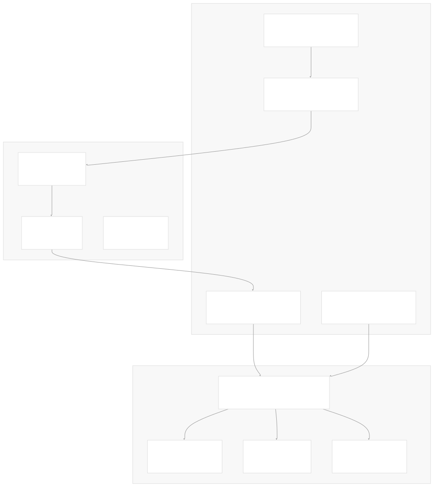
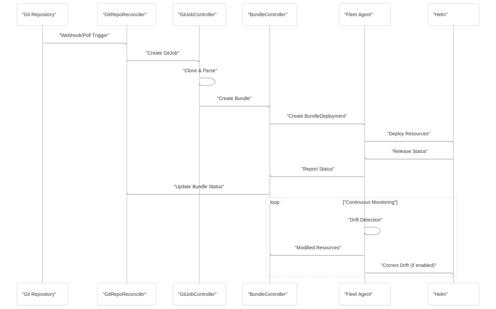

# Architecture

[Index your code with Devin](/private-repo)

[DeepWiki](/)

[DeepWiki](/)

[rancher/fleet](https://github.com/rancher/fleet "Open repository")

[Index your code with

Devin](/private-repo)Edit WikiShare

Last indexed: 3 June 2025 ([01abaa](https://github.com/rancher/fleet/commits/01abaa07))

* [Overview](/rancher/fleet/1-overview)
* [Architecture](/rancher/fleet/2-architecture)
* [Core APIs and Custom Resources](/rancher/fleet/2.1-core-apis-and-custom-resources)
* [Controllers and Reconcilers](/rancher/fleet/2.2-controllers-and-reconcilers)
* [Agent System](/rancher/fleet/2.3-agent-system)
* [Core Components](/rancher/fleet/3-core-components)
* [GitOps System](/rancher/fleet/3.1-gitops-system)
* [Bundle Management](/rancher/fleet/3.2-bundle-management)
* [Cluster Management](/rancher/fleet/3.3-cluster-management)
* [CLI Tools](/rancher/fleet/3.4-cli-tools)
* [Deployment and Installation](/rancher/fleet/4-deployment-and-installation)
* [Helm Charts](/rancher/fleet/4.1-helm-charts)
* [Container Images](/rancher/fleet/4.2-container-images)
* [Configuration and Tuning](/rancher/fleet/4.3-configuration-and-tuning)
* [Development](/rancher/fleet/5-development)
* [Development Environment](/rancher/fleet/5.1-development-environment)
* [Testing](/rancher/fleet/5.2-testing)
* [CI/CD and Release Process](/rancher/fleet/5.3-cicd-and-release-process)
* [Operations and Troubleshooting](/rancher/fleet/6-operations-and-troubleshooting)
* [Troubleshooting and Support](/rancher/fleet/6.1-troubleshooting-and-support)
* [Git Webhooks and Integrations](/rancher/fleet/6.2-git-webhooks-and-integrations)

Menu

# Architecture

Relevant source files

* [charts/fleet-crd/templates/crds.yaml](https://github.com/rancher/fleet/blob/01abaa07/charts/fleet-crd/templates/crds.yaml)
* [go.mod](https://github.com/rancher/fleet/blob/01abaa07/go.mod)
* [go.sum](https://github.com/rancher/fleet/blob/01abaa07/go.sum)
* [pkg/apis/fleet.cattle.io/v1alpha1/bundledeployment\_types.go](https://github.com/rancher/fleet/blob/01abaa07/pkg/apis/fleet.cattle.io/v1alpha1/bundledeployment_types.go)
* [pkg/apis/fleet.cattle.io/v1alpha1/gitrepo\_types.go](https://github.com/rancher/fleet/blob/01abaa07/pkg/apis/fleet.cattle.io/v1alpha1/gitrepo_types.go)
* [pkg/apis/fleet.cattle.io/v1alpha1/groupversion\_info.go](https://github.com/rancher/fleet/blob/01abaa07/pkg/apis/fleet.cattle.io/v1alpha1/groupversion_info.go)
* [pkg/apis/fleet.cattle.io/v1alpha1/zz\_generated.deepcopy.go](https://github.com/rancher/fleet/blob/01abaa07/pkg/apis/fleet.cattle.io/v1alpha1/zz_generated.deepcopy.go)
* [pkg/apis/go.mod](https://github.com/rancher/fleet/blob/01abaa07/pkg/apis/go.mod)
* [pkg/apis/go.sum](https://github.com/rancher/fleet/blob/01abaa07/pkg/apis/go.sum)
* [pkg/apis/internal/scheme.go](https://github.com/rancher/fleet/blob/01abaa07/pkg/apis/internal/scheme.go)

## Purpose and Scope

This document describes Fleet's overall architecture, including its core components, resource model, and how they interact to provide GitOps deployment capabilities across multiple Kubernetes clusters. This covers the fundamental design principles and high-level component relationships that drive Fleet's operations.

For specific details about individual APIs and custom resources, see [Core APIs and Custom Resources](/rancher/fleet/2.1-core-apis-and-custom-resources). For controller implementation details, see [Controllers and Reconcilers](/rancher/fleet/2.2-controllers-and-reconcilers). For agent system specifics, see [Agent System](/rancher/fleet/2.3-agent-system).

## High-Level Architecture Overview

Fleet implements a hub-and-spoke GitOps architecture where a central management cluster orchestrates deployments to multiple managed clusters through deployed agents.

**Fleet Architecture Overview**

Fleet operates as a distributed GitOps system where the management cluster contains controllers that monitor Git repositories and coordinate deployments, while managed clusters run agents that handle the actual resource deployment and status reporting.

Sources: [go.mod1-72](https://github.com/rancher/fleet/blob/01abaa07/go.mod#L1-L72) [charts/fleet-crd/templates/crds.yaml1-50](https://github.com/rancher/fleet/blob/01abaa07/charts/fleet-crd/templates/crds.yaml#L1-L50)

## Core Resource Model

Fleet's resource model centers around four primary custom resources that define the GitOps workflow from source to deployment.

**Fleet Resource Relationship Model**

The resource flow follows a clear hierarchy: `GitRepo` resources represent Git repositories that Fleet monitors, which generate `Bundle` resources containing the parsed Kubernetes manifests. These bundles target `Cluster` or `ClusterGroup` resources and result in `BundleDeployment` instances on each targeted cluster.

Sources: [pkg/apis/fleet.cattle.io/v1alpha1/gitrepo\_types.go32-41](https://github.com/rancher/fleet/blob/01abaa07/pkg/apis/fleet.cattle.io/v1alpha1/gitrepo_types.go#L32-L41) [pkg/apis/fleet.cattle.io/v1alpha1/bundledeployment\_types.go40-52](https://github.com/rancher/fleet/blob/01abaa07/pkg/apis/fleet.cattle.io/v1alpha1/bundledeployment_types.go#L40-L52) [charts/fleet-crd/templates/crds.yaml8-44](https://github.com/rancher/fleet/blob/01abaa07/charts/fleet-crd/templates/crds.yaml#L8-L44)

### Resource Specifications

| Resource | Purpose | Key Fields |
| --- | --- | --- |
| `GitRepo` | Defines Git repository to monitor | `spec.repo`, `spec.branch`, `spec.paths`, `spec.targets` |
| `Bundle` | Package of Kubernetes resources | `spec.resources[]`, `spec.targets[]`, `spec.rolloutStrategy` |
| `BundleDeployment` | Cluster-specific deployment instance | `spec.options`, `spec.dependsOn[]`, `status.ready` |
| `Cluster` | Managed cluster definition | `spec.kubeConfigSecret`, `status.agent` |
| `ClusterGroup` | Logical cluster grouping | `spec.selector`, `status.clusterCount` |

Sources: [pkg/apis/fleet.cattle.io/v1alpha1/gitrepo\_types.go52-148](https://github.com/rancher/fleet/blob/01abaa07/pkg/apis/fleet.cattle.io/v1alpha1/gitrepo_types.go#L52-L148) [pkg/apis/fleet.cattle.io/v1alpha1/bundledeployment\_types.go325-354](https://github.com/rancher/fleet/blob/01abaa07/pkg/apis/fleet.cattle.io/v1alpha1/bundledeployment_types.go#L325-L354)

## Component Architecture

Fleet's runtime architecture consists of several key controllers and agents that work together to implement the GitOps workflow.

**Fleet Controller and Agent Architecture**

The management cluster runs controllers that handle the GitOps lifecycle, while agents on managed clusters execute the actual deployments and monitor drift. The GitJob system bridges Git repository changes to Bundle creation.

Sources: [go.mod40-71](https://github.com/rancher/fleet/blob/01abaa07/go.mod#L40-L71) [pkg/apis/fleet.cattle.io/v1alpha1/groupversion\_info.go14-26](https://github.com/rancher/fleet/blob/01abaa07/pkg/apis/fleet.cattle.io/v1alpha1/groupversion_info.go#L14-L26)

### Controller Responsibilities

| Controller | Primary Function | Watches | Creates |
| --- | --- | --- | --- |
| `GitRepoReconciler` | Monitor Git repositories for changes | `GitRepo` | `GitJob` |
| `GitJobReconciler` | Execute Git synchronization | `GitJob` | `Bundle` |
| `BundleReconciler` | Manage bundle deployment lifecycle | `Bundle` | `BundleDeployment` |
| `ClusterReconciler` | Handle cluster registration and agent management | `Cluster` | Agent deployments |
| `BundleDeploymentReconciler` | Deploy resources on managed clusters | `BundleDeployment` | Kubernetes resources |

Sources: [pkg/apis/fleet.cattle.io/v1alpha1/bundledeployment\_types.go15-28](https://github.com/rancher/fleet/blob/01abaa07/pkg/apis/fleet.cattle.io/v1alpha1/bundledeployment_types.go#L15-L28) [pkg/apis/fleet.cattle.io/v1alpha1/gitrepo\_types.go7-21](https://github.com/rancher/fleet/blob/01abaa07/pkg/apis/fleet.cattle.io/v1alpha1/gitrepo_types.go#L7-L21)

## Deployment Options and Configuration

Fleet supports multiple deployment strategies and configuration options through its bundle deployment system.

**Fleet Bundle Deployment Configuration Model**

Fleet provides flexible deployment options supporting Helm charts, Kustomize overlays, and raw YAML manifests, with advanced features for drift detection and correction.

Sources: [pkg/apis/fleet.cattle.io/v1alpha1/bundledeployment\_types.go63-116](https://github.com/rancher/fleet/blob/01abaa07/pkg/apis/fleet.cattle.io/v1alpha1/bundledeployment_types.go#L63-L116) [pkg/apis/fleet.cattle.io/v1alpha1/bundledeployment\_types.go194-270](https://github.com/rancher/fleet/blob/01abaa07/pkg/apis/fleet.cattle.io/v1alpha1/bundledeployment_types.go#L194-L270)

### Deployment Flow

Fleet follows a consistent deployment pipeline regardless of the underlying deployment mechanism:

1. **Git Monitoring**: `GitRepoReconciler` polls Git repositories or receives webhook notifications
2. **Content Processing**: `GitJobReconciler` clones repositories and runs `fleet apply` to generate bundles
3. **Bundle Creation**: Parsed Kubernetes resources are packaged into `Bundle` resources
4. **Target Resolution**: Bundle targeting rules determine which clusters receive deployments
5. **BundleDeployment Creation**: Individual `BundleDeployment` resources are created per target cluster
6. **Agent Execution**: Fleet agents on managed clusters deploy resources using Helm
7. **Status Reporting**: Agents report deployment status back to the management cluster

Sources: [pkg/apis/fleet.cattle.io/v1alpha1/bundledeployment\_types.go325-396](https://github.com/rancher/fleet/blob/01abaa07/pkg/apis/fleet.cattle.io/v1alpha1/bundledeployment_types.go#L325-L396) [pkg/apis/fleet.cattle.io/v1alpha1/gitrepo\_types.go177-197](https://github.com/rancher/fleet/blob/01abaa07/pkg/apis/fleet.cattle.io/v1alpha1/gitrepo_types.go#L177-L197)

## Runtime Interactions and Status Flow

The runtime operation of Fleet involves continuous synchronization and status reporting between management and managed clusters.

**Fleet Runtime Interaction Flow**

This sequence shows how Fleet components interact during a typical deployment cycle, from Git changes through to deployed resources and ongoing monitoring.

Sources: [pkg/apis/fleet.cattle.io/v1alpha1/bundledeployment\_types.go370-396](https://github.com/rancher/fleet/blob/01abaa07/pkg/apis/fleet.cattle.io/v1alpha1/bundledeployment_types.go#L370-L396) [pkg/apis/fleet.cattle.io/v1alpha1/gitrepo\_types.go177-210](https://github.com/rancher/fleet/blob/01abaa07/pkg/apis/fleet.cattle.io/v1alpha1/gitrepo_types.go#L177-L210)

### Status and Health Monitoring

Fleet maintains comprehensive status information across all levels of the deployment hierarchy:

* **GitRepo Status**: Tracks Git synchronization state, commit hashes, and bundle deployment readiness
* **Bundle Status**: Aggregates status from all target clusters, showing ready/total counts and error conditions
* **BundleDeployment Status**: Provides detailed per-cluster status including deployed resources and drift detection
* **Resource Status**: Individual Kubernetes resource health and readiness information

The status system enables Fleet to provide clear visibility into deployment health across potentially hundreds of clusters and thousands of resources.

Sources: [pkg/apis/fleet.cattle.io/v1alpha1/bundledeployment\_types.go407-470](https://github.com/rancher/fleet/blob/01abaa07/pkg/apis/fleet.cattle.io/v1alpha1/bundledeployment_types.go#L407-L470) [pkg/apis/fleet.cattle.io/v1alpha1/gitrepo\_types.go199-210](https://github.com/rancher/fleet/blob/01abaa07/pkg/apis/fleet.cattle.io/v1alpha1/gitrepo_types.go#L199-L210) [charts/fleet-crd/templates/crds.yaml17-44](https://github.com/rancher/fleet/blob/01abaa07/charts/fleet-crd/templates/crds.yaml#L17-L44)

Dismiss

Refresh this wiki

Enter email to refresh

### On this page

* [Architecture](#architecture)
* [Purpose and Scope](#purpose-and-scope)
* [High-Level Architecture Overview](#high-level-architecture-overview)
* [Core Resource Model](#core-resource-model)
* [Resource Specifications](#resource-specifications)
* [Component Architecture](#component-architecture)
* [Controller Responsibilities](#controller-responsibilities)
* [Deployment Options and Configuration](#deployment-options-and-configuration)
* [Deployment Flow](#deployment-flow)
* [Runtime Interactions and Status Flow](#runtime-interactions-and-status-flow)
* [Status and Health Monitoring](#status-and-health-monitoring)

Ask Devin about rancher/fleet

Fast