# Troubleshooting and Support

[Index your code with Devin](/private-repo)

[DeepWiki](/)

[DeepWiki](/)

[rancher/fleet](https://github.com/rancher/fleet "Open repository")

[Index your code with

Devin](/private-repo)Edit WikiShare

Last indexed: 3 June 2025 ([01abaa](https://github.com/rancher/fleet/commits/01abaa07))

* [Overview](/rancher/fleet/1-overview)
* [Architecture](/rancher/fleet/2-architecture)
* [Core APIs and Custom Resources](/rancher/fleet/2.1-core-apis-and-custom-resources)
* [Controllers and Reconcilers](/rancher/fleet/2.2-controllers-and-reconcilers)
* [Agent System](/rancher/fleet/2.3-agent-system)
* [Core Components](/rancher/fleet/3-core-components)
* [GitOps System](/rancher/fleet/3.1-gitops-system)
* [Bundle Management](/rancher/fleet/3.2-bundle-management)
* [Cluster Management](/rancher/fleet/3.3-cluster-management)
* [CLI Tools](/rancher/fleet/3.4-cli-tools)
* [Deployment and Installation](/rancher/fleet/4-deployment-and-installation)
* [Helm Charts](/rancher/fleet/4.1-helm-charts)
* [Container Images](/rancher/fleet/4.2-container-images)
* [Configuration and Tuning](/rancher/fleet/4.3-configuration-and-tuning)
* [Development](/rancher/fleet/5-development)
* [Development Environment](/rancher/fleet/5.1-development-environment)
* [Testing](/rancher/fleet/5.2-testing)
* [CI/CD and Release Process](/rancher/fleet/5.3-cicd-and-release-process)
* [Operations and Troubleshooting](/rancher/fleet/6-operations-and-troubleshooting)
* [Troubleshooting and Support](/rancher/fleet/6.1-troubleshooting-and-support)
* [Git Webhooks and Integrations](/rancher/fleet/6.2-git-webhooks-and-integrations)

Menu

# Troubleshooting and Support

Relevant source files

* [.github/ISSUE\_TEMPLATE/1-bug-report.yml](https://github.com/rancher/fleet/blob/01abaa07/.github/ISSUE_TEMPLATE/1-bug-report.yml)
* [.github/ISSUE\_TEMPLATE/2-feature-request.yml](https://github.com/rancher/fleet/blob/01abaa07/.github/ISSUE_TEMPLATE/2-feature-request.yml)
* [.github/ISSUE\_TEMPLATE/config.yml](https://github.com/rancher/fleet/blob/01abaa07/.github/ISSUE_TEMPLATE/config.yml)
* [.github/scripts/register-downstream-clusters.sh](https://github.com/rancher/fleet/blob/01abaa07/.github/scripts/register-downstream-clusters.sh)
* [.github/scripts/setup-rancher.sh](https://github.com/rancher/fleet/blob/01abaa07/.github/scripts/setup-rancher.sh)
* [.github/workflows/port-issue.yml](https://github.com/rancher/fleet/blob/01abaa07/.github/workflows/port-issue.yml)
* [dev/README.md](https://github.com/rancher/fleet/blob/01abaa07/dev/README.md)
* [dev/import-images-k3d](https://github.com/rancher/fleet/blob/01abaa07/dev/import-images-k3d)
* [dev/setup-rancher-clusters](https://github.com/rancher/fleet/blob/01abaa07/dev/setup-rancher-clusters)
* [integrationtests/agent/adoption\_test.go](https://github.com/rancher/fleet/blob/01abaa07/integrationtests/agent/adoption_test.go)
* [integrationtests/agent/assets/deployment-v1.yaml](https://github.com/rancher/fleet/blob/01abaa07/integrationtests/agent/assets/deployment-v1.yaml)
* [integrationtests/agent/bundle\_deployment\_diffs\_test.go](https://github.com/rancher/fleet/blob/01abaa07/integrationtests/agent/bundle_deployment_diffs_test.go)
* [integrationtests/agent/bundle\_deployment\_drift\_test.go](https://github.com/rancher/fleet/blob/01abaa07/integrationtests/agent/bundle_deployment_drift_test.go)
* [integrationtests/agent/bundle\_deployment\_status\_test.go](https://github.com/rancher/fleet/blob/01abaa07/integrationtests/agent/bundle_deployment_status_test.go)
* [integrationtests/agent/helm\_capabilities\_test.go](https://github.com/rancher/fleet/blob/01abaa07/integrationtests/agent/helm_capabilities_test.go)
* [integrationtests/agent/suite\_test.go](https://github.com/rancher/fleet/blob/01abaa07/integrationtests/agent/suite_test.go)
* [integrationtests/cli/assets/bundledeployment/bd-with-kube-version.yaml](https://github.com/rancher/fleet/blob/01abaa07/integrationtests/cli/assets/bundledeployment/bd-with-kube-version.yaml)
* [internal/cmd/agent/controller/drift\_controller.go](https://github.com/rancher/fleet/blob/01abaa07/internal/cmd/agent/controller/drift_controller.go)
* [internal/cmd/agent/deployer/desiredset/diff.go](https://github.com/rancher/fleet/blob/01abaa07/internal/cmd/agent/deployer/desiredset/diff.go)
* [internal/cmd/agent/deployer/desiredset/diff\_test.go](https://github.com/rancher/fleet/blob/01abaa07/internal/cmd/agent/deployer/desiredset/diff_test.go)
* [internal/cmd/agent/deployer/driftdetect/driftdetect.go](https://github.com/rancher/fleet/blob/01abaa07/internal/cmd/agent/deployer/driftdetect/driftdetect.go)
* [internal/helmdeployer/capabilities.go](https://github.com/rancher/fleet/blob/01abaa07/internal/helmdeployer/capabilities.go)

This page provides guidance for diagnosing and resolving common Fleet issues, collecting diagnostic information, and getting help when problems occur. It covers operational troubleshooting techniques for both production deployments and development environments.

For information about Fleet's testing strategies and development setup, see [Testing](/rancher/fleet/5.2-testing) and [Development Environment](/rancher/fleet/5.1-development-environment). For details about monitoring Fleet in production, see [Operations and Troubleshooting](/rancher/fleet/6-operations-and-troubleshooting).

## Common Issues and Symptoms

### Bundle Deployment Failures

Bundle deployments can fail for several reasons, typically indicated by the `Ready` condition being `False` in the BundleDeployment status.



**Sources:** [integrationtests/agent/bundle\_deployment\_status\_test.go1-421](https://github.com/rancher/fleet/blob/01abaa07/integrationtests/agent/bundle_deployment_status_test.go#L1-L421) [integrationtests/agent/helm\_capabilities\_test.go97-105](https://github.com/rancher/fleet/blob/01abaa07/integrationtests/agent/helm_capabilities_test.go#L97-L105)

Common failure scenarios include:

| Symptom | Likely Cause | Investigation Steps |
| --- | --- | --- |
| `Ready: False` with "chart requires kubeVersion" | Helm chart incompatible with cluster | Check chart's `kubeVersion` constraint |
| `Ready: False` with "modified" message | Resource drift detected | Review `Status.ModifiedStatus` array |
| `Ready: False` with "missing" message | Resource deleted externally | Check if resources exist in cluster |
| `Ready: False` with "not owned by us" | Resource ownership conflict | Check resource labels and annotations |

### Agent Connectivity Issues

Fleet agents communicate with the management cluster through the `fleet-controller`. Connection issues manifest as:

* Clusters showing as `NotReady` in cluster status
* Bundle deployments not being created on downstream clusters
* Stale status information from managed clusters


**Sources:** [integrationtests/agent/suite\_test.go136-218](https://github.com/rancher/fleet/blob/01abaa07/integrationtests/agent/suite_test.go#L136-L218) [dev/setup-rancher-clusters1-59](https://github.com/rancher/fleet/blob/01abaa07/dev/setup-rancher-clusters#L1-L59)

## Diagnostic Commands

### Checking Fleet Component Status

Start troubleshooting by verifying core Fleet components are running:

```
# Check fleet-controller status
kubectl get pods -n cattle-fleet-system -l app=fleet-controller

# Check fleet-agent status (on managed clusters)
kubectl get pods -n cattle-fleet-system -l app=fleet-agent

# View GitRepo processing status
kubectl get gitrepos -A -o jsonpath='{.items[*].status}'

# Check Bundle status
kubectl get bundles -A -o wide

# Check BundleDeployment status
kubectl get bundledeployments -A -o wide
```

### Examining Resource Status

Fleet uses several status fields to indicate deployment state:

```
# Check BundleDeployment conditions
kubectl get bundledeployment <name> -n <namespace> -o jsonpath='{.status.conditions}'

# View modified resources
kubectl get bundledeployment <name> -n <namespace> -o jsonpath='{.status.modifiedStatus}'

# Check deployed resources
kubectl get bundledeployment <name> -n <namespace> -o jsonpath='{.status.resources}'
```

**Sources:** [.github/ISSUE\_TEMPLATE/1-bug-report.yml62-65](https://github.com/rancher/fleet/blob/01abaa07/.github/ISSUE_TEMPLATE/1-bug-report.yml#L62-L65) [integrationtests/agent/bundle\_deployment\_status\_test.go259-295](https://github.com/rancher/fleet/blob/01abaa07/integrationtests/agent/bundle_deployment_status_test.go#L259-L295)

## Log Collection and Analysis

### Fleet Controller Logs

The fleet-controller processes GitRepos and manages Bundles:

```
# View controller logs
kubectl logs -n cattle-fleet-system -l app=fleet-controller

# Follow logs in real-time
kubectl logs -n cattle-fleet-system -l app=fleet-controller -f

# View specific controller reconciler logs
kubectl logs -n cattle-fleet-system -l app=fleet-controller | grep "bundle-reconciler"
kubectl logs -n cattle-fleet-system -l app=fleet-controller | grep "gitrepo-reconciler"
```

### Fleet Agent Logs

Fleet agents handle BundleDeployment processing on managed clusters:

```
# View agent logs
kubectl logs -n cattle-fleet-system -l app=fleet-agent

# Check specific reconciler logs
kubectl logs -n cattle-fleet-system -l app=fleet-agent | grep "bundledeployment-reconciler"
kubectl logs -n cattle-fleet-system -l app=fleet-agent | grep "drift-reconciler"
```

### Log Analysis Patterns

Look for these patterns in logs:

| Log Pattern | Indicates | Action |
| --- | --- | --- |
| `"error"` entries | Operation failures | Check error message details |
| `"drift-detect"` entries | Resource modification detection | Review drift correction settings |
| `"helm"` entries | Helm deployment issues | Check Helm release status |
| `"reconcile finished"` | Successful operations | Normal operation indicator |

**Sources:** [internal/cmd/agent/controller/drift\_controller.go65-134](https://github.com/rancher/fleet/blob/01abaa07/internal/cmd/agent/controller/drift_controller.go#L65-L134) [dev/README.md1-4](https://github.com/rancher/fleet/blob/01abaa07/dev/README.md#L1-L4)

## Development Environment Troubleshooting

### K3D Cluster Issues

When using k3d for development, common issues include:


**Sources:** [dev/README.md181-196](https://github.com/rancher/fleet/blob/01abaa07/dev/README.md#L181-L196) [dev/import-images-k3d1-23](https://github.com/rancher/fleet/blob/01abaa07/dev/import-images-k3d#L1-L23)

### Environment Configuration

The development scripts use several environment variables that affect troubleshooting:

```
# Core test environment variables
export FLEET_E2E_NS=fleet-local
export FLEET_E2E_CLUSTER=k3d-upstream
export FLEET_E2E_CLUSTER_DOWNSTREAM=k3d-downstream1

# Git and OCI test configuration
export GIT_REPO_USER="git"
export GIT_REPO_URL="git@github.com:yourprivate/repo.git"
export CI_OCI_USERNAME="fleet-ci"
export CI_OCI_PASSWORD="foo"
```

**Sources:** [dev/README.md142-179](https://github.com/rancher/fleet/blob/01abaa07/dev/README.md#L142-L179)

### Common Development Issues

| Issue | Symptom | Solution |
| --- | --- | --- |
| DNS resolution failures | `*.sslip.io` domains not resolving | Configure Docker DNS or use alternative DNS |
| Image import failures | Fleet pods not starting | Run `dev/import-images-k3d` script |
| Port forwarding issues | Services not accessible | Check `public_hostname` configuration |
| Test failures | Integration tests failing | Verify environment variables in `.envrc` |

## Drift Detection Troubleshooting

Fleet's drift detection system monitors deployed resources for external changes. Issues manifest through the `DriftReconciler`:


**Sources:** [internal/cmd/agent/controller/drift\_controller.go30-41](https://github.com/rancher/fleet/blob/01abaa07/internal/cmd/agent/controller/drift_controller.go#L30-L41) [internal/cmd/agent/deployer/driftdetect/driftdetect.go16-26](https://github.com/rancher/fleet/blob/01abaa07/internal/cmd/agent/deployer/driftdetect/driftdetect.go#L16-L26)

### Drift Detection Configuration

Drift correction behavior is controlled by the `CorrectDrift` specification:

```
spec:
  correctDrift:
    enabled: true
    force: false  # Use three-way merge
```

Common drift detection issues:

* **Drift correction failures**: Check for three-way merge conflicts when `force: false`
* **Excessive drift notifications**: Review `enqueueDelay` in drift controller
* **Resources not monitored**: Verify drift detection resource registration

**Sources:** [integrationtests/agent/bundle\_deployment\_drift\_test.go250-326](https://github.com/rancher/fleet/blob/01abaa07/integrationtests/agent/bundle_deployment_drift_test.go#L250-L326) [internal/cmd/agent/controller/drift\_controller.go43-46](https://github.com/rancher/fleet/blob/01abaa07/internal/cmd/agent/controller/drift_controller.go#L43-L46)

## Getting Help and Reporting Issues

### Information to Collect

When reporting Fleet issues, include:

1. **Environment Information**:

   * Fleet version
   * Kubernetes version and provider
   * Architecture (arm64/amd64)
2. **Resource Status**:

   ```
   kubectl get gitrepos -A -o jsonpath='{.items[*].status}'
   kubectl get bundles -A -o yaml
   kubectl get bundledeployments -A -o yaml
   ```
3. **Component Logs**:

   ```
   kubectl logs -n cattle-fleet-system -l app=fleet-controller --tail=1000
   kubectl logs -n cattle-fleet-system -l app=fleet-agent --tail=1000
   ```

**Sources:** [.github/ISSUE\_TEMPLATE/1-bug-report.yml36-54](https://github.com/rancher/fleet/blob/01abaa07/.github/ISSUE_TEMPLATE/1-bug-report.yml#L36-L54) [.github/ISSUE\_TEMPLATE/1-bug-report.yml58-80](https://github.com/rancher/fleet/blob/01abaa07/.github/ISSUE_TEMPLATE/1-bug-report.yml#L58-L80)

### Issue Templates

Fleet provides structured issue templates for:

* **Bug Reports**: Use for operational issues, deployment failures, or unexpected behavior
* **Feature Requests**: Use for enhancement suggestions or missing functionality

When filing issues, include specific error messages, resource YAML definitions, and steps to reproduce the problem.

### Community Resources

For additional help:

* Check existing GitHub issues for similar problems
* Review Fleet documentation and examples
* Use the bug report template for consistent issue reporting
* Include relevant log excerpts and resource status information

**Sources:** [.github/ISSUE\_TEMPLATE/1-bug-report.yml1-91](https://github.com/rancher/fleet/blob/01abaa07/.github/ISSUE_TEMPLATE/1-bug-report.yml#L1-L91) [.github/ISSUE\_TEMPLATE/2-feature-request.yml1-33](https://github.com/rancher/fleet/blob/01abaa07/.github/ISSUE_TEMPLATE/2-feature-request.yml#L1-L33)

Dismiss

Refresh this wiki

Enter email to refresh

### On this page

* [Troubleshooting and Support](#troubleshooting-and-support)
* [Common Issues and Symptoms](#common-issues-and-symptoms)
* [Bundle Deployment Failures](#bundle-deployment-failures)
* [Agent Connectivity Issues](#agent-connectivity-issues)
* [Diagnostic Commands](#diagnostic-commands)
* [Checking Fleet Component Status](#checking-fleet-component-status)
* [Examining Resource Status](#examining-resource-status)
* [Log Collection and Analysis](#log-collection-and-analysis)
* [Fleet Controller Logs](#fleet-controller-logs)
* [Fleet Agent Logs](#fleet-agent-logs)
* [Log Analysis Patterns](#log-analysis-patterns)
* [Development Environment Troubleshooting](#development-environment-troubleshooting)
* [K3D Cluster Issues](#k3d-cluster-issues)
* [Environment Configuration](#environment-configuration)
* [Common Development Issues](#common-development-issues)
* [Drift Detection Troubleshooting](#drift-detection-troubleshooting)
* [Drift Detection Configuration](#drift-detection-configuration)
* [Getting Help and Reporting Issues](#getting-help-and-reporting-issues)
* [Information to Collect](#information-to-collect)
* [Issue Templates](#issue-templates)
* [Community Resources](#community-resources)

Ask Devin about rancher/fleet

Fast