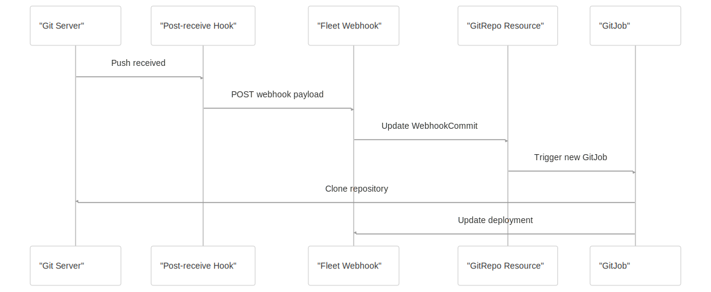

# Git Webhooks and Integrations

[Index your code with Devin](/private-repo)

[DeepWiki](/)

[DeepWiki](/)

[rancher/fleet](https://github.com/rancher/fleet "Open repository")

[Index your code with

Devin](/private-repo)Edit WikiShare

Last indexed: 3 June 2025 ([01abaa](https://github.com/rancher/fleet/commits/01abaa07))

* [Overview](/rancher/fleet/1-overview)
* [Architecture](/rancher/fleet/2-architecture)
* [Core APIs and Custom Resources](/rancher/fleet/2.1-core-apis-and-custom-resources)
* [Controllers and Reconcilers](/rancher/fleet/2.2-controllers-and-reconcilers)
* [Agent System](/rancher/fleet/2.3-agent-system)
* [Core Components](/rancher/fleet/3-core-components)
* [GitOps System](/rancher/fleet/3.1-gitops-system)
* [Bundle Management](/rancher/fleet/3.2-bundle-management)
* [Cluster Management](/rancher/fleet/3.3-cluster-management)
* [CLI Tools](/rancher/fleet/3.4-cli-tools)
* [Deployment and Installation](/rancher/fleet/4-deployment-and-installation)
* [Helm Charts](/rancher/fleet/4.1-helm-charts)
* [Container Images](/rancher/fleet/4.2-container-images)
* [Configuration and Tuning](/rancher/fleet/4.3-configuration-and-tuning)
* [Development](/rancher/fleet/5-development)
* [Development Environment](/rancher/fleet/5.1-development-environment)
* [Testing](/rancher/fleet/5.2-testing)
* [CI/CD and Release Process](/rancher/fleet/5.3-cicd-and-release-process)
* [Operations and Troubleshooting](/rancher/fleet/6-operations-and-troubleshooting)
* [Troubleshooting and Support](/rancher/fleet/6.1-troubleshooting-and-support)
* [Git Webhooks and Integrations](/rancher/fleet/6.2-git-webhooks-and-integrations)

Menu

# Git Webhooks and Integrations

Relevant source files

* [charts/fleet/templates/rbac\_gitjob.yaml](https://github.com/rancher/fleet/blob/01abaa07/charts/fleet/templates/rbac_gitjob.yaml)
* [cmd/fleetcli/main.go](https://github.com/rancher/fleet/blob/01abaa07/cmd/fleetcli/main.go)
* [e2e/assets/gitrepo/gitrepo.yaml](https://github.com/rancher/fleet/blob/01abaa07/e2e/assets/gitrepo/gitrepo.yaml)
* [e2e/assets/single-cluster/test-oci.yaml](https://github.com/rancher/fleet/blob/01abaa07/e2e/assets/single-cluster/test-oci.yaml)
* [e2e/single-cluster/delete\_namespaces\_test.go](https://github.com/rancher/fleet/blob/01abaa07/e2e/single-cluster/delete_namespaces_test.go)
* [e2e/single-cluster/finalizers\_test.go](https://github.com/rancher/fleet/blob/01abaa07/e2e/single-cluster/finalizers_test.go)
* [e2e/single-cluster/gitrepo\_test.go](https://github.com/rancher/fleet/blob/01abaa07/e2e/single-cluster/gitrepo_test.go)
* [e2e/single-cluster/oci\_registry\_test.go](https://github.com/rancher/fleet/blob/01abaa07/e2e/single-cluster/oci_registry_test.go)
* [e2e/single-cluster/suite\_test.go](https://github.com/rancher/fleet/blob/01abaa07/e2e/single-cluster/suite_test.go)
* [e2e/testenv/k8sclient/k8sclient.go](https://github.com/rancher/fleet/blob/01abaa07/e2e/testenv/k8sclient/k8sclient.go)
* [integrationtests/gitjob/controller/controller\_test.go](https://github.com/rancher/fleet/blob/01abaa07/integrationtests/gitjob/controller/controller_test.go)
* [integrationtests/gitjob/controller/suite\_test.go](https://github.com/rancher/fleet/blob/01abaa07/integrationtests/gitjob/controller/suite_test.go)
* [internal/cmd/agent/deployer/deployer.go](https://github.com/rancher/fleet/blob/01abaa07/internal/cmd/agent/deployer/deployer.go)
* [internal/cmd/agent/deployer/deployer\_test.go](https://github.com/rancher/fleet/blob/01abaa07/internal/cmd/agent/deployer/deployer_test.go)
* [internal/cmd/controller/agentmanagement/root.go](https://github.com/rancher/fleet/blob/01abaa07/internal/cmd/controller/agentmanagement/root.go)
* [internal/cmd/controller/cleanup/root.go](https://github.com/rancher/fleet/blob/01abaa07/internal/cmd/controller/cleanup/root.go)
* [internal/cmd/controller/gitops/operator.go](https://github.com/rancher/fleet/blob/01abaa07/internal/cmd/controller/gitops/operator.go)
* [internal/cmd/controller/gitops/reconciler/gitjob.go](https://github.com/rancher/fleet/blob/01abaa07/internal/cmd/controller/gitops/reconciler/gitjob.go)
* [internal/cmd/controller/gitops/reconciler/gitjob\_controller.go](https://github.com/rancher/fleet/blob/01abaa07/internal/cmd/controller/gitops/reconciler/gitjob_controller.go)
* [internal/cmd/controller/gitops/reconciler/gitjob\_test.go](https://github.com/rancher/fleet/blob/01abaa07/internal/cmd/controller/gitops/reconciler/gitjob_test.go)
* [internal/cmd/controller/helmops/operator.go](https://github.com/rancher/fleet/blob/01abaa07/internal/cmd/controller/helmops/operator.go)
* [internal/cmd/controller/operator.go](https://github.com/rancher/fleet/blob/01abaa07/internal/cmd/controller/operator.go)
* [internal/cmd/controller/root.go](https://github.com/rancher/fleet/blob/01abaa07/internal/cmd/controller/root.go)
* [internal/ocistorage/ociwrapper.go](https://github.com/rancher/fleet/blob/01abaa07/internal/ocistorage/ociwrapper.go)
* [pkg/webhook/parser.go](https://github.com/rancher/fleet/blob/01abaa07/pkg/webhook/parser.go)
* [pkg/webhook/parser\_test.go](https://github.com/rancher/fleet/blob/01abaa07/pkg/webhook/parser_test.go)
* [pkg/webhook/webhook.go](https://github.com/rancher/fleet/blob/01abaa07/pkg/webhook/webhook.go)
* [pkg/webhook/webhook\_test.go](https://github.com/rancher/fleet/blob/01abaa07/pkg/webhook/webhook_test.go)

This document covers Fleet's Git webhook system and integrations with various Git hosting providers. It explains how Fleet monitors Git repositories for changes through both polling and webhook mechanisms, and how to configure real-time Git notifications for faster deployments.

For information about the overall GitOps workflow and bundle management, see [GitOps System](/rancher/fleet/3.1-gitops-system). For details about GitRepo custom resources and their configuration, see [Core APIs and Custom Resources](/rancher/fleet/2.1-core-apis-and-custom-resources).

## Architecture Overview

Fleet provides two mechanisms for monitoring Git repository changes:

1. **Polling**: Regular interval-based checking of Git repositories
2. **Webhooks**: Real-time notifications from Git hosting providers

The webhook system integrates with Fleet's existing GitOps reconciliation loop to provide immediate updates when Git repositories change, reducing deployment latency from polling intervals to near real-time.



Sources: [pkg/webhook/webhook.go1-332](https://github.com/rancher/fleet/blob/01abaa07/pkg/webhook/webhook.go#L1-L332) [internal/cmd/controller/gitops/reconciler/gitjob\_controller.go1-740](https://github.com/rancher/fleet/blob/01abaa07/internal/cmd/controller/gitops/reconciler/gitjob_controller.go#L1-L740) [internal/cmd/controller/gitops/operator.go1-246](https://github.com/rancher/fleet/blob/01abaa07/internal/cmd/controller/gitops/operator.go#L1-L246)

## Webhook System Components

Fleet's webhook system consists of several key components that work together to process incoming webhook events and update GitRepo resources accordingly.

### Webhook Server Setup

The webhook server is initialized as part of the GitOps operator and listens for incoming HTTP requests from Git hosting providers.



The webhook server runs on port 8080 by default and can be configured through the `Listen` parameter in the GitOps operator configuration.

Sources: [internal/cmd/controller/gitops/operator.go219-245](https://github.com/rancher/fleet/blob/01abaa07/internal/cmd/controller/gitops/operator.go#L219-L245) [pkg/webhook/webhook.go187-197](https://github.com/rancher/fleet/blob/01abaa07/pkg/webhook/webhook.go#L187-L197)

### Webhook Processing Flow

When a webhook event is received, Fleet processes it through a multi-step validation and update flow:



Sources: [pkg/webhook/webhook.go60-185](https://github.com/rancher/fleet/blob/01abaa07/pkg/webhook/webhook.go#L60-L185) [pkg/webhook/webhook.go205-228](https://github.com/rancher/fleet/blob/01abaa07/pkg/webhook/webhook.go#L205-L228)

## Git Provider Integrations

Fleet supports webhook integrations with multiple Git hosting providers through a unified parsing system that handles provider-specific payload formats.

### Supported Providers

| Provider | Header Detection | Authentication | Payload Format |
| --- | --- | --- | --- |
| GitHub | `X-Github-Event` | HMAC SHA-256 | JSON |
| GitLab | `X-Gitlab-Event` | Token-based | JSON |
| Bitbucket Cloud | `X-Event-Key` | UUID verification | JSON |
| Bitbucket Server | `X-Event-Key` | HMAC SHA-256 | JSON |
| Azure DevOps | `X-Vss-Activityid` | Basic Auth | JSON |
| Gogs | `X-Gogs-Event` | HMAC SHA-256 | JSON |

### Provider Detection and Parsing

The webhook parser automatically detects the Git provider based on HTTP headers and routes to the appropriate parsing logic:



Sources: [pkg/webhook/parser.go26-142](https://github.com/rancher/fleet/blob/01abaa07/pkg/webhook/parser.go#L26-L142) [pkg/webhook/webhook.go270-331](https://github.com/rancher/fleet/blob/01abaa07/pkg/webhook/webhook.go#L270-L331)

## Security and Authentication

Fleet implements security measures to verify webhook authenticity and prevent unauthorized updates to GitRepo resources.

### Webhook Secret Validation

Fleet supports both global and per-GitRepo webhook secrets for validating incoming webhook requests:



### Secret Configuration Format

Webhook secrets are stored as Kubernetes Secret resources with provider-specific keys:

```
apiVersion: v1
kind: Secret
metadata:
  name: webhook-secret
  namespace: fleet-local
data:
  github: <base64-encoded-secret>
  gitlab: <base64-encoded-token>
  bitbucket: <base64-encoded-uuid>
  bitbucket-server: <base64-encoded-secret>
  gogs: <base64-encoded-secret>
  azure-username: <base64-encoded-username>
  azure-password: <base64-encoded-password>
```

Sources: [pkg/webhook/webhook.go205-228](https://github.com/rancher/fleet/blob/01abaa07/pkg/webhook/webhook.go#L205-L228) [pkg/webhook/parser.go26-142](https://github.com/rancher/fleet/blob/01abaa07/pkg/webhook/parser.go#L26-L142)

## Webhook and Polling Integration

Fleet's webhook system integrates seamlessly with the existing Git polling mechanism, providing a hybrid approach for reliable Git repository monitoring.

### GitRepo Status Fields

The `GitRepo` resource maintains separate fields for tracking polling and webhook commits:

| Field | Purpose | Updated By |
| --- | --- | --- |
| `Status.Commit` | Current commit from polling | `GitJobReconciler` |
| `Status.WebhookCommit` | Latest commit from webhook | `Webhook` handler |
| `Status.LastPollingTime` | Last polling attempt | `GitJobReconciler` |

### Reconciliation Logic

The `GitJobReconciler` merges webhook and polling information during reconciliation:



Sources: [internal/cmd/controller/gitops/reconciler/gitjob\_controller.go196-199](https://github.com/rancher/fleet/blob/01abaa07/internal/cmd/controller/gitops/reconciler/gitjob_controller.go#L196-L199) [internal/cmd/controller/gitops/reconciler/gitjob\_controller.go322-338](https://github.com/rancher/fleet/blob/01abaa07/internal/cmd/controller/gitops/reconciler/gitjob_controller.go#L322-L338)

## Configuration and Setup

### Webhook Server Configuration

The webhook server is configured through the GitOps operator parameters:

| Parameter | Default | Description |
| --- | --- | --- |
| `Listen` | `:8080` | Webhook server bind address |
| `Namespace` | `cattle-fleet-system` | Fleet system namespace |

### GitRepo Webhook Configuration

Enable webhooks for a GitRepo by configuring the polling interval and optional webhook secret:

```
apiVersion: fleet.cattle.io/v1alpha1
kind: GitRepo
metadata:
  name: my-repo
spec:
  repo: https://github.com/example/repo
  branch: main
  pollingInterval: 24h  # Disable frequent polling
  webhookSecret: my-webhook-secret  # Optional per-repo secret
```

### Webhook URL Format

Configure your Git hosting provider to send webhooks to:

```
http://<fleet-webhook-server>:8080/

```

Sources: [internal/cmd/controller/gitops/operator.go56](https://github.com/rancher/fleet/blob/01abaa07/internal/cmd/controller/gitops/operator.go#L56-L56) [pkg/webhook/webhook.go169-174](https://github.com/rancher/fleet/blob/01abaa07/pkg/webhook/webhook.go#L169-L174)

## Error Handling and Status Codes

The webhook system provides appropriate HTTP status codes for different error conditions:

| Condition | HTTP Status | Description |
| --- | --- | --- |
| Successful processing | 200 OK | Webhook processed successfully |
| Authentication failure | 401 Unauthorized | Invalid webhook secret/token |
| Invalid HTTP method | 405 Method Not Allowed | Only POST requests allowed |
| Other errors | 500 Internal Server Error | Processing errors |

### Error Response Examples

Authentication failures return specific error codes based on the Git provider:



Sources: [pkg/webhook/webhook.go230-255](https://github.com/rancher/fleet/blob/01abaa07/pkg/webhook/webhook.go#L230-L255) [pkg/webhook/webhook\_test.go243-306](https://github.com/rancher/fleet/blob/01abaa07/pkg/webhook/webhook_test.go#L243-L306)

## Testing and Validation

Fleet includes comprehensive testing for webhook functionality, including integration tests that verify end-to-end webhook processing.

### E2E Webhook Testing

The test suite includes webhook integration tests that:

* Set up a local Git server with post-receive hooks
* Configure webhook notifications to Fleet
* Verify that Git changes trigger immediate updates
* Validate that deployments update without waiting for polling intervals

### Webhook Validation Flow

Test scenarios verify the complete webhook processing pipeline:



Sources: [e2e/single-cluster/gitrepo\_test.go207-316](https://github.com/rancher/fleet/blob/01abaa07/e2e/single-cluster/gitrepo_test.go#L207-L316) [integrationtests/gitjob/controller/controller\_test.go1-897](https://github.com/rancher/fleet/blob/01abaa07/integrationtests/gitjob/controller/controller_test.go#L1-L897)

Dismiss

Refresh this wiki

Enter email to refresh

### On this page

* [Git Webhooks and Integrations](#git-webhooks-and-integrations)
* [Architecture Overview](#architecture-overview)
* [Webhook System Components](#webhook-system-components)
* [Webhook Server Setup](#webhook-server-setup)
* [Webhook Processing Flow](#webhook-processing-flow)
* [Git Provider Integrations](#git-provider-integrations)
* [Supported Providers](#supported-providers)
* [Provider Detection and Parsing](#provider-detection-and-parsing)
* [Security and Authentication](#security-and-authentication)
* [Webhook Secret Validation](#webhook-secret-validation)
* [Secret Configuration Format](#secret-configuration-format)
* [Webhook and Polling Integration](#webhook-and-polling-integration)
* [GitRepo Status Fields](#gitrepo-status-fields)
* [Reconciliation Logic](#reconciliation-logic)
* [Configuration and Setup](#configuration-and-setup)
* [Webhook Server Configuration](#webhook-server-configuration)
* [GitRepo Webhook Configuration](#gitrepo-webhook-configuration)
* [Webhook URL Format](#webhook-url-format)
* [Error Handling and Status Codes](#error-handling-and-status-codes)
* [Error Response Examples](#error-response-examples)
* [Testing and Validation](#testing-and-validation)
* [E2E Webhook Testing](#e2e-webhook-testing)
* [Webhook Validation Flow](#webhook-validation-flow)

Ask Devin about rancher/fleet

Fast