# Core APIs and Custom Resources

[Index your code with Devin](/private-repo)

[DeepWiki](/)

[DeepWiki](/)

[rancher/fleet](https://github.com/rancher/fleet "Open repository")

[Index your code with

Devin](/private-repo)Edit WikiShare

Last indexed: 3 June 2025 ([01abaa](https://github.com/rancher/fleet/commits/01abaa07))

* [Overview](/rancher/fleet/1-overview)
* [Architecture](/rancher/fleet/2-architecture)
* [Core APIs and Custom Resources](/rancher/fleet/2.1-core-apis-and-custom-resources)
* [Controllers and Reconcilers](/rancher/fleet/2.2-controllers-and-reconcilers)
* [Agent System](/rancher/fleet/2.3-agent-system)
* [Core Components](/rancher/fleet/3-core-components)
* [GitOps System](/rancher/fleet/3.1-gitops-system)
* [Bundle Management](/rancher/fleet/3.2-bundle-management)
* [Cluster Management](/rancher/fleet/3.3-cluster-management)
* [CLI Tools](/rancher/fleet/3.4-cli-tools)
* [Deployment and Installation](/rancher/fleet/4-deployment-and-installation)
* [Helm Charts](/rancher/fleet/4.1-helm-charts)
* [Container Images](/rancher/fleet/4.2-container-images)
* [Configuration and Tuning](/rancher/fleet/4.3-configuration-and-tuning)
* [Development](/rancher/fleet/5-development)
* [Development Environment](/rancher/fleet/5.1-development-environment)
* [Testing](/rancher/fleet/5.2-testing)
* [CI/CD and Release Process](/rancher/fleet/5.3-cicd-and-release-process)
* [Operations and Troubleshooting](/rancher/fleet/6-operations-and-troubleshooting)
* [Troubleshooting and Support](/rancher/fleet/6.1-troubleshooting-and-support)
* [Git Webhooks and Integrations](/rancher/fleet/6.2-git-webhooks-and-integrations)

Menu

# Core APIs and Custom Resources

Relevant source files

* [charts/fleet-crd/templates/crds.yaml](https://github.com/rancher/fleet/blob/01abaa07/charts/fleet-crd/templates/crds.yaml)
* [go.mod](https://github.com/rancher/fleet/blob/01abaa07/go.mod)
* [go.sum](https://github.com/rancher/fleet/blob/01abaa07/go.sum)
* [pkg/apis/fleet.cattle.io/v1alpha1/bundledeployment\_types.go](https://github.com/rancher/fleet/blob/01abaa07/pkg/apis/fleet.cattle.io/v1alpha1/bundledeployment_types.go)
* [pkg/apis/fleet.cattle.io/v1alpha1/gitrepo\_types.go](https://github.com/rancher/fleet/blob/01abaa07/pkg/apis/fleet.cattle.io/v1alpha1/gitrepo_types.go)
* [pkg/apis/fleet.cattle.io/v1alpha1/groupversion\_info.go](https://github.com/rancher/fleet/blob/01abaa07/pkg/apis/fleet.cattle.io/v1alpha1/groupversion_info.go)
* [pkg/apis/fleet.cattle.io/v1alpha1/zz\_generated.deepcopy.go](https://github.com/rancher/fleet/blob/01abaa07/pkg/apis/fleet.cattle.io/v1alpha1/zz_generated.deepcopy.go)
* [pkg/apis/go.mod](https://github.com/rancher/fleet/blob/01abaa07/pkg/apis/go.mod)
* [pkg/apis/go.sum](https://github.com/rancher/fleet/blob/01abaa07/pkg/apis/go.sum)
* [pkg/apis/internal/scheme.go](https://github.com/rancher/fleet/blob/01abaa07/pkg/apis/internal/scheme.go)

This document covers Fleet's core API definitions and Custom Resource Definitions (CRDs) that form the foundation of Fleet's GitOps functionality. These APIs define the data structures and schemas for managing Git repositories, application bundles, cluster deployments, and cluster management within Fleet.

For information about controllers that operate on these resources, see [Controllers and Reconcilers](/rancher/fleet/2.2-controllers-and-reconcilers). For details about the agent system that manages these resources on downstream clusters, see [Agent System](/rancher/fleet/2.3-agent-system).

## API Group Overview

Fleet defines its custom resources under the `fleet.cattle.io` API group with version `v1alpha1`. All Fleet CRDs use this group version and are managed through Kubernetes' standard API machinery.

Sources: [pkg/apis/fleet.cattle.io/v1alpha1/groupversion\_info.go14-16](https://github.com/rancher/fleet/blob/01abaa07/pkg/apis/fleet.cattle.io/v1alpha1/groupversion_info.go#L14-L16) [charts/fleet-crd/templates/crds.yaml1-10](https://github.com/rancher/fleet/blob/01abaa07/charts/fleet-crd/templates/crds.yaml#L1-L10)

## Core Custom Resource Definitions

### GitRepo

The `GitRepo` CRD represents a Git repository that Fleet monitors for changes. It defines the source of truth for deployments and specifies how Fleet should process the repository contents.

Key GitRepo configuration options include:

* **Repository Access**: `clientSecretName`, `caBundle`, `insecureSkipTLSVerify` for authentication and security
* **Content Selection**: `paths` array for monitoring specific directories, `revision` for specific commits/tags
* **Deployment Control**: `paused` flag, `forceSyncGeneration` for manual redeployment
* **Target Selection**: `targets` array defining clusters or cluster groups for deployment

Sources: [pkg/apis/fleet.cattle.io/v1alpha1/gitrepo\_types.go35-41](https://github.com/rancher/fleet/blob/01abaa07/pkg/apis/fleet.cattle.io/v1alpha1/gitrepo_types.go#L35-L41) [pkg/apis/fleet.cattle.io/v1alpha1/gitrepo\_types.go52-148](https://github.com/rancher/fleet/blob/01abaa07/pkg/apis/fleet.cattle.io/v1alpha1/gitrepo_types.go#L52-L148)

### Bundle

The `Bundle` CRD represents a collection of Kubernetes resources that are deployed together as a unit. Bundles are typically created automatically from GitRepo contents but can also be created manually.

Sources: [charts/fleet-crd/templates/crds.yaml2000-2100](https://github.com/rancher/fleet/blob/01abaa07/charts/fleet-crd/templates/crds.yaml#L2000-L2100) [pkg/apis/fleet.cattle.io/v1alpha1/zz\_generated.deepcopy.go63-88](https://github.com/rancher/fleet/blob/01abaa07/pkg/apis/fleet.cattle.io/v1alpha1/zz_generated.deepcopy.go#L63-L88)

### BundleDeployment

The `BundleDeployment` CRD represents a Bundle deployed to a specific cluster. Fleet agents only see BundleDeployment resources, not the original Bundle or GitRepo resources.

Sources: [pkg/apis/fleet.cattle.io/v1alpha1/bundledeployment\_types.go40-52](https://github.com/rancher/fleet/blob/01abaa07/pkg/apis/fleet.cattle.io/v1alpha1/bundledeployment_types.go#L40-L52) [pkg/apis/fleet.cattle.io/v1alpha1/bundledeployment\_types.go325-354](https://github.com/rancher/fleet/blob/01abaa07/pkg/apis/fleet.cattle.io/v1alpha1/bundledeployment_types.go#L325-L354)

## Resource Relationships and Data Flow

Fleet's core resources form a hierarchical relationship where GitRepos create Bundles, which create BundleDeployments on target clusters.

Sources: [pkg/apis/fleet.cattle.io/v1alpha1/gitrepo\_types.go158-175](https://github.com/rancher/fleet/blob/01abaa07/pkg/apis/fleet.cattle.io/v1alpha1/gitrepo_types.go#L158-L175) [charts/fleet-crd/templates/crds.yaml91-159](https://github.com/rancher/fleet/blob/01abaa07/charts/fleet-crd/templates/crds.yaml#L91-L159)

## Deployment Options and Configuration

Fleet provides extensive configuration options through the `BundleDeploymentOptions` structure, which supports multiple deployment patterns.

### Helm Options

Sources: [pkg/apis/fleet.cattle.io/v1alpha1/bundledeployment\_types.go194-270](https://github.com/rancher/fleet/blob/01abaa07/pkg/apis/fleet.cattle.io/v1alpha1/bundledeployment_types.go#L194-L270) [charts/fleet-crd/templates/crds.yaml297-451](https://github.com/rancher/fleet/blob/01abaa07/charts/fleet-crd/templates/crds.yaml#L297-L451)

### Kustomize and YAML Options

Fleet also supports Kustomize and raw YAML deployments with overlays:

| Option Type | Configuration | Purpose |
| --- | --- | --- |
| `KustomizeOptions` | `dir: string` | Points to directory containing `kustomization.yaml` |
| `YAMLOptions` | `overlays: []string` | Names mapping to `overlays/{name}` directories |
| `DiffOptions` | `comparePatches: []ComparePatch` | Ignore specific fields during drift detection |

Sources: [pkg/apis/fleet.cattle.io/v1alpha1/bundledeployment\_types.go186-192](https://github.com/rancher/fleet/blob/01abaa07/pkg/apis/fleet.cattle.io/v1alpha1/bundledeployment_types.go#L186-L192) [pkg/apis/fleet.cattle.io/v1alpha1/bundledeployment\_types.go174-184](https://github.com/rancher/fleet/blob/01abaa07/pkg/apis/fleet.cattle.io/v1alpha1/bundledeployment_types.go#L174-L184)

## Status and Monitoring

Fleet provides comprehensive status tracking through several status structures that enable monitoring and troubleshooting.

### Resource Status Types

Sources: [pkg/apis/fleet.cattle.io/v1alpha1/bundledeployment\_types.go407-425](https://github.com/rancher/fleet/blob/01abaa07/pkg/apis/fleet.cattle.io/v1alpha1/bundledeployment_types.go#L407-L425) [pkg/apis/fleet.cattle.io/v1alpha1/bundledeployment\_types.go439-470](https://github.com/rancher/fleet/blob/01abaa07/pkg/apis/fleet.cattle.io/v1alpha1/bundledeployment_types.go#L439-L470)

## Custom Resource Schema Registration

Fleet uses Kubernetes' controller-gen tool to generate CRD schemas and registers them using a scheme builder pattern:

The registration follows this pattern in each type file:

1. `init()` function calls `InternalSchemeBuilder.Register()`
2. `InternalSchemeBuilder` is defined in `groupversion_info.go`
3. Each CRD type implements `runtime.Object` interface via generated methods

Sources: [pkg/apis/fleet.cattle.io/v1alpha1/groupversion\_info.go14-26](https://github.com/rancher/fleet/blob/01abaa07/pkg/apis/fleet.cattle.io/v1alpha1/groupversion_info.go#L14-L26) [pkg/apis/internal/scheme.go62-76](https://github.com/rancher/fleet/blob/01abaa07/pkg/apis/internal/scheme.go#L62-L76) [pkg/apis/fleet.cattle.io/v1alpha1/gitrepo\_types.go7-9](https://github.com/rancher/fleet/blob/01abaa07/pkg/apis/fleet.cattle.io/v1alpha1/gitrepo_types.go#L7-L9)

Dismiss

Refresh this wiki

Enter email to refresh

### On this page

* [Core APIs and Custom Resources](#core-apis-and-custom-resources)
* [API Group Overview](#api-group-overview)
* [Core Custom Resource Definitions](#core-custom-resource-definitions)
* [GitRepo](#gitrepo)
* [Bundle](#bundle)
* [BundleDeployment](#bundledeployment)
* [Resource Relationships and Data Flow](#resource-relationships-and-data-flow)
* [Deployment Options and Configuration](#deployment-options-and-configuration)
* [Helm Options](#helm-options)
* [Kustomize and YAML Options](#kustomize-and-yaml-options)
* [Status and Monitoring](#status-and-monitoring)
* [Resource Status Types](#resource-status-types)
* [Custom Resource Schema Registration](#custom-resource-schema-registration)

Ask Devin about rancher/fleet

Fast