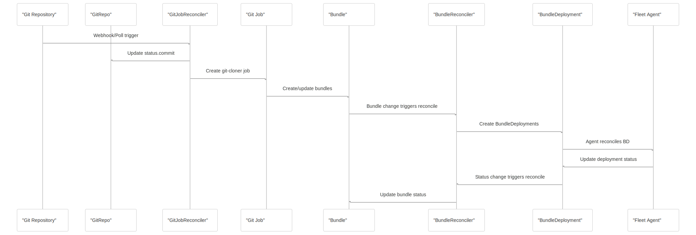

# Controllers and Reconcilers

[Index your code with Devin](/private-repo)

[DeepWiki](/)

[DeepWiki](/)

[rancher/fleet](https://github.com/rancher/fleet "Open repository")

[Index your code with

Devin](/private-repo)Edit WikiShare

Last indexed: 3 June 2025 ([01abaa](https://github.com/rancher/fleet/commits/01abaa07))

* [Overview](/rancher/fleet/1-overview)
* [Architecture](/rancher/fleet/2-architecture)
* [Core APIs and Custom Resources](/rancher/fleet/2.1-core-apis-and-custom-resources)
* [Controllers and Reconcilers](/rancher/fleet/2.2-controllers-and-reconcilers)
* [Agent System](/rancher/fleet/2.3-agent-system)
* [Core Components](/rancher/fleet/3-core-components)
* [GitOps System](/rancher/fleet/3.1-gitops-system)
* [Bundle Management](/rancher/fleet/3.2-bundle-management)
* [Cluster Management](/rancher/fleet/3.3-cluster-management)
* [CLI Tools](/rancher/fleet/3.4-cli-tools)
* [Deployment and Installation](/rancher/fleet/4-deployment-and-installation)
* [Helm Charts](/rancher/fleet/4.1-helm-charts)
* [Container Images](/rancher/fleet/4.2-container-images)
* [Configuration and Tuning](/rancher/fleet/4.3-configuration-and-tuning)
* [Development](/rancher/fleet/5-development)
* [Development Environment](/rancher/fleet/5.1-development-environment)
* [Testing](/rancher/fleet/5.2-testing)
* [CI/CD and Release Process](/rancher/fleet/5.3-cicd-and-release-process)
* [Operations and Troubleshooting](/rancher/fleet/6-operations-and-troubleshooting)
* [Troubleshooting and Support](/rancher/fleet/6.1-troubleshooting-and-support)
* [Git Webhooks and Integrations](/rancher/fleet/6.2-git-webhooks-and-integrations)

Menu

# Controllers and Reconcilers

Relevant source files

* [charts/fleet/templates/rbac\_gitjob.yaml](https://github.com/rancher/fleet/blob/01abaa07/charts/fleet/templates/rbac_gitjob.yaml)
* [cmd/fleetcli/main.go](https://github.com/rancher/fleet/blob/01abaa07/cmd/fleetcli/main.go)
* [integrationtests/controller/bundle/bundle\_helm\_test.go](https://github.com/rancher/fleet/blob/01abaa07/integrationtests/controller/bundle/bundle_helm_test.go)
* [integrationtests/gitjob/controller/controller\_test.go](https://github.com/rancher/fleet/blob/01abaa07/integrationtests/gitjob/controller/controller_test.go)
* [integrationtests/gitjob/controller/suite\_test.go](https://github.com/rancher/fleet/blob/01abaa07/integrationtests/gitjob/controller/suite_test.go)
* [integrationtests/helmops/controller/suite\_test.go](https://github.com/rancher/fleet/blob/01abaa07/integrationtests/helmops/controller/suite_test.go)
* [internal/cmd/agent/controller/bundledeployment\_controller.go](https://github.com/rancher/fleet/blob/01abaa07/internal/cmd/agent/controller/bundledeployment_controller.go)
* [internal/cmd/agent/deployer/monitor/updatestatus.go](https://github.com/rancher/fleet/blob/01abaa07/internal/cmd/agent/deployer/monitor/updatestatus.go)
* [internal/cmd/agent/deployer/monitor/updatestatus\_test.go](https://github.com/rancher/fleet/blob/01abaa07/internal/cmd/agent/deployer/monitor/updatestatus_test.go)
* [internal/cmd/controller/agentmanagement/root.go](https://github.com/rancher/fleet/blob/01abaa07/internal/cmd/controller/agentmanagement/root.go)
* [internal/cmd/controller/cleanup/root.go](https://github.com/rancher/fleet/blob/01abaa07/internal/cmd/controller/cleanup/root.go)
* [internal/cmd/controller/gitops/operator.go](https://github.com/rancher/fleet/blob/01abaa07/internal/cmd/controller/gitops/operator.go)
* [internal/cmd/controller/gitops/reconciler/gitjob.go](https://github.com/rancher/fleet/blob/01abaa07/internal/cmd/controller/gitops/reconciler/gitjob.go)
* [internal/cmd/controller/gitops/reconciler/gitjob\_controller.go](https://github.com/rancher/fleet/blob/01abaa07/internal/cmd/controller/gitops/reconciler/gitjob_controller.go)
* [internal/cmd/controller/gitops/reconciler/gitjob\_test.go](https://github.com/rancher/fleet/blob/01abaa07/internal/cmd/controller/gitops/reconciler/gitjob_test.go)
* [internal/cmd/controller/helmops/operator.go](https://github.com/rancher/fleet/blob/01abaa07/internal/cmd/controller/helmops/operator.go)
* [internal/cmd/controller/helmops/reconciler/helmop\_controller.go](https://github.com/rancher/fleet/blob/01abaa07/internal/cmd/controller/helmops/reconciler/helmop_controller.go)
* [internal/cmd/controller/helmops/reconciler/helmop\_controller\_test.go](https://github.com/rancher/fleet/blob/01abaa07/internal/cmd/controller/helmops/reconciler/helmop_controller_test.go)
* [internal/cmd/controller/helmops/reconciler/helmop\_status.go](https://github.com/rancher/fleet/blob/01abaa07/internal/cmd/controller/helmops/reconciler/helmop_status.go)
* [internal/cmd/controller/operator.go](https://github.com/rancher/fleet/blob/01abaa07/internal/cmd/controller/operator.go)
* [internal/cmd/controller/reconciler/bundle\_controller.go](https://github.com/rancher/fleet/blob/01abaa07/internal/cmd/controller/reconciler/bundle_controller.go)
* [internal/cmd/controller/reconciler/bundledeployment\_controller.go](https://github.com/rancher/fleet/blob/01abaa07/internal/cmd/controller/reconciler/bundledeployment_controller.go)
* [internal/cmd/controller/reconciler/cluster\_controller.go](https://github.com/rancher/fleet/blob/01abaa07/internal/cmd/controller/reconciler/cluster_controller.go)
* [internal/cmd/controller/reconciler/clustergroup\_controller.go](https://github.com/rancher/fleet/blob/01abaa07/internal/cmd/controller/reconciler/clustergroup_controller.go)
* [internal/cmd/controller/reconciler/config\_controller.go](https://github.com/rancher/fleet/blob/01abaa07/internal/cmd/controller/reconciler/config_controller.go)
* [internal/cmd/controller/reconciler/imagescan\_controller.go](https://github.com/rancher/fleet/blob/01abaa07/internal/cmd/controller/reconciler/imagescan_controller.go)
* [internal/cmd/controller/root.go](https://github.com/rancher/fleet/blob/01abaa07/internal/cmd/controller/root.go)
* [pkg/apis/fleet.cattle.io/v1alpha1/bundle\_types.go](https://github.com/rancher/fleet/blob/01abaa07/pkg/apis/fleet.cattle.io/v1alpha1/bundle_types.go)
* [pkg/apis/fleet.cattle.io/v1alpha1/helmop\_types.go](https://github.com/rancher/fleet/blob/01abaa07/pkg/apis/fleet.cattle.io/v1alpha1/helmop_types.go)

This document explains Fleet's controller architecture and reconciliation patterns. Controllers are the core components that watch Kubernetes resources and implement the GitOps workflow, from Git repository monitoring to bundle deployment across clusters.

For information about Fleet's custom resources and APIs, see [Core APIs and Custom Resources](/rancher/fleet/2.1-core-apis-and-custom-resources). For details about the agent system that runs on managed clusters, see [Agent System](/rancher/fleet/2.3-agent-system).

## Controller Pattern Overview

Fleet implements the Kubernetes controller pattern using the [controller-runtime](https://github.com/rancher/fleet/blob/01abaa07/controller-runtime) framework. Each controller watches specific resources and reconciles their desired state through reconciler functions that run continuously.

**Sources:** [internal/cmd/controller/operator.go62-121](https://github.com/rancher/fleet/blob/01abaa07/internal/cmd/controller/operator.go#L62-L121) [internal/cmd/controller/gitops/operator.go108-121](https://github.com/rancher/fleet/blob/01abaa07/internal/cmd/controller/gitops/operator.go#L108-L121)

## Core Controllers

### GitJob Controller

The `GitJobReconciler` manages `GitRepo` resources and creates Kubernetes Jobs to clone Git repositories and process their contents into bundles.

Key responsibilities:

* Polls Git repositories for new commits
* Creates Jobs with git-cloner containers to fetch repository contents
* Manages RBAC resources for Git operations
* Updates GitRepo status based on Job results
* Handles webhook-triggered synchronization

**Sources:** [internal/cmd/controller/gitops/reconciler/gitjob\_controller.go99-220](https://github.com/rancher/fleet/blob/01abaa07/internal/cmd/controller/gitops/reconciler/gitjob_controller.go#L99-L220) [internal/cmd/controller/gitops/reconciler/gitjob.go49-67](https://github.com/rancher/fleet/blob/01abaa07/internal/cmd/controller/gitops/reconciler/gitjob.go#L49-L67)

### Bundle Controller

The `BundleReconciler` processes Bundle resources and creates BundleDeployments for target clusters.

Key responsibilities:

* Builds target lists from Bundle specifications
* Creates BundleDeployments for each matching cluster
* Stores bundle content as Content resources
* Manages Helm values and options secrets
* Cleans up orphaned BundleDeployments

**Sources:** [internal/cmd/controller/reconciler/bundle\_controller.go60-342](https://github.com/rancher/fleet/blob/01abaa07/internal/cmd/controller/reconciler/bundle_controller.go#L60-L342) [internal/cmd/controller/reconciler/bundle\_controller.go395-447](https://github.com/rancher/fleet/blob/01abaa07/internal/cmd/controller/reconciler/bundle_controller.go#L395-L447)

### BundleDeployment Controllers

Fleet has two BundleDeployment controllers serving different purposes:

#### Management Cluster Controller

Updates display status and handles cleanup:

#### Agent Cluster Controller

Deploys resources using Helm:

**Sources:** [internal/cmd/controller/reconciler/bundledeployment\_controller.go28-120](https://github.com/rancher/fleet/blob/01abaa07/internal/cmd/controller/reconciler/bundledeployment_controller.go#L28-L120) [internal/cmd/agent/controller/bundledeployment\_controller.go28-215](https://github.com/rancher/fleet/blob/01abaa07/internal/cmd/agent/controller/bundledeployment_controller.go#L28-L215)

### Cluster Controller

The `ClusterReconciler` manages cluster status and aggregates bundle deployment information.

**Sources:** [internal/cmd/controller/reconciler/cluster\_controller.go49-238](https://github.com/rancher/fleet/blob/01abaa07/internal/cmd/controller/reconciler/cluster_controller.go#L49-L238)

## Reconciliation Workflow

The reconciliation workflow follows this sequence:

**Sources:** [internal/cmd/controller/gitops/reconciler/gitjob\_controller.go135-220](https://github.com/rancher/fleet/blob/01abaa07/internal/cmd/controller/gitops/reconciler/gitjob_controller.go#L135-L220) [internal/cmd/controller/reconciler/bundle\_controller.go135-342](https://github.com/rancher/fleet/blob/01abaa07/internal/cmd/controller/reconciler/bundle_controller.go#L135-L342)

## Controller Setup and Configuration

Controllers are configured and started through manager setup:

### Worker Configuration

Controllers support configurable concurrency through environment variables:

| Controller | Environment Variable | Default |
| --- | --- | --- |
| Bundle | `BUNDLE_RECONCILER_WORKERS` | 1 |
| BundleDeployment | `BUNDLEDEPLOYMENT_RECONCILER_WORKERS` | 1 |
| Cluster | `CLUSTER_RECONCILER_WORKERS` | 1 |
| ClusterGroup | `CLUSTERGROUP_RECONCILER_WORKERS` | 1 |
| GitRepo | `GITREPO_RECONCILER_WORKERS` | 1 |
| ImageScan | `IMAGESCAN_RECONCILER_WORKERS` | 1 |

**Sources:** [internal/cmd/controller/root.go87-125](https://github.com/rancher/fleet/blob/01abaa07/internal/cmd/controller/root.go#L87-L125) [internal/cmd/controller/gitops/operator.go132-139](https://github.com/rancher/fleet/blob/01abaa07/internal/cmd/controller/gitops/operator.go#L132-L139)

### Event Filtering

Controllers use predicates to filter events and avoid unnecessary reconciliation:

**Sources:** [internal/cmd/controller/gitops/reconciler/gitjob\_controller.go115-133](https://github.com/rancher/fleet/blob/01abaa07/internal/cmd/controller/gitops/reconciler/gitjob_controller.go#L115-L133) [internal/cmd/controller/reconciler/bundledeployment\_controller.go124-138](https://github.com/rancher/fleet/blob/01abaa07/internal/cmd/controller/reconciler/bundledeployment_controller.go#L124-L138)

## Status Management

### Status Reconciler

The `StatusReconciler` updates GitRepo status based on bundle states:

### Condition Management

Controllers use standardized condition management:

**Sources:** [internal/cmd/controller/gitops/reconciler/status.go](https://github.com/rancher/fleet/blob/01abaa07/internal/cmd/controller/gitops/reconciler/status.go) [internal/cmd/controller/gitops/reconciler/gitjob\_controller.go610-618](https://github.com/rancher/fleet/blob/01abaa07/internal/cmd/controller/gitops/reconciler/gitjob_controller.go#L610-L618)

## Implementation Details

### Interface Abstractions

Controllers use interfaces for testability and modularity:

| Interface | Purpose | Implementation |
| --- | --- | --- |
| `GitFetcher` | Git operations | `git.Fetch` |
| `TimeGetter` | Time operations | `RealClock` |
| `BundleQuery` | Bundle targeting | `target.Builder` |
| `Store` | Content storage | `manifest.Store` |
| `TargetBuilder` | Target resolution | `target.Builder` |

### Error Handling

Controllers implement retry mechanisms and error aggregation:

### Metrics Integration

Controllers collect metrics for observability:

**Sources:** [internal/cmd/controller/gitops/reconciler/gitjob\_controller.go57-77](https://github.com/rancher/fleet/blob/01abaa07/internal/cmd/controller/gitops/reconciler/gitjob_controller.go#L57-L77) [internal/cmd/controller/reconciler/bundle\_controller.go594-595](https://github.com/rancher/fleet/blob/01abaa07/internal/cmd/controller/reconciler/bundle_controller.go#L594-L595) [internal/metrics/](https://github.com/rancher/fleet/blob/01abaa07/internal/metrics/)

Dismiss

Refresh this wiki

Enter email to refresh

### On this page

* [Controllers and Reconcilers](#controllers-and-reconcilers)
* [Controller Pattern Overview](#controller-pattern-overview)
* [Core Controllers](#core-controllers)
* [GitJob Controller](#gitjob-controller)
* [Bundle Controller](#bundle-controller)
* [BundleDeployment Controllers](#bundledeployment-controllers)
* [Management Cluster Controller](#management-cluster-controller)
* [Agent Cluster Controller](#agent-cluster-controller)
* [Cluster Controller](#cluster-controller)
* [Reconciliation Workflow](#reconciliation-workflow)
* [Controller Setup and Configuration](#controller-setup-and-configuration)
* [Worker Configuration](#worker-configuration)
* [Event Filtering](#event-filtering)
* [Status Management](#status-management)
* [Status Reconciler](#status-reconciler)
* [Condition Management](#condition-management)
* [Implementation Details](#implementation-details)
* [Interface Abstractions](#interface-abstractions)
* [Error Handling](#error-handling)
* [Metrics Integration](#metrics-integration)

Ask Devin about rancher/fleet

Fast