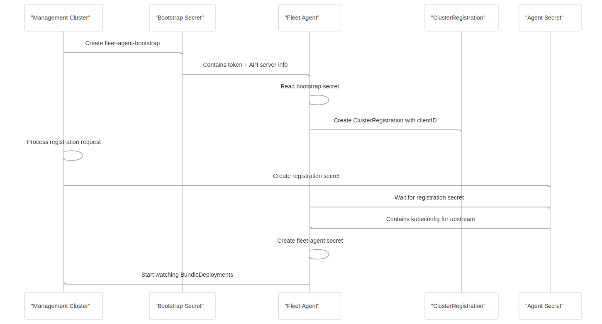

# Agent System

[Get free private DeepWikis in Devin](/private-repo)

[DeepWiki](https://deepwiki.com)

[DeepWiki](/)

[rancher/fleet](https://github.com/rancher/fleet)

[Get free private DeepWikis with

Devin](/private-repo)Share

Last indexed: 3 June 2025 ([01abaa](https://github.com/rancher/fleet/commits/01abaa07))

* [Overview](/rancher/fleet/1-overview)
* [Architecture](/rancher/fleet/2-architecture)
* [Core APIs and Custom Resources](/rancher/fleet/2.1-core-apis-and-custom-resources)
* [Controllers and Reconcilers](/rancher/fleet/2.2-controllers-and-reconcilers)
* [Agent System](/rancher/fleet/2.3-agent-system)
* [Core Components](/rancher/fleet/3-core-components)
* [GitOps System](/rancher/fleet/3.1-gitops-system)
* [Bundle Management](/rancher/fleet/3.2-bundle-management)
* [Cluster Management](/rancher/fleet/3.3-cluster-management)
* [CLI Tools](/rancher/fleet/3.4-cli-tools)
* [Deployment and Installation](/rancher/fleet/4-deployment-and-installation)
* [Helm Charts](/rancher/fleet/4.1-helm-charts)
* [Container Images](/rancher/fleet/4.2-container-images)
* [Configuration and Tuning](/rancher/fleet/4.3-configuration-and-tuning)
* [Development](/rancher/fleet/5-development)
* [Development Environment](/rancher/fleet/5.1-development-environment)
* [Testing](/rancher/fleet/5.2-testing)
* [CI/CD and Release Process](/rancher/fleet/5.3-cicd-and-release-process)
* [Operations and Troubleshooting](/rancher/fleet/6-operations-and-troubleshooting)
* [Troubleshooting and Support](/rancher/fleet/6.1-troubleshooting-and-support)
* [Git Webhooks and Integrations](/rancher/fleet/6.2-git-webhooks-and-integrations)

Menu

# Agent System

Relevant source files

* [.github/scripts/deploy-fleet.sh](https://github.com/rancher/fleet/blob/01abaa07/.github/scripts/deploy-fleet.sh)
* [charts/fleet/tests/agent-leader-election.yaml](https://github.com/rancher/fleet/blob/01abaa07/charts/fleet/tests/agent-leader-election.yaml)
* [dev/setup-fleet](https://github.com/rancher/fleet/blob/01abaa07/dev/setup-fleet)
* [dev/update-agent-k3d](https://github.com/rancher/fleet/blob/01abaa07/dev/update-agent-k3d)
* [dev/update-controller-k3d](https://github.com/rancher/fleet/blob/01abaa07/dev/update-controller-k3d)
* [integrationtests/agent/adoption\_test.go](https://github.com/rancher/fleet/blob/01abaa07/integrationtests/agent/adoption_test.go)
* [integrationtests/agent/assets/deployment-v1.yaml](https://github.com/rancher/fleet/blob/01abaa07/integrationtests/agent/assets/deployment-v1.yaml)
* [integrationtests/agent/bundle\_deployment\_diffs\_test.go](https://github.com/rancher/fleet/blob/01abaa07/integrationtests/agent/bundle_deployment_diffs_test.go)
* [integrationtests/agent/bundle\_deployment\_drift\_test.go](https://github.com/rancher/fleet/blob/01abaa07/integrationtests/agent/bundle_deployment_drift_test.go)
* [integrationtests/agent/bundle\_deployment\_status\_test.go](https://github.com/rancher/fleet/blob/01abaa07/integrationtests/agent/bundle_deployment_status_test.go)
* [integrationtests/agent/helm\_capabilities\_test.go](https://github.com/rancher/fleet/blob/01abaa07/integrationtests/agent/helm_capabilities_test.go)
* [integrationtests/agent/suite\_test.go](https://github.com/rancher/fleet/blob/01abaa07/integrationtests/agent/suite_test.go)
* [integrationtests/cli/assets/bundledeployment/bd-with-kube-version.yaml](https://github.com/rancher/fleet/blob/01abaa07/integrationtests/cli/assets/bundledeployment/bd-with-kube-version.yaml)
* [internal/cmd/agent/clusterstatus.go](https://github.com/rancher/fleet/blob/01abaa07/internal/cmd/agent/clusterstatus.go)
* [internal/cmd/agent/clusterstatus/ticker.go](https://github.com/rancher/fleet/blob/01abaa07/internal/cmd/agent/clusterstatus/ticker.go)
* [internal/cmd/agent/controller/drift\_controller.go](https://github.com/rancher/fleet/blob/01abaa07/internal/cmd/agent/controller/drift_controller.go)
* [internal/cmd/agent/deployer/desiredset/diff.go](https://github.com/rancher/fleet/blob/01abaa07/internal/cmd/agent/deployer/desiredset/diff.go)
* [internal/cmd/agent/deployer/desiredset/diff\_test.go](https://github.com/rancher/fleet/blob/01abaa07/internal/cmd/agent/deployer/desiredset/diff_test.go)
* [internal/cmd/agent/deployer/driftdetect/driftdetect.go](https://github.com/rancher/fleet/blob/01abaa07/internal/cmd/agent/deployer/driftdetect/driftdetect.go)
* [internal/cmd/agent/operator.go](https://github.com/rancher/fleet/blob/01abaa07/internal/cmd/agent/operator.go)
* [internal/cmd/agent/register.go](https://github.com/rancher/fleet/blob/01abaa07/internal/cmd/agent/register.go)
* [internal/cmd/agent/register/register.go](https://github.com/rancher/fleet/blob/01abaa07/internal/cmd/agent/register/register.go)
* [internal/cmd/agent/root.go](https://github.com/rancher/fleet/blob/01abaa07/internal/cmd/agent/root.go)
* [internal/cmd/controller/agentmanagement/agent/agent.go](https://github.com/rancher/fleet/blob/01abaa07/internal/cmd/controller/agentmanagement/agent/agent.go)
* [internal/cmd/controller/agentmanagement/agent/manifest.go](https://github.com/rancher/fleet/blob/01abaa07/internal/cmd/controller/agentmanagement/agent/manifest.go)
* [internal/cmd/controller/agentmanagement/agent/manifest\_test.go](https://github.com/rancher/fleet/blob/01abaa07/internal/cmd/controller/agentmanagement/agent/manifest_test.go)
* [internal/cmd/controller/agentmanagement/controllers/cluster/controller.go](https://github.com/rancher/fleet/blob/01abaa07/internal/cmd/controller/agentmanagement/controllers/cluster/controller.go)
* [internal/cmd/controller/agentmanagement/controllers/cluster/import.go](https://github.com/rancher/fleet/blob/01abaa07/internal/cmd/controller/agentmanagement/controllers/cluster/import.go)
* [internal/cmd/controller/agentmanagement/controllers/clusterregistration/controller.go](https://github.com/rancher/fleet/blob/01abaa07/internal/cmd/controller/agentmanagement/controllers/clusterregistration/controller.go)
* [internal/cmd/controller/agentmanagement/controllers/clusterregistration/controller\_test.go](https://github.com/rancher/fleet/blob/01abaa07/internal/cmd/controller/agentmanagement/controllers/clusterregistration/controller_test.go)
* [internal/cmd/controller/agentmanagement/controllers/clusterregistrationtoken/handler.go](https://github.com/rancher/fleet/blob/01abaa07/internal/cmd/controller/agentmanagement/controllers/clusterregistrationtoken/handler.go)
* [internal/cmd/controller/agentmanagement/controllers/manageagent/manageagent.go](https://github.com/rancher/fleet/blob/01abaa07/internal/cmd/controller/agentmanagement/controllers/manageagent/manageagent.go)
* [internal/cmd/controller/agentmanagement/controllers/manageagent/manageagent\_test.go](https://github.com/rancher/fleet/blob/01abaa07/internal/cmd/controller/agentmanagement/controllers/manageagent/manageagent_test.go)
* [internal/cmd/options.go](https://github.com/rancher/fleet/blob/01abaa07/internal/cmd/options.go)
* [internal/helmdeployer/capabilities.go](https://github.com/rancher/fleet/blob/01abaa07/internal/helmdeployer/capabilities.go)
* [pkg/apis/fleet.cattle.io/v1alpha1/cluster\_types.go](https://github.com/rancher/fleet/blob/01abaa07/pkg/apis/fleet.cattle.io/v1alpha1/cluster_types.go)

The Fleet Agent System manages the deployment and operation of Fleet agents on downstream clusters. This system handles agent registration, deployment, configuration, and ongoing operation including bundle deployment and drift detection. For information about the overall Fleet architecture, see [Architecture](/rancher/fleet/2-architecture).

The agent system operates in two main contexts:

* **Management cluster**: Controllers that deploy and manage agents on downstream clusters
* **Downstream clusters**: The Fleet agent processes that execute bundle deployments and report status

## Agent Architecture Overview

**Sources:** [internal/cmd/agent/root.go80-180](https://github.com/rancher/fleet/blob/01abaa07/internal/cmd/agent/root.go#L80-L180) [internal/cmd/agent/operator.go57-187](https://github.com/rancher/fleet/blob/01abaa07/internal/cmd/agent/operator.go#L57-L187) [internal/cmd/controller/agentmanagement/controllers/cluster/import.go257-447](https://github.com/rancher/fleet/blob/01abaa07/internal/cmd/controller/agentmanagement/controllers/cluster/import.go#L257-L447)

## Agent Registration Process

The agent registration process establishes secure communication between downstream agents and the management cluster through a multi-step bootstrap process.

### Registration Flow

**Sources:** [internal/cmd/agent/register/register.go132-265](https://github.com/rancher/fleet/blob/01abaa07/internal/cmd/agent/register/register.go#L132-L265) [internal/cmd/controller/agentmanagement/controllers/clusterregistration/controller.go173-350](https://github.com/rancher/fleet/blob/01abaa07/internal/cmd/controller/agentmanagement/controllers/clusterregistration/controller.go#L173-L350)

### Bootstrap Secret Structure

The `fleet-agent-bootstrap` secret contains the initial configuration needed for agent registration:

| Key | Description |
| --- | --- |
| `token` | Registration token for authentication |
| `apiServerURL` | Management cluster API server URL |
| `apiServerCA` | Management cluster CA certificate |
| `systemRegistrationNamespace` | Namespace for registration resources |

**Sources:** [internal/cmd/agent/register/register.go288-329](https://github.com/rancher/fleet/blob/01abaa07/internal/cmd/agent/register/register.go#L288-L329) [internal/cmd/controller/agentmanagement/agent/agent.go94-114](https://github.com/rancher/fleet/blob/01abaa07/internal/cmd/controller/agentmanagement/agent/agent.go#L94-L114)

## Agent Deployment Methods

Fleet supports two primary methods for deploying agents to downstream clusters:

### Manager-Initiated Deployment

The management cluster deploys agents directly using cluster kubeconfig secrets:

The `importHandler.importCluster` method handles this process:

1. Reads kubeconfig from `cluster.spec.kubeConfigSecret`
2. Creates `ClusterRegistrationToken` for the cluster
3. Generates agent manifests with bootstrap configuration
4. Applies manifests directly to downstream cluster

**Sources:** [internal/cmd/controller/agentmanagement/controllers/cluster/import.go257-447](https://github.com/rancher/fleet/blob/01abaa07/internal/cmd/controller/agentmanagement/controllers/cluster/import.go#L257-L447) [internal/cmd/controller/agentmanagement/agent/agent.go38-90](https://github.com/rancher/fleet/blob/01abaa07/internal/cmd/controller/agentmanagement/agent/agent.go#L38-L90)

### Agent-Initiated Registration

Agents self-register using pre-deployed bootstrap secrets:

**Sources:** [internal/cmd/agent/register/register.go53-112](https://github.com/rancher/fleet/blob/01abaa07/internal/cmd/agent/register/register.go#L53-L112) [internal/cmd/agent/register.go20-47](https://github.com/rancher/fleet/blob/01abaa07/internal/cmd/agent/register.go#L20-L47)

## Agent Runtime Architecture

### Core Agent Components

The Fleet agent runs multiple controllers and runnables to manage bundle deployments and cluster status:

**Sources:** [internal/cmd/agent/operator.go115-187](https://github.com/rancher/fleet/blob/01abaa07/internal/cmd/agent/operator.go#L115-L187) [internal/cmd/agent/operator.go189-297](https://github.com/rancher/fleet/blob/01abaa07/internal/cmd/agent/operator.go#L189-L297)

### Bundle Deployment Reconciliation

The `BundleDeploymentReconciler` is the primary controller responsible for processing bundle deployments:

| Component | Purpose | Key Methods |
| --- | --- | --- |
| `deployer.Deployer` | Orchestrates bundle deployment | `Deploy()`, `Resources()`, `RemoveExternalChanges()` |
| `helmdeployer.HelmDeployer` | Helm SDK integration | `Deploy()`, `Resources()`, `Delete()` |
| `monitor.Monitor` | Status monitoring and reporting | `UpdateStatus()` |
| `driftdetect.DriftDetect` | Change detection for deployed resources | `Refresh()` |
| `cleanup.Cleanup` | Resource cleanup and garbage collection | `CleanUp()` |

**Sources:** [internal/cmd/agent/operator.go189-297](https://github.com/rancher/fleet/blob/01abaa07/internal/cmd/agent/operator.go#L189-L297) [internal/cmd/agent/controller/bundledeployment\_controller.go](https://github.com/rancher/fleet/blob/01abaa07/internal/cmd/agent/controller/bundledeployment_controller.go)

### Drift Detection and Correction

The drift detection system monitors deployed resources for external changes:

The drift correction process:

1. `trigger.Trigger` watches deployed Kubernetes resources
2. `driftdetect.DriftDetect` aggregates change events
3. `DriftReconciler` receives notifications via channel
4. If `correctDrift.enabled` is true, `deployer.RemoveExternalChanges` corrects drift

**Sources:** [internal/cmd/agent/deployer/driftdetect/driftdetect.go51-99](https://github.com/rancher/fleet/blob/01abaa07/internal/cmd/agent/deployer/driftdetect/driftdetect.go#L51-L99) [internal/cmd/agent/controller/drift\_controller.go112-122](https://github.com/rancher/fleet/blob/01abaa07/internal/cmd/agent/controller/drift_controller.go#L112-L122)

## Agent Management from Controller

The management cluster includes several controllers for agent lifecycle management:

### ManageAgent Controller

Creates agent bundles to deploy agents using Fleet's own bundle system:

The `manageagent.newAgentBundle` method creates bundles containing:

* Agent deployment manifest
* Service accounts and RBAC
* Network policies
* Configuration from cluster spec

**Sources:** [internal/cmd/controller/agentmanagement/controllers/manageagent/manageagent.go261-336](https://github.com/rancher/fleet/blob/01abaa07/internal/cmd/controller/agentmanagement/controllers/manageagent/manageagent.go#L261-L336) [internal/cmd/controller/agentmanagement/agent/manifest.go55-130](https://github.com/rancher/fleet/blob/01abaa07/internal/cmd/controller/agentmanagement/agent/manifest.go#L55-L130)

### Cluster Import Controller

Handles manager-initiated agent deployment for clusters with kubeconfig secrets:

| Function | Purpose |
| --- | --- |
| `importHandler.OnChange` | Updates cluster `clientID` when kubeconfig present |
| `importHandler.importCluster` | Deploys agent to downstream cluster |
| `importHandler.onConfig` | Triggers re-import on API server config changes |

The import process includes:

1. Validating kubeconfig connectivity via `connection.SmokeTestKubeClientConnection`
2. Creating `ClusterRegistrationToken`
3. Generating agent manifests via `agent.AgentWithConfig`
4. Applying manifests to downstream cluster
5. Cleaning up old agent installations during migrations

**Sources:** [internal/cmd/controller/agentmanagement/controllers/cluster/import.go195-447](https://github.com/rancher/fleet/blob/01abaa07/internal/cmd/controller/agentmanagement/controllers/cluster/import.go#L195-L447)

## Agent Configuration and Manifests

### Agent Manifest Generation

The `agent.Manifest` function generates Kubernetes manifests for agent deployment:

Key manifest components:

* **ServiceAccount**: `fleet-agent` with cluster-admin permissions
* **Deployment**: Agent container with environment configuration
* **NetworkPolicy**: Allows all ingress/egress for agent pods
* **RBAC**: ClusterRole and ClusterRoleBinding for full cluster access

**Sources:** [internal/cmd/controller/agentmanagement/agent/manifest.go55-316](https://github.com/rancher/fleet/blob/01abaa07/internal/cmd/controller/agentmanagement/agent/manifest.go#L55-L316)

### Agent Configuration Options

| Option | Environment Variable | Purpose |
| --- | --- | --- |
| `AgentScope` | `AGENT_SCOPE` | Isolates agents in multi-tenant scenarios |
| `CheckinInterval` | `CHECKIN_INTERVAL` | Frequency of cluster status updates |
| `BundleDeploymentWorkers` | `BUNDLEDEPLOYMENT_RECONCILER_WORKERS` | Concurrency for bundle processing |
| `DriftWorkers` | `DRIFT_RECONCILER_WORKERS` | Concurrency for drift detection |
| `AgentReplicas` | `FLEET_AGENT_REPLICA_COUNT` | Number of agent replicas |

**Sources:** [internal/cmd/controller/agentmanagement/agent/manifest.go32-47](https://github.com/rancher/fleet/blob/01abaa07/internal/cmd/controller/agentmanagement/agent/manifest.go#L32-L47) [internal/cmd/agent/root.go39-157](https://github.com/rancher/fleet/blob/01abaa07/internal/cmd/agent/root.go#L39-L157)

## Cluster Status Reporting

The agent reports cluster health and status back to the management cluster:

The status reporting system:

1. Runs on configurable `checkinInterval` (default 15 minutes)
2. Updates `cluster.status.agent.lastSeen` timestamp
3. Reports agent namespace for management visibility
4. Uses JSON patch to avoid requiring full object read permissions

**Sources:** [internal/cmd/agent/clusterstatus/ticker.go28-90](https://github.com/rancher/fleet/blob/01abaa07/internal/cmd/agent/clusterstatus/ticker.go#L28-L90) [internal/cmd/agent/clusterstatus.go24-59](https://github.com/rancher/fleet/blob/01abaa07/internal/cmd/agent/clusterstatus.go#L24-L59)

Dismiss

Refresh this wiki

Enter email to refresh

### On this page

* [Agent System](#agent-system)
* [Agent Architecture Overview](#agent-architecture-overview)
* [Agent Registration Process](#agent-registration-process)
* [Registration Flow](#registration-flow)
* [Bootstrap Secret Structure](#bootstrap-secret-structure)
* [Agent Deployment Methods](#agent-deployment-methods)
* [Manager-Initiated Deployment](#manager-initiated-deployment)
* [Agent-Initiated Registration](#agent-initiated-registration)
* [Agent Runtime Architecture](#agent-runtime-architecture)
* [Core Agent Components](#core-agent-components)
* [Bundle Deployment Reconciliation](#bundle-deployment-reconciliation)
* [Drift Detection and Correction](#drift-detection-and-correction)
* [Agent Management from Controller](#agent-management-from-controller)
* [ManageAgent Controller](#manageagent-controller)
* [Cluster Import Controller](#cluster-import-controller)
* [Agent Configuration and Manifests](#agent-configuration-and-manifests)
* [Agent Manifest Generation](#agent-manifest-generation)
* [Agent Configuration Options](#agent-configuration-options)
* [Cluster Status Reporting](#cluster-status-reporting)

Ask Devin about rancher/fleet

Deep Research