# Core Components

[Index your code with Devin](/private-repo)

[DeepWiki](/)

[DeepWiki](/)

[rancher/fleet](https://github.com/rancher/fleet "Open repository")

[Index your code with

Devin](/private-repo)Edit WikiShare

Last indexed: 3 June 2025 ([01abaa](https://github.com/rancher/fleet/commits/01abaa07))

* [Overview](/rancher/fleet/1-overview)
* [Architecture](/rancher/fleet/2-architecture)
* [Core APIs and Custom Resources](/rancher/fleet/2.1-core-apis-and-custom-resources)
* [Controllers and Reconcilers](/rancher/fleet/2.2-controllers-and-reconcilers)
* [Agent System](/rancher/fleet/2.3-agent-system)
* [Core Components](/rancher/fleet/3-core-components)
* [GitOps System](/rancher/fleet/3.1-gitops-system)
* [Bundle Management](/rancher/fleet/3.2-bundle-management)
* [Cluster Management](/rancher/fleet/3.3-cluster-management)
* [CLI Tools](/rancher/fleet/3.4-cli-tools)
* [Deployment and Installation](/rancher/fleet/4-deployment-and-installation)
* [Helm Charts](/rancher/fleet/4.1-helm-charts)
* [Container Images](/rancher/fleet/4.2-container-images)
* [Configuration and Tuning](/rancher/fleet/4.3-configuration-and-tuning)
* [Development](/rancher/fleet/5-development)
* [Development Environment](/rancher/fleet/5.1-development-environment)
* [Testing](/rancher/fleet/5.2-testing)
* [CI/CD and Release Process](/rancher/fleet/5.3-cicd-and-release-process)
* [Operations and Troubleshooting](/rancher/fleet/6-operations-and-troubleshooting)
* [Troubleshooting and Support](/rancher/fleet/6.1-troubleshooting-and-support)
* [Git Webhooks and Integrations](/rancher/fleet/6.2-git-webhooks-and-integrations)

Menu

# Core Components

Relevant source files

* [charts/fleet/templates/rbac\_gitjob.yaml](https://github.com/rancher/fleet/blob/01abaa07/charts/fleet/templates/rbac_gitjob.yaml)
* [cmd/fleetcli/main.go](https://github.com/rancher/fleet/blob/01abaa07/cmd/fleetcli/main.go)
* [integrationtests/controller/bundle/bundle\_helm\_test.go](https://github.com/rancher/fleet/blob/01abaa07/integrationtests/controller/bundle/bundle_helm_test.go)
* [integrationtests/gitjob/controller/controller\_test.go](https://github.com/rancher/fleet/blob/01abaa07/integrationtests/gitjob/controller/controller_test.go)
* [integrationtests/gitjob/controller/suite\_test.go](https://github.com/rancher/fleet/blob/01abaa07/integrationtests/gitjob/controller/suite_test.go)
* [integrationtests/helmops/controller/suite\_test.go](https://github.com/rancher/fleet/blob/01abaa07/integrationtests/helmops/controller/suite_test.go)
* [internal/cmd/controller/agentmanagement/root.go](https://github.com/rancher/fleet/blob/01abaa07/internal/cmd/controller/agentmanagement/root.go)
* [internal/cmd/controller/cleanup/root.go](https://github.com/rancher/fleet/blob/01abaa07/internal/cmd/controller/cleanup/root.go)
* [internal/cmd/controller/gitops/operator.go](https://github.com/rancher/fleet/blob/01abaa07/internal/cmd/controller/gitops/operator.go)
* [internal/cmd/controller/gitops/reconciler/gitjob.go](https://github.com/rancher/fleet/blob/01abaa07/internal/cmd/controller/gitops/reconciler/gitjob.go)
* [internal/cmd/controller/gitops/reconciler/gitjob\_controller.go](https://github.com/rancher/fleet/blob/01abaa07/internal/cmd/controller/gitops/reconciler/gitjob_controller.go)
* [internal/cmd/controller/gitops/reconciler/gitjob\_test.go](https://github.com/rancher/fleet/blob/01abaa07/internal/cmd/controller/gitops/reconciler/gitjob_test.go)
* [internal/cmd/controller/helmops/operator.go](https://github.com/rancher/fleet/blob/01abaa07/internal/cmd/controller/helmops/operator.go)
* [internal/cmd/controller/helmops/reconciler/helmop\_controller.go](https://github.com/rancher/fleet/blob/01abaa07/internal/cmd/controller/helmops/reconciler/helmop_controller.go)
* [internal/cmd/controller/helmops/reconciler/helmop\_controller\_test.go](https://github.com/rancher/fleet/blob/01abaa07/internal/cmd/controller/helmops/reconciler/helmop_controller_test.go)
* [internal/cmd/controller/helmops/reconciler/helmop\_status.go](https://github.com/rancher/fleet/blob/01abaa07/internal/cmd/controller/helmops/reconciler/helmop_status.go)
* [internal/cmd/controller/operator.go](https://github.com/rancher/fleet/blob/01abaa07/internal/cmd/controller/operator.go)
* [internal/cmd/controller/reconciler/bundle\_controller.go](https://github.com/rancher/fleet/blob/01abaa07/internal/cmd/controller/reconciler/bundle_controller.go)
* [internal/cmd/controller/root.go](https://github.com/rancher/fleet/blob/01abaa07/internal/cmd/controller/root.go)
* [pkg/apis/fleet.cattle.io/v1alpha1/bundle\_types.go](https://github.com/rancher/fleet/blob/01abaa07/pkg/apis/fleet.cattle.io/v1alpha1/bundle_types.go)
* [pkg/apis/fleet.cattle.io/v1alpha1/helmop\_types.go](https://github.com/rancher/fleet/blob/01abaa07/pkg/apis/fleet.cattle.io/v1alpha1/helmop_types.go)
* [pkg/durations/durations.go](https://github.com/rancher/fleet/blob/01abaa07/pkg/durations/durations.go)

This document describes Fleet's core functional components and how they work together to implement GitOps for Kubernetes. These components form the foundation of Fleet's architecture and handle the primary workflows of Git repository monitoring, bundle creation and deployment, and cluster management.

For information about Fleet's overall architecture and design principles, see [Architecture](/rancher/fleet/2-architecture). For details about custom resource definitions and APIs, see [Core APIs and Custom Resources](/rancher/fleet/2.1-core-apis-and-custom-resources). For deployment and installation specifics, see [Deployment and Installation](/rancher/fleet/4-deployment-and-installation).

## GitOps System

The GitOps system is Fleet's core mechanism for monitoring Git repositories and converting their contents into deployable bundles. This system is built around the `GitJobReconciler` which orchestrates Git repository synchronization through Kubernetes Jobs.

### GitJob Controller Architecture


The `GitJobReconciler` serves as the primary controller for Git repository operations. It monitors `GitRepo` resources and creates Kubernetes Jobs to clone repositories and process their contents into Fleet bundles.

**Sources:** [internal/cmd/controller/gitops/reconciler/gitjob\_controller.go99-113](https://github.com/rancher/fleet/blob/01abaa07/internal/cmd/controller/gitops/reconciler/gitjob_controller.go#L99-L113) [internal/cmd/controller/gitops/operator.go143-156](https://github.com/rancher/fleet/blob/01abaa07/internal/cmd/controller/gitops/operator.go#L143-L156)

### Git Repository Monitoring

Fleet supports two methods for detecting changes in Git repositories:

1. **Polling**: The `GitJobReconciler` uses configurable polling intervals to check for new commits
2. **Webhooks**: Git webhooks can trigger immediate synchronization when changes occur


The polling mechanism is controlled by `getPollingIntervalDuration()` and can be disabled via `GitRepo.spec.disablePolling`. When webhooks are configured, they update `GitRepo.status.webhookCommit` which triggers immediate processing.

**Sources:** [internal/cmd/controller/gitops/reconciler/gitjob\_controller.go434-452](https://github.com/rancher/fleet/blob/01abaa07/internal/cmd/controller/gitops/reconciler/gitjob_controller.go#L434-L452) [internal/cmd/controller/gitops/reconciler/gitjob\_controller.go521-527](https://github.com/rancher/fleet/blob/01abaa07/internal/cmd/controller/gitops/reconciler/gitjob_controller.go#L521-L527) [pkg/webhook/](https://github.com/rancher/fleet/blob/01abaa07/pkg/webhook/)

### Job Creation and Execution

When the GitJob controller detects changes, it creates Kubernetes Jobs that clone the repository and process its contents:


The job creation process includes RBAC setup, configuration management, and secret handling for authentication and CA certificates. The actual Git operations are performed by init containers that clone the repository, followed by the main container running `fleet apply`.

**Sources:** [internal/cmd/controller/gitops/reconciler/gitjob\_controller.go49-67](https://github.com/rancher/fleet/blob/01abaa07/internal/cmd/controller/gitops/reconciler/gitjob_controller.go#L49-L67) [internal/cmd/controller/gitops/reconciler/gitjob.go134-143](https://github.com/rancher/fleet/blob/01abaa07/internal/cmd/controller/gitops/reconciler/gitjob.go#L134-L143) [internal/cmd/controller/gitops/reconciler/gitjob.go145-287](https://github.com/rancher/fleet/blob/01abaa07/internal/cmd/controller/gitops/reconciler/gitjob.go#L145-L287)

## Bundle Management System

The Bundle Management System handles the packaging, targeting, and deployment of Kubernetes resources. This system is centered around the `BundleReconciler` which creates and manages `BundleDeployment` resources for target clusters.

### Bundle Controller Architecture


The `BundleReconciler` orchestrates the entire bundle deployment lifecycle, from processing bundle specifications to creating targeted deployments for specific clusters.

**Sources:** [internal/cmd/controller/reconciler/bundle\_controller.go60-71](https://github.com/rancher/fleet/blob/01abaa07/internal/cmd/controller/reconciler/bundle_controller.go#L60-L71) [internal/cmd/controller/reconciler/bundle\_controller.go135-219](https://github.com/rancher/fleet/blob/01abaa07/internal/cmd/controller/reconciler/bundle_controller.go#L135-L219)

### Bundle Creation and Processing

Bundles are created from Git repository contents through the `fleet apply` process. The system supports multiple content types:

1. **Raw Kubernetes manifests**: Stored directly in `Bundle.spec.resources`
2. **OCI registry storage**: Content stored externally with reference in `Bundle.spec.contentsID`
3. **Helm charts**: Helm chart information in `Bundle.spec.helmOpOptions`


The content processing determines how resources are stored and accessed by agents during deployment.

**Sources:** [internal/cmd/controller/reconciler/bundle\_controller.go184-205](https://github.com/rancher/fleet/blob/01abaa07/internal/cmd/controller/reconciler/bundle_controller.go#L184-L205) [internal/cmd/controller/reconciler/bundle\_controller.go224-239](https://github.com/rancher/fleet/blob/01abaa07/internal/cmd/controller/reconciler/bundle_controller.go#L224-L239)

### Target Resolution and BundleDeployment Creation

The targeting system determines which clusters receive which bundles based on selectors, cluster groups, and explicit cluster names:


Each matched target results in a `BundleDeployment` resource that agents use to deploy the bundle to their cluster.

**Sources:** [internal/cmd/controller/reconciler/bundle\_controller.go207-222](https://github.com/rancher/fleet/blob/01abaa07/internal/cmd/controller/reconciler/bundle_controller.go#L207-L222) [internal/cmd/controller/reconciler/bundle\_controller.go265-329](https://github.com/rancher/fleet/blob/01abaa07/internal/cmd/controller/reconciler/bundle_controller.go#L265-L329) [internal/cmd/controller/reconciler/bundle\_controller.go395-447](https://github.com/rancher/fleet/blob/01abaa07/internal/cmd/controller/reconciler/bundle_controller.go#L395-L447)

## Cluster Management System

The Cluster Management System handles registration, monitoring, and communication with downstream clusters. This system ensures Fleet agents can connect to the management cluster and receive their deployment instructions.

### Agent Registration and Management


Clusters are registered through a token-based system that deploys Fleet agents to downstream clusters. These agents then register themselves and begin receiving bundle deployments.

**Sources:** [internal/cmd/controller/agentmanagement/](https://github.com/rancher/fleet/blob/01abaa07/internal/cmd/controller/agentmanagement/) [internal/cmd/agent/](https://github.com/rancher/fleet/blob/01abaa07/internal/cmd/agent/)

### Bundle Distribution to Clusters

The system uses a query interface to determine which bundles should be deployed to which clusters:


This distribution mechanism ensures that each cluster receives only the bundles that are targeted to it, with appropriate customizations applied.

**Sources:** [internal/cmd/controller/reconciler/bundle\_controller.go47-50](https://github.com/rancher/fleet/blob/01abaa07/internal/cmd/controller/reconciler/bundle_controller.go#L47-L50) [internal/cmd/controller/target/](https://github.com/rancher/fleet/blob/01abaa07/internal/cmd/controller/target/)

## CLI Tools

Fleet provides command-line tools for applying and managing Fleet resources. The primary tool is `fleetcli` which processes Git repository contents and creates Fleet bundles.

### Fleet CLI Architecture


The CLI tools are used both by users for local testing and by the GitJob system for processing repository contents in Kubernetes Jobs.

**Sources:** [cmd/fleetcli/main.go24-40](https://github.com/rancher/fleet/blob/01abaa07/cmd/fleetcli/main.go#L24-L40) [internal/cmd/cli/](https://github.com/rancher/fleet/blob/01abaa07/internal/cmd/cli/)

### Bundle Processing Pipeline

The `fleet apply` command implements a comprehensive pipeline for converting Git repository contents into Fleet bundles:


This pipeline handles the complexity of converting arbitrary Git repository structures into standardized Fleet deployment units.

**Sources:** [internal/bundlereader/](https://github.com/rancher/fleet/blob/01abaa07/internal/bundlereader/) [internal/manifest/](https://github.com/rancher/fleet/blob/01abaa07/internal/manifest/)

## Additional Components

Fleet includes several additional components that extend its core functionality:

### HelmOps System (Experimental)

The HelmOps system provides an alternative method for deploying Helm charts without requiring a Git repository:


The HelmOps system creates bundles directly from Helm chart specifications, bypassing the Git repository workflow.

**Sources:** [internal/cmd/controller/helmops/reconciler/helmop\_controller.go39-47](https://github.com/rancher/fleet/blob/01abaa07/internal/cmd/controller/helmops/reconciler/helmop_controller.go#L39-L47) [pkg/apis/fleet.cattle.io/v1alpha1/helmop\_types.go33-41](https://github.com/rancher/fleet/blob/01abaa07/pkg/apis/fleet.cattle.io/v1alpha1/helmop_types.go#L33-L41)

### Configuration Management

Fleet uses a centralized configuration system managed by the `ConfigReconciler`:

* **Duration constants**: Defined in [pkg/durations/durations.go9-40](https://github.com/rancher/fleet/blob/01abaa07/pkg/durations/durations.go#L9-L40)
* **System configuration**: Managed through ConfigMaps and environment variables
* **RBAC templates**: Defined in [charts/fleet/templates/rbac\_gitjob.yaml1-148](https://github.com/rancher/fleet/blob/01abaa07/charts/fleet/templates/rbac_gitjob.yaml#L1-L148)

**Sources:** [internal/cmd/controller/reconciler/config.go](https://github.com/rancher/fleet/blob/01abaa07/internal/cmd/controller/reconciler/config.go) [internal/config/](https://github.com/rancher/fleet/blob/01abaa07/internal/config/)

Dismiss

Refresh this wiki

Enter email to refresh

### On this page

* [Core Components](#core-components)
* [GitOps System](#gitops-system)
* [GitJob Controller Architecture](#gitjob-controller-architecture)
* [Git Repository Monitoring](#git-repository-monitoring)
* [Job Creation and Execution](#job-creation-and-execution)
* [Bundle Management System](#bundle-management-system)
* [Bundle Controller Architecture](#bundle-controller-architecture)
* [Bundle Creation and Processing](#bundle-creation-and-processing)
* [Target Resolution and BundleDeployment Creation](#target-resolution-and-bundledeployment-creation)
* [Cluster Management System](#cluster-management-system)
* [Agent Registration and Management](#agent-registration-and-management)
* [Bundle Distribution to Clusters](#bundle-distribution-to-clusters)
* [CLI Tools](#cli-tools)
* [Fleet CLI Architecture](#fleet-cli-architecture)
* [Bundle Processing Pipeline](#bundle-processing-pipeline)
* [Additional Components](#additional-components)
* [HelmOps System (Experimental)](#helmops-system-experimental)
* [Configuration Management](#configuration-management)

Ask Devin about rancher/fleet

Fast