# GitOps System

[Get free private DeepWikis in Devin](/private-repo)

[DeepWiki](https://deepwiki.com)

[DeepWiki](/)

[rancher/fleet](https://github.com/rancher/fleet)

[Get free private DeepWikis with

Devin](/private-repo)Share

Last indexed: 3 June 2025 ([01abaa](https://github.com/rancher/fleet/commits/01abaa07))

* [Overview](/rancher/fleet/1-overview)
* [Architecture](/rancher/fleet/2-architecture)
* [Core APIs and Custom Resources](/rancher/fleet/2.1-core-apis-and-custom-resources)
* [Controllers and Reconcilers](/rancher/fleet/2.2-controllers-and-reconcilers)
* [Agent System](/rancher/fleet/2.3-agent-system)
* [Core Components](/rancher/fleet/3-core-components)
* [GitOps System](/rancher/fleet/3.1-gitops-system)
* [Bundle Management](/rancher/fleet/3.2-bundle-management)
* [Cluster Management](/rancher/fleet/3.3-cluster-management)
* [CLI Tools](/rancher/fleet/3.4-cli-tools)
* [Deployment and Installation](/rancher/fleet/4-deployment-and-installation)
* [Helm Charts](/rancher/fleet/4.1-helm-charts)
* [Container Images](/rancher/fleet/4.2-container-images)
* [Configuration and Tuning](/rancher/fleet/4.3-configuration-and-tuning)
* [Development](/rancher/fleet/5-development)
* [Development Environment](/rancher/fleet/5.1-development-environment)
* [Testing](/rancher/fleet/5.2-testing)
* [CI/CD and Release Process](/rancher/fleet/5.3-cicd-and-release-process)
* [Operations and Troubleshooting](/rancher/fleet/6-operations-and-troubleshooting)
* [Troubleshooting and Support](/rancher/fleet/6.1-troubleshooting-and-support)
* [Git Webhooks and Integrations](/rancher/fleet/6.2-git-webhooks-and-integrations)

Menu

# GitOps System

Relevant source files

* [charts/fleet/templates/rbac\_gitjob.yaml](https://github.com/rancher/fleet/blob/01abaa07/charts/fleet/templates/rbac_gitjob.yaml)
* [cmd/fleetcli/main.go](https://github.com/rancher/fleet/blob/01abaa07/cmd/fleetcli/main.go)
* [e2e/assets/gitrepo/gitrepo.yaml](https://github.com/rancher/fleet/blob/01abaa07/e2e/assets/gitrepo/gitrepo.yaml)
* [e2e/assets/single-cluster/test-oci.yaml](https://github.com/rancher/fleet/blob/01abaa07/e2e/assets/single-cluster/test-oci.yaml)
* [e2e/single-cluster/delete\_namespaces\_test.go](https://github.com/rancher/fleet/blob/01abaa07/e2e/single-cluster/delete_namespaces_test.go)
* [e2e/single-cluster/finalizers\_test.go](https://github.com/rancher/fleet/blob/01abaa07/e2e/single-cluster/finalizers_test.go)
* [e2e/single-cluster/gitrepo\_test.go](https://github.com/rancher/fleet/blob/01abaa07/e2e/single-cluster/gitrepo_test.go)
* [e2e/single-cluster/oci\_registry\_test.go](https://github.com/rancher/fleet/blob/01abaa07/e2e/single-cluster/oci_registry_test.go)
* [e2e/single-cluster/suite\_test.go](https://github.com/rancher/fleet/blob/01abaa07/e2e/single-cluster/suite_test.go)
* [e2e/testenv/k8sclient/k8sclient.go](https://github.com/rancher/fleet/blob/01abaa07/e2e/testenv/k8sclient/k8sclient.go)
* [integrationtests/gitjob/controller/controller\_test.go](https://github.com/rancher/fleet/blob/01abaa07/integrationtests/gitjob/controller/controller_test.go)
* [integrationtests/gitjob/controller/suite\_test.go](https://github.com/rancher/fleet/blob/01abaa07/integrationtests/gitjob/controller/suite_test.go)
* [internal/cmd/agent/deployer/deployer.go](https://github.com/rancher/fleet/blob/01abaa07/internal/cmd/agent/deployer/deployer.go)
* [internal/cmd/agent/deployer/deployer\_test.go](https://github.com/rancher/fleet/blob/01abaa07/internal/cmd/agent/deployer/deployer_test.go)
* [internal/cmd/controller/agentmanagement/root.go](https://github.com/rancher/fleet/blob/01abaa07/internal/cmd/controller/agentmanagement/root.go)
* [internal/cmd/controller/cleanup/root.go](https://github.com/rancher/fleet/blob/01abaa07/internal/cmd/controller/cleanup/root.go)
* [internal/cmd/controller/gitops/operator.go](https://github.com/rancher/fleet/blob/01abaa07/internal/cmd/controller/gitops/operator.go)
* [internal/cmd/controller/gitops/reconciler/gitjob.go](https://github.com/rancher/fleet/blob/01abaa07/internal/cmd/controller/gitops/reconciler/gitjob.go)
* [internal/cmd/controller/gitops/reconciler/gitjob\_controller.go](https://github.com/rancher/fleet/blob/01abaa07/internal/cmd/controller/gitops/reconciler/gitjob_controller.go)
* [internal/cmd/controller/gitops/reconciler/gitjob\_test.go](https://github.com/rancher/fleet/blob/01abaa07/internal/cmd/controller/gitops/reconciler/gitjob_test.go)
* [internal/cmd/controller/helmops/operator.go](https://github.com/rancher/fleet/blob/01abaa07/internal/cmd/controller/helmops/operator.go)
* [internal/cmd/controller/operator.go](https://github.com/rancher/fleet/blob/01abaa07/internal/cmd/controller/operator.go)
* [internal/cmd/controller/root.go](https://github.com/rancher/fleet/blob/01abaa07/internal/cmd/controller/root.go)
* [internal/ocistorage/ociwrapper.go](https://github.com/rancher/fleet/blob/01abaa07/internal/ocistorage/ociwrapper.go)
* [pkg/webhook/parser.go](https://github.com/rancher/fleet/blob/01abaa07/pkg/webhook/parser.go)
* [pkg/webhook/parser\_test.go](https://github.com/rancher/fleet/blob/01abaa07/pkg/webhook/parser_test.go)
* [pkg/webhook/webhook.go](https://github.com/rancher/fleet/blob/01abaa07/pkg/webhook/webhook.go)
* [pkg/webhook/webhook\_test.go](https://github.com/rancher/fleet/blob/01abaa07/pkg/webhook/webhook_test.go)

## Purpose and Scope

The GitOps System is Fleet's core component responsible for monitoring Git repositories, detecting changes, and transforming Git content into deployable Kubernetes resources. This system bridges the gap between Git repositories containing application manifests and Fleet's bundle management system.

This document covers the Git monitoring mechanisms (polling and webhooks), job creation for repository processing, and bundle generation from Git content. For information about bundle deployment and management, see [Bundle Management](/rancher/fleet/3.2-bundle-management). For cluster-specific deployment handling, see [Cluster Management](/rancher/fleet/3.3-cluster-management).

## System Architecture

The GitOps system operates through several interconnected components that work together to implement continuous deployment from Git repositories.

### Core Components

**GitOps System Core Components**

Sources: [internal/cmd/controller/gitops/reconciler/gitjob\_controller.go99-113](https://github.com/rancher/fleet/blob/01abaa07/internal/cmd/controller/gitops/reconciler/gitjob_controller.go#L99-L113) [internal/cmd/controller/gitops/operator.go143-164](https://github.com/rancher/fleet/blob/01abaa07/internal/cmd/controller/gitops/operator.go#L143-L164) [pkg/webhook/webhook.go44-58](https://github.com/rancher/fleet/blob/01abaa07/pkg/webhook/webhook.go#L44-L58)

The `GitJobReconciler` serves as the primary controller that watches `GitRepo` resources and orchestrates the entire GitOps workflow. It integrates with a `GitFetcher` for repository polling, manages Kubernetes Jobs for Git operations, and coordinates with the `StatusReconciler` for status updates.

### GitRepo Resource Lifecycle

**GitRepo Resource State Machine**

Sources: [internal/cmd/controller/gitops/reconciler/gitjob\_controller.go135-220](https://github.com/rancher/fleet/blob/01abaa07/internal/cmd/controller/gitops/reconciler/gitjob_controller.go#L135-L220) [internal/cmd/controller/gitops/reconciler/gitjob\_controller.go322-338](https://github.com/rancher/fleet/blob/01abaa07/internal/cmd/controller/gitops/reconciler/gitjob_controller.go#L322-L338)

## Git Monitoring System

Fleet implements two mechanisms for detecting changes in Git repositories: polling and webhooks. Both systems feed into the same job creation and processing pipeline.

### Polling Implementation

The polling system uses the `GitFetcher` interface to periodically check for new commits:

**Git Polling System Flow**

Sources: [internal/cmd/controller/gitops/reconciler/gitjob\_controller.go434-452](https://github.com/rancher/fleet/blob/01abaa07/internal/cmd/controller/gitops/reconciler/gitjob_controller.go#L434-L452) [internal/cmd/controller/gitops/reconciler/gitjob\_controller.go521-527](https://github.com/rancher/fleet/blob/01abaa07/internal/cmd/controller/gitops/reconciler/gitjob_controller.go#L521-L527) [internal/cmd/controller/gitops/reconciler/gitjob\_controller.go186-194](https://github.com/rancher/fleet/blob/01abaa07/internal/cmd/controller/gitops/reconciler/gitjob_controller.go#L186-L194)

The polling mechanism operates through several key functions:

* `shouldRunPollingTask()` determines if polling should occur based on intervals and generation changes
* `repoPolled()` executes the actual Git fetch operation via `GitFetcher.LatestCommit()`
* `getPollingIntervalDuration()` calculates the appropriate polling frequency with jitter

### Webhook Implementation

The webhook system provides real-time Git change notifications from various Git providers:

**Webhook Processing Pipeline**

Sources: [pkg/webhook/webhook.go60-185](https://github.com/rancher/fleet/blob/01abaa07/pkg/webhook/webhook.go#L60-L185) [pkg/webhook/webhook.go270-331](https://github.com/rancher/fleet/blob/01abaa07/pkg/webhook/webhook.go#L270-L331) [pkg/webhook/parser.go26-76](https://github.com/rancher/fleet/blob/01abaa07/pkg/webhook/parser.go#L26-L76)

The webhook handler supports multiple Git providers through dedicated parsers:

* GitHub (`parseGitHub()`)
* GitLab (`parseGitLab()`)
* Bitbucket (`parseBitbucket()`)
* Azure DevOps (`parseAzureDevOps()`)
* Gogs (`parseGogs()`)

Each parser extracts commit SHA, branch information, and repository URLs from provider-specific webhook payloads.

## Job Creation and Execution

When a new commit is detected (via polling or webhook), the system creates Kubernetes Jobs to process the repository content.

### Job Creation Logic

**GitJob Creation Decision Tree**

Sources: [internal/cmd/controller/gitops/reconciler/gitjob\_controller.go322-338](https://github.com/rancher/fleet/blob/01abaa07/internal/cmd/controller/gitops/reconciler/gitjob_controller.go#L322-L338) [internal/cmd/controller/gitops/reconciler/gitjob\_controller.go49-67](https://github.com/rancher/fleet/blob/01abaa07/internal/cmd/controller/gitops/reconciler/gitjob_controller.go#L49-L67) [internal/cmd/controller/gitops/reconciler/gitjob.go134-143](https://github.com/rancher/fleet/blob/01abaa07/internal/cmd/controller/gitops/reconciler/gitjob.go#L134-L143)

### Job Specification Structure

The created Kubernetes Job includes specialized containers and volumes for Git operations:

**GitJob Kubernetes Resources**

Sources: [internal/cmd/controller/gitops/reconciler/gitjob.go145-186](https://github.com/rancher/fleet/blob/01abaa07/internal/cmd/controller/gitops/reconciler/gitjob.go#L145-L186) [internal/cmd/controller/gitops/reconciler/gitjob.go198-230](https://github.com/rancher/fleet/blob/01abaa07/internal/cmd/controller/gitops/reconciler/gitjob.go#L198-L230) [internal/cmd/controller/gitops/reconciler/gitjob.go262-366](https://github.com/rancher/fleet/blob/01abaa07/internal/cmd/controller/gitops/reconciler/gitjob.go#L262-L366)

The job specification includes:

* `newGitCloner()` creates the init container for repository cloning
* `newJobSpec()` configures the main container running `fleet apply`
* RBAC resources for secure cluster access
* Volume mounts for Git credentials and CA certificates

## Bundle Generation Process

The core transformation from Git content to Fleet bundles occurs within the Kubernetes Job through the `fleet apply` command.

### Fleet Apply Execution

**Bundle Generation from Git Content**

Sources: [internal/cmd/controller/gitops/reconciler/gitjob.go368-507](https://github.com/rancher/fleet/blob/01abaa07/internal/cmd/controller/gitops/reconciler/gitjob.go#L368-L507) [cmd/fleetcli/main.go1-28](https://github.com/rancher/fleet/blob/01abaa07/cmd/fleetcli/main.go#L1-L28)

The `fleet apply` command processes the cloned repository by:

1. Discovering `fleet.yaml` configuration files
2. Processing specified paths for different content types
3. Generating Kubernetes manifests
4. Creating Bundle resources with appropriate targeting

### Job Status Management

The system tracks job execution status and updates GitRepo conditions accordingly:

**Job Status to GitRepo Condition Mapping**

Sources: [internal/cmd/controller/gitops/reconciler/gitjob\_controller.go529-608](https://github.com/rancher/fleet/blob/01abaa07/internal/cmd/controller/gitops/reconciler/gitjob_controller.go#L529-L608) [internal/cmd/controller/gitops/reconciler/gitjob\_controller.go381-432](https://github.com/rancher/fleet/blob/01abaa07/internal/cmd/controller/gitops/reconciler/gitjob_controller.go#L381-L432)

## Error Handling and Resilience

The GitOps system implements comprehensive error handling and retry mechanisms to ensure reliable operation.

### Error Classification and Response

Different types of errors receive different treatment based on their severity and recoverability:

**Error Handling Decision Tree**

Sources: [internal/cmd/agent/deployer/deployer.go244-299](https://github.com/rancher/fleet/blob/01abaa07/internal/cmd/agent/deployer/deployer.go#L244-L299) [internal/cmd/controller/gitops/reconciler/gitjob\_controller.go685-740](https://github.com/rancher/fleet/blob/01abaa07/internal/cmd/controller/gitops/reconciler/gitjob_controller.go#L685-L740)

### Cleanup and Finalization

The system ensures proper cleanup of resources when GitRepo resources are deleted:

**GitRepo Cleanup Process**

Sources: [internal/cmd/controller/gitops/reconciler/gitjob\_controller.go285-317](https://github.com/rancher/fleet/blob/01abaa07/internal/cmd/controller/gitops/reconciler/gitjob_controller.go#L285-L317) [internal/cmd/controller/finalize/finalize.go](https://github.com/rancher/fleet/blob/01abaa07/internal/cmd/controller/finalize/finalize.go)

The cleanup process ensures all dependent resources are properly removed before the GitRepo resource itself is deleted, preventing resource leaks and maintaining system consistency.

Dismiss

Refresh this wiki

Enter email to refresh

### On this page

* [GitOps System](#gitops-system)
* [Purpose and Scope](#purpose-and-scope)
* [System Architecture](#system-architecture)
* [Core Components](#core-components)
* [GitRepo Resource Lifecycle](#gitrepo-resource-lifecycle)
* [Git Monitoring System](#git-monitoring-system)
* [Polling Implementation](#polling-implementation)
* [Webhook Implementation](#webhook-implementation)
* [Job Creation and Execution](#job-creation-and-execution)
* [Job Creation Logic](#job-creation-logic)
* [Job Specification Structure](#job-specification-structure)
* [Bundle Generation Process](#bundle-generation-process)
* [Fleet Apply Execution](#fleet-apply-execution)
* [Job Status Management](#job-status-management)
* [Error Handling and Resilience](#error-handling-and-resilience)
* [Error Classification and Response](#error-classification-and-response)
* [Cleanup and Finalization](#cleanup-and-finalization)

Ask Devin about rancher/fleet

Deep Research