# Bundle Management

[Get free private DeepWikis in Devin](/private-repo)

[DeepWiki](https://deepwiki.com)

[DeepWiki](/)

[rancher/fleet](https://github.com/rancher/fleet)

[Get free private DeepWikis with

Devin](/private-repo)Share

Last indexed: 3 June 2025 ([01abaa](https://github.com/rancher/fleet/commits/01abaa07))

* [Overview](/rancher/fleet/1-overview)
* [Architecture](/rancher/fleet/2-architecture)
* [Core APIs and Custom Resources](/rancher/fleet/2.1-core-apis-and-custom-resources)
* [Controllers and Reconcilers](/rancher/fleet/2.2-controllers-and-reconcilers)
* [Agent System](/rancher/fleet/2.3-agent-system)
* [Core Components](/rancher/fleet/3-core-components)
* [GitOps System](/rancher/fleet/3.1-gitops-system)
* [Bundle Management](/rancher/fleet/3.2-bundle-management)
* [Cluster Management](/rancher/fleet/3.3-cluster-management)
* [CLI Tools](/rancher/fleet/3.4-cli-tools)
* [Deployment and Installation](/rancher/fleet/4-deployment-and-installation)
* [Helm Charts](/rancher/fleet/4.1-helm-charts)
* [Container Images](/rancher/fleet/4.2-container-images)
* [Configuration and Tuning](/rancher/fleet/4.3-configuration-and-tuning)
* [Development](/rancher/fleet/5-development)
* [Development Environment](/rancher/fleet/5.1-development-environment)
* [Testing](/rancher/fleet/5.2-testing)
* [CI/CD and Release Process](/rancher/fleet/5.3-cicd-and-release-process)
* [Operations and Troubleshooting](/rancher/fleet/6-operations-and-troubleshooting)
* [Troubleshooting and Support](/rancher/fleet/6.1-troubleshooting-and-support)
* [Git Webhooks and Integrations](/rancher/fleet/6.2-git-webhooks-and-integrations)

Menu

# Bundle Management

Relevant source files

* [charts/fleet-crd/templates/crds.yaml](https://github.com/rancher/fleet/blob/01abaa07/charts/fleet-crd/templates/crds.yaml)
* [integrationtests/cli/apply/apply\_test.go](https://github.com/rancher/fleet/blob/01abaa07/integrationtests/cli/apply/apply_test.go)
* [integrationtests/cli/apply/helm\_test.go](https://github.com/rancher/fleet/blob/01abaa07/integrationtests/cli/apply/helm_test.go)
* [integrationtests/controller/bundle/bundle\_helm\_test.go](https://github.com/rancher/fleet/blob/01abaa07/integrationtests/controller/bundle/bundle_helm_test.go)
* [integrationtests/helmops/controller/suite\_test.go](https://github.com/rancher/fleet/blob/01abaa07/integrationtests/helmops/controller/suite_test.go)
* [internal/bundlereader/loaddirectory.go](https://github.com/rancher/fleet/blob/01abaa07/internal/bundlereader/loaddirectory.go)
* [internal/bundlereader/loaddirectory\_test.go](https://github.com/rancher/fleet/blob/01abaa07/internal/bundlereader/loaddirectory_test.go)
* [internal/bundlereader/read.go](https://github.com/rancher/fleet/blob/01abaa07/internal/bundlereader/read.go)
* [internal/bundlereader/resources.go](https://github.com/rancher/fleet/blob/01abaa07/internal/bundlereader/resources.go)
* [internal/cmd/cli/apply/apply.go](https://github.com/rancher/fleet/blob/01abaa07/internal/cmd/cli/apply/apply.go)
* [internal/cmd/cli/match/match.go](https://github.com/rancher/fleet/blob/01abaa07/internal/cmd/cli/match/match.go)
* [internal/cmd/controller/helmops/reconciler/helmop\_controller.go](https://github.com/rancher/fleet/blob/01abaa07/internal/cmd/controller/helmops/reconciler/helmop_controller.go)
* [internal/cmd/controller/helmops/reconciler/helmop\_controller\_test.go](https://github.com/rancher/fleet/blob/01abaa07/internal/cmd/controller/helmops/reconciler/helmop_controller_test.go)
* [internal/cmd/controller/helmops/reconciler/helmop\_status.go](https://github.com/rancher/fleet/blob/01abaa07/internal/cmd/controller/helmops/reconciler/helmop_status.go)
* [internal/cmd/controller/imagescan/update/filereader.go](https://github.com/rancher/fleet/blob/01abaa07/internal/cmd/controller/imagescan/update/filereader.go)
* [internal/cmd/controller/imagescan/update/setters.go](https://github.com/rancher/fleet/blob/01abaa07/internal/cmd/controller/imagescan/update/setters.go)
* [internal/cmd/controller/reconciler/bundle\_controller.go](https://github.com/rancher/fleet/blob/01abaa07/internal/cmd/controller/reconciler/bundle_controller.go)
* [pkg/apis/fleet.cattle.io/v1alpha1/bundle\_types.go](https://github.com/rancher/fleet/blob/01abaa07/pkg/apis/fleet.cattle.io/v1alpha1/bundle_types.go)
* [pkg/apis/fleet.cattle.io/v1alpha1/helmop\_types.go](https://github.com/rancher/fleet/blob/01abaa07/pkg/apis/fleet.cattle.io/v1alpha1/helmop_types.go)

## Purpose and Scope

This document explains how Fleet packages and deploys Kubernetes resources as bundles, including the bundle lifecycle, targeting mechanisms, and rollout strategies. Bundles are Fleet's fundamental deployment unit that contain collections of Kubernetes resources along with their deployment configuration.

For information about how bundles are created from Git repositories, see GitOps System. For details about cluster registration and communication, see [Cluster Management](/rancher/fleet/3.3-cluster-management). For CLI tools that work with bundles, see [CLI Tools](/rancher/fleet/3.4-cli-tools).

## Bundle Lifecycle Overview

The following diagram shows the complete bundle lifecycle from creation to deployment:

Sources: [internal/cmd/cli/apply/apply.go98-169](https://github.com/rancher/fleet/blob/01abaa07/internal/cmd/cli/apply/apply.go#L98-L169) [internal/bundlereader/read.go44-85](https://github.com/rancher/fleet/blob/01abaa07/internal/bundlereader/read.go#L44-L85) [internal/cmd/controller/reconciler/bundle\_controller.go134-342](https://github.com/rancher/fleet/blob/01abaa07/internal/cmd/controller/reconciler/bundle_controller.go#L134-L342)

## Bundle Structure and Components

A `Bundle` contains the following key components defined in the `BundleSpec`:

### Core Fields

* **Resources**: Array of `BundleResource` objects containing the actual Kubernetes manifests
* **Targets**: Array of `BundleTarget` objects defining which clusters to deploy to
* **RolloutStrategy**: Controls staged deployment across clusters
* **Dependencies**: References to other bundles that must be ready first

### Resource Storage Options

Fleet supports multiple ways to store bundle content:

| Storage Type | Field | Description |
| --- | --- | --- |
| Embedded | `spec.resources[]` | Resources stored directly in Bundle CRD |
| Content CRD | `spec.contentsId` + Content resource | Resources stored in separate Content CRD |
| OCI Registry | `spec.contentsId` + OCI secret | Resources stored in OCI registry (experimental) |
| Helm Chart | `spec.helmOpOptions` | Resources from Helm chart repository (experimental) |

### Deployment Options

The `BundleDeploymentOptions` embedded in `BundleSpec` includes:

* **Helm**: Chart configuration, values, and Helm-specific options
* **Kustomize**: Directory and overlay configuration
* **YAML**: Raw manifest overlays and patches
* **Namespace**: Target namespace and namespace management
* **ServiceAccount**: Service account for deployment

Sources: [pkg/apis/fleet.cattle.io/v1alpha1/bundle\_types.go95-136](https://github.com/rancher/fleet/blob/01abaa07/pkg/apis/fleet.cattle.io/v1alpha1/bundle_types.go#L95-L136) [charts/fleet-crd/templates/crds.yaml95-540](https://github.com/rancher/fleet/blob/01abaa07/charts/fleet-crd/templates/crds.yaml#L95-L540)

## Bundle Creation Process

### From Git Repositories

The GitJob controller creates bundles by:

1. **Repository Scanning**: `bundlereader.NewBundle()` processes directories containing `fleet.yaml` files
2. **Resource Loading**: `readResources()` collects all Kubernetes manifests and Helm charts
3. **Bundle Generation**: Creates Bundle CRD with embedded or referenced resources

### From CLI

The `fleet apply` command creates bundles directly:

### Resource Processing

The bundle reader processes different resource types:

* **Raw YAML**: Direct inclusion in bundle resources
* **Helm Charts**: Download, dependency update, and template extraction
* **Kustomize**: Directory processing with overlay support
* **Remote Content**: Download from URLs or OCI registries

Sources: [internal/cmd/cli/apply/apply.go285-381](https://github.com/rancher/fleet/blob/01abaa07/internal/cmd/cli/apply/apply.go#L285-L381) [internal/bundlereader/read.go144-279](https://github.com/rancher/fleet/blob/01abaa07/internal/bundlereader/read.go#L144-L279) [internal/bundlereader/resources.go26-85](https://github.com/rancher/fleet/blob/01abaa07/internal/bundlereader/resources.go#L26-L85)

## Target Matching and BundleDeployment Creation

### Target Resolution Process

The `BundleReconciler` creates `BundleDeployment` resources through this process:

1. **Target Building**: `Builder.Targets()` evaluates bundle targets against available clusters
2. **Cluster Matching**: Compares cluster labels, names, and cluster group membership
3. **BundleDeployment Creation**: Creates one BundleDeployment per matched cluster

### Target Matching Logic

### BundleDeployment Structure

Each `BundleDeployment` contains:

* **Cluster-specific configuration**: Merged from bundle and target customizations
* **Deployment ID**: Unique identifier for the specific deployment version
* **Options and StagedOptions**: Current and pending deployment configurations
* **Dependencies**: Resolved bundle dependencies for the target cluster

Sources: [internal/cmd/controller/reconciler/bundle\_controller.go207-342](https://github.com/rancher/fleet/blob/01abaa07/internal/cmd/controller/reconciler/bundle_controller.go#L207-L342) [internal/cmd/controller/target/target.go](https://github.com/rancher/fleet/blob/01abaa07/internal/cmd/controller/target/target.go) [charts/fleet-crd/templates/crds.yaml30-44](https://github.com/rancher/fleet/blob/01abaa07/charts/fleet-crd/templates/crds.yaml#L30-L44)

## Resource Storage and Content Management

### Content Resource Management

When not using OCI or Helm chart storage, Fleet creates `Content` resources:

1. **Content Creation**: `Store.Store()` creates Content CRD with resource data
2. **Finalizer Management**: Content resources have finalizers linking them to BundleDeployments
3. **Cleanup**: `finalize.PurgeContent()` removes unused Content resources

### OCI Registry Storage (Experimental)

For OCI storage, Fleet:

1. **Manifest Push**: `pushOCIManifest()` uploads bundle resources to OCI registry
2. **Secret Creation**: Creates secret with OCI registry credentials and reference
3. **Bundle Reference**: Sets `spec.contentsId` to manifest ID instead of storing resources

### Resource Compression

Large bundles automatically use compression:

* **Size Check**: Bundles over 1MB trigger compression
* **Encoding**: Resources encoded as `base64+gz` in `BundleResource.content`
* **UTF-8 Detection**: Text resources stored uncompressed when possible

Sources: [internal/cmd/cli/apply/apply.go460-499](https://github.com/rancher/fleet/blob/01abaa07/internal/cmd/cli/apply/apply.go#L460-L499) [internal/manifest/store.go](https://github.com/rancher/fleet/blob/01abaa07/internal/manifest/store.go) [internal/bundlereader/loaddirectory.go186-213](https://github.com/rancher/fleet/blob/01abaa07/internal/bundlereader/loaddirectory.go#L186-L213)

## Rollout Strategies and Status Management

### Partition-Based Rollouts

Fleet supports sophisticated rollout strategies through `RolloutStrategy`:

### Status Aggregation

Bundle status is computed from BundleDeployment statuses:

* **Summary Counts**: Ready, NotReady, OutOfSync, etc. counts across all deployments
* **Display Information**: Human-readable status like "3/5" ready clusters
* **Conditions**: Ready condition reflects overall bundle health
* **Resource Tracking**: SHA256 sum of resources for change detection

### Deployment States

| State | Description | Bundle Field |
| --- | --- | --- |
| Ready | All resources deployed and ready | `status.summary.ready` |
| NotReady | Deployed but some resources not ready | `status.summary.notReady` |
| OutOfSync | Fleet controller and agent out of sync | `status.summary.outOfSync` |
| ErrApplied | Deployment failed | `status.summary.errApplied` |
| WaitApplied | Waiting for deployment | `status.summary.waitApplied` |
| Pending | Being processed by controller | `status.summary.pending` |
| Modified | External modifications detected | `status.summary.modified` |

Sources: [pkg/apis/fleet.cattle.io/v1alpha1/bundle\_types.go160-184](https://github.com/rancher/fleet/blob/01abaa07/pkg/apis/fleet.cattle.io/v1alpha1/bundle_types.go#L160-L184) [internal/cmd/controller/reconciler/bundle\_controller.go242-264](https://github.com/rancher/fleet/blob/01abaa07/internal/cmd/controller/reconciler/bundle_controller.go#L242-L264) [internal/cmd/controller/summary/summary.go](https://github.com/rancher/fleet/blob/01abaa07/internal/cmd/controller/summary/summary.go)

## Bundle and BundleDeployment Relationship

The following diagram illustrates the relationship between Bundle and BundleDeployment resources:

### Key Relationships

* **One-to-Many**: One Bundle creates multiple BundleDeployments (one per target cluster)
* **Shared Content**: Content resources are shared across BundleDeployments via finalizers
* **Cluster Isolation**: Each BundleDeployment exists in a cluster-specific namespace
* **Agent Processing**: Fleet agents only see BundleDeployments for their cluster

Sources: [internal/cmd/controller/reconciler/bundle\_controller.go268-329](https://github.com/rancher/fleet/blob/01abaa07/internal/cmd/controller/reconciler/bundle_controller.go#L268-L329) [internal/cmd/controller/finalize/finalize.go](https://github.com/rancher/fleet/blob/01abaa07/internal/cmd/controller/finalize/finalize.go) [charts/fleet-crd/templates/crds.yaml7-44](https://github.com/rancher/fleet/blob/01abaa07/charts/fleet-crd/templates/crds.yaml#L7-L44)

Dismiss

Refresh this wiki

Enter email to refresh

### On this page

* [Bundle Management](#bundle-management)
* [Purpose and Scope](#purpose-and-scope)
* [Bundle Lifecycle Overview](#bundle-lifecycle-overview)
* [Bundle Structure and Components](#bundle-structure-and-components)
* [Core Fields](#core-fields)
* [Resource Storage Options](#resource-storage-options)
* [Deployment Options](#deployment-options)
* [Bundle Creation Process](#bundle-creation-process)
* [From Git Repositories](#from-git-repositories)
* [From CLI](#from-cli)
* [Resource Processing](#resource-processing)
* [Target Matching and BundleDeployment Creation](#target-matching-and-bundledeployment-creation)
* [Target Resolution Process](#target-resolution-process)
* [Target Matching Logic](#target-matching-logic)
* [BundleDeployment Structure](#bundledeployment-structure)
* [Resource Storage and Content Management](#resource-storage-and-content-management)
* [Content Resource Management](#content-resource-management)
* [OCI Registry Storage (Experimental)](#oci-registry-storage-experimental)
* [Resource Compression](#resource-compression)
* [Rollout Strategies and Status Management](#rollout-strategies-and-status-management)
* [Partition-Based Rollouts](#partition-based-rollouts)
* [Status Aggregation](#status-aggregation)
* [Deployment States](#deployment-states)
* [Bundle and BundleDeployment Relationship](#bundle-and-bundledeployment-relationship)
* [Key Relationships](#key-relationships)

Ask Devin about rancher/fleet

Deep Research