# Cluster Management

[Index your code with Devin](/private-repo)

[DeepWiki](/)

[DeepWiki](/)

[rancher/fleet](https://github.com/rancher/fleet "Open repository")

[Index your code with

Devin](/private-repo)Edit WikiShare

Last indexed: 3 June 2025 ([01abaa](https://github.com/rancher/fleet/commits/01abaa07))

* [Overview](/rancher/fleet/1-overview)
* [Architecture](/rancher/fleet/2-architecture)
* [Core APIs and Custom Resources](/rancher/fleet/2.1-core-apis-and-custom-resources)
* [Controllers and Reconcilers](/rancher/fleet/2.2-controllers-and-reconcilers)
* [Agent System](/rancher/fleet/2.3-agent-system)
* [Core Components](/rancher/fleet/3-core-components)
* [GitOps System](/rancher/fleet/3.1-gitops-system)
* [Bundle Management](/rancher/fleet/3.2-bundle-management)
* [Cluster Management](/rancher/fleet/3.3-cluster-management)
* [CLI Tools](/rancher/fleet/3.4-cli-tools)
* [Deployment and Installation](/rancher/fleet/4-deployment-and-installation)
* [Helm Charts](/rancher/fleet/4.1-helm-charts)
* [Container Images](/rancher/fleet/4.2-container-images)
* [Configuration and Tuning](/rancher/fleet/4.3-configuration-and-tuning)
* [Development](/rancher/fleet/5-development)
* [Development Environment](/rancher/fleet/5.1-development-environment)
* [Testing](/rancher/fleet/5.2-testing)
* [CI/CD and Release Process](/rancher/fleet/5.3-cicd-and-release-process)
* [Operations and Troubleshooting](/rancher/fleet/6-operations-and-troubleshooting)
* [Troubleshooting and Support](/rancher/fleet/6.1-troubleshooting-and-support)
* [Git Webhooks and Integrations](/rancher/fleet/6.2-git-webhooks-and-integrations)

Menu

# Cluster Management

Relevant source files

* [.github/scripts/deploy-fleet.sh](https://github.com/rancher/fleet/blob/01abaa07/.github/scripts/deploy-fleet.sh)
* [charts/fleet-crd/templates/crds.yaml](https://github.com/rancher/fleet/blob/01abaa07/charts/fleet-crd/templates/crds.yaml)
* [charts/fleet/tests/agent-leader-election.yaml](https://github.com/rancher/fleet/blob/01abaa07/charts/fleet/tests/agent-leader-election.yaml)
* [dev/setup-fleet](https://github.com/rancher/fleet/blob/01abaa07/dev/setup-fleet)
* [dev/update-agent-k3d](https://github.com/rancher/fleet/blob/01abaa07/dev/update-agent-k3d)
* [dev/update-controller-k3d](https://github.com/rancher/fleet/blob/01abaa07/dev/update-controller-k3d)
* [internal/cmd/agent/clusterstatus.go](https://github.com/rancher/fleet/blob/01abaa07/internal/cmd/agent/clusterstatus.go)
* [internal/cmd/agent/clusterstatus/ticker.go](https://github.com/rancher/fleet/blob/01abaa07/internal/cmd/agent/clusterstatus/ticker.go)
* [internal/cmd/agent/operator.go](https://github.com/rancher/fleet/blob/01abaa07/internal/cmd/agent/operator.go)
* [internal/cmd/agent/register.go](https://github.com/rancher/fleet/blob/01abaa07/internal/cmd/agent/register.go)
* [internal/cmd/agent/register/register.go](https://github.com/rancher/fleet/blob/01abaa07/internal/cmd/agent/register/register.go)
* [internal/cmd/agent/root.go](https://github.com/rancher/fleet/blob/01abaa07/internal/cmd/agent/root.go)
* [internal/cmd/controller/agentmanagement/agent/agent.go](https://github.com/rancher/fleet/blob/01abaa07/internal/cmd/controller/agentmanagement/agent/agent.go)
* [internal/cmd/controller/agentmanagement/agent/manifest.go](https://github.com/rancher/fleet/blob/01abaa07/internal/cmd/controller/agentmanagement/agent/manifest.go)
* [internal/cmd/controller/agentmanagement/agent/manifest\_test.go](https://github.com/rancher/fleet/blob/01abaa07/internal/cmd/controller/agentmanagement/agent/manifest_test.go)
* [internal/cmd/controller/agentmanagement/controllers/cluster/controller.go](https://github.com/rancher/fleet/blob/01abaa07/internal/cmd/controller/agentmanagement/controllers/cluster/controller.go)
* [internal/cmd/controller/agentmanagement/controllers/cluster/import.go](https://github.com/rancher/fleet/blob/01abaa07/internal/cmd/controller/agentmanagement/controllers/cluster/import.go)
* [internal/cmd/controller/agentmanagement/controllers/clusterregistration/controller.go](https://github.com/rancher/fleet/blob/01abaa07/internal/cmd/controller/agentmanagement/controllers/clusterregistration/controller.go)
* [internal/cmd/controller/agentmanagement/controllers/clusterregistration/controller\_test.go](https://github.com/rancher/fleet/blob/01abaa07/internal/cmd/controller/agentmanagement/controllers/clusterregistration/controller_test.go)
* [internal/cmd/controller/agentmanagement/controllers/clusterregistrationtoken/handler.go](https://github.com/rancher/fleet/blob/01abaa07/internal/cmd/controller/agentmanagement/controllers/clusterregistrationtoken/handler.go)
* [internal/cmd/controller/agentmanagement/controllers/manageagent/manageagent.go](https://github.com/rancher/fleet/blob/01abaa07/internal/cmd/controller/agentmanagement/controllers/manageagent/manageagent.go)
* [internal/cmd/controller/agentmanagement/controllers/manageagent/manageagent\_test.go](https://github.com/rancher/fleet/blob/01abaa07/internal/cmd/controller/agentmanagement/controllers/manageagent/manageagent_test.go)
* [internal/cmd/options.go](https://github.com/rancher/fleet/blob/01abaa07/internal/cmd/options.go)
* [pkg/apis/fleet.cattle.io/v1alpha1/cluster\_types.go](https://github.com/rancher/fleet/blob/01abaa07/pkg/apis/fleet.cattle.io/v1alpha1/cluster_types.go)

This document covers Fleet's cluster management system, which handles the registration, agent deployment, and ongoing management of downstream Kubernetes clusters. Fleet supports both manager-initiated cluster imports (using kubeconfig) and agent-initiated cluster registration.

For information about how bundles are deployed to managed clusters, see [Bundle Management](/rancher/fleet/3.2-bundle-management). For details on the agent system architecture, see [Agent System](/rancher/fleet/2.3-agent-system).

## Registration Methods

Fleet supports two primary methods for adding clusters to its management:

### Manager-Initiated Registration (Import)

In this method, Fleet uses a kubeconfig secret to connect to and manage a downstream cluster. The `importHandler` in the fleet-controller initiates the process.

**Import Process Diagram**

Sources: [internal/cmd/controller/agentmanagement/controllers/cluster/import.go257-447](https://github.com/rancher/fleet/blob/01abaa07/internal/cmd/controller/agentmanagement/controllers/cluster/import.go#L257-L447)

### Agent-Initiated Registration

In this method, a Fleet agent deployed with a registration token initiates connection to the management cluster.

**Agent Registration Process**

Sources: [internal/cmd/agent/register/register.go49-265](https://github.com/rancher/fleet/blob/01abaa07/internal/cmd/agent/register/register.go#L49-L265) [internal/cmd/controller/agentmanagement/controllers/clusterregistration/controller.go173-349](https://github.com/rancher/fleet/blob/01abaa07/internal/cmd/controller/agentmanagement/controllers/clusterregistration/controller.go#L173-L349)

## Core Resources

Fleet's cluster management relies on several custom resources defined in the API:

| Resource | Purpose | Key Fields |
| --- | --- | --- |
| `Cluster` | Represents a managed Kubernetes cluster | `spec.clientID`, `spec.kubeConfigSecret`, `status.namespace` |
| `ClusterRegistration` | Registration request from agent to management cluster | `spec.clientID`, `spec.clientRandom`, `spec.clusterLabels` |
| `ClusterRegistrationToken` | Token used for agent registration | `spec.ttl`, `status.secretName` |
| `BundleDeployment` | Cluster-specific deployment of a Bundle | `spec.deploymentID`, `status.display` |

Sources: [pkg/apis/fleet.cattle.io/v1alpha1/cluster\_types.go58-245](https://github.com/rancher/fleet/blob/01abaa07/pkg/apis/fleet.cattle.io/v1alpha1/cluster_types.go#L58-L245) [charts/fleet-crd/templates/crds.yaml1-45](https://github.com/rancher/fleet/blob/01abaa07/charts/fleet-crd/templates/crds.yaml#L1-L45)

## Agent Management

Fleet automatically deploys and manages Fleet agents on registered clusters through the `manageagent` controller.

**Agent Bundle Creation Flow**

The agent deployment includes:

* **Deployment**: `fleet-agent` with configurable replicas, resources, and tolerations
* **ServiceAccount**: Full cluster permissions for resource management
* **RBAC**: `ClusterRole` and `ClusterRoleBinding` for cluster-wide access
* **NetworkPolicy**: Allows all ingress/egress for agent communication

Sources: [internal/cmd/controller/agentmanagement/controllers/manageagent/manageagent.go218-336](https://github.com/rancher/fleet/blob/01abaa07/internal/cmd/controller/agentmanagement/controllers/manageagent/manageagent.go#L218-L336) [internal/cmd/controller/agentmanagement/agent/manifest.go55-130](https://github.com/rancher/fleet/blob/01abaa07/internal/cmd/controller/agentmanagement/agent/manifest.go#L55-L130)

## Cluster Status and Health Monitoring

Fleet agents continuously report their status back to the management cluster through the `clusterstatus` component.

**Status Reporting Architecture**

The `AgentStatus` tracks:

* `lastSeen`: Timestamp of last status update
* `namespace`: Agent deployment namespace

Sources: [internal/cmd/agent/clusterstatus/ticker.go28-90](https://github.com/rancher/fleet/blob/01abaa07/internal/cmd/agent/clusterstatus/ticker.go#L28-L90) [pkg/apis/fleet.cattle.io/v1alpha1/cluster\_types.go234-244](https://github.com/rancher/fleet/blob/01abaa07/pkg/apis/fleet.cattle.io/v1alpha1/cluster_types.go#L234-L244)

## Authentication and Authorization

Fleet implements a sophisticated RBAC system for cluster communication:

### Registration Phase RBAC

During registration, the `ClusterRegistrationToken` creates:

* **ServiceAccount**: `{tokenName}-{uid}` in cluster registration namespace
* **Role**: Permissions to create `ClusterRegistration` resources
* **Role**: Access to secrets in `systemRegistrationNamespace`

### Post-Registration RBAC

After successful registration, additional permissions are granted:

* **Role**: Update `Cluster` status for specific cluster
* **RoleBinding**: To `fleet-bundle-deployment` ClusterRole
* **ClusterRoleBinding**: To `fleet-content` ClusterRole for content access

Sources: [internal/cmd/controller/agentmanagement/controllers/clusterregistrationtoken/handler.go135-213](https://github.com/rancher/fleet/blob/01abaa07/internal/cmd/controller/agentmanagement/controllers/clusterregistrationtoken/handler.go#L135-L213) [internal/cmd/controller/agentmanagement/controllers/clusterregistration/controller.go265-347](https://github.com/rancher/fleet/blob/01abaa07/internal/cmd/controller/agentmanagement/controllers/clusterregistration/controller.go#L265-L347)

## Configuration and Customization

Clusters support extensive customization through their spec:

| Field | Purpose | Example |
| --- | --- | --- |
| `agentEnvVars` | Additional environment variables for agent | Custom configurations |
| `agentNamespace` | Override default agent namespace | `"custom-fleet-system"` |
| `agentTolerations` | Pod tolerations for agent | Node-specific scheduling |
| `agentAffinity` | Pod affinity rules | Preferred node selection |
| `agentResources` | Resource requests/limits | CPU and memory constraints |
| `hostNetwork` | Enable host networking | Network-related bundles |

The `manageagent` controller monitors these fields and triggers agent redeployment when changes are detected through hash-based change detection.

Sources: [internal/cmd/controller/agentmanagement/controllers/manageagent/manageagent.go76-206](https://github.com/rancher/fleet/blob/01abaa07/internal/cmd/controller/agentmanagement/controllers/manageagent/manageagent.go#L76-L206) [pkg/apis/fleet.cattle.io/v1alpha1/cluster\_types.go102-136](https://github.com/rancher/fleet/blob/01abaa07/pkg/apis/fleet.cattle.io/v1alpha1/cluster_types.go#L102-L136)

Dismiss

Refresh this wiki

Enter email to refresh

### On this page

* [Cluster Management](#cluster-management)
* [Registration Methods](#registration-methods)
* [Manager-Initiated Registration (Import)](#manager-initiated-registration-import)
* [Agent-Initiated Registration](#agent-initiated-registration)
* [Core Resources](#core-resources)
* [Agent Management](#agent-management)
* [Cluster Status and Health Monitoring](#cluster-status-and-health-monitoring)
* [Authentication and Authorization](#authentication-and-authorization)
* [Registration Phase RBAC](#registration-phase-rbac)
* [Post-Registration RBAC](#post-registration-rbac)
* [Configuration and Customization](#configuration-and-customization)

Ask Devin about rancher/fleet

Fast