# Overview

[Index your code with Devin](/private-repo)

[DeepWiki](/)

[DeepWiki](/)

[rancherlabs/application-collection-extension](https://github.com/rancherlabs/application-collection-extension "Open repository")

[Index your code with

Devin](/private-repo)Edit WikiShare

Last indexed: 29 July 2025 ([039b43](https://github.com/rancherlabs/application-collection-extension/commits/039b43fd))

* [Overview](/rancherlabs/application-collection-extension/1-overview)
* [Architecture](/rancherlabs/application-collection-extension/2-architecture)
* [User Interface](/rancherlabs/application-collection-extension/3-user-interface)
* [Application Structure](/rancherlabs/application-collection-extension/3.1-application-structure)
* [Authentication and Settings](/rancherlabs/application-collection-extension/3.2-authentication-and-settings)
* [Applications Management](/rancherlabs/application-collection-extension/3.3-applications-management)
* [Workloads Management](/rancherlabs/application-collection-extension/3.4-workloads-management)
* [Helm Operations](/rancherlabs/application-collection-extension/3.5-helm-operations)
* [Client Libraries](/rancherlabs/application-collection-extension/3.6-client-libraries)
* [UI Components and Utilities](/rancherlabs/application-collection-extension/3.7-ui-components-and-utilities)
* [Backend Service](/rancherlabs/application-collection-extension/4-backend-service)
* [Docker Extension Packaging](/rancherlabs/application-collection-extension/5-docker-extension-packaging)
* [Development and Build System](/rancherlabs/application-collection-extension/6-development-and-build-system)
* [Deployment and Release](/rancherlabs/application-collection-extension/7-deployment-and-release)
* [Visual Assets](/rancherlabs/application-collection-extension/8-visual-assets)

Menu

# Overview

Relevant source files

* [README.md](https://github.com/rancherlabs/application-collection-extension/blob/039b43fd/README.md)
* [backend/package-lock.json](https://github.com/rancherlabs/application-collection-extension/blob/039b43fd/backend/package-lock.json)
* [backend/package.json](https://github.com/rancherlabs/application-collection-extension/blob/039b43fd/backend/package.json)
* [ui/package.json](https://github.com/rancherlabs/application-collection-extension/blob/039b43fd/ui/package.json)

## Purpose and Scope

The SUSE Application Collection Docker Desktop Extension is a containerized application that provides a unified interface for managing Kubernetes workloads from the [SUSE Application Collection](https://apps.rancher.io). This extension integrates directly into Docker Desktop and Rancher Desktop environments, enabling users to discover, install, configure, and manage Helm-based applications without leaving their desktop development environment.

This document covers the overall system architecture, core components, and integration patterns. For detailed information about the React frontend implementation, see [User Interface](/rancherlabs/application-collection-extension/3-user-interface). For backend service specifics, see [Backend Service](/rancherlabs/application-collection-extension/4-backend-service). For packaging and distribution details, see [Docker Extension Packaging](/rancherlabs/application-collection-extension/5-docker-extension-packaging).

## System Architecture

The extension follows a multi-tier architecture pattern with clear separation between presentation, application logic, and external service integration layers.

### High-Level Component Architecture



**Sources:** [ui/package.json1-55](https://github.com/rancherlabs/application-collection-extension/blob/039b43fd/ui/package.json#L1-L55) [backend/package.json1-19](https://github.com/rancherlabs/application-collection-extension/blob/039b43fd/backend/package.json#L1-L19) [README.md1-78](https://github.com/rancherlabs/application-collection-extension/blob/039b43fd/README.md#L1-L78)

### Technology Stack Composition



**Sources:** [ui/package.json9-27](https://github.com/rancherlabs/application-collection-extension/blob/039b43fd/ui/package.json#L9-L27) [backend/package.json10-13](https://github.com/rancherlabs/application-collection-extension/blob/039b43fd/backend/package.json#L10-L13) [ui/package.json37-54](https://github.com/rancherlabs/application-collection-extension/blob/039b43fd/ui/package.json#L37-L54)

## Core Component Responsibilities

### UI Application Layer (`ui/`)

The React-based frontend serves as the primary user interface, built with Vite bundling and Material-UI components. The application implements client-side routing and maintains authentication state across multiple external services.

**Key Dependencies:**

* `@docker/extension-api-client` for Docker Desktop integration
* `@mui/material` and `@mui/icons-material` for UI components
* `react-router-dom` for client-side navigation
* `@kubernetes/client-node` for direct Kubernetes API access
* `axios` with retry capabilities for HTTP communication

### Backend Service Layer (`backend/`)

The Express.js backend provides additional API endpoints and handles operations that require server-side processing or CLI tool execution.

**Key Dependencies:**

* `express` 5.1.0 for HTTP server functionality
* `body-parser` for request parsing
* `yaml` for configuration file processing

### External API Integration

The system integrates with Rancher's backend APIs through automatically generated TypeScript clients. The OpenAPI generator creates type-safe client libraries from the Rancher API specification.

**API Client Generation:**

```
"generate-backend-client": "openapi-generator-cli generate -g typescript-axios -i https://api.apps.rancher.io/api-docs -o autogenerated/client/backend --model-name-suffix=DTO"
```

**Sources:** [ui/package.json34](https://github.com/rancherlabs/application-collection-extension/blob/039b43fd/ui/package.json#L34-L34) [ui/package.json39](https://github.com/rancherlabs/application-collection-extension/blob/039b43fd/ui/package.json#L39-L39)

## Authentication and External Service Integration

### Authentication Flow Architecture



**Sources:** [ui/package.json10](https://github.com/rancherlabs/application-collection-extension/blob/039b43fd/ui/package.json#L10-L10) [ui/package.json13](https://github.com/rancherlabs/application-collection-extension/blob/039b43fd/ui/package.json#L13-L13) [ui/package.json34](https://github.com/rancherlabs/application-collection-extension/blob/039b43fd/ui/package.json#L34-L34)

## Build and Development Workflow

### Development Environment Setup

The project uses Node.js 22+ as the runtime requirement and implements separate build processes for frontend and backend components.

**Frontend Build Process:**

* TypeScript compilation with `tsc`
* Vite bundling for production builds
* ESLint for code quality
* Jest for testing

**Backend Build Process:**

* Node.js execution without compilation
* ESLint for code quality
* Direct dependency installation

### Extension Packaging Strategy

The extension packages both UI and backend components into a single Docker container with embedded CLI tools for multiple architectures (Linux, Darwin, Windows on AMD64 and ARM64).

**Sources:** [ui/package.json6-8](https://github.com/rancherlabs/application-collection-extension/blob/039b43fd/ui/package.json#L6-L8) [ui/package.json29-35](https://github.com/rancherlabs/application-collection-extension/blob/039b43fd/ui/package.json#L29-L35) [backend/package.json5-8](https://github.com/rancherlabs/application-collection-extension/blob/039b43fd/backend/package.json#L5-L8)

Dismiss

Refresh this wiki

Enter email to refresh

### On this page

* [Overview](#overview)
* [Purpose and Scope](#purpose-and-scope)
* [System Architecture](#system-architecture)
* [High-Level Component Architecture](#high-level-component-architecture)
* [Technology Stack Composition](#technology-stack-composition)
* [Core Component Responsibilities](#core-component-responsibilities)
* [UI Application Layer (`ui/`)](#ui-application-layer-ui)
* [Backend Service Layer (`backend/`)](#backend-service-layer-backend)
* [External API Integration](#external-api-integration)
* [Authentication and External Service Integration](#authentication-and-external-service-integration)
* [Authentication Flow Architecture](#authentication-flow-architecture)
* [Build and Development Workflow](#build-and-development-workflow)
* [Development Environment Setup](#development-environment-setup)
* [Extension Packaging Strategy](#extension-packaging-strategy)

Ask Devin about rancherlabs/application-collection-extension

Fast