# UI Components and Utilities

[Get free private DeepWikis in Devin](/private-repo)

[DeepWiki](https://deepwiki.com)

[DeepWiki](/)

[rancherlabs/application-collection-extension](https://github.com/rancherlabs/application-collection-extension)

[Get free private DeepWikis with

Devin](/private-repo)Share

Last indexed: 29 July 2025 ([039b43](https://github.com/rancherlabs/application-collection-extension/commits/039b43fd))

* [Overview](/rancherlabs/application-collection-extension/1-overview)
* [Architecture](/rancherlabs/application-collection-extension/2-architecture)
* [User Interface](/rancherlabs/application-collection-extension/3-user-interface)
* [Application Structure](/rancherlabs/application-collection-extension/3.1-application-structure)
* [Authentication and Settings](/rancherlabs/application-collection-extension/3.2-authentication-and-settings)
* [Applications Management](/rancherlabs/application-collection-extension/3.3-applications-management)
* [Workloads Management](/rancherlabs/application-collection-extension/3.4-workloads-management)
* [Helm Operations](/rancherlabs/application-collection-extension/3.5-helm-operations)
* [Client Libraries](/rancherlabs/application-collection-extension/3.6-client-libraries)
* [UI Components and Utilities](/rancherlabs/application-collection-extension/3.7-ui-components-and-utilities)
* [Backend Service](/rancherlabs/application-collection-extension/4-backend-service)
* [Docker Extension Packaging](/rancherlabs/application-collection-extension/5-docker-extension-packaging)
* [Development and Build System](/rancherlabs/application-collection-extension/6-development-and-build-system)
* [Deployment and Release](/rancherlabs/application-collection-extension/7-deployment-and-release)
* [Visual Assets](/rancherlabs/application-collection-extension/8-visual-assets)

Menu

# UI Components and Utilities

Relevant source files

* [ui/src/components/GitBranch/GitBranch.tsx](https://github.com/rancherlabs/application-collection-extension/blob/039b43fd/ui/src/components/GitBranch/GitBranch.tsx)
* [ui/src/components/GitBranch/git-branch.svg](https://github.com/rancherlabs/application-collection-extension/blob/039b43fd/ui/src/components/GitBranch/git-branch.svg)
* [ui/src/components/NotificationsCenter/index.tsx](https://github.com/rancherlabs/application-collection-extension/blob/039b43fd/ui/src/components/NotificationsCenter/index.tsx)
* [ui/src/pages/ApplicationDetailsPage/components/BranchesList/HintIcon.tsx](https://github.com/rancherlabs/application-collection-extension/blob/039b43fd/ui/src/pages/ApplicationDetailsPage/components/BranchesList/HintIcon.tsx)
* [ui/src/pages/WorkloadDetailsPage/components/HistoryTimeLine.tsx](https://github.com/rancherlabs/application-collection-extension/blob/039b43fd/ui/src/pages/WorkloadDetailsPage/components/HistoryTimeLine.tsx)

This document covers the reusable UI components, notification systems, custom icons, and utility functions that are used throughout the SUSE Application Collection extension interface. These components provide consistent styling, behavior, and functionality across different pages of the application.

For information about the main application structure and routing, see [Application Structure](/rancherlabs/application-collection-extension/3.1-application-structure). For page-specific components related to applications and workloads management, see [Applications Management](/rancherlabs/application-collection-extension/3.3-applications-management) and [Workloads Management](/rancherlabs/application-collection-extension/3.4-workloads-management).

## Notification System

The extension includes a comprehensive notification system built around a centralized notifications context and drawer interface. The system provides real-time feedback to users about application operations, errors, and status updates.

### NotificationsCenter Component

The `NotificationsCenter` component provides a slide-out drawer interface for viewing and managing notifications. It supports filtering between all notifications and unread notifications, along with batch operations for marking notifications as read.

The component implements the following key features:

| Feature | Implementation | File Reference |
| --- | --- | --- |
| Drawer Interface | Material-UI Drawer with right anchor | [ui/src/components/NotificationsCenter/index.tsx28-40](https://github.com/rancherlabs/application-collection-extension/blob/039b43fd/ui/src/components/NotificationsCenter/index.tsx#L28-L40) |
| Filtering | Toggle between 'all' and 'unread' notifications | [ui/src/components/NotificationsCenter/index.tsx14-20](https://github.com/rancherlabs/application-collection-extension/blob/039b43fd/ui/src/components/NotificationsCenter/index.tsx#L14-L20) |
| Batch Operations | Mark all notifications as read | [ui/src/components/NotificationsCenter/index.tsx22-25](https://github.com/rancherlabs/application-collection-extension/blob/039b43fd/ui/src/components/NotificationsCenter/index.tsx#L22-L25) |
| Sorting | Notifications sorted by timestamp (newest first) | [ui/src/components/NotificationsCenter/index.tsx78](https://github.com/rancherlabs/application-collection-extension/blob/039b43fd/ui/src/components/NotificationsCenter/index.tsx#L78-L78) |

Sources: [ui/src/components/NotificationsCenter/index.tsx1-89](https://github.com/rancherlabs/application-collection-extension/blob/039b43fd/ui/src/components/NotificationsCenter/index.tsx#L1-L89)

## Reusable UI Components

### HintIcon Component

The `HintIcon` component provides a standardized way to display contextual hints with tooltips throughout the interface. It combines an icon, text, and tooltip in a consistent layout.

The component accepts three props: `tooltip` (string), `icon` (SvgIconComponent), and `text` (string). It also provides a loading variant `LoadingHintIcon` for skeleton loading states.

Sources: [ui/src/pages/ApplicationDetailsPage/components/BranchesList/HintIcon.tsx1-29](https://github.com/rancherlabs/application-collection-extension/blob/039b43fd/ui/src/pages/ApplicationDetailsPage/components/BranchesList/HintIcon.tsx#L1-L29)

### HistoryTimeLine Component

The `HistoryTimeLine` component displays Helm deployment history in a timeline format, providing visual feedback about deployment status and timing.

The component includes utility functions for parsing deployment descriptions and mapping Helm status values to display status.

Sources: [ui/src/pages/WorkloadDetailsPage/components/HistoryTimeLine.tsx1-48](https://github.com/rancherlabs/application-collection-extension/blob/039b43fd/ui/src/pages/WorkloadDetailsPage/components/HistoryTimeLine.tsx#L1-L48)

## Custom Icons and SVG Assets

### GitBranch Icon Component

The extension includes custom SVG icons for domain-specific concepts. The `GitBranch` component wraps a custom SVG asset to provide a consistent git branch icon throughout the interface.

The component uses Vite's SVG-to-React transformation (`?react` import suffix) to import the SVG as a React component, then wraps it in Material-UI's `SvgIcon` for consistent theming and sizing.

Sources: [ui/src/components/GitBranch/GitBranch.tsx1-7](https://github.com/rancherlabs/application-collection-extension/blob/039b43fd/ui/src/components/GitBranch/GitBranch.tsx#L1-L7) [ui/src/components/GitBranch/git-branch.svg1-2](https://github.com/rancherlabs/application-collection-extension/blob/039b43fd/ui/src/components/GitBranch/git-branch.svg#L1-L2)

## Component Integration Patterns

### Status Icon Integration

The UI components follow consistent patterns for status display across different contexts. The `StatusIcon` component (referenced but not shown in provided files) is used throughout timeline displays and workload interfaces.

### Loading State Patterns

The UI components implement consistent loading state patterns using Material-UI skeleton components:

| Component | Loading Pattern | Implementation |
| --- | --- | --- |
| HintIcon | Skeleton text with configurable width | `LoadingHintIcon` component |
| Timeline | Individual timeline item skeletons | Integrated with `HistoryTimeLine` |
| Notifications | Empty state messaging | Built into `NotificationsCenter` |

Sources: [ui/src/pages/ApplicationDetailsPage/components/BranchesList/HintIcon.tsx26-28](https://github.com/rancherlabs/application-collection-extension/blob/039b43fd/ui/src/pages/ApplicationDetailsPage/components/BranchesList/HintIcon.tsx#L26-L28) [ui/src/components/NotificationsCenter/index.tsx72-74](https://github.com/rancherlabs/application-collection-extension/blob/039b43fd/ui/src/components/NotificationsCenter/index.tsx#L72-L74)

Dismiss

Refresh this wiki

Enter email to refresh

### On this page

* [UI Components and Utilities](#ui-components-and-utilities)
* [Notification System](#notification-system)
* [NotificationsCenter Component](#notificationscenter-component)
* [Reusable UI Components](#reusable-ui-components)
* [HintIcon Component](#hinticon-component)
* [HistoryTimeLine Component](#historytimeline-component)
* [Custom Icons and SVG Assets](#custom-icons-and-svg-assets)
* [GitBranch Icon Component](#gitbranch-icon-component)
* [Component Integration Patterns](#component-integration-patterns)
* [Status Icon Integration](#status-icon-integration)
* [Loading State Patterns](#loading-state-patterns)

Ask Devin about rancherlabs/application-collection-extension

Deep Research