# Backend Service

[Index your code with Devin](/private-repo)

[DeepWiki](/)

[DeepWiki](/)

[rancherlabs/application-collection-extension](https://github.com/rancherlabs/application-collection-extension "Open repository")

[Index your code with

Devin](/private-repo)Edit WikiShare

Last indexed: 29 July 2025 ([039b43](https://github.com/rancherlabs/application-collection-extension/commits/039b43fd))

* [Overview](/rancherlabs/application-collection-extension/1-overview)
* [Architecture](/rancherlabs/application-collection-extension/2-architecture)
* [User Interface](/rancherlabs/application-collection-extension/3-user-interface)
* [Application Structure](/rancherlabs/application-collection-extension/3.1-application-structure)
* [Authentication and Settings](/rancherlabs/application-collection-extension/3.2-authentication-and-settings)
* [Applications Management](/rancherlabs/application-collection-extension/3.3-applications-management)
* [Workloads Management](/rancherlabs/application-collection-extension/3.4-workloads-management)
* [Helm Operations](/rancherlabs/application-collection-extension/3.5-helm-operations)
* [Client Libraries](/rancherlabs/application-collection-extension/3.6-client-libraries)
* [UI Components and Utilities](/rancherlabs/application-collection-extension/3.7-ui-components-and-utilities)
* [Backend Service](/rancherlabs/application-collection-extension/4-backend-service)
* [Docker Extension Packaging](/rancherlabs/application-collection-extension/5-docker-extension-packaging)
* [Development and Build System](/rancherlabs/application-collection-extension/6-development-and-build-system)
* [Deployment and Release](/rancherlabs/application-collection-extension/7-deployment-and-release)
* [Visual Assets](/rancherlabs/application-collection-extension/8-visual-assets)

Menu

# Backend Service

Relevant source files

* [backend/package-lock.json](https://github.com/rancherlabs/application-collection-extension/blob/039b43fd/backend/package-lock.json)
* [backend/package.json](https://github.com/rancherlabs/application-collection-extension/blob/039b43fd/backend/package.json)

## Purpose and Scope

The Backend Service is an Express.js server component that extends the functionality of the SUSE Application Collection Docker Desktop Extension's React frontend. This service provides additional API endpoints and server-side processing capabilities that complement the client-side application management features.

For information about the React frontend components, see [User Interface](/rancherlabs/application-collection-extension/3-user-interface). For details about the overall system architecture, see [Architecture](/rancherlabs/application-collection-extension/2-architecture).

## Architecture Overview

The backend service is implemented as a Node.js Express application that runs alongside the React frontend within the Docker Desktop Extension environment. It serves as an intermediary layer between the frontend UI and external systems.

**Sources**: [backend/package.json6](https://github.com/rancherlabs/application-collection-extension/blob/039b43fd/backend/package.json#L6-L6)

## Server Configuration

The backend service is configured as a standard Express.js application with the following characteristics:

### Entry Point and Startup

The service starts through the `bin/www` script as defined in the npm start command. This follows Express.js conventions for server initialization and port binding.

**Sources**: [backend/package.json6](https://github.com/rancherlabs/application-collection-extension/blob/039b43fd/backend/package.json#L6-L6)

### Core Dependencies

The backend relies on several key Node.js packages to provide its functionality:

| Package | Version | Purpose |
| --- | --- | --- |
| `express` | ^5.1.0 | Web application framework |
| `body-parser` | ^2.2.0 | HTTP request body parsing middleware |
| `yaml` | ^2.7.1 | YAML file parsing and manipulation |

**Sources**: [backend/package.json10-13](https://github.com/rancherlabs/application-collection-extension/blob/039b43fd/backend/package.json#L10-L13)

## Middleware and Request Processing

The backend service uses `body-parser` middleware to handle HTTP request parsing, enabling it to process various content types from client requests and external API interactions.

The `yaml` dependency suggests the backend handles YAML configuration files, likely for Kubernetes manifests or Helm chart processing.

**Sources**: [backend/package.json11-13](https://github.com/rancherlabs/application-collection-extension/blob/039b43fd/backend/package.json#L11-L13)

## Development and Code Quality

The backend includes development tooling for code quality and consistency:

### Linting Configuration

The service uses ESLint with stylistic plugins for code formatting and quality enforcement:

* `eslint` (^8.57.1) - Core linting functionality
* `@stylistic/eslint-plugin` (^2.10.1) - Code style enforcement

**Sources**: [backend/package.json15-18](https://github.com/rancherlabs/application-collection-extension/blob/039b43fd/backend/package.json#L15-L18)

## Integration Points

The backend service integrates with multiple external systems and internal components:

### Frontend Integration

The backend works in conjunction with the React UI application, providing server-side capabilities that extend the client-side functionality for application and workload management.

### External API Integration

Based on the overall system architecture, the backend service interfaces with:

* Rancher Components API
* Rancher Applications API
* Rancher Artifacts API

### CLI Tool Integration

The backend likely orchestrates interactions with command-line tools installed on the host system:

* Helm CLI for chart management
* kubectl for Kubernetes operations
* Docker CLI for container operations

**Sources**: [backend/package.json1-19](https://github.com/rancherlabs/application-collection-extension/blob/039b43fd/backend/package.json#L1-L19)

## Versioning and Release Management

The backend service maintains version synchronization with the overall extension through its package.json version field (0.4.1) and includes automated versioning scripts that integrate with git for release management.

**Sources**: [backend/package.json3-8](https://github.com/rancherlabs/application-collection-extension/blob/039b43fd/backend/package.json#L3-L8)

Dismiss

Refresh this wiki

Enter email to refresh

### On this page

* [Backend Service](#backend-service)
* [Purpose and Scope](#purpose-and-scope)
* [Architecture Overview](#architecture-overview)
* [Server Configuration](#server-configuration)
* [Entry Point and Startup](#entry-point-and-startup)
* [Core Dependencies](#core-dependencies)
* [Middleware and Request Processing](#middleware-and-request-processing)
* [Development and Code Quality](#development-and-code-quality)
* [Linting Configuration](#linting-configuration)
* [Integration Points](#integration-points)
* [Frontend Integration](#frontend-integration)
* [External API Integration](#external-api-integration)
* [CLI Tool Integration](#cli-tool-integration)
* [Versioning and Release Management](#versioning-and-release-management)

Ask Devin about rancherlabs/application-collection-extension

Fast