# Docker Extension Packaging

[Get free private DeepWikis in Devin](/private-repo)

[DeepWiki](https://deepwiki.com)

[DeepWiki](/)

[rancherlabs/application-collection-extension](https://github.com/rancherlabs/application-collection-extension)

[Get free private DeepWikis with

Devin](/private-repo)Share

Last indexed: 29 July 2025 ([039b43](https://github.com/rancherlabs/application-collection-extension/commits/039b43fd))

* [Overview](/rancherlabs/application-collection-extension/1-overview)
* [Architecture](/rancherlabs/application-collection-extension/2-architecture)
* [User Interface](/rancherlabs/application-collection-extension/3-user-interface)
* [Application Structure](/rancherlabs/application-collection-extension/3.1-application-structure)
* [Authentication and Settings](/rancherlabs/application-collection-extension/3.2-authentication-and-settings)
* [Applications Management](/rancherlabs/application-collection-extension/3.3-applications-management)
* [Workloads Management](/rancherlabs/application-collection-extension/3.4-workloads-management)
* [Helm Operations](/rancherlabs/application-collection-extension/3.5-helm-operations)
* [Client Libraries](/rancherlabs/application-collection-extension/3.6-client-libraries)
* [UI Components and Utilities](/rancherlabs/application-collection-extension/3.7-ui-components-and-utilities)
* [Backend Service](/rancherlabs/application-collection-extension/4-backend-service)
* [Docker Extension Packaging](/rancherlabs/application-collection-extension/5-docker-extension-packaging)
* [Development and Build System](/rancherlabs/application-collection-extension/6-development-and-build-system)
* [Deployment and Release](/rancherlabs/application-collection-extension/7-deployment-and-release)
* [Visual Assets](/rancherlabs/application-collection-extension/8-visual-assets)

Menu

# Docker Extension Packaging

Relevant source files

* [Dockerfile](https://github.com/rancherlabs/application-collection-extension/blob/039b43fd/Dockerfile)

This document explains how the SUSE Application Collection is packaged as a Docker Desktop Extension. It covers the multi-stage build process, cross-platform binary inclusion, OpenAPI client generation, and Docker extension metadata configuration that transforms the React UI and Node.js backend into a distributable Docker Desktop Extension.

For information about the build system and development workflow, see [Development and Build System](/rancherlabs/application-collection-extension/6-development-and-build-system). For details about the deployment pipeline, see [Deployment and Release](/rancherlabs/application-collection-extension/7-deployment-and-release).

## Build Architecture Overview

The Docker extension packaging uses a sophisticated multi-stage build process that coordinates several independent build phases to create a unified extension package.

### Multi-Stage Build Process

The packaging process consists of five distinct stages, each with a specific responsibility:

Sources: [Dockerfile1-123](https://github.com/rancherlabs/application-collection-extension/blob/039b43fd/Dockerfile#L1-L123)

### Binary Fetching Strategy

The `fetcher` stage downloads external CLI tools required by the extension for multiple operating systems and architectures:

| Tool | Version | Platforms |
| --- | --- | --- |
| Helm | 3.17.3 | darwin-${TARGETARCH}, linux-${TARGETARCH}, windows-amd64 |
| kubectl | 1.33.0 | darwin/${TARGETARCH}, linux/${TARGETARCH}, windows/amd64 |

The fetcher downloads binaries to organized directory structures:

Sources: [Dockerfile1-31](https://github.com/rancherlabs/application-collection-extension/blob/039b43fd/Dockerfile#L1-L31)

## Client Generation and Building

### OpenAPI Client Generation

The `backend-client-generator` stage creates TypeScript client libraries from the Rancher API specification:

Sources: [Dockerfile33-38](https://github.com/rancherlabs/application-collection-extension/blob/039b43fd/Dockerfile#L33-L38)

### UI Build Process

The `client-builder` stage compiles the React application with the generated API clients:

Sources: [Dockerfile40-51](https://github.com/rancherlabs/application-collection-extension/blob/039b43fd/Dockerfile#L40-L51)

### Backend Preparation

The `backend-builder` stage prepares the Node.js backend with dependencies:

Sources: [Dockerfile53-62](https://github.com/rancherlabs/application-collection-extension/blob/039b43fd/Dockerfile#L53-L62)

## Docker Extension Metadata

### Extension Labels and Metadata

The final stage applies comprehensive Docker extension metadata through OCI labels:

| Label Category | Purpose | Key Labels |
| --- | --- | --- |
| Image Metadata | Basic image information | `org.opencontainers.image.title`, `org.opencontainers.image.description`, `org.opencontainers.image.vendor` |
| Extension API | Docker Desktop integration | `com.docker.desktop.extension.api.version` |
| Categories | Extension marketplace | `com.docker.extension.categories` |
| Visual Assets | UI presentation | `com.docker.desktop.extension.icon`, `com.docker.extension.screenshots` |
| Documentation | User resources | `com.docker.extension.publisher-url`, `com.docker.extension.additional-urls` |

### Extension Configuration Structure

Sources: [Dockerfile110-122](https://github.com/rancherlabs/application-collection-extension/blob/039b43fd/Dockerfile#L110-L122)

### Runtime Configuration

The final image configures the extension runtime environment:

* **Working Directory**: `/backend` for the Express server
* **Socket Path**: `/run/guest-services/application-collection-extension.sock` via `PORT` environment variable
* **Entry Point**: `./bin/www` to start the Express server
* **User Context**: `root` for system access requirements

Sources: [Dockerfile117-122](https://github.com/rancherlabs/application-collection-extension/blob/039b43fd/Dockerfile#L117-L122)

## Multi-Platform Support

### Target Architecture Handling

The build process uses Docker's `TARGETARCH` build argument to fetch appropriate binaries for the target platform:

Note: Windows binaries are downloaded for `amd64` only, regardless of the target architecture.

Sources: [Dockerfile3-31](https://github.com/rancherlabs/application-collection-extension/blob/039b43fd/Dockerfile#L3-L31)

### Build Platform Optimization

The build uses `--platform=$BUILDPLATFORM` for build stages to optimize build performance by running build tools on the native platform while targeting the desired output platform.

Sources: [Dockerfile33-53](https://github.com/rancherlabs/application-collection-extension/blob/039b43fd/Dockerfile#L33-L53)

Dismiss

Refresh this wiki

Enter email to refresh

### On this page

* [Docker Extension Packaging](#docker-extension-packaging)
* [Build Architecture Overview](#build-architecture-overview)
* [Multi-Stage Build Process](#multi-stage-build-process)
* [Binary Fetching Strategy](#binary-fetching-strategy)
* [Client Generation and Building](#client-generation-and-building)
* [OpenAPI Client Generation](#openapi-client-generation)
* [UI Build Process](#ui-build-process)
* [Backend Preparation](#backend-preparation)
* [Docker Extension Metadata](#docker-extension-metadata)
* [Extension Labels and Metadata](#extension-labels-and-metadata)
* [Extension Configuration Structure](#extension-configuration-structure)
* [Runtime Configuration](#runtime-configuration)
* [Multi-Platform Support](#multi-platform-support)
* [Target Architecture Handling](#target-architecture-handling)
* [Build Platform Optimization](#build-platform-optimization)

Ask Devin about rancherlabs/application-collection-extension

Deep Research