# Development and Build System

[Index your code with Devin](/private-repo)

[DeepWiki](/)

[DeepWiki](/)

[rancherlabs/application-collection-extension](https://github.com/rancherlabs/application-collection-extension "Open repository")

[Index your code with

Devin](/private-repo)Edit WikiShare

Last indexed: 29 July 2025 ([039b43](https://github.com/rancherlabs/application-collection-extension/commits/039b43fd))

* [Overview](/rancherlabs/application-collection-extension/1-overview)
* [Architecture](/rancherlabs/application-collection-extension/2-architecture)
* [User Interface](/rancherlabs/application-collection-extension/3-user-interface)
* [Application Structure](/rancherlabs/application-collection-extension/3.1-application-structure)
* [Authentication and Settings](/rancherlabs/application-collection-extension/3.2-authentication-and-settings)
* [Applications Management](/rancherlabs/application-collection-extension/3.3-applications-management)
* [Workloads Management](/rancherlabs/application-collection-extension/3.4-workloads-management)
* [Helm Operations](/rancherlabs/application-collection-extension/3.5-helm-operations)
* [Client Libraries](/rancherlabs/application-collection-extension/3.6-client-libraries)
* [UI Components and Utilities](/rancherlabs/application-collection-extension/3.7-ui-components-and-utilities)
* [Backend Service](/rancherlabs/application-collection-extension/4-backend-service)
* [Docker Extension Packaging](/rancherlabs/application-collection-extension/5-docker-extension-packaging)
* [Development and Build System](/rancherlabs/application-collection-extension/6-development-and-build-system)
* [Deployment and Release](/rancherlabs/application-collection-extension/7-deployment-and-release)
* [Visual Assets](/rancherlabs/application-collection-extension/8-visual-assets)

Menu

# Development and Build System

Relevant source files

* [.github/workflows/pr-verify.yml](https://github.com/rancherlabs/application-collection-extension/blob/039b43fd/.github/workflows/pr-verify.yml)
* [ui/openapitools.json](https://github.com/rancherlabs/application-collection-extension/blob/039b43fd/ui/openapitools.json)
* [ui/package-lock.json](https://github.com/rancherlabs/application-collection-extension/blob/039b43fd/ui/package-lock.json)
* [ui/src/vite-env.d.ts](https://github.com/rancherlabs/application-collection-extension/blob/039b43fd/ui/src/vite-env.d.ts)
* [ui/vite.config.ts](https://github.com/rancherlabs/application-collection-extension/blob/039b43fd/ui/vite.config.ts)

This document covers the development environment setup, build configuration, dependency management, and CI/CD pipeline for the SUSE Application Collection Docker Desktop Extension. It details the tools, scripts, and workflows used to develop, build, and maintain the codebase.

For information about the overall system architecture, see [Architecture](/rancherlabs/application-collection-extension/2-architecture). For deployment and release processes, see [Deployment and Release](/rancherlabs/application-collection-extension/7-deployment-and-release).

## Development Environment Requirements

The project requires specific versions of development tools and runtime environments to ensure consistency across development and build processes.

### Runtime Requirements

| Component | Version | Purpose |
| --- | --- | --- |
| Node.js | >=22.0.0 | JavaScript runtime for build tools and development server |
| npm | Latest | Package manager and script runner |
| Docker | Latest | Container runtime for extension packaging |
| Docker Desktop | Latest | Target platform for extension deployment |

The Node.js version requirement is enforced in [ui/package-lock.json48-50](https://github.com/rancherlabs/application-collection-extension/blob/039b43fd/ui/package-lock.json#L48-L50) through the `engines` field, ensuring all developers use a compatible runtime version.

**Sources:** [ui/package-lock.json48-50](https://github.com/rancherlabs/application-collection-extension/blob/039b43fd/ui/package-lock.json#L48-L50)

### Development Tools Architecture



**Sources:** [ui/package-lock.json10-50](https://github.com/rancherlabs/application-collection-extension/blob/039b43fd/ui/package-lock.json#L10-L50)

## Build Configuration

The build system is centered around Vite as the primary build tool, configured for React development with additional plugins for SVG handling and Docker Desktop Extension compatibility.

### Vite Configuration

The main build configuration is defined in [ui/vite.config.ts1-25](https://github.com/rancherlabs/application-collection-extension/blob/039b43fd/ui/vite.config.ts#L1-L25):

```
// Key configuration elements from vite.config.ts
plugins: [react(), svgr()]  // React JSX and SVG-as-component support
base: './'                  // Relative path base for extension packaging
build: {
  outDir: 'build',         // Output directory
  chunkSizeWarningLimit: 1000
}
server: {
  port: 3000,              // Development server port
  strictPort: true,        // Fail if port unavailable
  proxy: {                 // API proxy for development
    '/api': 'https://api.apps.rancher.io'
  }
}
```

The configuration includes a development proxy that routes `/api` requests to `https://api.apps.rancher.io`, enabling local development against the production Rancher API without CORS issues.

**Sources:** [ui/vite.config.ts1-25](https://github.com/rancherlabs/application-collection-extension/blob/039b43fd/ui/vite.config.ts#L1-L25)

### TypeScript Configuration

TypeScript is configured with Vite-specific type definitions in [ui/src/vite-env.d.ts1-3](https://github.com/rancherlabs/application-collection-extension/blob/039b43fd/ui/src/vite-env.d.ts#L1-L3):

* `vite/client` types for Vite-specific features
* `vite-plugin-svgr/client` types for SVG-as-React-component functionality

**Sources:** [ui/src/vite-env.d.ts1-3](https://github.com/rancherlabs/application-collection-extension/blob/039b43fd/ui/src/vite-env.d.ts#L1-L3)

## Code Generation Pipeline

The project uses OpenAPI code generation to create TypeScript client libraries for the Rancher backend APIs, ensuring type safety and API contract compliance.

### OpenAPI Client Generation


The generation process is configured in [ui/openapitools.json1-7](https://github.com/rancherlabs/application-collection-extension/blob/039b43fd/ui/openapitools.json#L1-L7) and executed with specific parameters:

```
npx @openapitools/openapi-generator-cli generate \
  -g typescript-axios \
  -i https://api.apps.rancher.io/api-docs \
  -o autogenerated/client/backend \
  --additional-properties usePromises=true \
  --model-name-suffix=DTO
```

Key generation parameters:

* **Generator**: `typescript-axios` for TypeScript with Axios HTTP client
* **Input**: Live OpenAPI specification from Rancher API
* **Output**: `autogenerated/client/backend/` directory
* **Promise-based**: Uses modern Promise APIs instead of callbacks
* **Model suffix**: All generated models have `DTO` suffix for clarity

**Sources:** [ui/openapitools.json1-7](https://github.com/rancherlabs/application-collection-extension/blob/039b43fd/ui/openapitools.json#L1-L7) [.github/workflows/pr-verify.yml24-32](https://github.com/rancherlabs/application-collection-extension/blob/039b43fd/.github/workflows/pr-verify.yml#L24-L32)

## CI/CD Pipeline

The continuous integration pipeline is implemented using GitHub Actions with multiple verification jobs that run conditionally based on file changes.

### PR Verification Workflow



The workflow implements intelligent change detection using `git diff --name-only origin/main...HEAD` to only run verification steps when relevant files have changed:

* **UI changes**: Files matching `^ui/` pattern trigger UI build verification
* **Backend changes**: Files matching `^backend/` pattern trigger backend linting
* **Docker changes**: Changes to `Dockerfile`, `docker-compose.yaml`, or `.dockerignore` trigger multi-platform build

**Sources:** [.github/workflows/pr-verify.yml1-178](https://github.com/rancherlabs/application-collection-extension/blob/039b43fd/.github/workflows/pr-verify.yml#L1-L178)

### Build Artifacts and Caching

The pipeline optimizes build times through:

1. **npm caching**: Uses `actions/setup-node@v4` with `cache: 'npm'` and `cache-dependency-path`
2. **Artifact sharing**: Generated OpenAPI clients are shared between jobs via `actions/upload-artifact@v4`
3. **Conditional execution**: Jobs skip when no relevant files changed

**Sources:** [.github/workflows/pr-verify.yml80-87](https://github.com/rancherlabs/application-collection-extension/blob/039b43fd/.github/workflows/pr-verify.yml#L80-L87) [.github/workflows/pr-verify.yml122-124](https://github.com/rancherlabs/application-collection-extension/blob/039b43fd/.github/workflows/pr-verify.yml#L122-L124)

## Local Development Workflow

### Development Server Setup

The development environment provides hot-reload capabilities and API proxying for seamless development:



### Available npm Scripts

The development workflow is driven by npm scripts defined in the UI package:

| Script | Command | Purpose |
| --- | --- | --- |
| `npm run dev` | `vite` | Start development server with hot reload |
| `npm run build` | `vite build` | Production build to `build/` directory |
| `npm run lint` | `eslint src --ext ts,tsx` | Code quality checking |
| `npm test` | `jest` | Run unit tests |
| `npm ci` | Install exact dependency versions | Clean dependency installation |

**Sources:** [ui/vite.config.ts13-24](https://github.com/rancherlabs/application-collection-extension/blob/039b43fd/ui/vite.config.ts#L13-L24) [.github/workflows/pr-verify.yml92-97](https://github.com/rancherlabs/application-collection-extension/blob/039b43fd/.github/workflows/pr-verify.yml#L92-L97)

### Dependency Management

The project uses `package-lock.json` for exact dependency version control, ensuring reproducible builds across environments. The lockfile version 3 format provides enhanced security and performance features.

Critical dependencies and their roles:

* **@docker/extension-api-client**: Docker Desktop Extension API integration
* **@openapitools/openapi-generator-cli**: API client code generation
* **@vitejs/plugin-react**: React JSX compilation and Fast Refresh
* **vite-plugin-svgr**: SVG-to-React-component transformation
* **@typescript-eslint/eslint-plugin**: TypeScript-specific linting rules

**Sources:** [ui/package-lock.json1-50](https://github.com/rancherlabs/application-collection-extension/blob/039b43fd/ui/package-lock.json#L1-L50)

Dismiss

Refresh this wiki

Enter email to refresh

### On this page

* [Development and Build System](#development-and-build-system)
* [Development Environment Requirements](#development-environment-requirements)
* [Runtime Requirements](#runtime-requirements)
* [Development Tools Architecture](#development-tools-architecture)
* [Build Configuration](#build-configuration)
* [Vite Configuration](#vite-configuration)
* [TypeScript Configuration](#typescript-configuration)
* [Code Generation Pipeline](#code-generation-pipeline)
* [OpenAPI Client Generation](#openapi-client-generation)
* [CI/CD Pipeline](#cicd-pipeline)
* [PR Verification Workflow](#pr-verification-workflow)
* [Build Artifacts and Caching](#build-artifacts-and-caching)
* [Local Development Workflow](#local-development-workflow)
* [Development Server Setup](#development-server-setup)
* [Available npm Scripts](#available-npm-scripts)
* [Dependency Management](#dependency-management)

Ask Devin about rancherlabs/application-collection-extension

Fast