# Deployment and Release

[Index your code with Devin](/private-repo)

[DeepWiki](/)

[DeepWiki](/)

[rancherlabs/application-collection-extension](https://github.com/rancherlabs/application-collection-extension "Open repository")

[Index your code with

Devin](/private-repo)Edit WikiShare

Last indexed: 29 July 2025 ([039b43](https://github.com/rancherlabs/application-collection-extension/commits/039b43fd))

* [Overview](/rancherlabs/application-collection-extension/1-overview)
* [Architecture](/rancherlabs/application-collection-extension/2-architecture)
* [User Interface](/rancherlabs/application-collection-extension/3-user-interface)
* [Application Structure](/rancherlabs/application-collection-extension/3.1-application-structure)
* [Authentication and Settings](/rancherlabs/application-collection-extension/3.2-authentication-and-settings)
* [Applications Management](/rancherlabs/application-collection-extension/3.3-applications-management)
* [Workloads Management](/rancherlabs/application-collection-extension/3.4-workloads-management)
* [Helm Operations](/rancherlabs/application-collection-extension/3.5-helm-operations)
* [Client Libraries](/rancherlabs/application-collection-extension/3.6-client-libraries)
* [UI Components and Utilities](/rancherlabs/application-collection-extension/3.7-ui-components-and-utilities)
* [Backend Service](/rancherlabs/application-collection-extension/4-backend-service)
* [Docker Extension Packaging](/rancherlabs/application-collection-extension/5-docker-extension-packaging)
* [Development and Build System](/rancherlabs/application-collection-extension/6-development-and-build-system)
* [Deployment and Release](/rancherlabs/application-collection-extension/7-deployment-and-release)
* [Visual Assets](/rancherlabs/application-collection-extension/8-visual-assets)

Menu

# Deployment and Release

Relevant source files

* [.github/release.yml](https://github.com/rancherlabs/application-collection-extension/blob/039b43fd/.github/release.yml)
* [.github/workflows/pr-verify.yml](https://github.com/rancherlabs/application-collection-extension/blob/039b43fd/.github/workflows/pr-verify.yml)
* [.github/workflows/prepare-release.yml](https://github.com/rancherlabs/application-collection-extension/blob/039b43fd/.github/workflows/prepare-release.yml)
* [.github/workflows/release.yml](https://github.com/rancherlabs/application-collection-extension/blob/039b43fd/.github/workflows/release.yml)
* [Dockerfile](https://github.com/rancherlabs/application-collection-extension/blob/039b43fd/Dockerfile)
* [ui/openapitools.json](https://github.com/rancherlabs/application-collection-extension/blob/039b43fd/ui/openapitools.json)

This document covers the build system, CI/CD pipeline, and release process for the SUSE Application Collection Docker Desktop Extension. It explains how the multi-component application is packaged into a Docker Desktop Extension and distributed through various channels.

For information about the development workflow and local build setup, see [Development and Build System](/rancherlabs/application-collection-extension/6-development-and-build-system).

## Build Process

The extension uses a multi-stage Docker build process to create a self-contained Docker Desktop Extension package that includes the React UI, Express backend, and required CLI binaries for multiple platforms.

### Multi-Stage Docker Build

The build process consists of five distinct stages that handle different aspects of the packaging:

**Binary Fetching Stage**: The `fetcher` stage downloads platform-specific CLI binaries:

* Downloads Helm v3.17.3 and kubectl v1.33.0 for multiple platforms
* Supports `darwin`, `linux`, and `windows` operating systems
* Handles both `amd64` and `arm64` architectures (except Windows which only supports `amd64`)
* Places binaries in organized directory structure under `/tmp/binaries`

**API Client Generation**: The `backend-client-generator` stage creates TypeScript API clients:

* Uses OpenAPI Generator CLI v6.6.0 to generate TypeScript clients
* Fetches API specification from `https://api.apps.rancher.io/api-docs`
* Generates `typescript-axios` client with promises support
* Applies `DTO` suffix to model names for type safety

**UI Build**: The `client-builder` stage compiles the React application:

* Uses Node.js 22 development image from `dp.apps.rancher.io`
* Implements npm cache mounting for faster builds
* Integrates generated API client from previous stage
* Produces optimized production build assets

**Backend Build**: The `backend-builder` stage prepares the Express backend:

* Installs Node.js dependencies with npm cache optimization
* Copies backend source code without additional compilation

**Final Assembly**: The final stage combines all components:

* Uses Node.js 22 runtime image as base
* Copies CLI binaries to both `/binaries` and `/usr/bin`
* Includes Docker Extension metadata and configuration files
* Sets up Unix socket communication via `PORT=/run/guest-services/application-collection-extension.sock`

Sources: [Dockerfile1-123](https://github.com/rancherlabs/application-collection-extension/blob/039b43fd/Dockerfile#L1-L123)

### Extension Metadata and Configuration

The Docker image includes comprehensive metadata labels that define the extension's behavior within Docker Desktop:

| Metadata Field | Purpose | Value |
| --- | --- | --- |
| `com.docker.desktop.extension.api.version` | Extension API compatibility | `0.3.4` |
| `com.docker.extension.categories` | Extension categorization | `kubernetes,utility-tools` |
| `com.docker.desktop.extension.icon` | Extension icon URL | GitHub raw asset link |
| `com.docker.extension.screenshots` | Marketplace screenshots | Array of GitHub raw asset links |
| `com.docker.extension.detailed-description` | Rich HTML description | Multi-line HTML with usage instructions |
| `com.docker.extension.additional-urls` | Related links | Product page, documentation, support |

The extension uses `docker-compose.yaml` and `metadata.json` files for Docker Desktop integration configuration.

Sources: [Dockerfile68-108](https://github.com/rancherlabs/application-collection-extension/blob/039b43fd/Dockerfile#L68-L108) [Dockerfile112-114](https://github.com/rancherlabs/application-collection-extension/blob/039b43fd/Dockerfile#L112-L114)

## CI/CD Pipeline

The project implements a comprehensive GitHub Actions-based CI/CD pipeline with three main workflows for different stages of the development lifecycle.

### Pull Request Verification

The `pr-verify.yml` workflow ensures code quality and build integrity:

**Resource Generation**: Generates OpenAPI TypeScript client from Rancher API specification and uploads as artifact for downstream jobs.

**Selective Verification**: Uses `git diff` to detect changes and only run relevant verification steps:

* UI verification runs only when files under `ui/` change
* Backend verification runs only when files under `backend/` change
* Docker verification runs only when `Dockerfile`, `docker-compose.yaml`, or `.dockerignore` change

**Multi-Platform Testing**: Docker build verification tests both `linux/amd64` and `linux/arm64` platforms without pushing images.

Sources: [.github/workflows/pr-verify.yml1-178](https://github.com/rancherlabs/application-collection-extension/blob/039b43fd/.github/workflows/pr-verify.yml#L1-L178)

### Release Preparation

The `prepare-release.yml` workflow automates version management:

* Triggers when a PR is opened with branch name pattern `release/*`
* Extracts version number from branch name (e.g., `release/1.2.3` → `1.2.3`)
* Updates `package.json` version in both `ui/` and `backend/` directories
* Uses npm version hack to work around npm's git repository requirement
* Commits and pushes version updates back to the release branch

Sources: [.github/workflows/prepare-release.yml1-61](https://github.com/rancherlabs/application-collection-extension/blob/039b43fd/.github/workflows/prepare-release.yml#L1-L61)

### Release Execution

The `release.yml` workflow handles final release execution:

**Authentication Management**:

* Uses GitHub secrets for Application Collection registry (`APPCO_SA_USERNAME`, `APPCO_SA_PASSWORD`)
* Fetches Docker Hub credentials from Vault using `rancher-eio/read-vault-secrets` action

**Multi-Platform Build**:

* Builds for `linux/amd64` and `linux/arm64` platforms
* Pushes images with both `latest` and version-specific tags
* Uses `RELEASE_VERSION` build arg for extension metadata

**Release Artifacts**:

* Creates and pushes Git tag with extracted version number
* Generates GitHub release with auto-generated release notes
* Images published to `rancher/application-collection-extension` on Docker Hub

Sources: [.github/workflows/release.yml1-83](https://github.com/rancherlabs/application-collection-extension/blob/039b43fd/.github/workflows/release.yml#L1-L83)

## Version Management

The project uses a branch-based versioning strategy with automated version updates:

### Release Branch Workflow

1. **Release Branch Creation**: Developers create branches with pattern `release/{version}` (e.g., `release/1.2.3`)
2. **Automated Preparation**: `prepare-release.yml` updates package.json files in both UI and backend
3. **Version Synchronization**: Both components maintain the same version number
4. **Release Execution**: Merging the release PR triggers the full release pipeline

### Version Propagation

The version number flows through multiple components during the build:

* **Package Metadata**: Updated in `ui/package.json` and `backend/package.json`
* **Docker Build Arg**: Passed as `RELEASE_VERSION` to Docker build
* **Extension Metadata**: Included in changelog URL in Docker labels
* **Git Tags**: Applied to the repository for release tracking
* **Docker Tags**: Applied to published images on Docker Hub

Sources: [.github/workflows/prepare-release.yml19-24](https://github.com/rancherlabs/application-collection-extension/blob/039b43fd/.github/workflows/prepare-release.yml#L19-L24) [.github/workflows/release.yml19-24](https://github.com/rancherlabs/application-collection-extension/blob/039b43fd/.github/workflows/release.yml#L19-L24) [.github/workflows/release.yml62-64](https://github.com/rancherlabs/application-collection-extension/blob/039b43fd/.github/workflows/release.yml#L62-L64)

## Distribution Channels

The extension is distributed through multiple channels to reach different user bases:

### Docker Hub Registry

* **Primary Repository**: `rancher/application-collection-extension`
* **Tag Strategy**: Both `latest` and version-specific tags (e.g., `1.2.3`)
* **Platform Support**: Multi-arch images supporting `linux/amd64` and `linux/arm64`
* **Authentication**: Managed through Vault-stored credentials

### Application Collection Registry

* **Internal Registry**: `dp.apps.rancher.io` for SUSE/Rancher ecosystem
* **Build Dependencies**: Source for Node.js base images and binary hosting
* **Authentication**: Service account credentials stored in GitHub secrets

### GitHub Releases

* **Release Notes**: Auto-generated from commit history and PR titles
* **Tag Management**: Synchronized with Docker image tags
* **Release Categories**: Defined in `.github/release.yml` with labels for breaking changes, features, enhancements, and bug fixes
* **Changelog Organization**: Categorizes changes by impact and type

Sources: [.github/workflows/release.yml58-64](https://github.com/rancherlabs/application-collection-extension/blob/039b43fd/.github/workflows/release.yml#L58-L64) [.github/workflows/release.yml29-34](https://github.com/rancherlabs/application-collection-extension/blob/039b43fd/.github/workflows/release.yml#L29-L34) [.github/workflows/release.yml73-82](https://github.com/rancherlabs/application-collection-extension/blob/039b43fd/.github/workflows/release.yml#L73-L82) [.github/release.yml1-18](https://github.com/rancherlabs/application-collection-extension/blob/039b43fd/.github/release.yml#L1-L18)

### Extension Marketplace Integration

The Docker extension includes metadata for integration with Docker Desktop's extension marketplace:

* **Visual Assets**: Screenshots and icons hosted on GitHub raw content
* **External Links**: Product pages, documentation, and support channels
* **Category Tags**: Classified under `kubernetes` and `utility-tools`
* **Publisher Information**: SUSE LLC branding and contact information

Sources: [Dockerfile68-108](https://github.com/rancherlabs/application-collection-extension/blob/039b43fd/Dockerfile#L68-L108)

Dismiss

Refresh this wiki

Enter email to refresh

### On this page

* [Deployment and Release](#deployment-and-release)
* [Build Process](#build-process)
* [Multi-Stage Docker Build](#multi-stage-docker-build)
* [Extension Metadata and Configuration](#extension-metadata-and-configuration)
* [CI/CD Pipeline](#cicd-pipeline)
* [Pull Request Verification](#pull-request-verification)
* [Release Preparation](#release-preparation)
* [Release Execution](#release-execution)
* [Version Management](#version-management)
* [Release Branch Workflow](#release-branch-workflow)
* [Version Propagation](#version-propagation)
* [Distribution Channels](#distribution-channels)
* [Docker Hub Registry](#docker-hub-registry)
* [Application Collection Registry](#application-collection-registry)
* [GitHub Releases](#github-releases)
* [Extension Marketplace Integration](#extension-marketplace-integration)

Ask Devin about rancherlabs/application-collection-extension

Fast