# Visual Assets

[Get free private DeepWikis in Devin](/private-repo)

[DeepWiki](https://deepwiki.com)

[DeepWiki](/)

[rancherlabs/application-collection-extension](https://github.com/rancherlabs/application-collection-extension)

[Get free private DeepWikis with

Devin](/private-repo)Share

Last indexed: 29 July 2025 ([039b43](https://github.com/rancherlabs/application-collection-extension/commits/039b43fd))

* [Overview](/rancherlabs/application-collection-extension/1-overview)
* [Architecture](/rancherlabs/application-collection-extension/2-architecture)
* [User Interface](/rancherlabs/application-collection-extension/3-user-interface)
* [Application Structure](/rancherlabs/application-collection-extension/3.1-application-structure)
* [Authentication and Settings](/rancherlabs/application-collection-extension/3.2-authentication-and-settings)
* [Applications Management](/rancherlabs/application-collection-extension/3.3-applications-management)
* [Workloads Management](/rancherlabs/application-collection-extension/3.4-workloads-management)
* [Helm Operations](/rancherlabs/application-collection-extension/3.5-helm-operations)
* [Client Libraries](/rancherlabs/application-collection-extension/3.6-client-libraries)
* [UI Components and Utilities](/rancherlabs/application-collection-extension/3.7-ui-components-and-utilities)
* [Backend Service](/rancherlabs/application-collection-extension/4-backend-service)
* [Docker Extension Packaging](/rancherlabs/application-collection-extension/5-docker-extension-packaging)
* [Development and Build System](/rancherlabs/application-collection-extension/6-development-and-build-system)
* [Deployment and Release](/rancherlabs/application-collection-extension/7-deployment-and-release)
* [Visual Assets](/rancherlabs/application-collection-extension/8-visual-assets)

Menu

# Visual Assets

Relevant source files

* [assets/01\_collection.png](https://github.com/rancherlabs/application-collection-extension/blob/039b43fd/assets/01_collection.png)
* [assets/02\_application-details.png](https://github.com/rancherlabs/application-collection-extension/blob/039b43fd/assets/02_application-details.png)
* [assets/03\_install-form.png](https://github.com/rancherlabs/application-collection-extension/blob/039b43fd/assets/03_install-form.png)

This page documents the visual assets used in the SUSE Application Collection Docker Desktop Extension, including screenshots, icons, and media files used for extension marketplace listings, documentation, and user interface elements.

For information about the overall extension packaging and distribution, see [Docker Extension Packaging](/rancherlabs/application-collection-extension/5-docker-extension-packaging). For details about the user interface components that may reference these assets, see [User Interface](/rancherlabs/application-collection-extension/3-user-interface).

## Purpose and Asset Types

The extension uses visual assets primarily for:

* Docker Desktop marketplace screenshots and promotional materials
* Documentation illustrations showing the extension in action
* Application icons and branding elements
* User interface imagery and icons

## Asset Directory Structure

Visual assets are organized in a dedicated directory structure within the extension codebase:

**Asset Directory Organization**

* `assets/` - Main directory containing all visual assets
* Numbered naming convention (e.g., `01_`, `02_`) for ordered presentation
* Descriptive names indicating content purpose

Sources: [assets/01\_collection.png1-30](https://github.com/rancherlabs/application-collection-extension/blob/039b43fd/assets/01_collection.png#L1-L30)

## Screenshot Assets

### Collection Screenshot (`01_collection.png`)

The primary screenshot asset demonstrates the application collection interface:

| Property | Value |
| --- | --- |
| **File Path** | `assets/01_collection.png` |
| **Dimensions** | 3680 × 2212 pixels |
| **Format** | PNG with embedded metadata |
| **Purpose** | Marketplace/documentation screenshot |
| **Content** | Application collection browsing interface |

The screenshot includes embedded EXIF metadata indicating it was captured as a user interface screenshot, with the comment field explicitly marked as "Screenshot".

Sources: [assets/01\_collection.png20-30](https://github.com/rancherlabs/application-collection-extension/blob/039b43fd/assets/01_collection.png#L20-L30)

### Technical Specifications

The screenshot asset follows standard practices for documentation imagery:

* High resolution for clear display across different viewing contexts
* sRGB color profile for consistent color reproduction
* PNG format with transparency support
* Embedded metadata for proper attribution and technical details

Sources: [assets/01\_collection.png20-29](https://github.com/rancherlabs/application-collection-extension/blob/039b43fd/assets/01_collection.png#L20-L29)

## Integration with Extension Packaging

Visual assets integrate with the Docker Desktop Extension packaging system in several ways:

### Marketplace Integration

The visual assets are referenced through:

* Docker extension metadata labels pointing to screenshot files
* Manifest configuration specifying icon locations
* Build process inclusion in the final extension package

Sources: [assets/01\_collection.png1-30](https://github.com/rancherlabs/application-collection-extension/blob/039b43fd/assets/01_collection.png#L1-L30)

## Asset Usage Patterns

### Documentation Screenshots

The numbered screenshot naming pattern (`01_collection.png`) suggests a sequence of documentation images:

| Screenshot | Purpose | Expected Content |
| --- | --- | --- |
| `01_collection.png` | Primary interface | Application collection browsing |
| Additional numbered files | Feature demonstrations | Specific functionality areas |

### File Format Standards

Visual assets follow consistent technical standards:

This standardization ensures:

* Consistent visual quality across different display contexts
* Proper metadata for asset management and attribution
* Compatibility with Docker Desktop marketplace requirements
* Future-proof scaling for high-resolution displays

Sources: [assets/01\_collection.png20-30](https://github.com/rancherlabs/application-collection-extension/blob/039b43fd/assets/01_collection.png#L20-L30)

Dismiss

Refresh this wiki

Enter email to refresh

### On this page

* [Visual Assets](#visual-assets)
* [Purpose and Asset Types](#purpose-and-asset-types)
* [Asset Directory Structure](#asset-directory-structure)
* [Screenshot Assets](#screenshot-assets)
* [Collection Screenshot (`01\_collection.png`)](#collection-screenshot-01_collectionpng)
* [Technical Specifications](#technical-specifications)
* [Integration with Extension Packaging](#integration-with-extension-packaging)
* [Marketplace Integration](#marketplace-integration)
* [Asset Usage Patterns](#asset-usage-patterns)
* [Documentation Screenshots](#documentation-screenshots)
* [File Format Standards](#file-format-standards)

Ask Devin about rancherlabs/application-collection-extension

Deep Research