# Architecture

[Index your code with Devin](/private-repo)

[DeepWiki](/)

[DeepWiki](/)

[rancherlabs/application-collection-extension](https://github.com/rancherlabs/application-collection-extension "Open repository")

[Index your code with

Devin](/private-repo)Edit WikiShare

Last indexed: 29 July 2025 ([039b43](https://github.com/rancherlabs/application-collection-extension/commits/039b43fd))

* [Overview](/rancherlabs/application-collection-extension/1-overview)
* [Architecture](/rancherlabs/application-collection-extension/2-architecture)
* [User Interface](/rancherlabs/application-collection-extension/3-user-interface)
* [Application Structure](/rancherlabs/application-collection-extension/3.1-application-structure)
* [Authentication and Settings](/rancherlabs/application-collection-extension/3.2-authentication-and-settings)
* [Applications Management](/rancherlabs/application-collection-extension/3.3-applications-management)
* [Workloads Management](/rancherlabs/application-collection-extension/3.4-workloads-management)
* [Helm Operations](/rancherlabs/application-collection-extension/3.5-helm-operations)
* [Client Libraries](/rancherlabs/application-collection-extension/3.6-client-libraries)
* [UI Components and Utilities](/rancherlabs/application-collection-extension/3.7-ui-components-and-utilities)
* [Backend Service](/rancherlabs/application-collection-extension/4-backend-service)
* [Docker Extension Packaging](/rancherlabs/application-collection-extension/5-docker-extension-packaging)
* [Development and Build System](/rancherlabs/application-collection-extension/6-development-and-build-system)
* [Deployment and Release](/rancherlabs/application-collection-extension/7-deployment-and-release)
* [Visual Assets](/rancherlabs/application-collection-extension/8-visual-assets)

Menu

# Architecture

Relevant source files

* [Dockerfile](https://github.com/rancherlabs/application-collection-extension/blob/039b43fd/Dockerfile)
* [backend/package-lock.json](https://github.com/rancherlabs/application-collection-extension/blob/039b43fd/backend/package-lock.json)
* [backend/package.json](https://github.com/rancherlabs/application-collection-extension/blob/039b43fd/backend/package.json)
* [ui/src/App.tsx](https://github.com/rancherlabs/application-collection-extension/blob/039b43fd/ui/src/App.tsx)

This document describes the technical architecture of the SUSE Application Collection Docker Desktop Extension, covering the multi-tier system design, component interactions, build pipeline, and external service integrations. The system enables Kubernetes workload management through a unified Docker Desktop interface that integrates with Rancher's application collection.

For information about the user interface components and React application structure, see [User Interface](/rancherlabs/application-collection-extension/3-user-interface). For details about the build system and development workflow, see [Development and Build System](/rancherlabs/application-collection-extension/6-development-and-build-system).

## System Overview

The SUSE Application Collection Extension follows a three-tier architecture pattern implemented as a Docker Desktop Extension. The system consists of a React-based frontend, an Express.js backend service, and extensive integration with external Kubernetes and Rancher ecosystem tools.

**Multi-stage Docker Build Architecture**

Sources: [Dockerfile1-123](https://github.com/rancherlabs/application-collection-extension/blob/039b43fd/Dockerfile#L1-L123)

## Component Architecture

### Frontend Layer

The React application serves as the primary user interface, built with Material-UI components and TypeScript. The application uses hash-based routing to manage navigation between different functional areas.

**React Application Structure**

The main application entry point configures routing, theming, and context providers. The routing system uses `createHashRouter` to define the application's navigation structure with nested routes for workload management.

Sources: [ui/src/App.tsx168-202](https://github.com/rancherlabs/application-collection-extension/blob/039b43fd/ui/src/App.tsx#L168-L202) [ui/src/App.tsx13-131](https://github.com/rancherlabs/application-collection-extension/blob/039b43fd/ui/src/App.tsx#L13-L131) [ui/src/App.tsx204-221](https://github.com/rancherlabs/application-collection-extension/blob/039b43fd/ui/src/App.tsx#L204-L221)

### Backend Service Layer

The Express.js backend provides additional API endpoints and serves as a bridge for operations that require server-side processing. The backend is minimal, focusing on extending the frontend's capabilities rather than replacing direct API calls.

**Backend Service Dependencies**

Sources: [backend/package.json10-14](https://github.com/rancherlabs/application-collection-extension/blob/039b43fd/backend/package.json#L10-L14) [Dockerfile118](https://github.com/rancherlabs/application-collection-extension/blob/039b43fd/Dockerfile#L118-L118)

### CLI Integration Layer

The system integrates multiple CLI tools through pre-built binaries included in the container. These tools provide the core functionality for Kubernetes and Helm operations.

**CLI Tool Integration**

The build process fetches platform-specific binaries for `helm` and `kubectl`, making them available across different host architectures. The Linux binaries are copied to `/usr/bin` for runtime execution.

Sources: [Dockerfile3-14](https://github.com/rancherlabs/application-collection-extension/blob/039b43fd/Dockerfile#L3-L14) [Dockerfile16-23](https://github.com/rancherlabs/application-collection-extension/blob/039b43fd/Dockerfile#L16-L23) [Dockerfile25-31](https://github.com/rancherlabs/application-collection-extension/blob/039b43fd/Dockerfile#L25-L31) [Dockerfile110-111](https://github.com/rancherlabs/application-collection-extension/blob/039b43fd/Dockerfile#L110-L111)

## Build and Packaging Pipeline

The extension uses a multi-stage Docker build process that generates API clients, builds frontend and backend components, and packages everything into a single container with appropriate Docker Extension metadata.

**Multi-stage Build Process**

The build pipeline generates TypeScript clients from Rancher's OpenAPI specification, builds the React application with Vite, prepares the Express backend, and fetches CLI binaries for multiple platforms.

Sources: [Dockerfile33-38](https://github.com/rancherlabs/application-collection-extension/blob/039b43fd/Dockerfile#L33-L38) [Dockerfile40-51](https://github.com/rancherlabs/application-collection-extension/blob/039b43fd/Dockerfile#L40-L51) [Dockerfile53-62](https://github.com/rancherlabs/application-collection-extension/blob/039b43fd/Dockerfile#L53-L62) [Dockerfile64-123](https://github.com/rancherlabs/application-collection-extension/blob/039b43fd/Dockerfile#L64-L123)

## External Service Integration

The extension integrates with multiple external services and APIs to provide its functionality. These integrations are managed through generated clients and direct API calls.

**External Service Architecture**

The system uses generated TypeScript clients to communicate with Rancher's backend APIs for application discovery and metadata. Direct CLI integration handles Kubernetes and Helm operations through the included binaries.

Sources: [Dockerfile38](https://github.com/rancherlabs/application-collection-extension/blob/039b43fd/Dockerfile#L38-L38) [Dockerfile68-108](https://github.com/rancherlabs/application-collection-extension/blob/039b43fd/Dockerfile#L68-L108)

## Container Extension Configuration

The Docker Desktop Extension is configured through comprehensive metadata labels that define its marketplace presence, capabilities, and integration points.

The extension metadata includes API version compatibility (`com.docker.desktop.extension.api.version="0.3.4"`), categorization (`com.docker.extension.categories="kubernetes,utility-tools"`), and rich marketplace content including screenshots, documentation links, and detailed descriptions.

The container runs the Express backend on a Unix socket (`/run/guest-services/application-collection-extension.sock`) and includes the React build output and all necessary binaries for cross-platform operation.

Sources: [Dockerfile68-108](https://github.com/rancherlabs/application-collection-extension/blob/039b43fd/Dockerfile#L68-L108) [Dockerfile110-122](https://github.com/rancherlabs/application-collection-extension/blob/039b43fd/Dockerfile#L110-L122)

Dismiss

Refresh this wiki

Enter email to refresh

### On this page

* [Architecture](#architecture)
* [System Overview](#system-overview)
* [Component Architecture](#component-architecture)
* [Frontend Layer](#frontend-layer)
* [Backend Service Layer](#backend-service-layer)
* [CLI Integration Layer](#cli-integration-layer)
* [Build and Packaging Pipeline](#build-and-packaging-pipeline)
* [External Service Integration](#external-service-integration)
* [Container Extension Configuration](#container-extension-configuration)

Ask Devin about rancherlabs/application-collection-extension

Fast