# User Interface

[Get free private DeepWikis in Devin](/private-repo)

[DeepWiki](https://deepwiki.com)

[DeepWiki](/)

[rancherlabs/application-collection-extension](https://github.com/rancherlabs/application-collection-extension)

[Get free private DeepWikis with

Devin](/private-repo)Share

Last indexed: 29 July 2025 ([039b43](https://github.com/rancherlabs/application-collection-extension/commits/039b43fd))

* [Overview](/rancherlabs/application-collection-extension/1-overview)
* [Architecture](/rancherlabs/application-collection-extension/2-architecture)
* [User Interface](/rancherlabs/application-collection-extension/3-user-interface)
* [Application Structure](/rancherlabs/application-collection-extension/3.1-application-structure)
* [Authentication and Settings](/rancherlabs/application-collection-extension/3.2-authentication-and-settings)
* [Applications Management](/rancherlabs/application-collection-extension/3.3-applications-management)
* [Workloads Management](/rancherlabs/application-collection-extension/3.4-workloads-management)
* [Helm Operations](/rancherlabs/application-collection-extension/3.5-helm-operations)
* [Client Libraries](/rancherlabs/application-collection-extension/3.6-client-libraries)
* [UI Components and Utilities](/rancherlabs/application-collection-extension/3.7-ui-components-and-utilities)
* [Backend Service](/rancherlabs/application-collection-extension/4-backend-service)
* [Docker Extension Packaging](/rancherlabs/application-collection-extension/5-docker-extension-packaging)
* [Development and Build System](/rancherlabs/application-collection-extension/6-development-and-build-system)
* [Deployment and Release](/rancherlabs/application-collection-extension/7-deployment-and-release)
* [Visual Assets](/rancherlabs/application-collection-extension/8-visual-assets)

Menu

# User Interface

Relevant source files

* [ui/package-lock.json](https://github.com/rancherlabs/application-collection-extension/blob/039b43fd/ui/package-lock.json)
* [ui/package.json](https://github.com/rancherlabs/application-collection-extension/blob/039b43fd/ui/package.json)
* [ui/src/App.tsx](https://github.com/rancherlabs/application-collection-extension/blob/039b43fd/ui/src/App.tsx)

The User Interface serves as the primary frontend application for the SUSE Application Collection Docker Desktop Extension. This React-based web application provides users with a comprehensive interface for managing applications from the Rancher collection and monitoring deployed workloads in Kubernetes clusters. The UI handles authentication, application browsing, installation workflows, and workload lifecycle management through a modern Material-UI design system.

For backend service functionality, see [Backend Service](/rancherlabs/application-collection-extension/4-backend-service). For Docker extension packaging details, see [Docker Extension Packaging](/rancherlabs/application-collection-extension/5-docker-extension-packaging).

## Technology Stack

The UI is built as a modern React application with TypeScript, utilizing several key technologies:

| Technology | Version | Purpose |
| --- | --- | --- |
| React | 19.1.0 | Core UI framework |
| TypeScript | 4.8.3 | Type safety and development experience |
| Material-UI (MUI) | 7.2.0 | Component library and design system |
| React Router | 6.27.0 | Client-side routing |
| Vite | 6.3.5 | Build tool and development server |
| Axios | 1.7.7 | HTTP client for API communication |

**Sources:** [ui/package.json9-27](https://github.com/rancherlabs/application-collection-extension/blob/039b43fd/ui/package.json#L9-L27)

## Application Architecture

The application follows a standard React architecture with centralized state management through context providers, declarative routing, and a component-based structure.

### Application Entry Point

The main `App` component in [ui/src/App.tsx204-221](https://github.com/rancherlabs/application-collection-extension/blob/039b43fd/ui/src/App.tsx#L204-L221) establishes the application foundation by wrapping the router with essential providers for theming, authentication, and notifications.

**Sources:** [ui/src/App.tsx1-221](https://github.com/rancherlabs/application-collection-extension/blob/039b43fd/ui/src/App.tsx#L1-L221)

### Routing Configuration

The application uses React Router with hash-based routing to ensure compatibility within the Docker Desktop Extension environment:

**Sources:** [ui/src/App.tsx168-202](https://github.com/rancherlabs/application-collection-extension/blob/039b43fd/ui/src/App.tsx#L168-L202)

## Theme System

The application implements a comprehensive theming system that supports both light and dark modes, automatically detecting user preferences through the `prefers-color-scheme` media query.

### Theme Configuration

The theme system extends Material-UI's default theme with custom color palettes and typography settings:

| Component | Customization | Purpose |
| --- | --- | --- |
| `MuiButton` | Line height normalization | Consistent button appearance |
| `MuiCardActionArea` | Transparent focus highlight | Clean card interactions |
| `MuiChip` | Small label font size | Compact status indicators |
| `MuiTableCell` | Header colors and body font size | Improved table readability |

Custom color palette additions include:

* **Primary**: `#2453ff` - Main brand color for actions
* **Secondary**: `#30BA78` - Success and positive actions
* **Ochre**: `#D3D026` - Warning and attention states
* **Fog**: `#efefef` - Neutral backgrounds and subtle elements

**Sources:** [ui/src/App.tsx13-131](https://github.com/rancherlabs/application-collection-extension/blob/039b43fd/ui/src/App.tsx#L13-L131) [ui/src/App.tsx133-166](https://github.com/rancherlabs/application-collection-extension/blob/039b43fd/ui/src/App.tsx#L133-L166)

## Provider Architecture

The application uses a layered provider architecture to manage global state and cross-cutting concerns:

This architecture ensures that authentication status, notification handling, and theme preferences are available throughout the component tree without prop drilling.

**Sources:** [ui/src/App.tsx212-220](https://github.com/rancherlabs/application-collection-extension/blob/039b43fd/ui/src/App.tsx#L212-L220)

## Core Functional Areas

The user interface is organized into several major functional areas, each handled by dedicated page components and supporting infrastructure:

### Applications Management

* Browse available applications from the Rancher collection
* View detailed application information and installation options
* Manage application versions and branches
* Handle installation workflows with customizable parameters

### Workloads Management

* Monitor deployed Helm releases and their status
* View Kubernetes service information and resource usage
* Perform lifecycle operations (upgrade, edit, uninstall)
* Access workload logs and troubleshooting information

### Settings and Configuration

* Manage Docker, Kubernetes, and Helm CLI configurations
* Configure authentication credentials for external services
* Set up connection parameters for Kubernetes clusters

### Operations and Dialogs

* Installation dialogs with parameter customization
* Upgrade workflows with version selection
* Confirmation dialogs for destructive operations
* Progress tracking for long-running operations

Each functional area is implemented through dedicated page components, supporting UI components, and client libraries that interface with external systems. Detailed documentation for these areas is provided in the following sub-sections of this wiki.

**Sources:** [ui/src/App.tsx3-6](https://github.com/rancherlabs/application-collection-extension/blob/039b43fd/ui/src/App.tsx#L3-L6)

Dismiss

Refresh this wiki

Enter email to refresh

### On this page

* [User Interface](#user-interface)
* [Technology Stack](#technology-stack)
* [Application Architecture](#application-architecture)
* [Application Entry Point](#application-entry-point)
* [Routing Configuration](#routing-configuration)
* [Theme System](#theme-system)
* [Theme Configuration](#theme-configuration)
* [Provider Architecture](#provider-architecture)
* [Core Functional Areas](#core-functional-areas)
* [Applications Management](#applications-management)
* [Workloads Management](#workloads-management)
* [Settings and Configuration](#settings-and-configuration)
* [Operations and Dialogs](#operations-and-dialogs)

Ask Devin about rancherlabs/application-collection-extension

Deep Research