# Application Structure

[Index your code with Devin](/private-repo)

[DeepWiki](/)

[DeepWiki](/)

[rancherlabs/application-collection-extension](https://github.com/rancherlabs/application-collection-extension "Open repository")

[Index your code with

Devin](/private-repo)Edit WikiShare

Last indexed: 29 July 2025 ([039b43](https://github.com/rancherlabs/application-collection-extension/commits/039b43fd))

* [Overview](/rancherlabs/application-collection-extension/1-overview)
* [Architecture](/rancherlabs/application-collection-extension/2-architecture)
* [User Interface](/rancherlabs/application-collection-extension/3-user-interface)
* [Application Structure](/rancherlabs/application-collection-extension/3.1-application-structure)
* [Authentication and Settings](/rancherlabs/application-collection-extension/3.2-authentication-and-settings)
* [Applications Management](/rancherlabs/application-collection-extension/3.3-applications-management)
* [Workloads Management](/rancherlabs/application-collection-extension/3.4-workloads-management)
* [Helm Operations](/rancherlabs/application-collection-extension/3.5-helm-operations)
* [Client Libraries](/rancherlabs/application-collection-extension/3.6-client-libraries)
* [UI Components and Utilities](/rancherlabs/application-collection-extension/3.7-ui-components-and-utilities)
* [Backend Service](/rancherlabs/application-collection-extension/4-backend-service)
* [Docker Extension Packaging](/rancherlabs/application-collection-extension/5-docker-extension-packaging)
* [Development and Build System](/rancherlabs/application-collection-extension/6-development-and-build-system)
* [Deployment and Release](/rancherlabs/application-collection-extension/7-deployment-and-release)
* [Visual Assets](/rancherlabs/application-collection-extension/8-visual-assets)

Menu

# Application Structure

Relevant source files

* [ui/src/App.tsx](https://github.com/rancherlabs/application-collection-extension/blob/039b43fd/ui/src/App.tsx)
* [ui/src/main.tsx](https://github.com/rancherlabs/application-collection-extension/blob/039b43fd/ui/src/main.tsx)
* [ui/src/vite-env.d.ts](https://github.com/rancherlabs/application-collection-extension/blob/039b43fd/ui/src/vite-env.d.ts)
* [ui/vite.config.ts](https://github.com/rancherlabs/application-collection-extension/blob/039b43fd/ui/vite.config.ts)

This document covers the core React application setup for the SUSE Application Collection Docker Desktop Extension frontend. It details the main application component, routing configuration, theming system, context providers, and build tooling that form the foundation of the user interface.

For information about the specific UI components and pages built on this foundation, see [Applications Management](/rancherlabs/application-collection-extension/3.3-applications-management), [Workloads Management](/rancherlabs/application-collection-extension/3.4-workloads-management), and [Helm Operations](/rancherlabs/application-collection-extension/3.5-helm-operations). For details about the authentication and settings systems that integrate with this structure, see [Authentication and Settings](/rancherlabs/application-collection-extension/3.2-authentication-and-settings).

## Main Application Component

The React application is structured around a central `App` component that orchestrates all the foundational systems. The `App` component serves as the root container that provides theming, routing, and global context to the entire application.

### App Component Architecture



The `App` component implements a provider pattern where each provider wraps its children to provide specific functionality throughout the component tree.

**Sources:** [ui/src/App.tsx204-221](https://github.com/rancherlabs/application-collection-extension/blob/039b43fd/ui/src/App.tsx#L204-L221)

### Theme System

The application uses Material-UI's theming system with custom configurations that support both light and dark modes. The theme is dynamically determined based on the user's system preferences.

#### Theme Configuration Structure

| Component | Configuration | Purpose |
| --- | --- | --- |
| `MuiButton` | `styleOverrides.root` | Custom line-height for buttons |
| `MuiCardActionArea` | `styleOverrides.focusHighlight` | Transparent focus highlighting |
| `MuiChip` | `styleOverrides.labelSmall` | Custom font size for small chips |
| `MuiTableCell` | `styleOverrides.head/body` | Gray headers and small body text |

The theme includes custom typography using the Poppins font family and defines custom color palettes including `ochre` and `fog` colors that extend Material-UI's standard palette.



**Sources:** [ui/src/App.tsx13-131](https://github.com/rancherlabs/application-collection-extension/blob/039b43fd/ui/src/App.tsx#L13-L131) [ui/src/App.tsx133-166](https://github.com/rancherlabs/application-collection-extension/blob/039b43fd/ui/src/App.tsx#L133-L166) [ui/src/App.tsx205-210](https://github.com/rancherlabs/application-collection-extension/blob/039b43fd/ui/src/App.tsx#L205-L210)

## Routing Configuration

The application uses React Router DOM with hash-based routing through `createHashRouter`. This routing strategy is well-suited for Docker Desktop extensions where the application runs within an embedded context.

### Route Structure



The router configuration implements a nested structure where all routes are children of the root `Layout` component. Dynamic routes use route parameters (`:slugName`, `:name`) to pass identifiers to their respective page components.

**Sources:** [ui/src/App.tsx168-202](https://github.com/rancherlabs/application-collection-extension/blob/039b43fd/ui/src/App.tsx#L168-L202)

### Route Loaders

Two routes implement React Router's loader pattern for data fetching:

* `ApplicationDetailsLoader` - Loads application data before rendering `ApplicationDetailsPage`
* `WorkloadDetailsLoader` - Loads workload data before rendering `WorkloadDetailsPage`

These loaders enable data prefetching and ensure that page components receive necessary data during the routing transition.

**Sources:** [ui/src/App.tsx4](https://github.com/rancherlabs/application-collection-extension/blob/039b43fd/ui/src/App.tsx#L4-L4) [ui/src/App.tsx11](https://github.com/rancherlabs/application-collection-extension/blob/039b43fd/ui/src/App.tsx#L11-L11) [ui/src/App.tsx180](https://github.com/rancherlabs/application-collection-extension/blob/039b43fd/ui/src/App.tsx#L180-L180) [ui/src/App.tsx196](https://github.com/rancherlabs/application-collection-extension/blob/039b43fd/ui/src/App.tsx#L196-L196)

## Context Providers

The application implements a layered context provider structure that provides global state and functionality to all child components.

### Provider Hierarchy



| Provider | Source | Purpose |
| --- | --- | --- |
| `ThemeProvider` | Material-UI | Provides theme configuration and dark/light mode support |
| `AuthProvider` | `./AuthContext` | Manages authentication state across the application |
| `NotificationsProvider` | `./components/NotificationsCenter/NotificationsContext` | Handles global notifications and alerts |
| `RouterProvider` | React Router DOM | Provides routing context and navigation capabilities |

**Sources:** [ui/src/App.tsx7](https://github.com/rancherlabs/application-collection-extension/blob/039b43fd/ui/src/App.tsx#L7-L7) [ui/src/App.tsx10](https://github.com/rancherlabs/application-collection-extension/blob/039b43fd/ui/src/App.tsx#L10-L10) [ui/src/App.tsx213-219](https://github.com/rancherlabs/application-collection-extension/blob/039b43fd/ui/src/App.tsx#L213-L219)

## Build Configuration

The application uses Vite as its build tool and development server, configured through `vite.config.ts`. This configuration optimizes the build for the Docker Desktop extension environment.

### Vite Configuration



| Configuration | Value | Purpose |
| --- | --- | --- |
| `base` | `'./'` | Relative base path for deployment in extension context |
| `outDir` | `'build'` | Output directory for production builds |
| `port` | `3000` | Development server port |
| `strictPort` | `true` | Fail if port 3000 is unavailable |

### API Proxy Configuration

The development server includes a proxy configuration that redirects `/api` requests to `https://api.apps.rancher.io`. This allows the frontend to make API calls during development without CORS issues.

```
proxy: {
  '/api': {
    target: 'https://api.apps.rancher.io',
    changeOrigin: true,
    secure: false,
    rewrite: (path) => path.replace(/^\/api/, ''),
  }
}
```

**Sources:** [ui/vite.config.ts1-25](https://github.com/rancherlabs/application-collection-extension/blob/039b43fd/ui/vite.config.ts#L1-L25)

## Application Entry Point

The application entry point is defined in `main.tsx`, which renders the `App` component into the DOM with React's Strict Mode enabled.



The entry point also imports the global stylesheet (`stylesheet.css`) that provides base styles for the application.

**Sources:** [ui/src/main.tsx1-9](https://github.com/rancherlabs/application-collection-extension/blob/039b43fd/ui/src/main.tsx#L1-L9) [ui/src/vite-env.d.ts1-3](https://github.com/rancherlabs/application-collection-extension/blob/039b43fd/ui/src/vite-env.d.ts#L1-L3)

Dismiss

Refresh this wiki

Enter email to refresh

### On this page

* [Application Structure](#application-structure)
* [Main Application Component](#main-application-component)
* [App Component Architecture](#app-component-architecture)
* [Theme System](#theme-system)
* [Theme Configuration Structure](#theme-configuration-structure)
* [Routing Configuration](#routing-configuration)
* [Route Structure](#route-structure)
* [Route Loaders](#route-loaders)
* [Context Providers](#context-providers)
* [Provider Hierarchy](#provider-hierarchy)
* [Build Configuration](#build-configuration)
* [Vite Configuration](#vite-configuration)
* [API Proxy Configuration](#api-proxy-configuration)
* [Application Entry Point](#application-entry-point)

Ask Devin about rancherlabs/application-collection-extension

Fast