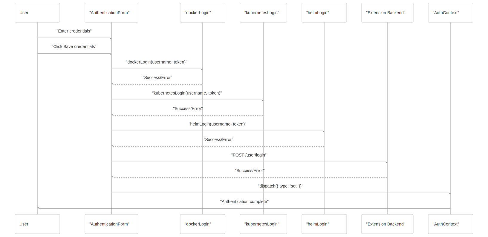

# Authentication and Settings

[Index your code with Devin](/private-repo)

[DeepWiki](/)

[DeepWiki](/)

[rancherlabs/application-collection-extension](https://github.com/rancherlabs/application-collection-extension "Open repository")

[Index your code with

Devin](/private-repo)Edit WikiShare

Last indexed: 29 July 2025 ([039b43](https://github.com/rancherlabs/application-collection-extension/commits/039b43fd))

* [Overview](/rancherlabs/application-collection-extension/1-overview)
* [Architecture](/rancherlabs/application-collection-extension/2-architecture)
* [User Interface](/rancherlabs/application-collection-extension/3-user-interface)
* [Application Structure](/rancherlabs/application-collection-extension/3.1-application-structure)
* [Authentication and Settings](/rancherlabs/application-collection-extension/3.2-authentication-and-settings)
* [Applications Management](/rancherlabs/application-collection-extension/3.3-applications-management)
* [Workloads Management](/rancherlabs/application-collection-extension/3.4-workloads-management)
* [Helm Operations](/rancherlabs/application-collection-extension/3.5-helm-operations)
* [Client Libraries](/rancherlabs/application-collection-extension/3.6-client-libraries)
* [UI Components and Utilities](/rancherlabs/application-collection-extension/3.7-ui-components-and-utilities)
* [Backend Service](/rancherlabs/application-collection-extension/4-backend-service)
* [Docker Extension Packaging](/rancherlabs/application-collection-extension/5-docker-extension-packaging)
* [Development and Build System](/rancherlabs/application-collection-extension/6-development-and-build-system)
* [Deployment and Release](/rancherlabs/application-collection-extension/7-deployment-and-release)
* [Visual Assets](/rancherlabs/application-collection-extension/8-visual-assets)

Menu

# Authentication and Settings

Relevant source files

* [ui/src/AuthContext.tsx](https://github.com/rancherlabs/application-collection-extension/blob/039b43fd/ui/src/AuthContext.tsx)
* [ui/src/Layout.tsx](https://github.com/rancherlabs/application-collection-extension/blob/039b43fd/ui/src/Layout.tsx)
* [ui/src/clients/backend.ts](https://github.com/rancherlabs/application-collection-extension/blob/039b43fd/ui/src/clients/backend.ts)
* [ui/src/clients/kubectl.ts](https://github.com/rancherlabs/application-collection-extension/blob/039b43fd/ui/src/clients/kubectl.ts)
* [ui/src/components/NotificationsCenter/NotificationsContext.tsx](https://github.com/rancherlabs/application-collection-extension/blob/039b43fd/ui/src/components/NotificationsCenter/NotificationsContext.tsx)
* [ui/src/pages/SettingsPage/components/AuthenticationForm.tsx](https://github.com/rancherlabs/application-collection-extension/blob/039b43fd/ui/src/pages/SettingsPage/components/AuthenticationForm.tsx)
* [ui/src/pages/SettingsPage/index.tsx](https://github.com/rancherlabs/application-collection-extension/blob/039b43fd/ui/src/pages/SettingsPage/index.tsx)

This document covers the authentication system and settings management functionality of the SUSE Application Collection Docker Desktop Extension. This includes credential management, multi-system authentication workflows, and Kubernetes context configuration.

For information about the overall UI architecture, see [Application Structure](/rancherlabs/application-collection-extension/3.1-application-structure). For details about client libraries that use these authentication credentials, see [Client Libraries](/rancherlabs/application-collection-extension/3.6-client-libraries).

## Authentication System Overview

The extension implements a comprehensive authentication system that manages credentials across multiple external services required for application deployment and management. The system coordinates authentication with Docker registries, Helm registries, Kubernetes clusters, and the Rancher backend APIs.

### Authentication Flow Architecture

Sources: [ui/src/pages/SettingsPage/components/AuthenticationForm.tsx21-94](https://github.com/rancherlabs/application-collection-extension/blob/039b43fd/ui/src/pages/SettingsPage/components/AuthenticationForm.tsx#L21-L94) [ui/src/AuthContext.tsx1-74](https://github.com/rancherlabs/application-collection-extension/blob/039b43fd/ui/src/AuthContext.tsx#L1-L74)

## Authentication Form Component

The `AuthenticationForm` component handles the complete authentication workflow, orchestrating login across all required systems in a specific sequence to ensure proper credential propagation.

### Authentication Process Sequence

The authentication process follows this specific order:

1. **Docker logout/login** - Authenticates with `dp.apps.rancher.io` Docker registry
2. **Kubernetes secret creation** - Creates `application-collection` secret for image pulls
3. **Helm registry login** - Authenticates Helm with the chart repository
4. **Backend authentication** - Persists credentials in the extension backend

Sources: [ui/src/pages/SettingsPage/components/AuthenticationForm.tsx21-94](https://github.com/rancherlabs/application-collection-extension/blob/039b43fd/ui/src/pages/SettingsPage/components/AuthenticationForm.tsx#L21-L94)

### Authentication Form UI Structure

| Component | Purpose | State Management |
| --- | --- | --- |
| Username TextField | Credential input | `useState<string>` |
| Access Token OutlinedInput | Token input with visibility toggle | `useState<string>` |
| Save Button | Triggers authentication workflow | Loading state with CircularProgress |
| Status Indicators | Shows success/error states | Check icon or Alert component |
| Configuration List | Documents automated CLI commands | Static informational display |

The form provides real-time feedback during the authentication process with loading states, success indicators, and detailed error messages for troubleshooting failed authentications.

Sources: [ui/src/pages/SettingsPage/components/AuthenticationForm.tsx96-180](https://github.com/rancherlabs/application-collection-extension/blob/039b43fd/ui/src/pages/SettingsPage/components/AuthenticationForm.tsx#L96-L180)

## Authentication Context Management

The `AuthContext` provides application-wide authentication state management using React Context and useReducer patterns.

### Authentication Context Architecture

The authentication context implements a reducer pattern with three primary actions:

* **`set`/`update`** - Stores credentials in localStorage and updates context state
* **`delete`** - Removes credentials from localStorage and sets auth to null
* **Backend synchronization** - Retrieves existing credentials from extension backend on initialization

Sources: [ui/src/AuthContext.tsx14-29](https://github.com/rancherlabs/application-collection-extension/blob/039b43fd/ui/src/AuthContext.tsx#L14-L29) [ui/src/AuthContext.tsx34-65](https://github.com/rancherlabs/application-collection-extension/blob/039b43fd/ui/src/AuthContext.tsx#L34-L65)

### Authentication State Initialization

The `AuthProvider` attempts to retrieve existing credentials from multiple sources during initialization:

1. **localStorage** - Primary credential storage for persistence across sessions
2. **Extension backend** - Fallback credential retrieval with retry logic
3. **Retry mechanism** - Up to 3 attempts with 500ms intervals for backend connectivity

Sources: [ui/src/AuthContext.tsx38-56](https://github.com/rancherlabs/application-collection-extension/blob/039b43fd/ui/src/AuthContext.tsx#L38-L56)

## Settings Page Configuration

The `SettingsPage` component provides a centralized interface for authentication and Kubernetes configuration management.

### Settings Page Component Structure

Sources: [ui/src/pages/SettingsPage/index.tsx9-20](https://github.com/rancherlabs/application-collection-extension/blob/039b43fd/ui/src/pages/SettingsPage/index.tsx#L9-L20)

### Kubernetes Context Management

The `K8sContextForm` component manages Kubernetes cluster context selection and switching:

| Function | Purpose | CLI Command |
| --- | --- | --- |
| `getContexts()` | Retrieve available contexts | `kubectl config get-contexts` |
| `useContext()` | Switch active context | `kubectl config use-context` |
| Context selection | Display current and available contexts | `kubectl config current-context` |

The form provides a dropdown selector for switching between available Kubernetes contexts, with loading states and error handling for context switching operations.

Sources: [ui/src/pages/SettingsPage/index.tsx22-77](https://github.com/rancherlabs/application-collection-extension/blob/039b43fd/ui/src/pages/SettingsPage/index.tsx#L22-L77) [ui/src/clients/kubectl.ts63-94](https://github.com/rancherlabs/application-collection-extension/blob/039b43fd/ui/src/clients/kubectl.ts#L63-L94)

## Client Authentication Integration

The authentication system integrates with multiple client libraries that handle external service interactions.

### Backend API Client Authentication

The backend client authentication system creates authenticated HTTP clients for Rancher API interactions:

* **Base64 encoding** - Credentials are encoded for Basic Authentication headers
* **Axios interceptors** - Automatic authentication header injection
* **Retry logic** - Network error and 5xx error retry handling
* **Environment-based configuration** - Development vs. production API endpoints

Sources: [ui/src/clients/backend.ts6-31](https://github.com/rancherlabs/application-collection-extension/blob/039b43fd/ui/src/clients/backend.ts#L6-L31)

### CLI Tool Authentication

The extension manages authentication for local CLI tools through the Docker Desktop extension API:

| Tool | Authentication Method | Registry/Endpoint |
| --- | --- | --- |
| Docker | `docker login` | `dp.apps.rancher.io` |
| Helm | `helm registry login` | `dp.apps.rancher.io/charts` |
| kubectl | `kubectl create secret docker-registry` | Kubernetes cluster |

The CLI authentication uses the Docker Desktop extension host CLI execution capabilities to run authentication commands with provided credentials.

Sources: [ui/src/clients/kubectl.ts10-24](https://github.com/rancherlabs/application-collection-extension/blob/039b43fd/ui/src/clients/kubectl.ts#L10-L24) [ui/src/pages/SettingsPage/components/AuthenticationForm.tsx26-91](https://github.com/rancherlabs/application-collection-extension/blob/039b43fd/ui/src/pages/SettingsPage/components/AuthenticationForm.tsx#L26-L91)

Dismiss

Refresh this wiki

Enter email to refresh

### On this page

* [Authentication and Settings](#authentication-and-settings)
* [Authentication System Overview](#authentication-system-overview)
* [Authentication Flow Architecture](#authentication-flow-architecture)
* [Authentication Form Component](#authentication-form-component)
* [Authentication Process Sequence](#authentication-process-sequence)
* [Authentication Form UI Structure](#authentication-form-ui-structure)
* [Authentication Context Management](#authentication-context-management)
* [Authentication Context Architecture](#authentication-context-architecture)
* [Authentication State Initialization](#authentication-state-initialization)
* [Settings Page Configuration](#settings-page-configuration)
* [Settings Page Component Structure](#settings-page-component-structure)
* [Kubernetes Context Management](#kubernetes-context-management)
* [Client Authentication Integration](#client-authentication-integration)
* [Backend API Client Authentication](#backend-api-client-authentication)
* [CLI Tool Authentication](#cli-tool-authentication)

Ask Devin about rancherlabs/application-collection-extension

Fast